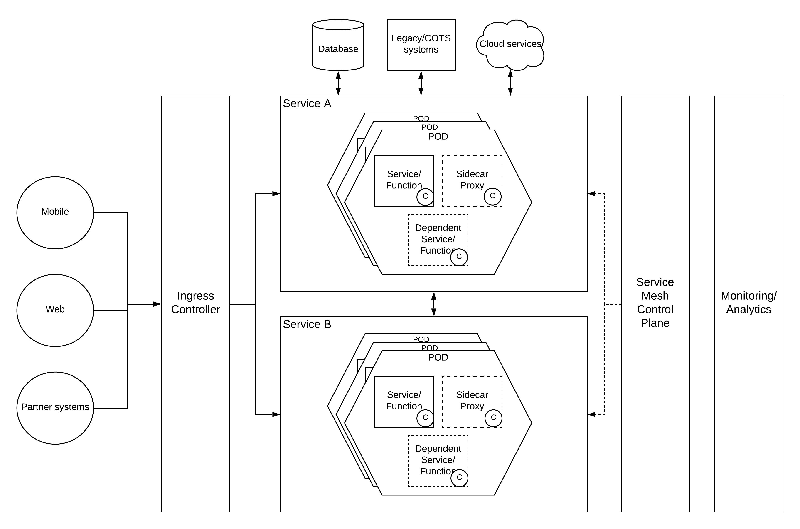

## Container Based Deployment Pattern

### Introduction
Enterprise software has been used to run on mainframes or server racks with multiple CPU units and heaps of memory. The amount of energy needed to run these machines as well as the high maintenance costs has become a conern for the CIOs and CTOs. Then they decided to go with a virtualization platform where it allows the enterprise software to be run on much lesser resources. After sometime, these virtual machines also looked premature and wasting a lot of resources which can be used for other purposes. That is where the container runtimes become useful. With the rise of docker, people started thinking about running applications with the same level of isolation as virtual machines without sacrificing the compute resources to run an entire operating system on a VM. 

Container based deployments are becoming more and more common within enterprise software ecosystem and there are many cloud service providers offer managed container services. This solutions architecture pattern explains how an entire enterprise software system can be built using a container based deployment model. Some of the concepts mentioned in this document may use terminology from some specific technologies. But that does not mean that this pattern can be applied in a vendor neutral manner. 

### Architecture

Let's start deciphering the above architecture diagram from the left hand side where we can find the most important entities for an enterprise which is the end users or the consumers who uses this nicely architected enterprise software system. These users can come from different channels like mobile, web and partner systems. To provide business functionality to these different channels, we can use REST APIs so that it is easier to implement from the client side. 

#### No API Manager
The well-known approach to expose a set of REST APIs is to use a fully blown API Management platform and start creating APIs in an API gateway. But in this architecture pattern, we are proposing somewhat different style of architecture without using any monolithic API Management platform. Instead, we can use one of the following components in place of ingress controller block

- Ingress Controller (Kubernetes)
- Load balancer
- Reverse Proxy

The most common questions which arises with this design choice is that where do we apply the standard QOS functionalities to the services. 

#### Everything is a service (in most cases a micro one)
Instead of putting a layer which is capable of providing centralized QOS capabilities, we are using a decentralized component called a sidecar proxy (or micro gateway or edge gateway) to provide the functionalities like

- Authentication
- Authorization
- Throttling
- Monitoring

