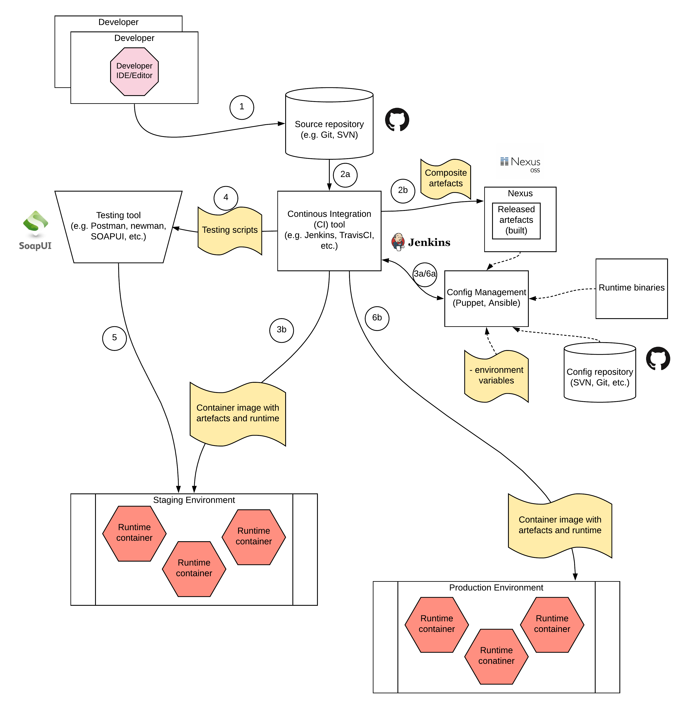

## Enterprise Continous Integration Continous Deployment (CICD) Pattern

### Introduction
Enterprise deployments used to span across several teams and took more time than it was expected. The mismatch of timelines, goals, resources and skills made it really hard to do a release within the enterprise within a desired time/date. It would have been fine when there was a little competition in the market. But that time has come to an end and the competition has become ever so increasing that some competitors do deployments and releases several times within a day. These modern enterprises have followed up the "Continous Integration(CI)/ Continous Deployment (CD)" pattern when implementing enterprise software. 

Within an enterprise software system, there are many types of software running. The below list contains a few types which are used within enterprise.
- On premise software developed in-house 
- On premise software running on top of a server runtime (e.g. tomcat, ESB, etc.)
- Commercial Off The Shelf (COTS) software developed by a 3rd party vendor
- Cloud based SaaS solutions
- Hybrid applications which runs part of their solution on cloud and the rest on premise

The above list contains a fraction of different types of software running in the enterprise. As enterprise architects or engineers, you should identify which components of which software needs to be maintained and managed by your team. Most of the time, cloud based solutions are maintained and managed by the cloud vendor and COTS systems also has less maintenance overhead. But the on premise systems requires more attention from you since those systems are maintained and managed by the teams within the enterprise. 

### Advantages of CI/CD within enterprise
By implementing a proper CI/CD process within your enterprise, you can achieve 
- Flexible and Reliable product/service releases
- Less impact with human errors
- Short time to market 
- Be on the edge of the technology
- Instant recovery of system errors/failures

### Solutions architecture for a CICD process 
Designing a continous integration continous deployment process for an enterprise requires an understanding of existing software systems within the enterprise. In any type of system which was described above, there are 2 types of development activities take place. 

1. Development of use cases with business logic using one of the below methods
- write code using a programming language 
- write code using a DSL (Domain Specific Language)
- Configure product using a UI and generate configurations and metadata

2. Configure the server runtimes by either of the below methods
- modifying the server configuration files
- modifying the server libraries for update/upgrade

A properly implemented CICD process should capture any of the above development activities as a system change and execute the entire CICD pipeline in such a scenario. The below figure depicts a process which can be used to implement a CICD process within your enterprise.

As depicted in the above diagram, the sequence of events occurs when there is a development activity is mentioned below.

