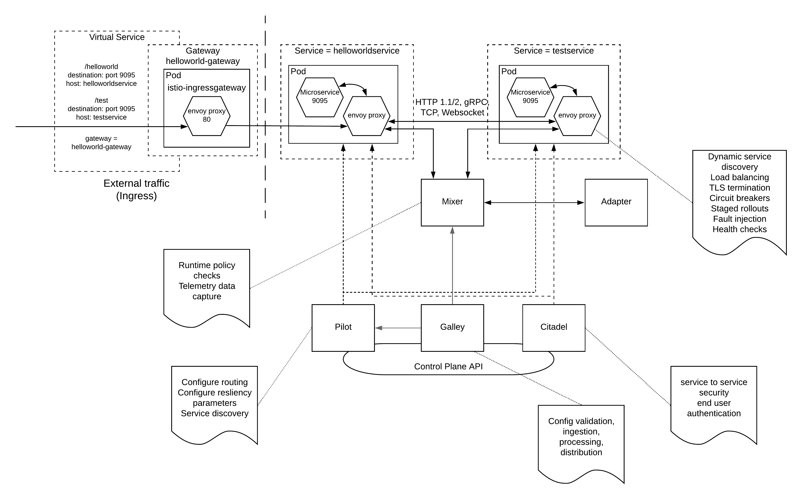

# Istio Service Mesh Pattern

## Introduction
Microservices Architecture (MSA) has given enterprise architects many challenges while offering outweighing number of advantages. It is easy to start with and with the number of services increases and the functionality is getting more and more granular, managing the services and their interactions become complex. Microservices communicated in 3 different ways

- Ingress traffic (requests coming from external clients)
- Intra service traffic (requests coming from another microservice)
- Egress traffic (requests going out to an external service)

The above mentioned different types of communication can happen either synchronously or asynchronously over different protocols. Some of them are
- HTTP 1.1/2
- Websocket
- gRPC
- TCP 

Managing these different forms of communications within a complex microservices architecture has become a major problem which needs to be solved when adopting a microservices strategy. The solution for this complex problem is the "Service Mesh" which is a "Network of microservices which are communicated with each other, with external systems over standard protocols". Service Meshes contains 2 layers where each layer performs a selected set of functionality.

1) Data plane - is responsible for communication across microservices as well as ingress and egress traffic
2) Control plane - provides control over networking of microservices and their interactions

Istio is a service mesh technology which supports both data plane and control plane functionality with a platform independent manner. It can run with infrastructures like kubernetes, nomad and consul. 

## Architecture
Service Mesh architecture consists of side car proxies which are running by the side of each microservice. These proxies intercept all the requests coming into a microservice as well as going out of the same. 

The above figure explains a lot of details in one picture. Some of the concepts used here are directly related to kubernetes. But you can use the same architecture with other supported platforms as well.

At the top of the picture you can find 2 microservices which are deployed in containers within kubernetes platform as pods. These pods contains another component alongside the microservice which is the envoy proxy which acts as the data plane within the Istio service mesh. This pod is then exposed as a kubernetes service. There are 2 kubernetes services depicted in the above picture.
1) helloworld service - expose via 9095 port
2) test service - expose via 9095 port

In addition to the data plane, there are 4 main control plane components depicted in the above picture. Those are
1) Mixer - Which collects attributes from envoy proxies and enforce policy checks and collect telemetry information. If you need to extend the functionality of the mixer, you can write a mixer adapter which can process this metadata and do additional policy enforcements and analytics
2) Pilot - It provides functionalities like service discovery, configuration of error handling and routing 
3) Citadel - This provides the service to service security (mTLS) as well as end user authentication (JWT) capabilities
4) Galley - This is a tool which validated the istio configurations and inject them to proxies and distribute within the service mesh

## How it works in runtime
Once the Istio SM is up and running with the above mentioned components, let's see how the communication between different components happen. There are mainly 3 scenarios.

### A message going from testservice to helloworld service

### A message coming from external client to helloworld service (ingress traffic)

### A message going out from a microservice to an external service (egress traffic)
