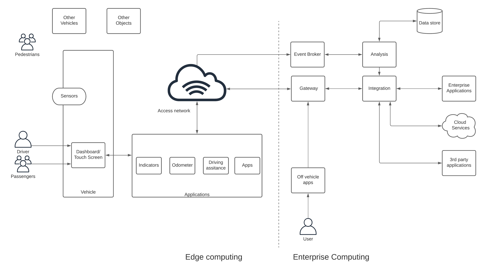
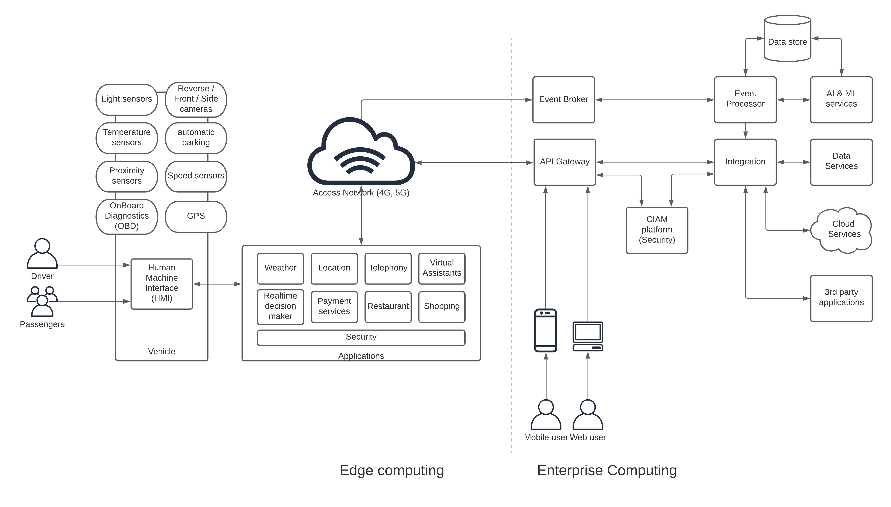

## Introduction
One of the most popular TV series from the ’90s is “Knight Rider” which is a show about a self-driving car called “Kit” and a selfless man called “Michael”. That show really made a huge impact on people’s minds regarding the possibility of manufacturing driverless cars or autonomous vehicles. The term “self-driving cars” became one of the major goals of the automotive industry. Even though the world is not there yet, we are getting closer to see something similar in the real world.
Having said that, the automotive industry is much more than self-driving cars and the usage of information technology within the industry is immense. Modern automobiles are equipped with smart dashboards called “Human-Machine-Interface” or HMI which can do tasks like

- Making phone calls, answering phone calls
- Playing songs, movies
- Finding gas stations, shopping malls, restaurants
- Displaying optimal routes
- Automatic parking, brake assists, cruise control
- Providing weather information

The above list is a small portion of the various smart functions that can be executed in modern automobiles through the HMI. In addition to these external functions, there are smart On-Board-Diagnostics (OBD) systems that can keep track of the status of the vehicle parts and systems like tires, oil capacities, vehicle services, battery systems, transmission systems, etc. and integrate that information with the HMI.

All these capabilities are great additions to the vehicles and automobile manufacturers are putting a lot of effort to add more and more capabilities to the vehicle. In addition to the in-vehicle capabilities, there is a considerable amount of systems and applications that work in conjunction with the vehicle to provide this sort of experience. Let’s try to identify the backbone of the automotive industry which is the IT ecosystem around the vehicle network.

## Business Architecture
Vehicles are moving objects that travel from point A to point B without colliding with other objects on the way. Some objects are living beings, some are similar vehicles and others are stationary objects. The driver of the vehicle (forget about the self-driving cars for the moment) is the one who is assigned with this task. In modern vehicles, there are a ton of sensors and actuators installed on the vehicle to help the driver execute this task of moving from A to B. The sensory data coming from these devices need to be processed, analyzed, and converted into actionable information using a system that consists of an in-vehicle component as well as components sitting outside the vehicle. The need for an external system comes with the advanced nature of the information that is provided to the driver. As an example, taking the input from all the cameras and placing them on a display is a simple task that can be performed by the in-vehicle computing platform. But providing the fastest route from A to B requires connecting to external services like traffic services and integrating that information with location data which is coming from a GPS unit installed on the vehicle. Another example would be automatically booking a vehicle service based on the distance traveled since the last service requires calling external services. What this means is that there is an underlying IT backbone that makes this sort of experience possible within the vehicle.
Let’s try to understand the main components of the automotive information technology ecosystem.

Figure: Automotive ecosystem business architecture

The above figure depicts the high-level components that are involved in operating a modern vehicle on the road. If we start from the left,

- The vehicle has various sensors to capture details on the surroundings
- The driver and the passengers are inside the vehicle
- There is the dashboard or touch screen/s which displays all the processed information that is usable to the driver and passengers
- The display shows multiple information on speed, rpm, indications, application (weather, maps, routing, etc.)
- External services will be utilized to provide some information in the applications which connect over a WAN
- Some vehicle-specific data are sent over to the enterprise side (car manufacturer, dealer, services company) to process and provide actionable information in a timely manner
- Some 3rd party applications and systems are integrated to provide mobility as a service (restaurants, vehicle services, shopping, payments, etc.)
- Vehicle owners can access the vehicle-specific information and historical and analytical data through off-vehicle applications (mobile app, web site)

In the above figure, there are 2 sections isolated by a dotted line in the middle. That line divides the computing resources based on the respective position in the overall ecosystem.

- Edge computing — These are the computing resources available in the vehicle and we call this “edge” since it is closer to the end-user. The computing power and the resources are limited in the edge due to various factors such as power consumption, mobility, network accessibility, etc.

- Enterprise computing — This is the section where most of the heavyweight computing operations are carried out. This is a typical enterprise IT deployment with all the required computing resources to execute various complex computing tasks that are required to provide the best possible experience to the users.

The link between edge computing and enterprise computing components is the “access network” which is typically a mobile network. The advancements in the telecommunications industry like 5G connectivity helps largely to provide a seamless user experience in near future. Let’s dig a little deeper into the components in the above figure.

### Edge computing
At the edge, what we can find is the vehicle with network connectivity. In the vehicle, there are various types of sensors that receive data from the surroundings and pass it back to the central computing platform within the vehicle. In most cases, it is a low-end computing device with a small processor and memory. This will have a display with a touch screen or with physical buttons that can execute simple tasks like changing the display mode, change across sensors in the display, control actuators like temperature, lighting, entertainment system, etc. All these functionalities can be done offline without connectivity to the external system over the network.
In addition to these traditional in-vehicle capabilities, modern vehicles come with a number of useful features in the form of “applications” that can be utilized while in the vehicle. These applications require connectivity to external systems to execute their tasks. Some examples of such applications are Routing, Shopping, Restaurants, Weather. In addition to these applications, there is a feature called driving assistance which relies on external systems to provide better insights into the driver on road conditions, traffic conditions, vehicle maintenance, and much other useful information.

### Enterprise Computing
As we discussed in the previous section, certain applications installed in the vehicle requires additional information and computing resources to carry out those functions. This is the task of the enterprise computing section of the platform. It requires certain components that are essential to support the edge computing resources. Given below is a list of high-level functionalities required in the enterprise computing section.

- Gateway — This is required to connect with external systems over a standard and secured channel from the in-vehicle applications. It allows the enterprise platform operators to offer different classes of services to the users with required access controls.
- Event Broker and Analysis — This component is needed to process real-time events coming from various sensors within the vehicle that requires near real-time processing and send back to the vehicle as actionable information. At the backend of these events, various AI and ML models can be executed for predictive analysis and provide user experiences such as ahead of time notifications on sensor replacements, vehicle part replacements, vehicle services, traveling patterns, effective routes with better air quality, etc.
- Integration — Providing an experience that involves multiple systems requires an integration component that understands those different systems. That is the role of integration in this solution. As an example, to provide an integrated food ordering application in the vehicle requires connecting to restaurants, payment services, and location services.
- Data Store — This is required to provide various short term and long term analytics on driving patterns, vehicle conditions, predictive analysis, and many other aspects of the overall experience that relies on historical data.
Other applications — There can be many other applications that support the overall experience of the driver and the passengers which operate outside of the “edge”. Some examples are weather services, location services, enterprise applications, and cloud services.
- User (off-vehicle) applications — These applications provide the users with the capability to review and analyze the various metrics of the vehicle and driving patterns through a mobile application or a web site from an off-vehicle device like a mobile computing device (e.g. phone, laptop, tab).
With the understanding of the main components that are involved in the automotive IT platform, let’s build a solution architecture that can be realized with the technologies available in the market.

## Solution Architecture
In this section of the article, we expand the business architecture that we came up with within the previous section and discuss each component in relation to existing technology solutions. The below figure depicts a solution architecture that is built using the previously mentioned BA.

Figure: Automotive industry IT reference architecture

The above diagram depicts the vehicle along with some of the common sensors found in modern vehicles. In addition to that, the built-in dashboard or touchscreen is depicted as the Human-Machine-Interface (HMI) which is a common term used for such interfaces. This interface consists of multiple applications that help the driver achieving his task of moving from A to B while providing additional mobility as a service function. These applications come with security requirements like authentication and authorization for doing certain tasks like payments. These applications rely on the enterprise computing backbone which does the heavy lifting of these applications.

API Gateway acts as the interface between edge computing and enterprise computing components and provides quality of service (QoS) capabilities such as security, rate-limiting, analytics, and different classes of services (e.g. free, monetized). It connects with various business systems and applications as the backend possibly through an integration layer that interconnects all these heterogeneous systems. There is a Customer Identity and Access Management (CIAM) platform that provides the necessary security features to the platform such as authentication, authorization, and Single-Sign-On (SSO), and Muti-Factor-Authentication (MFA) for APIs and applications.

The real-time events and sensor data captured in the vehicle are sent to the event broker via a simple messaging protocol like MQTT to reduce the overhead added by a protocol like HTTP. These events are captured and processed in real-time by an event processor or a stream processor and generate actionable insights and store them for further analysis by AI & ML services. These processed and analyzed information are then stored in data stores and exposed as data services to the edge applications over HTTP interfaces. At the same time, real-time notifications and insights are sent via event broker in a publish-subscribe model. The applications running on the edge consume these processed and analyzed information within the HMI so that drivers can take benefit from that. In addition to that, these enterprise systems provide predictions on certain events and automatically generate events such as vehicle services, part replacements, traffic conditions.

The same API Gateway is used to expose certain details about the vehicle, driving patterns, service schedules, and maintenance activities via mobile phone or a web application. It can also provide information such as the location of the vehicle and any movements even if the user is not within the vehicle.

## Summary
The automotive industry is going through significant advancements despite not being able to fully realize the “Knight Rider” legacy yet. Automobiles are becoming more and more intelligent and autonomous with the usage of information technology. We have identified 2 separate components of the automotive IT ecosystem namely edge computing and enterprise computing. Both components work together to provide a unique experience to the vehicle users (drivers, passengers) as well as to provide a safer environment for 3rd parties like other vehicles, pedestrians, and other objects. We briefly covered the main technical building blocks that can be used to build an effective IT solution architecture for the automotive industry that works with automobiles of the present and the future.

## References
https://www.ibm.com/cloud/architecture/architectures/automotive-connected-driver