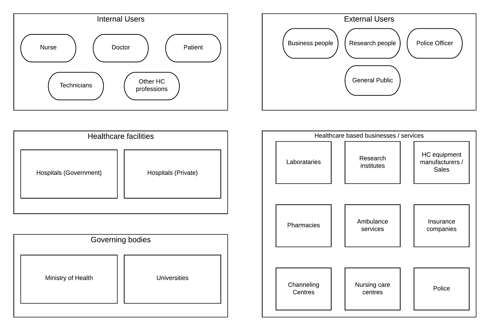
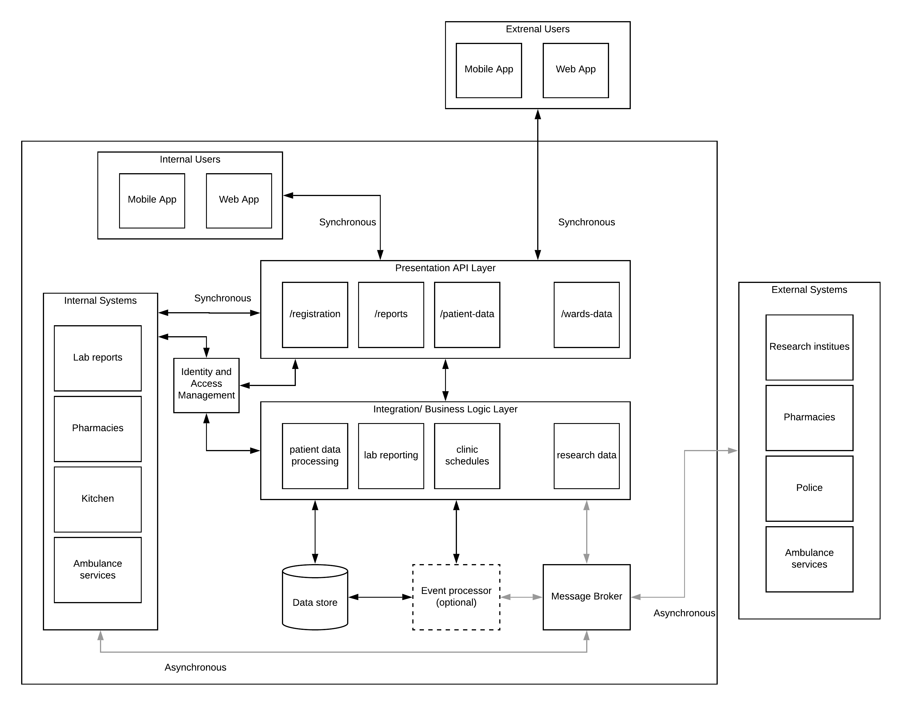
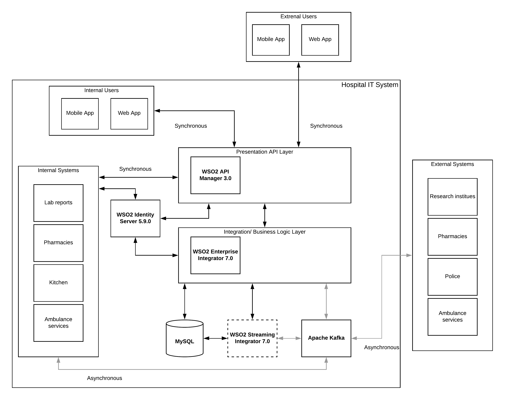

## Preface
There is a Buddhist saying called “Arogya Parama Labha”, which means “Health is the utmost wealth” of a person. You don’t need to be a Buddhist to understand that saying. It is an eternal truth. On the flip side, healthcare is becoming the most successful, money-making business in the whole world. In most countries, it is considered as the most prestigious benefit for a citizen or for an employee of a company. This post is not about where to find the best healthcare systems or how much it will cost you to buy health insurance. It is about building an effective digital health platform that can provide benefits to the whole population regardless of where you live.

## Introduction
The healthcare industry is one of the well-regarded industries in the whole world. It is understandable since it helps people to live better, live longer and live a happier life. Before going into the technical details or architecture of a digital health platform, let’s try to understand the ecosystem which surrounds the healthcare industry. The below figure depicts some of the major stakeholders within the healthcare ecosystem.

Figure 1: Healthcare ecosystem stakeholders

As depicted in the above figure, there are certain groups of people, systems, organizations play major roles within the healthcare ecosystem.

- Healthcare facilities — The main component of the ecosystem is the healthcare facility which is the hospital. This can be a government-managed one or a private facility managed by a company.
- Internal users — On top of these facilities, there are the main users of the ecosystem who interacts with the facility. These are the medical officers, nursing officers, technicians, patients and many other professionals working within these hospital facilities
- Governing bodies — Then we have the standards and governing bodies that govern the healthcare system and facilities so that society receives quality healthcare regardless of where they are getting the service from. Health ministry, Universities, and other institutes, unions comprise of this segment.
- External users — There are a different set of users outside these healthcare facilities who interact with the healthcare system. Police officers, Healthcare business owners, General public are some of these external users who interact with the ecosystem on a daily basis.
- Healthcare business/service — There is a huge external ecosystem built around the main healthcare stakeholders mentioned above. These are various businesses like pharmacies, healthcare equipment, insurance companies, public services like police, emergency and ambulance services, etc.

There can be many other groups, organizations interact with this ecosystem in addition to the listed segments in some parts of the world. But at a higher level, we can start with the aforementioned list.
The most important aspect of the healthcare ecosystem is the hospital. Let’s dig deep into a hospital and try to understand what components, systems, and interactions happen there.

.png)
Figure 2: Hospital ecosystem

The above figure depicts a basic model of a hospital. As depicted in the figure, there are virtually 3 layers of different facilities available in a typical hospital system.
Units that interacts with external people directly — These units are directly interacting with people who are coming to the hospital to get treatments.

- Reception — This is where people get information about which unit they wanted to go once they enter a hospital facility.
Outward Patient Division (OPD) — This is the unit where people come to get medicine from the hospital unless it is an emergency.
- Emergency Care Unit (ECU) — If there are emergency situations like accidents, poisoning or general emergency situations, this is the unit that handles those people (patients).
- Clinics — There are many routine clinics happening at the hospital where people with long term health issues attend.

Intermediate units which are accessible only by allowed people — These units can only be accessed through people with a relevant access card.
- Wards — Once the doctors from OPD or ECU decide that a patient needs to get a long term treatment, that patient will be inducted to the wards. There are different wards for different types of treatments needed by the patient.
- Laboratories — All the internal testing of various patient conditions are done within these laboratories and they are heavily interacting with medical staff and the accuracy of these results defines the quality of the service provided by the hospital
- Pharmacies — The people who are signing out from the wards, OPD patients, clinical patients get their medicines from the hospital pharmacy.

Special internal facilities which are only accessible by authorized people — These special units which need minimum interaction from external people.

- Intensive Care Unit (ICU) — When patients require consistent, intense care due to a special situation, those patients are treated in isolated areas that only be accessed through authorized personnel.
- Surgical wards — These are the wards that actually carry out major surgeries of patients and can only be accessed by authorized personnel.

Up until now, we only discussed the various units, people, organizations within the healthcare ecosystem. Let’s try to understand how these various stakeholders interact with each other and with systems.
In a typical hospital, most of the information exchanges happen in the form of reports. Each and every report needs to be validated by relevant professionals and needs to be shared with only the authorized people. In the meantime, there is certain information that needs to be stored in a central system for management.

.png)
Figure 3: Hospital information exchange

As depicted in the above figure, there are certain types of reports and data repositories reside in a typical hospital. Some of them are

- Clinic schedules — These are valuable information for the general public and the data are mostly static.
- Public health notification — Again valuable information for the general public and the data are mostly static
- Patient report card — Highly dynamic, highly sensitive data collected on each and every patient
- Lab results — Highly sensitive, highly verified information which is kind of static in nature
- Drug reports — Cumulative, less-dynamic details on available drugs and the requirements for each and every ward/unit
- Staffing/ Patient reports — Numbers required for planning of operations
- External reports — Police reports, birth/death certificates interact with external parties
- Static data repositories — Information about profiles of certain users of the system are stored in static repositories

Although this report based approach has yielded so many advantages within the healthcare industry, there are certain areas that we can improve beyond the report based information exchange if we go with a more modern API based information exchange.
One of the fundamental aspects of the information exchange is to decide the nature of the exchange.
Synchronous — Expects the results immediately and waiting for a response
Asynchronous — Results can come at any time. There is no waiting for results.
In a typical hospital/healthcare ecosystem, we can identify there are certain information exchanges that need to happen synchronously and certain exchanges can happen in an asynchronous manner.

## Digital Health Platform — Solution Architecture
Let’s try to figure out certain information exchanges and derive a possible solution architecture for the platform. One of the key things happen within the wards is doctors visiting each and every patient (called as ward round). When they do that, they go through the patient's historical data which is mentioned in the patient report card. This is a realtime information exchange scenario where the user needs access to patient data at that moment. Unless you have historical data stored somewhere (previous admissions, surgeries, etc.), the doctor has to rely only on the current report card related to that particular admission. Imagine a situation where the doctor has access to all the patient’s data and it provides an analysis of patient health conditions, the decisions that doctor’s made will become much better.

Another common use case is that the patients are sent to laboratories to get various tests done. Once these tests are done, laboratories sent over the reports to the wards. This is a perfect example of asynchronous data exchange. Instead of getting the reports in batch mode (someone collects reports at a fixed time), we can build an event-based system that immediately sends the reports to the wards through events.

There are many similar use cases and information exchanges we can identify within a typical hospital environment. With the introduction of an API-driven, digital information system, the efficiency of the healthcare ecosystem can be improved in multitudes.
Let’s put together these ideas into a solution architecture pattern.

Figure 4: Digital Health Platform — Solution Architecture

From this point onwards, it will be a bit deep technical article and if you feel it as a steep ride, bear with me for doing that to reduce this article to a certain word count. As depicted in the above figure, the entire architecture is designed based on 2 principles.

1) Messaging based— Synchronous vs Asynchronous
2) API driven — Information exchanges (synchronous) happens through APIs

Let’s start from the top layer where users (internal and external) interacts with the system through client applications. These applications can be mobile or web applications installed on laptop/desktop/tablet or even mobile phones. This layer is supported by the presentation API layer which exposes data that needs to be accessed in a synchronous manner. Example APIs are

- Patient registration
- Patient-report card
- Lab reports of a patient
- Ward statistics

There is an additional component called the Identity and Access Management component which takes care of the sensitive nature of data and how people access that data. The above-mentioned information will be accessed by human users as well as other applications and systems which are internal.

Underneath this presentation API layer, there is a layer that does the actual heavy lifting and the processing of the data and orchestrates between multiple raw data systems to produce results that are consumable through presentation APIs. This layer collects data from real-time sources, historical event sources, static data sources and produce valuable results for end-user consumption.

There is another major component within this architecture that is the “message broker” which will be used as the reliable messaging layer for asynchronous information exchanges. Some examples are
- Releasing lab results
- Police reports
- Birth/Death reports
- Research data
- Drug reports

In addition to that, there can be a realtime event processing component that analyses various events and produce results that are then communicated to relevant medical personnel and systems so that they can act immediately. As an example, if a certain report results in a severe health condition of a patient, the system can send notifications to relevant people to take immediate action rather than waiting till they get the report and analyze the report.

With the relevant access controls in place, the external healthcare ecosystem can be integrated with the hospital system through message broker for asynchronous communication scenarios like lab reports, equipment, drugs.

## Advantages of the Digital Health Platform
Having this sort of platform opens up a lot of advantages to the entire community. Here are some of the high-level advantages

- Healthcare professionals get access to real-time data as well as historical data and analysis of the same data which will increase the accuracy of their decisions significantly
- Administration people can monitor the operations within a hospital as well as interactions with external parties and improve the overall operational efficiency of their service
- The general public get the advantage of knowing their health conditions better and act responsibly
- A notification system can be utilized to build awareness amongst the general public when there are certain medical conditions breaking out in certain areas and give people warnings and instructions as and when happens with much more transparency and trust
- The medical research activities will get access to a lot of quality real data points to improve the quality of their medical research
- Connecting this platform with healthcare-related businesses (e.g. pharmacies, healthcare equipment manufacturers, channeling centers, etc. )opens up a big market to those people as well as allow the general public to get better quality service at competitive prices

## Digital Health Platform — Open Source Reference Architecture
Building such a platform is a challenging and costly operation in reality. But there are open source technologies available in the software industry that can be used to build this sort of a platform step by step without spending loads of money. The below figure depicts certain open source technologies that can be used to realize the above-mentioned architecture.

Figure 5: Digital Health Platform — Open Source reference architecture

As depicted in the above figure, there are certain open source products mapped into certain functional layers accordingly. But it does not mean that you can’t map some other open-source or commercial software to replace that functionality. This is only a reference architecture and users can extend it as and when necessary.

Let’s dig into the above figure and identify the main technologies used here.

- WSO2 API Manager 3.0 — This product can be used to expose the consumer level APIs to the web and mobile clients used by internal and external users. It provides security, monitoring, rate-limiting as well as advanced capabilities like developer portal and micro gateways.
- WSO2 Identity Server 5.9.0 — This product provides all the necessary identity and access management capabilities to protect the sensitive data that transmits through this system. It provides functionalities like authentication, authorization, user management and advanced functionalities like 2FA, account linking, social login, etc.
- WSO2 Enterprise Integrator 7.0 — This product is capable of integrating multiple systems and data sources and produce valuable results to API consumers. It comes with a graphical and XML based configuration approach that can be used by various integration developers.
- WSO2 Streaming Integrator 7.0 — This component is capable of doing real-time and time-series based analysis on the data coming into the healthcare platform through various channels. It adds value to the entire ecosystem by providing valuable insights to data to make much better decisions in the overall process.
- MySQL — There are many different types of data that need to be stored to keep the historical information about patients, staff, reports, etc. and MySQL can be used to keep this data since these data structures are relational.
- Apache Kafka — This component is responsible for storing asynchronous events with the highest guarantee levels and make sure that information exchange happens regardless of the status of individual systems. It can be used to store certain events for a longer period of time in case some systems does not recover for a long time.

Implementing this sort of platform needs to follow a phased-out approach where you bring the digital nature to the ecosystem step-by-step. Open source technology allows you to do that with their flexibility.

## Practical challenges of building this sort of a platform
One of the key aspects of bringing change to a well-established system like the healthcare industry is to show the value it brings to the entire ecosystem. This is not an easy task and you cannot show that value just after building the system. That becomes a chicken-and-egg problem if you are going to execute in that manner. Instead, you should first build very simple things which will show the real value of this bigger platform and evangelize the idea within small teams and then take it to the next level. Here are some of the main challenges you may face

- Writing patient records with pen and paper is much easier than typing that into a computing device — Fair enough point. You don’t need to address this at the beginning of the journey. Once people realize the value, there are certain things you can do to get around these people
- Medical data protection privacy needs to be maintained in digital form — Fair enough again. Digital protection is much more superior than the physical paper protection. Systems can be built to track every action within a digital system.
- People don’t know how to use these digital devices — Not fair enough points. But can come depending on where you are. Anyone who can use a mobile phone can use this system and healthcare professionals can be trained to use the digital input/output devices which are introduced with this platform (not many compared to what they have already)

## Final thoughts
The other aspect of bringing this sort of digital platform is to align people towards this technology and evangelize the idea and the advantages as much as possible. There are certain areas that seem challenging (as mentioned above) in bringing this idea forward. But with a good drive and an understanding, anyone can build this sort of a platform and reap the benefits that you never imagined.
