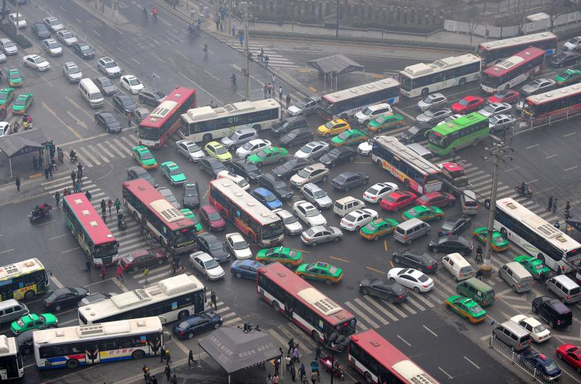
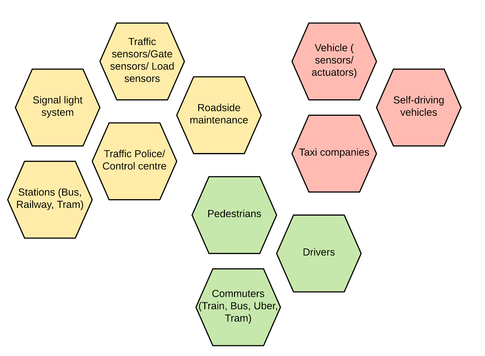
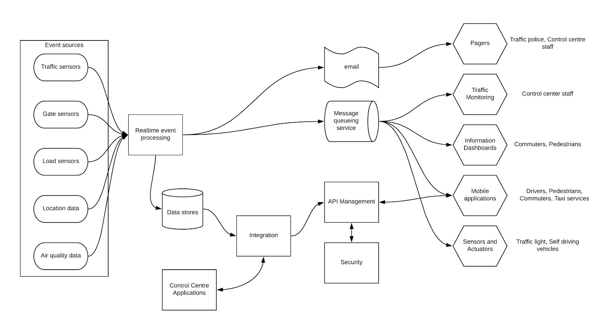
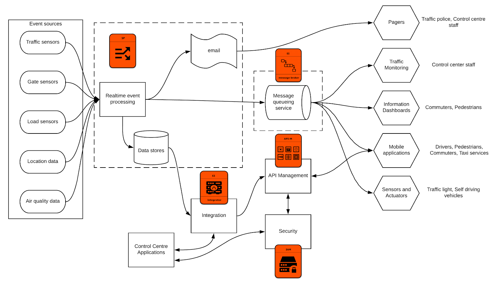
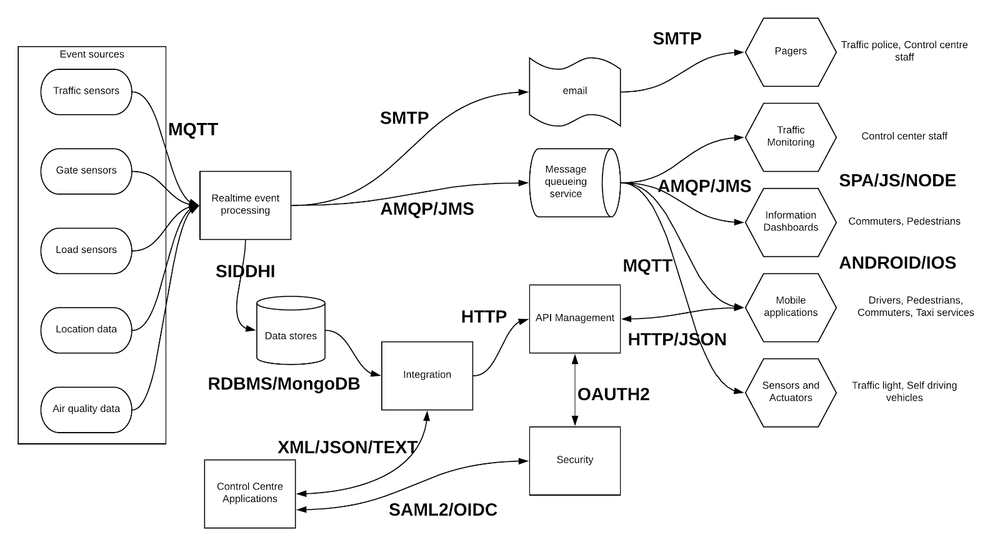

## Introduction

Transportation has been one of the most important activities of human existence. It helped people to spread across the globe, build new communities, explore beautiful places and so on. But every advancement hits a breakeven point where it slowly deviates away from its sole purpose or the advantage it brings. In the world of transportation, it is the “congestion” which causes the sole purpose to breakeven. Across the globe, wherever there is a considerable advancement in transportation, people are experiencing “congestion” or “traffic jam”. It does not matter whether you own maruti, toyota, audi, bmw or lamborghini. It is the same hectic feeling when we hits within a traffic jam. It is not the car manufacturers who are responsible for this congestion. It is the people and their behavior along with inefficient traffic handling systems.

**Source: http://www.getgometro.com/causes-of-traffic-congestion-and-it-can-be-avoided/**

Above figure showcases a typical (scary) traffic jam and by only looking at that figure, you will feel the pain. Vehicle manufacturers are trying to solve this problem through self-driving cars with more and more technical advancements. Even though it is a good move, it will not be the silver bullet for this complex problem. Companies like Uber are building systems which are more efficient in terms of vehicle utilization and professional drivers so that it will almost become another public transportation and people don’t want to bring their own vehicles. All these moves are really great and helping the congestion problem in different forms. Within this article, we are going to discuss about how to build an effective technology platform to improve the experience of people by providing necessary information to drivers, commuters, passengers and even vehicles to act in a manner which causes the least traffic congestion. Due to the complexity of the problem, the approaches describe here may not apply at the same efficiency everywhere. But this will provide a firm basis to build effective transportation systems.

## Understanding the transportation ecosystem
One key thing to note here is that we are trying to build a reference architecture specifically for ground transportation. This does not discuss about over the air or naval transportation. There are 3 main sections in ground transportation.

- Users (Commuters, Pedestrians, Drivers)
- Infrastructure (Roads, Traffic light, Traffic police, control centre)
- Vehicles (Bus, Train, Car, Self driving Car)

On top of above 3 categories, we have supportive services like roadside maintenance and taxi companies like Uber which helps the system to run with better efficiency. These main stakeholders can be depicted using the below figure.

**Figure 1: Main stakeholders of ground transportation ecosystem**

As depicted in the above figure, we can identify the following main stakeholders related to ground transportation.

- Commuters — People who travel as passengers of vehicles. They are interested about reaching their destination in a more convenient and time efficient manner. They need information about traffic conditions, vehicle locations, capacities and vehicle conditions.

- Drivers — People who drives the vehicle and use the infrastructure in reality. Their responsibility is to move commuters from starting point to the destination in a safe, timely manner. They are interested about traffic conditions, traffic light system, commuters who are waiting for their travel, roadside maintenance activities, events happening in that area, etc.

- Pedestrians — People who use the roads by barefoot and walking around the city. They want to know about air pollution, crowded areas and traffic light system.

- Vehicles (including self-driving) — This is the actual tool drivers are using to carry commuters around. These vehicles have sensors to capture data and actuators to act upon receiving data. Self driving vehicles are solely driven by these 2 types of data while other vehicles use those data points to improve drivers efficiency and eventually contributing to the overall improvement of the system.

- Sensors — Sensors can be used to improve the overall system efficiency. There can be different types of sensors depending on the positions they are located in.
-- Traffic sensors — These sensors can be installed in the road near junctions (e.g. SCOOT). They will capture raw events about how many vehicles passed through the sensors. That can be used to derive the traffic flow of a particular direction within a junction and eventually communicated to the traffic control system so that overall traffic lighting system can be improved.
-- Platform gate sensors — These sensors can be used to measure the capacity at a given platform of a station and based on that, users can be distributed to different sections of the platform to have a uniform distribution of load to the comportments.
-- Air pollution sensors — By measuring the air quality of an area, pedestrains can select healthy areas to take a walk and vehicles can be moved away from roads which are heavily used by pedestrians

- Traffic control system — The main component of the control system is the signal light system. Adaptive signal light systems can take feedback from roadside sensors and change the durations of green light and control the traffic flows as a whole and based on the day of the week and the time, it can decide timing of lights across the entire system. Traffic police can also receive this information through control centre.

- Roadside maintenance — In a developing city, there can be many maintenance activities going on within the road network and this information needs to be properly feeded into the system so that users can receive and act based on that. Prior notifications allow people to plan their routes in advance.

- Stations (Bus, Railway, Tram) — These are places which shows a lot of information about the transportation system status. It shows details about schedule, current running vehicles, locations. With the usage of sensors at vehicles, more detailed information like capacity of each compartments, locations of buses and predicted time can be communicated to the users through public communication mechanisms available in these stations

- Taxi companies — These companies have a huge impact on the traffic condition by reducing number of personal vehicles entering the city, ride sharing, professional drivers with advanced devices. These drivers can make smart decision and be more effective on the roads with quality information and experience.

- Transportation authorities — Most of the public transportation is controlled by these authorities. They can impose rules for better transportation system and run buses, trains and trams within cities.
There can be more than above mentioned stakeholders within a specific transportation ecosystem. But the above mentioned can be considered as a most common denominator.

## Understanding the technical requirements
Prior to coming up with a technical reference architecture, we need to understand the main technical requirements of the ecosystem in a manner we can realize with real world products. All the stakeholders we have mentioned in the previous section are more or less deal with valuable information to improve their efficiency. In this section, we are going to identify the information (or data) flows within this ecosystem and how these stakeholders are consuming or producing these events. At a 33000 feet level, we can identify the below mentioned technical aspects.

- Collect — data generated within various components are transmitted as events to other components. These events needs to be collected before doing any analysis in real time or batch mode.

- Analyze — The events needs to be analyzed and derive valuable insights through processing of these events.

- Communicate — Valuable insights, results and messages needs to be communicated to various channels for feedback and improvements of the system

- Act — Commuters, drivers, passengers, vehicles, police officers needs to act based on the valuable insights communicated to them so that they can collectively build a reliable transportation eco system

The next level of technical requirements comes when the processed data is shared with other parties. Here we need to have the following capabilities

- Integration — There can be different systems like control centre applications (desktop), web services, mobile applications, etc. These applications will be developed with their own standards and messaging formats and the transportation system should be capable of handling these integrations

- APIs — The processed data can be exposed as APIs so that other stakeholders like commuters, taxi services, third party application developers can consume this data and build innovative solutions which will eventually improve the overall system

- Security — Not all the processed data can be communicated to everyone. Hence we need to have proper security mechanisms established in the system so that only authorized people can access the relevant information.

- Monitoring — The events coming in from various sources and be used to build a realtime view of the system. This can be used in a control centre to monitor the system and take necessary actions whenever there is a need for human (manual) interactions.

## Reference architecture for a ground transportation system
With the identification of core technical requirements and capabilities for an efficient ground transportation system, it’s time to come up with a reference architecture for the solution.

**Figure 2: Ground transportation system reference architecture**

As depicted in the above figure 2, sensors provides information about the current state of the system. This includes data about vehicle flow, commuter capacities at stations, current load of vehicles (in each compartment), vehicle locations, air quality indexes. These events can be processed in 2 places.

- Pre-process data at edge — Before sending out data to the central system for processing, events can be filtered and aggregated at the edge level so that only the required events coming into the central system which handles a load of data

- Process data at central system — Once the events are filtered at edge, those events can be communicated to central system where it does the final processing and produce meaningful results and publish them through different channels
Once the data is processed real-time, the derived results needs to be communicated to the relevant parties so that it can improve the overall system. These results can be communicated through following methodologies

- Email notifications — If there are pre-planned maintenance activities or notifications which needs to be sent out to drivers, commuters, that can be sent as emails

- Pub-sub notifications — Real time results can be pushed into a topic and the relevant users who has subscribed to that topic can retrieve the events as an when that is sent out from the central analysis in real time

- APIs — Sometimes users needs to know about the historical traffic conditions to pre-plan their activities. You need to have that data stored in the central system to do that. This stored data can be exposed to those applications through secured APIs. Also this historical data needs to be integrated with other systems which exists in the control centre through an integration layer.

These results will be consumed by the actual users of the transportation system.
The drivers can get notifications about current traffic condition as well as historical data to choose their travel times and routes.
Commuters can see notifications about current vehicle locations, platform capacities, compartment level capacities, traffic conditions and plan their journeys so that they get a safer, comfortable travel.
Traffic light system can improve its efficiency by understanding the current traffic flows and change its behavior accordingly (Adaptive traffic light system)
Control centre can see the real-time wholistic view of the system and make better decisions accordingly
Traffic police officers can operate with more awareness of the real-time traffic conditions and offer better service to the public

## Realizing the reference architecture
Now we have an understanding about the problem and the high level solution. Let’s see how we can realize this reference architecture through a real product suite. According to the previous sections, we can identify 4 main capabilities which needs to realize this reference architecture.

- Real time event processing
- Integration with message queueing
- API management
- Security

There are many vendors who offers these capabilities through open source as well as proprietary software products. Instead choosing a polyglot type of model where you choose multiple vendors for different components, we are going to propose a single vendor who offers a complete open source platform with all the above mentioned capabilities.
WSO2 offers 4 main products covering all the requirements mentioned in previous sections.

- WSO2 Stream Processor — real time event processing with data stores and publishing capabilities
- WSO2 Enterprise Integrator — data and application integration with message queueing capabilities
- WSO2 API Manager — exposing services through managed APIs with security, throttling
- WSO2 Identity Server — single-sign-on and federated authentication capabilities

**Figure 3: Reference architecture realized with WSO2 technology**

As depicted in the above figure 3, the required core capabilities can be realized with WSO2 product suite. One thing which is not mentioned in the above figure is the edge analytics capabilities of WSO2 Stream Processor where it can be deployed at the edge towards sensor aggregation points and filter events before sending over to the central processing layer. Also in addition to the email and queueing protocols, WSO2 SP can communicate results over other mechanisms like Kafka, HTTP, RabbitMQ as well. If someone wants to use other technologies for message queueing layer like Amazon SQS, WSO2 provides capabilities to integrate with that through connectors. In the above architecture, most critical component is the stream processing part where it needs to process millions of events within a given second. WSO2 SP has a scalable architecture starting from 2 node cluster which can handle 10K transactions per second on average.

## Detailed technical reference architecture
When these different component connect with each other, they use different protocols, messaging formats and interfaces. Let’s take a look at which technologies we can use to realize this reference architecture.

**Figure 4: Ground transportation technical reference model**

The above figure depicts the relevant protocols, standards and messaging formats which are used to realize the reference architecture. Enterprise architects who needs to implement this type of a reference model can take their vendor selection decisions by using the technologies mentioned above. That makes this model independent from any one particular vendor. If someone wanted to build this system from scratch without using any existing products, they can do so by fullfilling the above mentioned technological requirements.

## Summary
Building an effective ground transportation system will drastically improve the productiveness of that community. People wastes thousands of hours within roads due to inefficient ground transportation systems through “congestion”. In this article, we have defined a reference architecture for an effective ground transportion system by identifying the main stakeholders, key requirements, technical approach and a realization mechanism with real product suite. Even though we have used a specific vendor for the purpose of this article, you can realize the same reference architecture through other technology stacks as well.
