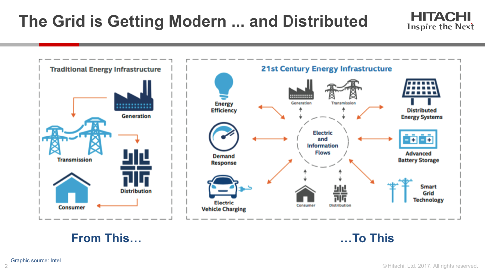
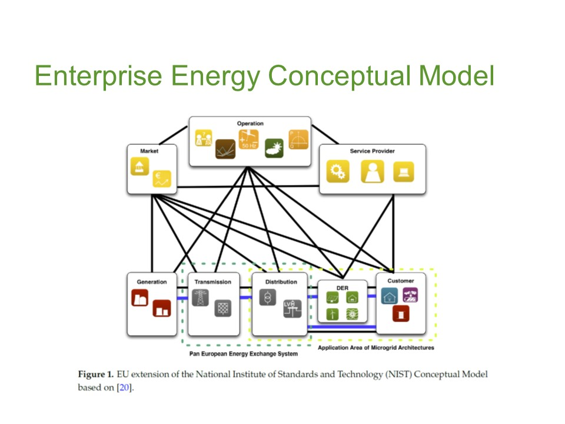
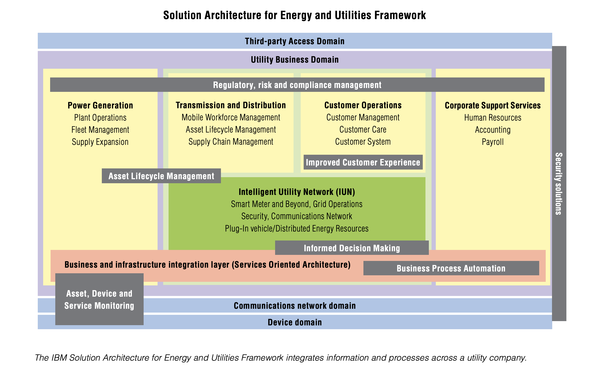
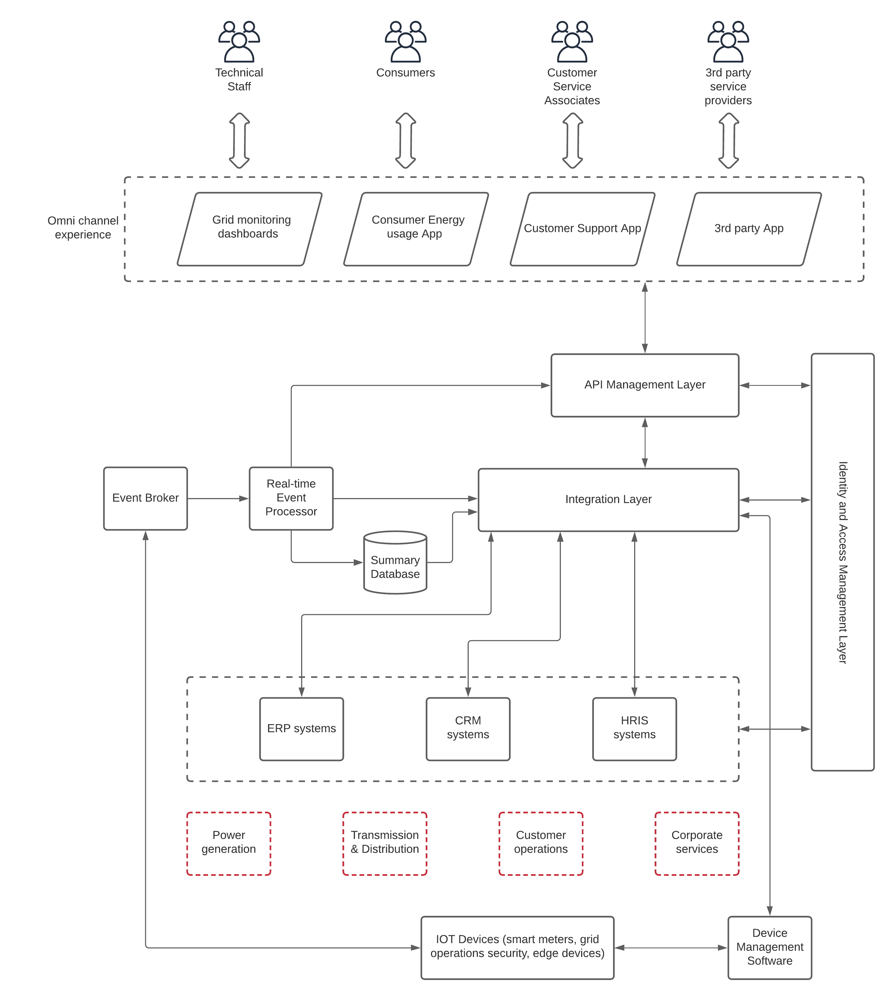

## Introduction
Urbanization is bringing more and more people to cities. The technological advancements in consumer electronics make more and more people use those devices than ever before.   It makes the demand for energy keeps increasing. Even though renewable energy is becoming more and more usable and cost-effective, it is yet to fulfill the continuity requirement of energy demand. Building more and more traditional energy-producing plants (e.g. coal) is impacting “climate change”. We should reduce the carbon footprint. It is a quite complicated problem to solve. At the same time, it is not something that we can keep aside. As technologists, what can we do to save the world?

Let’s try to break down this complicated problem into a set of requirements and try to work on those items as much we can from the technology perspective. Given below is a list of requirements in the energy industry that we can address through the application of technology. 

- Growing energy demand
- Measuring the impact on the environment
- Give customers control of their energy consumption
- Improve the quality of service and provide a continuous supply with minimum outages
- Improve the efficiency of energy generation, distribution, and delivery

Achieving these requirements needs a detailed analysis of the existing IT ecosystem and the technical challenges and come up with a solid technical framework or a reference architecture. 

The below figure depicts the transition of the energy industry from the traditional model of generation, transmission, distribution, and consumption to the more advanced aspects that are evolving with the usage of technology. 

Figure: Transformation of the energy industry

As depicted in the above figure, the energy industry needs to deal with not only an increase in energy demand but also the technology and consumer advancements around it. With the innovations happening around electric vehicles, battery systems, renewable energy sources, and consumer expectations, having your technology backbone supporting these advancements is a critical step to achieve success in the energy industry. 

This means that the dynamics around the energy industry is shaping into a common model that is similar to industries like financial services, the automotive industry with specific aspects like markets, operations, and 3rd party service providers are involved in the energy industry. The below graphic depicts the correlation of these components along with the traditional energy business model.

Figure: Enterprise Energy Conceptual Model

The above figure depicts a model of the energy industry along with its interaction with the market, operations, and service providers. It is a conceptual model that explains the interconnection of the traditional energy lifecycle of generation, transmission, distribution through distributed energy resources (DERs) and consumption with the energy market, continuous operations, and involvement of 3rd party service providers and energy companies. It does show that these interconnections (or integrations) are critical to providing a quality service to the customers. 

Let’s come back to our main topic of using IT technologies to support the modern energy industry demands. Given below is a list of high-level requirements that need to be supported through the technology. 

- Transforming the utility network from rigid, analog systems to dynamic and automated energy delivery systems by driving operational excellence
- Improving customer satisfaction with near real-time, detailed information about their energy usage
- Meet the environmental regulatory requirements while maintaining a sufficient, cost-effective energy supply through greener energy sources as well as more efficient infrastructure

These high-level requirements can be further divided into a set of technical requirements as mentioned below.

- Business processes for power generation optimization
- Transmission and distribution operations
- Customer operation transformation
- Corporate support services
- Plant operations
- Mobile workforce management
- Asset lifecycle management
- Smart metering
- Grid operations
- Customer care

With the understanding of technical requirements to succeed in the energy industry, let’s try to figure out what needs to be done to the existing IT ecosystem. To fulfill the above requirements, there are a certain set of technical challenges that need to be addressed in the IT ecosystem of energy companies. Given below is a list of challenges that exist in most of the energy industry organizations. 

- Legacy applications are used to store business data
- Higher cost for integrations
- Integrate with partners and 3rd parties for business operations requires a lot of manual work
- Customer services are provided through traditional channels (e.g. phone, in-person)
- Not enough information on what is happening in the grid/network
- No real-time data decision making based on data

Solving these technical challenges paves the way to solve the more complex domain-specific problems mentioned at the beginning of the article. Fortunately, there are technical solutions to solve most of these challenges. Let’s figure out what can be done. 

- Integrating multiple systems through a common platform
- Exposing data through secured APIs so that partners, 3rd parties can integrate instantly
- Improve the efficiency of energy generation and distribution through integrated systems and real-time decision making
- IoT enabled devices to monitor, collect and act on data
- Mobile apps to manage usage of energy, partner interactions, and internal employees through APIs (Omni-channel customer service)
- Integrating and optimizing assets, devices, networks, servers, applications, and data across the enterprise, energy companies can drive business agility and more intelligent networks.

It is excellent to understand the business requirements, technical requirements, existing technical gaps, and come up with a set of technical solutions that can support those requirements. It is useful to have this information in a graphical representation so that it is easy to grasp and communicate across teams. The below figure depicts a solution architecture framework developed by IBM for the energy industry. 

Figure: Solution Architecture Framework for the Energy industry

According to the above figure, there are 7 main areas that require the involvement of technology to drive the transformation within the energy industry. It discusses various stages of energy distribution and related functional components. Then it suggests technical solutions to each aspect. Given below are the main technical functionalities required in the energy industry according to the above figure. 

#### Asset, Device, and Service monitoring
- Improve outage management and reduce time to resolution
- Real-time control and analysis tools that help visualize the network, device, and infrastructure availability and performance
- Monitor and manage events from network infrastructure including power devices, communications/data network, systems, and infrastructure
- Provides operational dashboards

#### Asset lifecycle management
- ERP tools
- Managing lifecycle of assets including acquisition, management, inventory control, maintenance, safety, and disposal

#### Informed decision making
- Analyze events, develop insights and correlate reactions to change in a timely fashion
- Improve business flexibility and performance
- Customer energy management and provide offers to save electricity during peak hours

#### Improve customer experience
- Personalized customer experience with self-service capabilities with interactive communications
- Two-way communication with customers to improve the availability of the service

#### Business process automation
- Integrate existing applications
- Optimize business processes to increase customer satisfaction and improved business productivity
- SOA based architecture to integrate legacy systems and build new approaches to improve the distribution and sharing of data in real-time

#### Regulatory, Risk and Compliance management
- Build systems that have great visibility and control of content so that auditing becomes easier for regulatory requirements

#### Security solutions
- Remote monitoring of energy devices, managing grid assets, and operations need better security controls
- Should implement end-to-end security for all aspects including grid, distribution management, finance, admin, customer management, HR, and procurement

With all the details in hand, let’s try to build a solid technical architecture that can support most (if not all) of the requirements mentioned above. 

## Technical Reference Architecture
Building a solution architecture requires identifying the main building blocks and how they are interconnected. Based on the information provided in the previous sections, here are the main components that need to be included in the solution architecture. 

- Integration - This is critical to connecting various components that are required for business operations like asset management, customer management, etc. It makes sure that systems are well integrated through data and necessary insights are generated to take key business decisions. It also helps to improve business efficiency and customer experience through timely access to data. 
- API Management - Once the data is integrated and processed, that information needs to be exposed to internal and external consumers through secured channels. Having an API gateway allows exposing critical business data to different types of users through different channels in a secure manner. It also allows automating the manual interactions with 3rd party service providers and customers.
- Event broker - This component is required to collect all the real-time events coming from various hardware sensors and devices (smart meters) so that real-time decisions can be made and insights can be generated for various business operations. It also helps to deliver real-time notifications to customers and field operations teams to act accordingly and provide a better customer experience. 
- Real-time event processor - Once the events are collected by the event broker, those events need to be processed in real-time to make critical business decisions. In addition to real-time decision making and publishing, this component also generates actionable insights based on data within a given duration (e.g. hourly, daily, monthly, etc.). 
- ERP software - Enterprise Resource Planning is a critical aspect of managing the energy generation, transmission, and distribution processes with a lot of enterprise assets involved. 
- CRM software - Customer Relationship Management is another key aspect of operating an energy company that involves direct customer interactions. This component manages the customer relationship with the company while integrating with internal systems through the integration layer. 
- Identity and Access Management - Securing all the different applications and systems in a unified manner is essential to provide a better customer experience while protecting the business data and customer trust. This component is capable of providing that functionality. 

In addition to these main components, there can be 10s of other systems like device management software (MDM), HR management software (HRIS), etc. to support various parts of the operations within the organization. The below figure depicts how these components are laid out to build the solution architecture.

Figure: Technical Reference Architecture for Energy industry

As depicted in the above figure, “Integration Layer” is the main component that integrates disparate systems that are required to execute various business processes and make sure that data is transferred in a swift manner. This functionality is called the “ESB” or “Integration” in most cases. It makes sure that systems are connected as and when required with minimum effort or customization on those systems. Based on the requirements of a particular organization, the same layer provides the functionality to implement long-running business processes with human interactions with BPM tools. 

The “API Management Layer” exposes the data that needs to exposed to internal and external users with security and control. These users can use different channels to interact with data through this layer. As an example, the operations center of the organization will use their interactive website to connect through WebSockets to listen to real-time notifications about system failures while energy consumers will use their mobile applications to check the current month’s energy usage. It also helps when interacting with various regulatory, compliance bodies and makes sure that processes are well integrated and maintained with the necessary access and auditing capabilities. 

The “Identity and Access Management” layer is responsible for securing the data from fraudulent access and also makes life easier for the internal users to access multiple systems with a single login using Single-Sign-On capabilities. In addition to that, it also helps to implement advanced security for consumer access with Multi-Factor-Authentication (MFA) schemes. 

One of the critical aspects of providing a continuous service is to keep monitoring every aspect of the energy generation, transmission, and distribution with proper tools. In addition to that, the consumer side also needs to be monitored. That is the functionality of various devices used at different locations within the grid and those devices generate millions of events every minute. These events need to be collected and processed in real-time to identify any abnormal behaviors in the grid and the distribution network. That is the task of the event broker and the real-time event processing components which are mentioned in the above figure.

The above figure provides a strong foundation to build an effective IT ecosystem for the energy industry. This architecture can be implemented with various software components available in the market. 

## Future improvements
The above architecture can be expanded to support modern requirements like artificial intelligence, machine learning, and cloud computing with the usage of appropriate technologies. As an example, AI and ML related functionalities can be integrated with the event broker and real-time event processing components easily. All the required integration points are available for such improvements to the system. Given this architecture is independent of any particular vendor or specific technology, users can use their preferred cloud vendor that offers these basic functional components with their offering. The good news for such users is that most of the major public cloud vendors provide these functional capabilities as cloud services. 

## References

- IBM Solution Architecture for Energy and Utilities Industry - https://www.ibm.com/expressadvantage/br/downloads/The_IBM_Solution_Architecture_for_Energy_and_Utilities_Framework.pdf
- An Overview of Strategic, Program and Project Architecture in the Energy Industry - http://renewableplus.blogspot.com/2020/09/an-overview-of-strategic-program-and.html
- DX and IoT in Energy, Insurance, and Entertainment - https://community.hitachivantara.com/s/article/dx-and-iot-in-energy--insurance--and-entertainment

