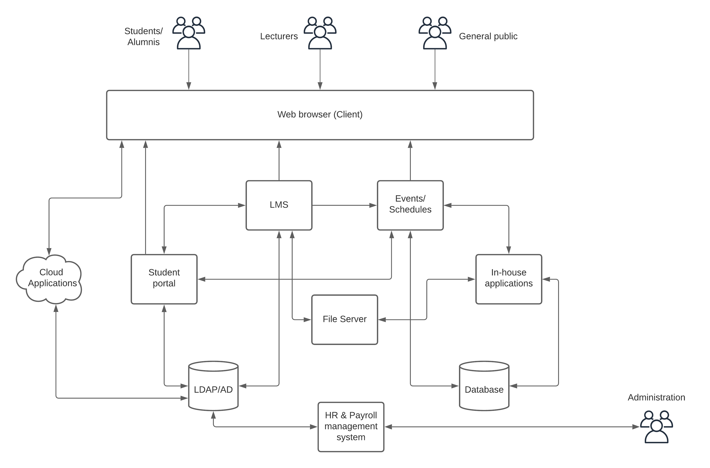
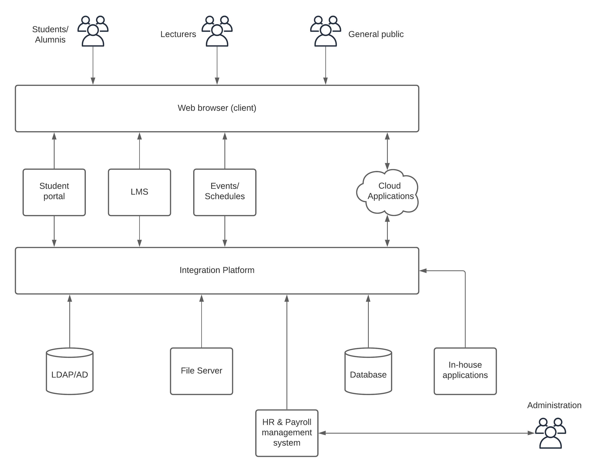
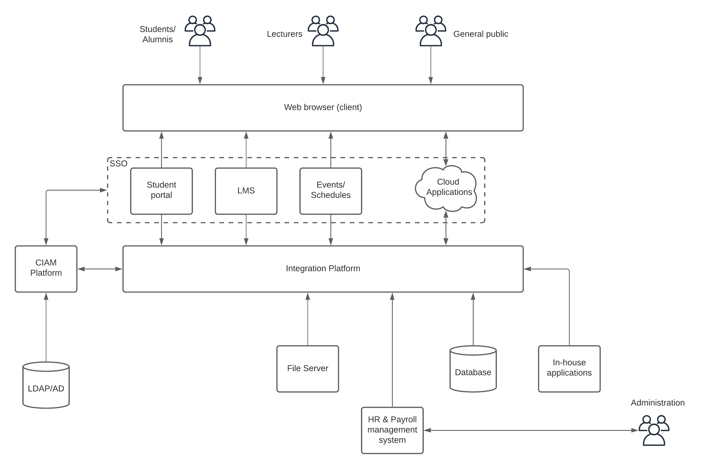
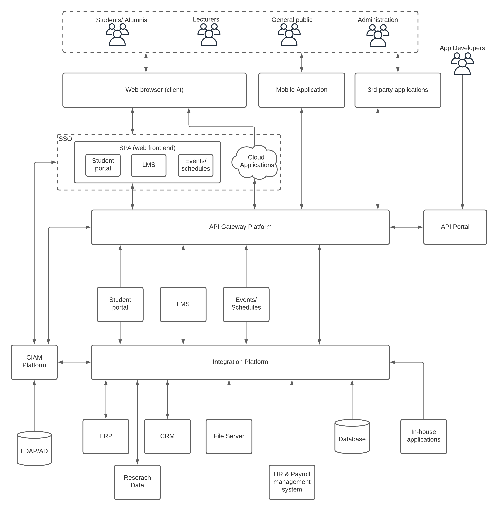

## Introduction
Education or specifically higher education (or tertiary education) is by far one of the most influential disciplines that drive the world forward. From Socrates to Plato to Aristotle to Einstein to Turing to Hawkings, it changed the way people understand the world. Once considered something only a privileged few can have now become a commodity. It really should have been like that from the beginning, but there was something missing in the past that stopped it from happening. That one thing is technology.  Today, we have all the required technology to make education a commodity for all. Let’s discuss how we can achieve that. 

In most places, higher education is provided through a university or a college that students has to enroll and study for 3-4 years. This has been the tradition for at least the last 100 years. Even though there are vast differences in the way graduates are perceived by the industry based on where they are graduated from, at the fundamental level, most of these institutions (universities, colleges) do common things when it comes to providing education to their students which is the primary task of the institution. The intention of this writing is to identify these common functions and build an information technology reference architecture that can be used in most of these institutions. 

## Trends in higher education
Even though education institutions are a place where a lot of innovations originating from, it is not much innovative when it comes to change and progress in terms of technology adoption. This tradition has changed a lot in the last decade where traditional education models are challenged with technology-based education models. From online course materials (PDFs, videos) to LMS to virtual classrooms to degree-awarding online platforms have become the norm in the education domain. The technology has evolved in many other areas of higher education including

- Submission of assignments
- Discussions
- Collaboration
- Exams
- Library facilities
- Alumni

to name a few. Who would have thought 10 years ago that you could study a Machine Learning course from Stanford University via Coursera for free from your home? But it is a reality. The world-renown universities like Stanford are offering their courses and degrees through these digital learning platforms. 

## Challenges in higher education
The adoption of technology within the higher education domain has been slow for decades. Even the institutions which adopted it, did that not because they understood the advantages fully, but because they wanted to show the world that they are cutting edge. We are not talking about the specific technologies used within the universities related to the fields of specialization or research. This is about the supporting Information Technology (IT) ecosystem within these institutions. Because of this lack of attention to the development of these platforms, while the other parts of the universities using the cutting edge technologies, still the education information system has struggled to keep up with the pace of other industries like telecommunications, retail or financial. 

Let’s try to understand the challenges that are faced by education institutions due to the lack of technology adoption. 

- Having multiple systems that are built in isolation made it difficult to manage and innovate
- Managing students, lectures, and schedules 
- Managing users across multiple systems
- Expanding to wider communities
- Keep up with the challenge of online learning platforms

With the advancement of the telecommunications industry and the increased mobility of people and computing devices, students of the 21st century differ significantly from the previous generations. This new generation of students uses mobile phones, laptops, tablet computers to access their courses, submit assignments, and many other tasks. It is important to keep the information technology ecosystem updated so that students can reap the benefits of these advancements. At the same time, education institutions can also accommodate more students with the use of technology. 

## Existing IT ecosystem
Let’s get straight into the traditional IT infrastructure that most of these educational institutions are having. 

Figure: Education industry existing IT infrastructure

A traditional IT ecosystem of an educational institution looks similar to the above figure where it has multiple systems used to provide certain services to the stakeholders. In most cases, these disparate systems are Commercial Off The Shelf (COTS) systems, Cloud Apps or in house built tools that are built and designed in total isolation. These systems need to interact with each other when providing aggregated services to the stakeholders. In an architecture similar to the above one, these interactions needs to be programmed individually within the respective systems and happens mostly in a point to point manner. Because of this nature, introducing something new to the students or other stakeholders takes a lot more time than expected. This approach of integration has several challenges. 

- It is really hard to bring in a new system to the mix
- Updating or upgrading an existing system needs a lot of work
- Each system needs to know about other systems to integrate
- Managing system integrations becomes harder with more systems

There are many other challenges related to modernization of the platform, but let’s keep those aside for the moment and focus on how to solve these first. 

## Setting the tone (Getting started)
The first step in solving any problem is to understand that there is one. Now with the understanding of the challenges in the existing platform, let’s identify a solution. The well known solution for integrating disparate systems within an IT organization is to use a centralized integration bus that interconnects each and every system with less work. This is the starting point for most of the digital transformation projects where organizations are transitioning from traditional models to IT driven business models. It is no different for education industry. 

Figure: Education IT architecture modernization - phase 1

As depicted in the above figure, an integration platform is introduced to the IT ecosystem so that interactions between systems become easier and manageable. It also allows to bring in new systems or upgrade existing systems without much impact to the overall platform. It also reduces the friction between systems and make it easier to innovate with new services to the stakeholders via integrations that were not possible before. 

Once the integration platform is settled in, the next phase of the evolution is to think about managing users and their identities across systems. With the increased usage of web based access across the globe, more and more users will enroll for the courses through digital means and new services needs to bring in to the platform to serve these users better. Providing an easy yet secure access to the digital resources will become a major requirement on the platform. 

## Securing the perimeter for growth
User experience is an area that most of the people care about when it comes to growth. As long as users are getting a better experience, growth will become less challenging for an organization. As mentioned previously, the modern users like mobility and they prefer doing work according to their own schedules. Hence, providing access to services that help them to continue their education via digital means is a must. From the system maintenance perspective, security is critical to keep the systems available and usable. 

Figure: Education IT architecture modernization - phase 2

As depicted in the above figure, bringing in a Customer Identity and Access Management (CIAM) platform is the next phase of the evolution. With such a platform, stakeholders of this ecosystem will be able to access related services in a much more secure and easier manner. Some essential capabilities like

- Providing Single-Sign-On to multiple systems
- Enabling easier access via social logins
- Enabling advanced security via Multi Factor Authentication (MFA)
- Managing users of multiple systems via a central location
- Allowing users to manage their identities
- Become compliant with industry standards like GDPR

Once the system is well integrated and secured, the next step is to expand it to wider audiences beyond the traditional enrolled students and staff members and go head on with the modern digital education platforms.

## IT reference architecture (Modern platform)
Online learning platforms like Coursera, Udemy, EDX or LinkedIn Learning are becoming widely popular in the education sector where people tend to earn their degrees and certifications through those platforms in a much more convenient and cheaper way than traditional education models. This challenge is something that no education institution can left alone. The world renown universities like Stanford, Yale, MIT are offering courses and certifications through these platforms. 

Bringing your traditional education ecosystem to this level of modernization requires a little more work than what we discussed in previous sections. For the most parts, in previous sections, we didn’t discuss much about doing big changes to the existing systems. But this phase is a bit different. 

Figure: Education IT architecture modernization - phase 3

As mentioned in the previous section, this phase of the transformation requires a better understanding of the current and future demands so that bigger changes are accepted by the management teams. As depicted in the above figure, here are the main changes that are introduced in this phase. 

- Allowing users to access services via multiple channels like mobile, web and third party platforms 
- Introduction of API Gateway platform to control the traffic from different channels to existing systems
- Separate out the front end functionality and back end functionality of existing systems and build new web applications (SPA) with more interactive features
- Expose APIs so that external developers can build applications that expand the reach 
- Introduce more and more systems to manage resources (ERP, CRM)

These changes make the platform ready to take over the challenges posed by other institutions as well as online learning platforms and build pathways to collaborate and grow together at the same time. A platform similar to the above will provide the following benefits to the higher education institution that adopt it.

- Provide better and improved experience to the students to carry out their studies and succeed
- Reach out to wider audiences and expand the value of the institution
- Compete and collaborate with online learning platforms and be part of the evolution
- Improve the overall quality and efficiency of the institution through streamlined processes
- Adopt to challenging world situations like pandemic or natural disasters

## Future developments
Once the information technology architecture is evolved and improved so that the institution can take on any challenges coming from the competition, next step is to take it to the next level and go ahead of the curve. Some of the future developments that can be considered for higher education industry technology architecture are

- Moving infrastructure to the cloud 
    - reduce operational overhead
    - improve on availability and scalability and latency
    - reduce cost on infrastructure
- Adding analytics capabilities to the platform to
    - understand the usage of technology and improve the experiences
    - identify trends and act accordingly
    - improve on business decision making

## Summary
The domain of higher education is going through a major evolution with the concept of “platform business” where online, digital platforms making huge impacts on the physical services. First it came to taxies through Uber, Lyft, then to hospitality through AirBnB and now to education through Coursera, Udemy and others. No higher education institution can ignore these advancements and the usage of technology no matter who they are. It is time to think more about the usage of technology to provide better experiences to the students so that they won’t fall back fully into the “platform” based education model. With the usage of modern technology tools like integration platforms, CIAM tools and API gateway platforms, these higher education institutions can build information technology infrastructure that can help them to become relevant in this evolution and stay ahead of the game. Once the platform is built with proper tools, taking it to the next level is also possible with the usage of technology advancements like cloud and artificial intelligence. 
