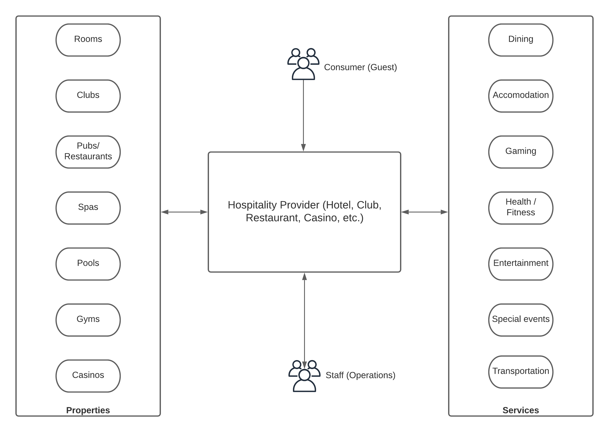
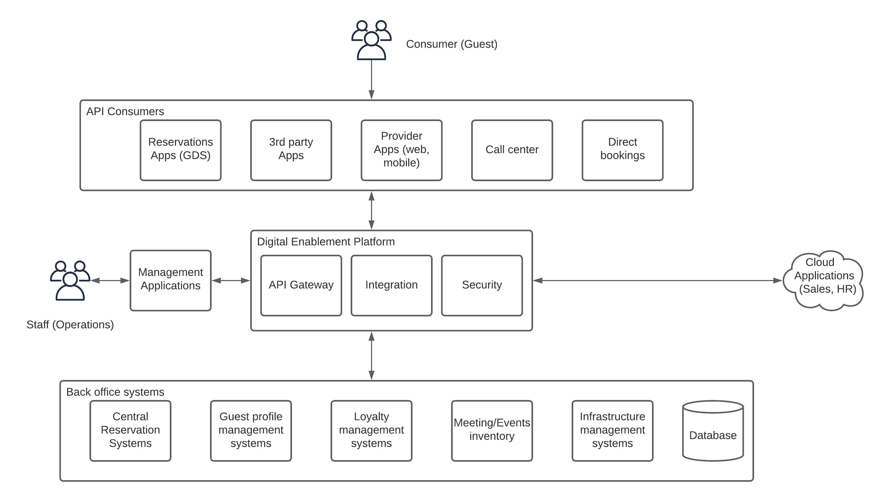
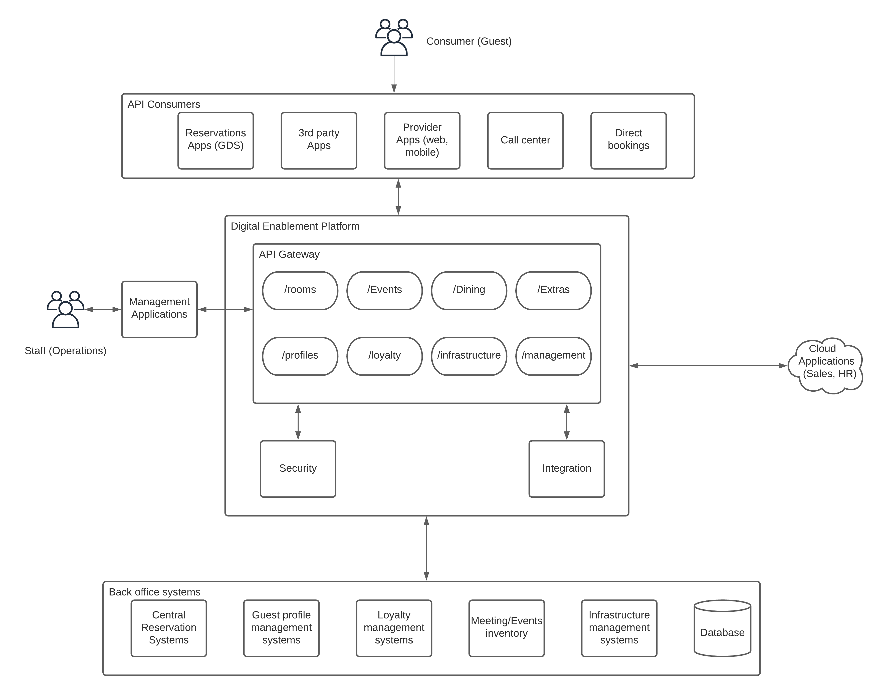
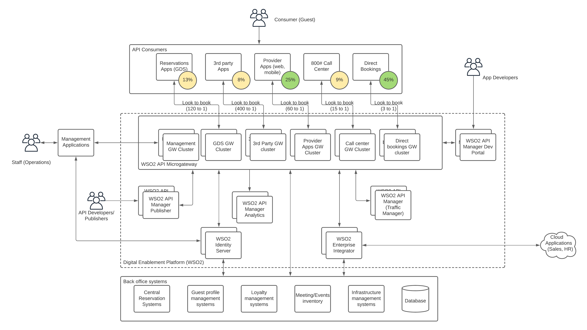

## Introduction
The hospitality industry is one of the oldest and highly regarded industries in the world. It is a great mixture of tradition, loyalty, and technology. It is an industry where you need the technology to play a second fiddle to the people. The customers (guests) expect more human touch in the service they get rather than a technical touch. At the same time, technology plays a huge role behind the scenes to serve the customers with the best possible service. With the introduction of technology-based, community-driven, social-driven platforms like Uber, Lyft, Airbnb, etc., this industry was democratized lately. These platforms made it possible for everyone to rent out their properties to guests and the levels of service that was maintained in the hospitality industry were lowered. These platforms became massively popular within a short period and the hospitality industry was challenged. 

It was kind of a blessing in disguise for the hospitality industry and that made the industry innovate more and adapt to the technical advancements in the world sooner than expected. The traditional IT infrastructure needs to be updated with platforms that are more flexible and adaptable to increasing customer demand. With the advancements in the global travel industry, people from all over the world started to travel more frequently and the hospitality industry had to adapt quickly to these changes. 

## Hospitality industry stakeholders

At a high level, hospitality industry involves 4 main stakeholders. Those are

- Properties
- Services
- Guests
- Staff

There are many other connected groups and functions that help the hospitality industry to operate. But the above mentioned are the main building blocks of the hospitality industry. The below figure details some of the components to provide more clarity to the reader.

Figure: Hospitality industry stakeholders

As depicted in the above figure, customers (guests) come to hospitality provider to get services that are provided through the properties which are managed by the staff. This is called the hospitality industry in layman’s terms. 

One of the most challenging and important aspects of the hospitality industry is to keep the customer happy all the time. Technology can help property owners to build modern, efficient information systems to help with this cause. 

## Hospitality Platform

Let’s start with the customer (guest) where he needs to make a reservation to one of the properties or services that are offered by the provider. The customer experience starts with the booking of a property for a certain service (accommodation, dining, gaming, etc.). This needs to be as simple as possible. There are multiple ways that customers can make a reservation or a booking for a service. 

- Mobile/Web applications developed by the Hospitality provider
- Toll free number (#800)
- Third party mobile/web applications (booking.com, expedia, etc.)
- Global Distribution System (GDS) apps (Amadeus, Galileo, WorldSpan, etc.)
- Direct bookings at the reception

These different consumer channels need to integrate with core IT infrastructure that holds data about the services, properties, and availability of the same. There are different types of systems that keep the records of properties, customers, events, and other related details. Some of those systems are

- Central Reservation System - Keeps track of all the property details and their availability
- Guest profile management system - Keeps track of guest information to provide better experience
- Loyalty management system - This keeps details about the loyalty programs
- Meeting/Events inventory - Stores information about events that are organized within the premises
- Infrastructure management system - Stores information on devices, sensors, and their status
- Database - Stores application specific data that are stored outside of the respective applications for reliability

These internal systems needs to be exposed to the consumer channels through a managed platform to offer the best service to the users while keeping the enterprise data safe. Let’s see how this can be achieved with a digital enablement platform (DEP). 

Figure: Hospitality platform high-level components

As depicted in the above figure, there are multiple applications that consumers use to make reservations to the services that are offered by the hospitality provider. It is the responsibility of the information system to provide these services in a standardized manner so that changes to the back office applications do not impact the customer experience. 

Application Programming Interface or APIs are the most commonly used method for exposing business data to consumer applications via a standard, secure and managed manner. 

The 3 main functional components that are used in the digital enablement platform to integrate, secure and expose internal services to consumer channels are

- API Gateway - Expose standardized service endpoints (APIs)
- Integration - Connect heterogeneous systems (on-premise, cloud)
- Security - Protect resources from malicious users and give better UX

These main building blocks needs to be integrated with each other to offer seamless experience to the guests. 

Depending on the application type, different types of information needs to be exposed through the system as APIs. Some APIs are only exposed to internal applications while others are exposed to external applications. This requires proper segregation of APIs into different categories and expose them with required security measures at the gateway layer. At the same time, internal applications needs to be integrated to provide a seamless user experience like Single-Sign-On. 

Figure: Hospitality platform APIs

As depicted in the above figure, services can be categorized into different APIs and exposed through the API gateway with relevant security controls. In most cases, APIs are categorized into 2 main types called internal and external APIs. There can be certain APIs that are exposed both internally and externally with different security scopes. As an example, external user may be able to view the number of available rooms of a certain type while an internal user may be able to view the number of available rooms and their details (floor, room number). Ability to protect resources of a given API with different security scopes would make this kind of functionality possible.

## Designing for scalability and performance with efficiency

Providing multiple options for customers to make a booking improves the customer experience significantly. At the same time, one of the important aspects of these different channels is the average success rate of these channels. Not all the channels provide same success rate and these channels utilize different amount of resources in the system. It is the task of the system architects to design the system so that it can provide the best possible experience to the customers while maintaining a healthy information system performance without affecting other channels. 

Based on the data captured by one of the largest hospitality provider, here are the success rates for these channels. (Lookup to Book ratio)

- Direct bookings - 3:1 
- Call center - 15:1 
- Mobile/Web Apps by the provider - 60:1 
- GDS systems - 120:1
- 3rd party apps - 400:1

The above statistic clearly shows that different channels have different success rates. At the same time, another important statistic is the percentage of bookings for each channel. 

- Direct bookings - 45% 
- Call center - 9% 
- Mobile/Web Apps by the provider - 25% 
- GDS systems - 13%
- 3rd party apps - 8%

If we consider both these statistics together, it is clear that we need to architect the system in a way that it provides the best possible experience to the channel with best conversation rate and booking ratio. At the same time, other less successful channels can be provided with somewhat lower performance while maintaining the system stability and the overall cost of the system. The method to achieve this type of segregation is to have microgateways that are specific to a certain client channel and scale them based on the needs of individual channels rather than putting all the APIs into one common gateway and scale that monolithic gateway. 

Figure: Scalable hospitality platform with WSO2

As depicted in the above figure, WSO2 API Manager allows the APIs to be deployed independently within microgateway runtimes so that they can be managed and maintained separately without impacting the performance of the other APIs. This is a key aspect given the statistics we shown earlier where 3rd party apps can eat up a lot of resources with minimum success if we put all the APIs into the same gateway. 

In addition to that, WSO2 API Manager comes with a modularized architecture to deploy different functional components independently so that they can scale and manage separately. The above figure includes the other functional components of the WSO2 API Manager as well. Those are

WSO2 APIM Microgateway - Gateway that receives all the requests from various consumer channels and route to the back-office applications
WSO2 APIM Analytics - Provide real-time statistics and monitoring data of APIs
WSO2 APIM Traffic Manager - This component applies various rate-limiting, traffic-control policies to protect the system from overuse
WSO2 APIM Publisher - Interface used by API developers and owners to design, implement and manage the APIs
WSO2 APIM Developer Portal - Allows API consumers to find APIs and use them for their applications

In addition to these components, WSO2 Identity Server and WSO2 Enterprise Integrator are used in this architecture to provide the security and integration capabilities respectively. 

## Future improvements
One of the key aspects of providing remarkable customer experiences is to gather intelligence from customer behaviors and offer highly customized services to the customers. This requires some for of machine learning technologies that analyze the data and come up with suggestions to improve the guest experience. This will play a major role in hospitality industry and give the edge to the providers to stay on top of the competition. Having an integrated platform with API driven interfaces allows the technologies like machine learning and artifical intelligence to come in and execute within the platform. 

At the same time, building platforms that are cloud-native and container-native allows the organizations to take the advantage of those technologies first hand. Choosing a technology platform that is built from the bottom up to support these capabilities will help enterprises immensely in the future. 
