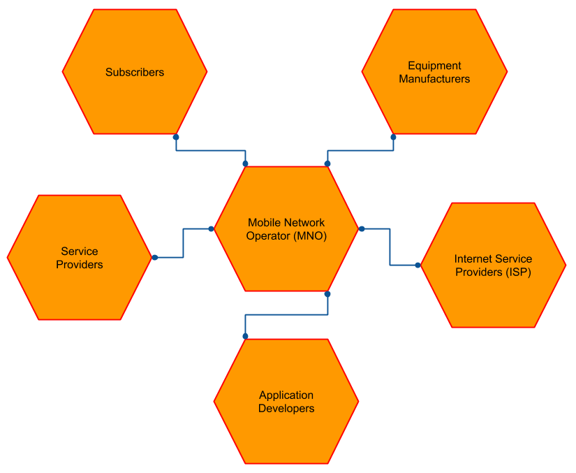
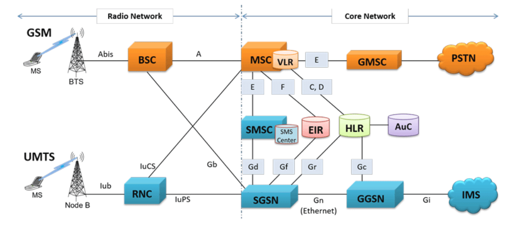
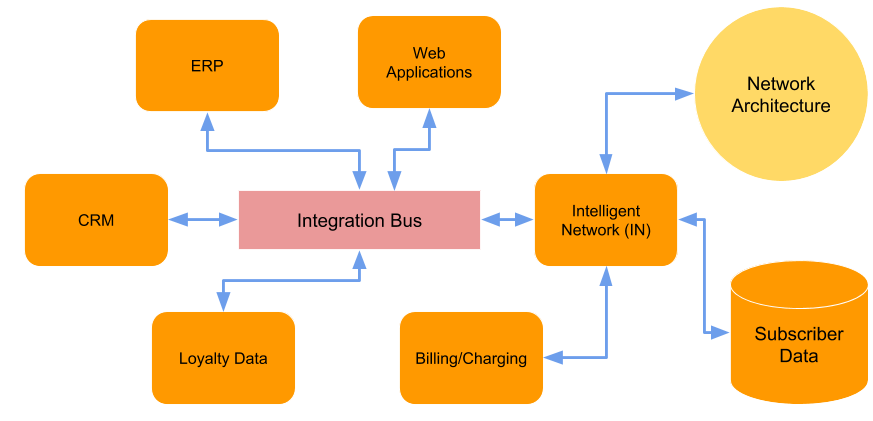
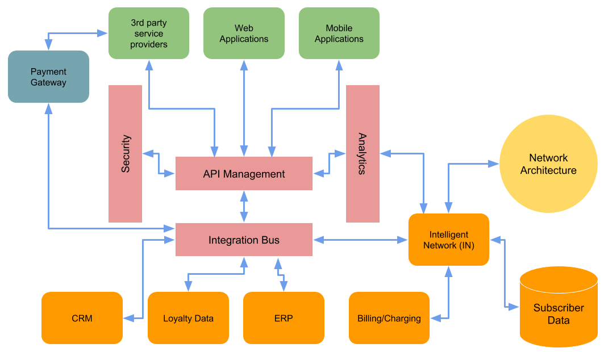
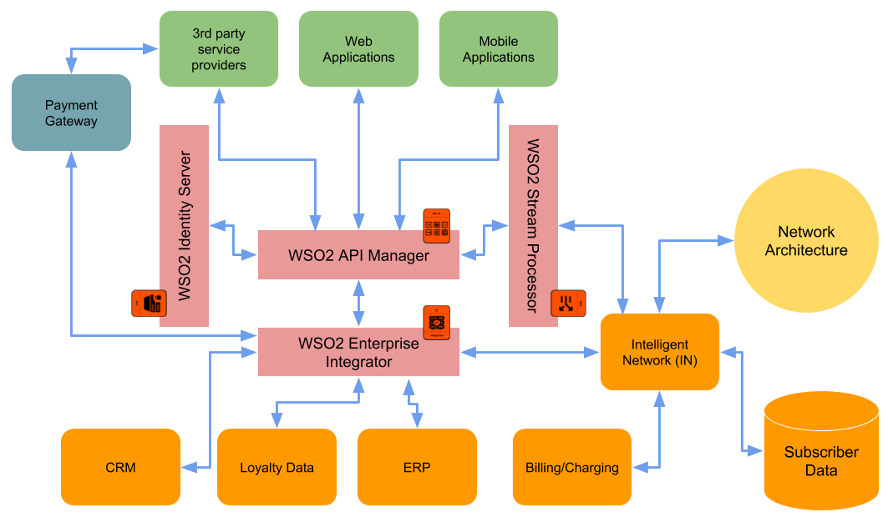
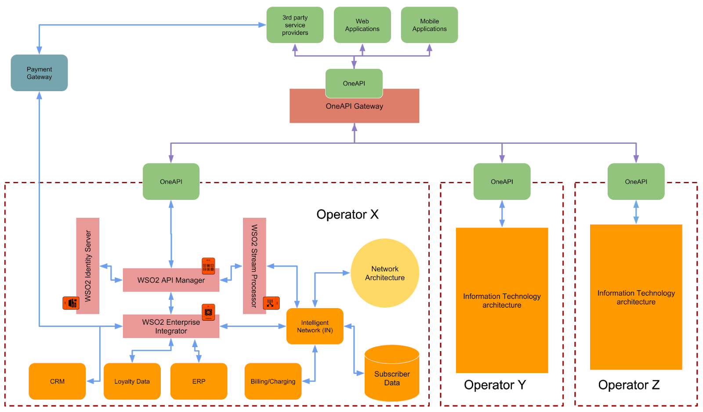

## Introduction
Sending a message from one place to another (telecommunication) has been a revolution since it’s inception. It helped people to save lives, win wars, make peace and many other things. After thousands of attempts, Alexander Graham Bell made it possible to send a message over a wire and that opened the door for the eventual over the air communication and finally we are in the age of satellite based communication (thanks to Sir. Arthur C. Clarke) which made it possible to connect people in far corners of the world within a whisker. Telecommunication (specifically mobile) technology has gone through several iterations (e.g. 2G, 3G, 4G, 5G) and the main focus point of that was to improve how information is exchanged across the network. As any other technology, telecommunication has gone beyond the need of message exchanges to data communications to video conferencing to shopping to financing and many more. You can absolutely do anything with the device (mobile phone) which was used to send messages in the past using your finger tips. The organizations who bring this technology to the end user are called the Mobile Network Operator (MNO)s. Even though they deal with these technical advancements continously, there main focus point is their customer base which they refer as subscribers. It is their responsibility to provide value to their subscribers on top of the telecommunication capability which they offer through technology. The main focus of this whitepaper is around how MNOs can collectively offer better experience to their subscribers while increasing their profit margins using digital transformation.

## Understading the stake holders in telecommunication eco system
Mobile Network Operator (MNO)s are the main players of the telecommunication game with respect to bringing telecommunication capability to the end users. They use the complex technological advancements and equipments and build networks which interconnects people in a given region (it can be a village, city, province, country or the entire world). Let’s identify the stakeholders who are engaged with the telecom eco system.

**Figure 1: Telecommunication industry stake holders**

- Mobile Network Operator (MNO) — The main stake holder of providing telecommunication services to subscribers. It is resposible for purchasing the frequencies, setting up the infrastructure (signalling towers, base stations, switches, antennas, etc.), designing the network based on capacities, testing the signal strengths and finally marketing and selling the service to the end users.

- Subscribers — The end users who are using the network which is built and maintained by the MNO and pay for the subscription.
Equipment manufacturers — Vendors who do research on technological advancements and build the equipments (antennas, routers, switches, servers, etc.) which provides the infrastructure layer for message exchanges.

- Internet Service Provider (ISP)s — These organizations maintain the connectivity between MNO maintained network and the public internet as well as other MNOs. Normally they maintain the backbone of the mobile network.
Application Developers — These people were not used to be stakeholders of telecommunication eco system in the past. But with the invent of customizable mobile operating systems like android and apple ios, application developers also play a major role in providing value added services to the subscribers on top of basic telecommunication capabilities like voice and data.

- Service Providers — These are 3rd party service providers like taxi services, e-channeling, payment services (Banks), location based services and many other types of services which are offered through either mobile network over signalling channels (SMS and USSD) or data network through internet.

## Understanding the technology landscape of telecommunication eco system
In the telecommunication industry, technology plays a major role. It is essential to understand the technology landscape before coming up with any reference model. We can divide the telecommunication technology architecture to 2 main sections.
- Networking architecure (Technology focused)
- Information Technology architecture (Business focused)

### Networking architecture
This is the core of any telecommunication system which provides the connectivity of subscribers. It requires a special technical capability in the field of telecommunication engineering to design, build and maintain the network. It is out of the scope of this article to discuss about the networking architecture. Following diagram is added for the sake of completeness.

**Figure 2: Telecommunication network architecture**

### Information technology architecture
In telecommunication industry, both network and subscribers are equally important to the MNO business. The idea of the information technology architecture is to define the systems and their interactions where subsciber related information resides. It can be billing, charging, value added services, subscriber information, service subscriptions, etc. These type of information resides on different systems which are built in house or bought from outside (COTS or SaaS applications). The interaction of these systems and how they are presented to the subscribers makes the differentiation across multiple MNOs operating in the same region since most of these MNOs owned the same type of network and technological capabilities. Due to this fact, it is essential for a MNO to focus on this part of the architecure and innovate. Typical information technology architecure within a MNO is depicted in the below figure.

**Figure 3: Telecommunications Information technology architecture (basic)**

As depicted in the above figure, in a typical information technology (IT) system within a telecommunication operator (MNO), we can find the below mentioned systems.

- Intelligent Network (IN) — This is the core of the IT architecture within the MNO. It has all the details about the subscribers and their usages. IN is connected with billing/charging systems, loyalty data systems, Call Data Record (CDR) systems and many other systems. It is responsible for charging the subscribers in proper and intelligent manner.

- Customer Relationships Management (CRM) — This is the software component which keeps the information about customers and their subscriptions.

- Enterprise Resource Planning (ERP) — This component keeps the information about projects, equipments, accounting, business processes and other business related items.

- Loyalty Data — This system is responsible for keeping information about any loyalty system and marketing promotions and other marketing activities

- Billing/Charging — This component is responsible for charging the customers based on their usage. Keeping various profiles based on usage patterns is defined and mainained here.

- Subscriber Data — This component keeps the information about subscribers from the network architecture perspective. This includes information like, Call Details Record (CDR), services offerred to a subscriber, profiles bounded to subscribers, etc.

- Web Applications — These are the internal and external applications which aggregates data from different systems mentioned above and provide a useful view.

- Integration Bus — This is the central component which interconnects heterogenous systems through various messaging formats and communication protocols.

- Network Architecture — This is the network portion which is described in previous section.
The above mentioned architecture is somewhat common amongst most of the telecommunication operators with more or less additional components. This architecture works perfectly fine and unless there are other operators doing innovative things around this archiecture to add value to their subscriber base and expanding to your subscriber base.

## Adding value to your subscriber base
Mobile telecommunication technology has grown to every corner of the earth. Whether you are a farmer living in a rural village in Uganda or an eskimo living in Greenland or a yankee living in New York, everyone is connected within sub second through this technology. The real potential of telecommunications lies on top of the standard voice, data or messaging services. That is where the innovation comes into picture. This technology has enabled a platform which spans beyond any cultural or geographical boundaries. To grasp this vast potential, network architecture as well as information technology architecture needs to be upgraded. In order to upgrade the IT architecture within telecom eco system to add value to their subscriber base, first we need to identify the capabilities which are required.

- Capability to expose subscriber information securely
- Analyze usage patterns
- Connect with 3rd party service providers
- Attract application developers

The above mentioned capabilities can be added to your IT system with the usage of API management, data analytics, partner on boarding portal and developer portal. The improved architecture of the IT system can be depicted as in the below figure.

**Figure 4: Telecommunications Information Technology reference architecture (advanced)**

In the above figure, there are few additions on top of the basic IT architecture diagram depicted in figure 3. Those additional components are

- API management — This component is used to expose the subscriber information to external systems in a secure and controlled manner. In addition to that, it provides the capabilities to on board partners, build portals for developers to write mobile applications

- Security — Once the subscriber information is exposed to third parties, it is essential that we could take the highest possible security measures to protect the data as well as the system

- Analytics — By analyzing the subscriber usage patterns and their interests, MNOs can offer more and more innovative and attractive services to the subscribers. The analytics component will do the real time as well as time series based analysis of subscriber data.

- Payment Gateway — This component resides outside of MNO eco system and connects with the internal systems through integration bus to handle the payments which are done from/to 3rd party service providers. As an example, a subsciber can pay his mobile subscription charges through his bank account or he can buy a shoe using his mobile subscription credit.

- Mobile applications — Once the Subscriber information is exposed through APIs, application developers can develop mobile applications alongside 3rd party service providers to offer innovative services.

- Service Providers — This can be any type of service providers who gets a chance to offer services to a whole new customer base (can be millions). Some examples are money transfer, e-channeling, home catering and banking.
This architecture can expand the horizon of the MNO’s business capabilities into many other areas through APIs. The subsciber base can get benefits through the services which MNO offers through partnerships. One of the important thing with this technology is that you can provide services with a simple messaging based or USSD based application even when there is no internet connectivity. Another important aspect is that these services can be offered through localized applications so that users who has language barriers can benefit from this technology.

## Realizing the modern Information Technology architecture
The next most important step of modernizing the IT architecture within MNO is to identify the products which are available to cater these requirements. WSO2 offers products which are specially built for these requirements. The below figure showcases the products which are well suited for this architecture.

**Figure 5: Telecommunications Information Technology reference architecture (WSO2 mapped)**

In the above figure 5, it depicts how the WSO2 products can be mapped to different components within the reference architecture for telecommunication IT system. As shown in the figure above, following WSO2 products can be used to realize the proposed reference architecture.

- WSO2 API Manager — Exposes the internal subscriber information to external users through a set of managed APIs. These APIs can be secured using OAuth2 protocol. These APIs can be displayed in a developer portal so that application developers and 3rd party service providers can discover these APIs and build their own applications. In addition to that, these API requests can be controlled using policies and alerts can be set based on over usage.

- WSO2 Identity Server — This provides the comprehensive security capabilities to the platform by acting as an authorization server for OAuth2 tokens as well as enabler for SSO and Identity Federation. As an example, MNOs can allow users to log in to various applications using their social logins like facebook, google.

- WSO2 Enterprise Integrator — Different systems like IN, ERP, CRM, Loyalty has their own data formats as well as transport protocols and needs to be interconnected to provide valuable aggregated data formats to the external applications. This is the central hub which interconnects heterogenous systems and allows API management layer to expose these systems and orchestrations as valuable APIs.

- WSO2 Stream Processor — This is the component which analyse the data going through above mentioned WSO2 products and provide insights on which APIs are heavily used, latency of different services, available login sessions and many other metrics related to the products. In addition to that events coming from network layer towards IN about usage details can also be monitored in real time and take decisions accordingly. As an example, if a particular subscriber is using data highly on a particular time frame regularly, system can automatically send him a message offering a package which is customized for that time period and increase the revenue of the business.

## Expanding the value addition across multiple operators
MNOs have their own strength and weaknesses when it comes to the network capabilities and other service offerings to their subscribers. MNOs wants to expand their strong capabilities to subscribers within other networks while subscribers wants to get the best possible service no matter who the operator is. This is one of the major reasons for the introduction of GSMA OneAPI. According to Wikipedia, it is defined as
“ OneAPI is a set of application programming interfaces (APIs) supported by the GSM Association that exposes network capabilities[clarify] over the Internet “.

In simple terms, it is mechanism to expose set of capabilities within MNOs through a standard set of APIs so that everyone can build applications on top of those APIs and allows interoperability across different MNOs (like they do for roaming) for services which they offer. If we think about roaming capabilities, there should be an agreement between your local MNO and the visitng MNO so that you can use the same SIM card within that visiting country or region. With the OneAPI specification, this interoperability brings to the next level where users can use services and applications which are offered by visiting MNO.
With the reference architecture discussed in the previous sections, MNOs can easily adopt to OneAPI standard without any changes or additions to their IT architecture or networking architecture. The only requirement is to implement the set of APIs defined by OneAPI specification using the API management layer and relevant system integrations through integration layer.

**Figure 6: Telecommunications Information Technology reference architecture with GSMA OneAPI**

As depicted in the above figure, when all the MNOs implement the OneAPI standard and expose their network capabilities and subsciber information, 3rd party service providers as well as application developers can reap benefit of a larger subscriber base. In fact mobile operators can also sell their services to subscribers on other network operators. Subscribers will get services from multiple operators by having only one subscription. To mediate and govern these interactions, there needs to be a “OneAPI Gateway” which will eventually route the subscriber requests based on set of defined rules and agreements across different operators. This gateway functionality can by done by a 3rd party provider (3PP) or one of the operators themselves. With this architecture, different operators can have their own internal implementations on how the systems are interconnected and so on, but they must expose a standard set of APIs.
This architecture can be expanded across boundaries and the entire world can be connected into a single network (similar to internet) and a person with a mobile phone and a subscription to his local operator can access services across the world when he is travelling or staying in his own country. It is somewhat similar to you watching youtube from your home through internet, you are using a mobile application which is used to channel a doctor in another country where you mother is living and make the appointment from the phone by paying from your mobile wallet !.

## Summary
In summary, the technology which used to connect people needs to be connected in a more meaningful manner. With the telecommunication information system reference architecture introduced within this article discusses about how to provide innovative services to your subscriber base and drive revenue to your business. By using GSMA OneAPI specification, it is possible to expand the business into other operators as well as other regions. Subscribers will alse benefitted from the global connectivity and service sharing across multiple operators.

### References
[1]https://www.gl.com/images/gsm-gprs-umts-sigtran-protocol-analyzer-over-tdm-ip-ps-web.gif

[2]https://en.wikipedia.org/wiki/OneAPI

[3]https://www.slideshare.net/oneapilive/gsma-oneapi-gateway
