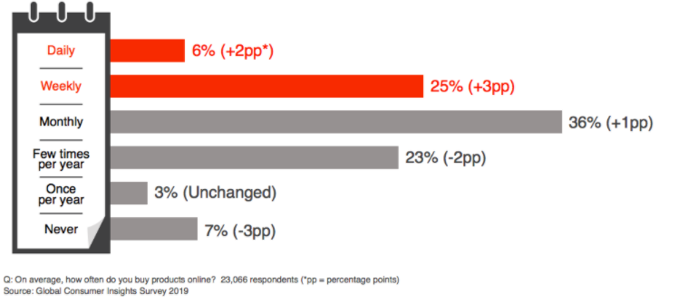
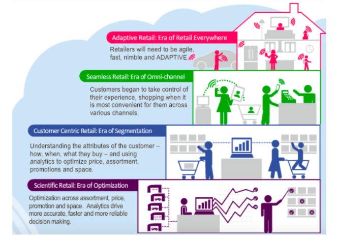
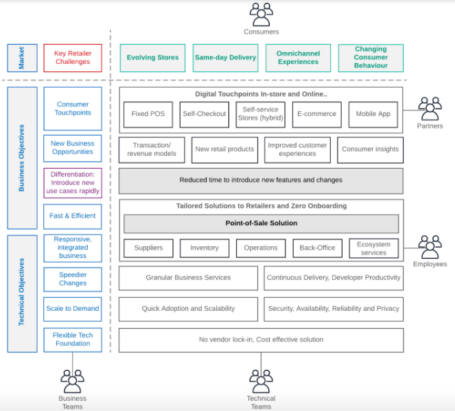
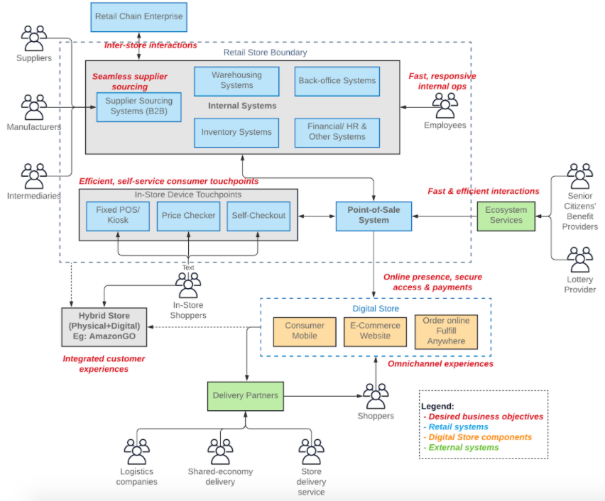
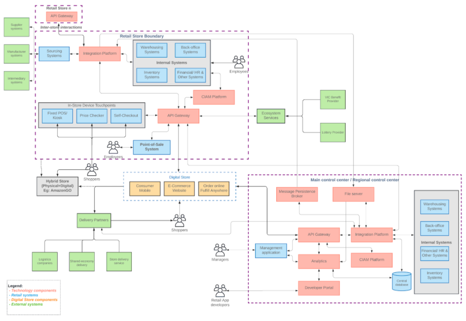
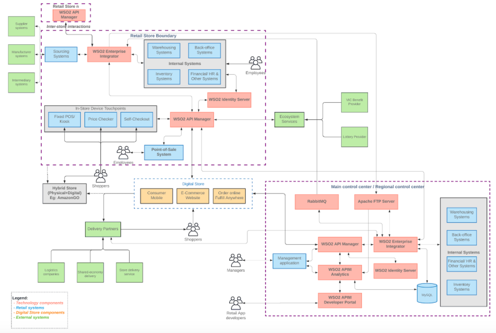

<h1 align="center"> Future Retail: A Business and Technical Architecture 
</h1>
<h2 align="center"> Key business and technology success factors for making a retail architecture a reality.
</h2>

<i>
Version 1.0 (Fall 2020)  
</i>

**_Authors_**
+ Lakshika Paiva, Associate Lead Business Analyst
<lakshikap@wso2.com>
+ Chanaka Fernando, Associate Director / Solutions Architect
<chanakaf@wso2.com>

## Table of Contents
- 1.0 Introduction
- 2.0 Retail Trends and Challenges
  - 2.1 Physical Stores to Online Channels
  - 2.2 Omnichannel Experiences
  - 2.3 Evolving Stores
  - 2.4 Same-Day Delivery
  - 2.5 Unexpected Situations
  - 2.6 Other Concerns
- 3.0 The Business of Retail
  - 3.1 Business Architecture for Retail
  - 3.2 Application Landscape of Retail
- 4.0 Technical Architecture for Retail
  - 4.1 Retail Store
  - 4.2 Main Control Center/Regional Control Center
- 5.0 Reference Software Architecture for Retail
- 6.0 Key Takeaways
  - 6.1 For Large and Medium Retail Chains
  - 6.2 For Retail Technology Solution Providers (System Integrators)
  - 6.3 For Small Retailers, Mom-And-Pop Stores, and Similar Businesses
  - 6.4 For CIO/CTO/Product Management Teams of Retailer/Retail Technology Providers
- References	

## 1.0 Introduction
This article presents a retail business architecture and a technical reference architecture suited for large, medium retail chains as well as adaptable to smaller retailers. The architectures are based on an analysis of the projected retail landscape influenced by changing customer behaviors, evolving stores, omnichannel experiences, and demands for same-day delivery of consumers. With the light of market knowledge, we identify the retail enterprise’s business objectives towards transformation and present it as business architecture, along with an existing application landscape. In the discussion, we articulate the key technology success factors for making this business architecture a reality. Thereafter, we propose a retail reference architecture that is useful to transform the retail business to a future-proof business through digital transformation. 

## 2.0 Retail Trends and Challenges
Irrespective of whether you are a large retail chain like Walmart, The Home Depot, Walgreens, Marks & Spencer, Carrefour, a medium-chain or a mom-and-pop retail store in the locality, all retailers are equally challenged by shifts in consumer behavior, growth of personal computing devices, developments in technology and other changes in the past few decades. As new technologies grow, we explore the impacts of these shifts on the retail industry to identify how a retailer needs to transform its business.

### 2.1 Physical Stores to Online Channels
The retail industry went through an apocalypse in the past decade when over 12,000 physical stores across many retailers closed down in North America owing to factors like over-expansion of malls, rising rents, bankruptcies, low quarterly profits outside holiday binge spending, delayed effects of the great recession, and shifts in spending habits. However, previous statistics show that retail spending is increasing year on year. So where are all the sales happening if not at stores?
Due to the increasing usage of internet connectivity and its penetration, online shopping has been a major driver for the retail industry. The Global Consumer Insights Survey 2019 shows that almost a third of consumers buy products online weekly or more frequently, up by 5% year-on-year (refer figure 1). As a result, consumer shopping habits have largely shifted from physical stores to digital channels like e-commerce websites and mobile apps.

  

<i>
Figure 1: Frequency of online shopping (Global Consumer Insights Survey 2019) 
</i>

Further, actual numbers in the predicted environment show a growing number of mobile computing devices, smartphones, and mobile payments driving consumer spending in retail. More often, today’s consumers shop on smartphones than on personal computers. As a result, online retail industry alone has been valued at USD 23,460 billion in 2017 and is expected to register a CAGR of 5.3% during the forecast period (2018-2023), to reach USD 31,880.8 billion by 2023.

### 2.2 Omnichannel Experiences
Today consumers are not only using one channel to shop, they are engaged with retailers through several touchpoints. Hence, omnichannel experiences are on the rise; in 2016, compared to 7% of online-only buyers, the remaining majority or 73% of shoppers said they use multiple channels during their shopping journey. Interestingly, these shoppers spent more time shopping, spent more money than online shoppers, and were also known to be more loyal. 
Walgreens mobile retail app is popular amongst its consumers in the United States for the omnichannel experience it provides across all interfaces. The app allows users to manage pharmacy prescriptions, fill out rapid refill requests, and find deals on products in stores. Further, customers can place orders online or via the app that they can pick up at the nearest location. Overall, it complements the in-store experience. This requires the customer to be connected with the mobile app to sales fulfillment operation, inventory, available promotions from suppliers, and more information equally offered within the store. Having an isolated customer database or gamut of disparate systems will not help, rather these systems need to work together to provide the omnichannel experience. 

### 2.3 Evolving Stores
With more stores closing down in 2019, new formats of stores are opening up in many regions. For instance, AmazonGO presents a new format of self-service and sensor-based stores where customers can purchase groceries and checkout without staff intervention. Traditional stores have adopted this concept to a certain extent by introducing self-checkout machines and kiosks which are less automated. However, more vendors like Grabango and Zippin are promoting the hybrid store concept by integrating the store with digital components. With checkout-free experiences through sensor-based communication and innovative apps, customers feel they have more independence during shopping and no queues at the checkout. Technology has been at the forefront of these store transformations and it will prove to be more useful in the future as countries uptake contactless approaches.

### 2.4 Same-Day Delivery
Delivery is an essential component of online retail. Business-to-consumer (B2C) retail delivery has evolved over the years from a few days to one-day and now same-day delivery with the rise of e-commerce in domestic markets. Retailers like Amazon and Walmart have excelled in this area but speed has always come with a premium price. 

In the long run, parcel logistics providers will be able to operate at the lowest cost while offering integrated logistics solutions ranging from orders through fulfillment to delivery and return. There are options like ‘Dropoff’ and ‘Uber’ that have leveraged their resources to offer an innovative delivery experience to customers. The opportunities ahead are huge. Logistics providers need to position themselves for the upcoming transformation and adapt their existing networks accordingly. However, McKinsey states that companies need to build the necessary network to make this possible, and technology plays a vital role in it. One of the four key success factors for same-day delivery is to have fast, integrated information technology systems. They must enable:

- Full inventory transparency across all warehouses and stores,
- The direct transfer of order data between webshop and (in-store) fulfillment,
- Prioritized picking logic to allow fast-tracking of same-day orders.

### 2.5 Unexpected Situations
The Covid-19 pandemic has caused a massive surge of grocery sales due to short-term panic buying, and has increased people’s spending towards essential goods via e-commerce, mobile commerce, order online and pick up, and adopting other queue-less methods. Amidst the crisis, going digital has proven to be one of the critical success factors for business continuity of all retailers. Brands and stores that had embraced the digital revolution were best prepared and have thrived, but some have experienced limitations in scaling to unexpected customer demand.

Several small and medium retailers operating on agile practices quickly adapted and transformed their businesses to go online and serve customers. Smaller, brick-and-mortar retail stores in the locality have either adapted using instant messaging services like Whatsapp and Viber or have remained closed for business. Improvised mechanisms are seen in all parts of the world irrespective of the state of their developed or underdeveloped economies. 

### 2.6 Other Concerns
In research done by Accenture, the impacts of pervasiveness, personalization, and privacy were seen to be key challenges to C-suite in the era of retail. Converging industries and complex customer expectations call for retailers to build on each era from Scientific Retail, Customer-Centric Retail, and now Seamless Retail (Figure 2). As customer needs and expectations continue to evolve, retailers must establish nimble, flexible, agile organizations. They must become adaptive.

  

<i>
Figure 2: Converging Industries and Customer Expectations of Retail (Accenture, 2019) 
</i>

- Pervasiveness
Customers are offered seamless experiences through different channels and this makes retail independent of a location or channel. The benefit of a digital world allows enterprises to learn about customers irrespective of these two factors so that they can adapt and make themselves more relevant. 
- Personalization 
Each customer is unique, and their needs and expectations are often contextual either to their location or activity or any other factor, having digital in mind. The expectation is that retailers understand these different situations and predict needs to better cater to these personalized needs. 
- Privacy
Privacy encompasses data security and every customer has specific privacy needs. Retailers must focus on striking the right balance in their relationships to create trust, engagement, desire, affinity, and delight. 

These three aspects call for careful consideration and design of customer identity and personal information management. Given the regulatory requirements in several countries having a compliant technology solution in place is important to retailers. 

In summary, as consumers get influenced by technology, retailers are going to be challenged in four key areas of change in consumer behaviors, demand for omnichannel experiences, faster delivery, and changing stores. Also, the sudden need for safer shopping in times like Covid-19 strengthens the case for digital presence. However, most retailers haven't been able to upkeep with the online demand and delivery or be able to adapt to changing circumstances, as fast as the market has required.
Further, a new segment has emerged for contactless payment and delivery in retail. However, pandemic circumstances won’t last for long, but it has given rise to a new normal, and it is a reminder of how resilient and responsive you are as a business. As customer expectations continue to shift, retailers must establish agile and adaptive enterprises. A strong digital foundation has been one of the critical success factors in this context. As a result, we collate the challenges and potential business objectives for retailers and propose a business architecture in the next section.

## 3.0 The Business of Retail 
### 3.1 Business Architecture for Retail
Each retail enterprise is different from a business perspective; in the simplest instance, Walmart competes in the market on the lowest price strategy and appeals to mass markets. The rest of the business’ strategic and tactical initiatives, teams, and operations are organized to generate this value across all activities in the value chain. Of course, today’s retail enterprises are a step ahead and have business systems in places like point-of-sale systems, inventory systems, sourcing, and human resource management systems to automate routine, manual tasks and speed up processing, for creating this value.

However, business strategies and technologies evolve. Hence, it is important to capture the key value drivers of the overall business operation to ensure technology aligns to achieve this value. We capture this value through a business architecture that acts as the primary business design blueprint that feeds into the technology decisions of the technical architecture. 

Figure 3 presents the business architecture for a typical retail chain, particularly with several stores. This mainly highlights the business objectives of the retail chain and how value is derived out of each business component and process involved in achieving these objectives. 

- Retailer challenges: The shifting market trends challenge retailers which is what drives change in business objectives and strategy. 
- Point-of-Sale (PoS) Solution: This is at the center of the retail store as it is the primary touchpoint for consumers. Other back-office operations like supplier sourcing, inventory management, work in unison with the PoS. The objective here is to be responsive as well as productive.

Table 1 highlights the objectives for a retail chain, which are common to most retailers. At this point, we keep it at a high-level as architectures are abstract. 

Table 1: Business and Technical Objectives forming the Business Architecture
|  |  |
|--|--|
|High-level Business Objective|Details|
|Introduce digital consumer touchpoints|To increase checkout convenience. To avoid trips to physical stores.|
|Introduce new business opportunities|To introduce new revenue models. To introduce new retail products. To offer improved customer experiences. To gather consumer insights.|
|Achieve differentiation|To be quick to respond to market needs.|
|Fast, responsive, integrated and efficient operations|To have fast back-office operations. To have an efficient supplier sourcing. To have just-in-time inventory. To work in unison with partners.|
|Speed of changes|To improve agility and nimbleness.|
|Scale to demand|To meet increasing demand. To enable quick adoption. To scale to increasing demand, and provide reliability, availability, and resiliency.|
|Flexible technology foundation|No vendor-lock-in. Cost-effective solution.|

  

<i>
Figure 3: Business Architecture for Retail 
</i>

Legend to Figure 3: 
- The business architecture is to be read horizontally. From a market perspective, key retailer challenges are depicted in the green boxes. 
- Four key business objectives are shown in blue/purple boxes. 
- Subsequently, four key technical objectives are shown in blue boxes below. 
- Alongside the objectives to the right, grey boxes show how a specific retailer’s objectives are organized to solve the market challenges given in green boxes.
- Partners represent the Lottery and delivery partners etc. It also includes programs like Veteran ID Card (VIC — an ID Veterans can use to get discounts at many restaurants, hotels, stores, and other businesses). 

### 3.2 Application Landscape of Retail
Figure 4 depicts one of the possible application landscapes for a typical large/ medium retail chain. To make this retail store possible, different retail components like point-of-sale systems, inventory management, warehousing, sourcing, and in-store devices have to work together. However, it is not currently designed to achieve the business architecture or objectives set out in section 3.1 above as there are several challenges. For instance, the systems may have been acquired at different points in time, and may not be connected to achieve the desired objectives. 

  

<i>
Figure 4: Application Architecture of a Retail Chain 
</i>

Legend to Figure 4: 
- The applications/ components that are existing in a particular retailer store are shown in blue.
- The external partner systems are shown in green, which may or may not connect to the retail store systems.
- The online stores are depicted in orange.
- The text in red shows the objectives that the retailer wants to achieve in the future through each component.
- The hybrid store in grey shows a potential farfetched objective for the business. It may have its own or a combination of technology/ systems. 
- Any component in the diagram may or may not be present at a retailer at any given time. 

The common problem with these types of application architectures is that systems are from various vendors that adopt heterogeneous technologies and standards. Retailers must connect them to solve certain challenges like offering seamless omnichannel experiences and opening up new online revenue options. Sometimes, the applications are designed to work in isolation and it results in data silos. 
The underlying connective technology plays a significant role in achieving the objectives through business architecture. We use this opportunity and challenges as the basis for proposing the desired technical architecture for a retail chain in the next section.

## 4.0 Technical Architecture for Retail
The value of digital connectivity has become more and more evident in modern times with a lot of people using their mobile phones, tabs, and computers to do absolutely everything possible through that medium. Retail shopping is one of the most popular applications of digital connectivity. With the Covid-19 pandemic which started late 2019/early 2020 and caused 70% of the world population to be in lockdown status for weeks if not months, this digital connectivity is becoming far more critical to carry out the daily activities.

Technology has come to the forefront to rescue mankind from extinction and help millions of people to survive at this trying time. But the retail industry has been utilizing the technology for a considerable amount of time and the companies who were ahead of the curve in terms of technology utilization were the first to respond to the current situation successfully. 

As we have seen in the previous section under the business architecture, it is evident that retail stores similar to any other enterprise system consist of various systems built by different vendors utilizing different standards and protocols. The very first challenge of building a technical architecture for a retail store is to identify these various systems and integrate them seamlessly so that they can operate efficiently and coherently. Once these integrations are made, the data residing in these systems need to be exposed in a standard form so that other components of the platform can make use of it. While exposing this data to other systems, it is essential to protect that data from unauthorized access and have proper controls over the access levels. 

If you are a large organization with 100s or 1000s of retail stores, this same type of architecture needs to be replicated easily. In the meantime, there should be a centralized or localized control center which is responsible for;
- Making high-level business decisions and communicating them with local stores
- Analyzing the business operations and derive business decisions
- Offer global services like online stores
- Organization-wide management of resources.

The technical architecture can be divided into 2 main components.
- Individual store technical architecture (which is repeated across stores)
- Main control center / regional control center technical architecture (which is centralized or deployed within limited regions)

Let’s take a look at the technical architecture which we can derive for the retail industry based on the points we have discussed in this article so far.

  

<i>
Figure 5: Technical reference architecture for retail chain 
</i>

The technical architecture shown in the above figure 5 depicts the main technical systems, different types of users, interactions of users, and systems. It is an extension of figure 3 where we depicted the business level connectivity amongst these components. 

Let’s take a detailed look at the components within the above technical architecture. 

### 4.1 Retail Store 
Every retail store is different in size, capacity, resources, location, and accessibility. But at a technical architecture level, we can generalize the components so that every store needs to have at least the following set of components. 

- Internal systems which manage data and resources
  - Warehousing systems
  - Human resource management systems
  - Inventory systems
  - Various back-office systems
- Customer-facing systems
  - Price checkers
  - Self-checkout
  - Point-of-Sales (POS) terminals

The systems mentioned above need to be interconnected internally and externally to offer a seamless, powerful, personalized experience to the users spanning from customers, partners, and internal employees. This is the functionality provided by a comprehensive middleware platform. 

- Integration Platform — Interconnects various internal systems with each other as well as with external partner systems through B2B integration capabilities. In addition to that, it takes care of asynchronous communication with the central platform where it receives updates (products, promotions, policies) and also delivers detailed reports for central bookkeeping and analytics purposes. This functionality can be further extended, for example, with a messaging system to guarantee the order delivery when backend systems are not available to accept new orders. 
- API Gateway — Exposes the integrated data to internal systems like customer-facing systems (POS, Self-checkout, Price checkers) as well as to external consumers like online channels as well as a control center for synchronous communications. It also provides security, throttling, rate limiting, caching, and business analytics at store level. 
- CIAM Platform — Protecting business data from unauthorized access is a critical aspect of a well-designed system while providing easy access to authorized customers. That is the task of customer identity and access management system (CIAM). It can also provide seamless access to internal systems through mechanisms such as Single-Sign-On, Multi-Factor Authentication, and adaptive authentication. 

This architecture can be repeated across retail stores with minor modifications. But it is extensible enough to support various systems and capabilities required by specific stores. 

### 4.2 Main Control Center/Regional Control Center
Traditional in-store sales, pickup sales, and regional delivery can be achieved through the retail stores which are located in a certain area. But providing the services to a wider geographic area needs a central control center or regional control center which can offer these services to consumers with a much better focus. In addition to that, there should be a centralized control over the retail stores to drive the business properly into larger goals while individual stores achieving their own goals. 
This main control center also consists of the same set of internal systems (with few more) which are mentioned above in the retail store's section. But this control center does not have a physical store where people can come and do their shopping. Rather it acts as a point of control for all the other retail stores as well as the main store for online sales. 
Here are the main middleware components and their functionalities used when deployed in the control center.

- Integration Platform — This component integrates internal systems within the control center and makes that data available for internal/external consumers. In addition to that, it connects with other retail stores to share control data in an asynchronous manner (through message broker) as well as in a synchronous manner (through API gateway in the store). Also, it receives batch data from retail stores through files and processes them in real-time and upload that information to databases. It will also connect with delivery partners for online sales and coordinate the delivery process through notifications. 
- API Gateway — The central API gateway deployment handles all the online sales requests in a scalable deployment without overloading the retail store level API gateways which are used for real sales within the stores. This gateway accepts the requests and handles them carefully with the usage of an integration platform and message broker and helps to deliver the products to consumers with much better user experience while utilizing the retail stores as and when necessary. It also provides APIs for retail stores to check the availability of certain products and automate the process of refilling the products when they go out of stock in those stores. 
- Message Broker — This component is used for multiple purposes within the control center. It is used to send real-time updates to retail stores with topic-based pub-sub communication channels as well as queue-based, specific channels. In addition to that, it is also utilized to store events to process later in case of backend system failures for guaranteed message processing which is critical in the retail business. 
- File Server — There are many cases where processing data in real-time is not required and doing so puts so much pressure on real-time business operations. Because of this, file-based data processing for certain operations is still a valid use case and in this case, retail stores can send file-based updates daily for sales reports, employee reports, product reports, etc. which can be processed offline and act accordingly. The integration platform will process the files and store them in a usable format.
- CIAM Platform — Providing access to the right data to the right people is critical in the control center since it is accessed by a larger number of users through online applications as well as for the management of retail stores. Having a comprehensive CIAM platform is crucial at this layer to have the right level of a mix between security and the user experience.
- Analytics — As mentioned earlier in section 2.0, doing proper business analytics on the operations within the retail stores as well as across the stores provides valuable insights into how that organization can increase sales while improving operational efficiency. Hence, having a proper analytics platform that can do statistical analysis as well as predictive analytics would give a real advantage over competitors.
- Developer Portal — To reap the full benefits of the API driven approach a developer portal can accelerate developer adoption to the retail APIs and bring in a new set of customers through their channels. As an example, there are many segments like telecom providers, banking/financial companies who wanted to provide their customers with one-click access to the retail products by integrating their mobile, web applications directly with the retail APIs exposed by the vendors. This portal makes that process easier for those 3rd parties as well as for the retail vendor to have proper governance and control over usage. 

This control center deployment can be a scalable deployment spanning across multiple data centers for high availability and better user experience. 

  

<i>
Figure 6: Software reference architecture for retail 
</i>

The technical architecture presented in the previous section is designed in such a way that it can be implemented with a variety of software vendors available in the market. Let’s select a few vendors in the market and design a reference software architecture so that readers of this article can correlate each product into their respective counterparts more clearly. Open-source technology vendors provide the flexibility and the freedom to design and implement this sort of architecture without much trouble. 

The above figure depicts a reference software architecture implemented using open-source software products. These products were selected based on their capabilities and the flexibility they possess through their open source licensing model. Here are the main components used in the above figure.

- WSO2 API Manager as API Gateway, Developer portal, and Analytics — This is an open-source API management solution that provides capabilities for full API lifecycle management along with support for cloud-native deployments. It has been used as the API gateway component, Analytics component as well as the Developer Portal component within the technical architecture. WSO2 API Manager’s component-based architecture allows us to deploy these components separately and manage and scale them independently. It also supports various containers, cloud platforms in addition to the standard physical/VM based infrastructure.
- WSO2 Enterprise Integrator as Integration Platform — This product is used as the integration platform which integrates various systems within the retail store as well as within the control center. In addition to that, it will also connect from one retail store to another store as well from one retail store to the control center via the message broker as well as via the file server. WSO2 EI is capable of handling on-premise and cloud systems integration and it comes with a runtime that supports deployment within physical/VM and container-based environments. 
- WSO2 Identity Server as CIAM platform — Providing secured access to the systems within the store as well as within the control center is crucial for the operation of the entire system. Employees will access systems through various interfaces and consumers will also need to be granted access to relevant information. At the same time, these access restrictions and authentication steps should not make it harder for the users to buy products and it should be a seamless and well-integrated experience. WSO2 Identity Server provides a comprehensive CIAM framework to implement security and access controls for the users while giving rich, secure experiences like social login, strong authentication, profile management, etc.
- RabbitMQ as the Message Broker — Providing guaranteed message processing is critical for online order processing within the control center. In addition to that, various updates need to be rolled over to the individual stores from the control center in an asynchronous manner without wasting resources and time for these message processing. RabbitMQ is one of the best open-source messaging systems available in the market which provides the necessary messaging guarantee as well as the asynchronous messaging support. 

Apache FTP Server as the File Server — Processing file transfers between the retail stores and the control center is a crucial but asynchronous (or batch) operation that needs to be handled in the background. Details like sales reports, inventory details, API analytics can be shared through flat files and processed later at the control center. Apache FTP server is an open-source file server that can support the required capabilities. 

The above software components were selected as a reference implementation. But this technical architecture is designed in such a way that it is independent of any vendor and none of the vendor-specific concepts are used when coming up with the technical architecture. With this reference software architecture, you can map the related products according to your needs and build your software architecture. 

## 6.0 Key Takeaways
### For Large and Medium Retail Chains
The retail industry is on the rise like never before. If you are a large or a medium-sized retail chain, there are many small retail chains gaining momentum in their localities and pose a challenge to your global business. To tackle this challenge, you need to innovate faster and go towards the consumer rather than expecting consumers to reach you. Technology takes you to places where you couldn’t reach before.
The consumers can automate their ordering of retail items so that they never need to step into a store or write a long list of grocery items and drive around the cities to complete the list. Instead, retailers like you can build the entire ecosystem to automate the buying process and deliver to the customer’s doorsteps just before he/she runs out of stocks at home. This whitepaper presents the business level details, key stakeholders, industry trends along with a reference technical architecture to build this sort of a platform for your business. 

### For Retail Technology Solution Providers (System Integrators)
Retail business is one of the most innovative and technology-centric businesses at the moment. The brick-and-mortar stores are long gone and retailers like Amazon, Walmart have made the shopping experience so simple that you just have to press a button to refill your essential items. But the reality is that there are a large number of medium-sized retailers who are yet to concur with the technology landscape and build effective retail businesses to compete with mega-retailers.
As technology solution providers for retail, you have to understand the key stakeholders in the wider ecosystem, trends, challenges, and technological architectures which can be used to help these retailers to build effective technology solutions that allow them to innovate and grow their business. This whitepaper provides business intelligence, technical architecture, and trends in the retail industry which can be utilized by people like you to build solutions that are more relevant and effective. 

### For Small Retailers, Mom-And-Pop Stores, and Similar Businesses
Technology is the weapon that large and medium-sized retailers use to ditch the small retail chains. More often than not, small retailers choose the options of unique products, localized packaging, and easy access to name a few as their competitive advantage over these competitors. But these factors are no longer true and small retailers need to think about utilizing the technology in a broader sense and beat these large players with the technology itself. As we mentioned before, technology allows you to reach places where you could never reach before.
And as a small retailer, you have a massive advantage over large retailers as your operation is smaller which is nimble and responsive to market changes. If you are a small retailer, you can build innovative services and offerings to your consumer base using selected technical architecture components presented in this paper. You can utilize the store level technology architecture, to begin with, and scale that out as and when necessary. There are many open source technology vendors available in the market so that you can start utilizing those technologies with a lower cost to build the desired technology platform to innovate and win customers. 

### For CIO/CTO/Product Management Teams of Retailer/Retail Technology Providers
Innovation is a key aspect of any competitive landscape. To innovate, you should have a solid understanding of the business and the usage of technology within the retail industry. This whitepaper discusses the business level details of the retail industry and the technical reference architecture to build that solid platform to innovate and grow the business. As a business-focused executive, you can use this information to understand how technical components fit into your business to make innovative revenue opportunities like online presence, mobile retail, and hybrid stores possible. 

