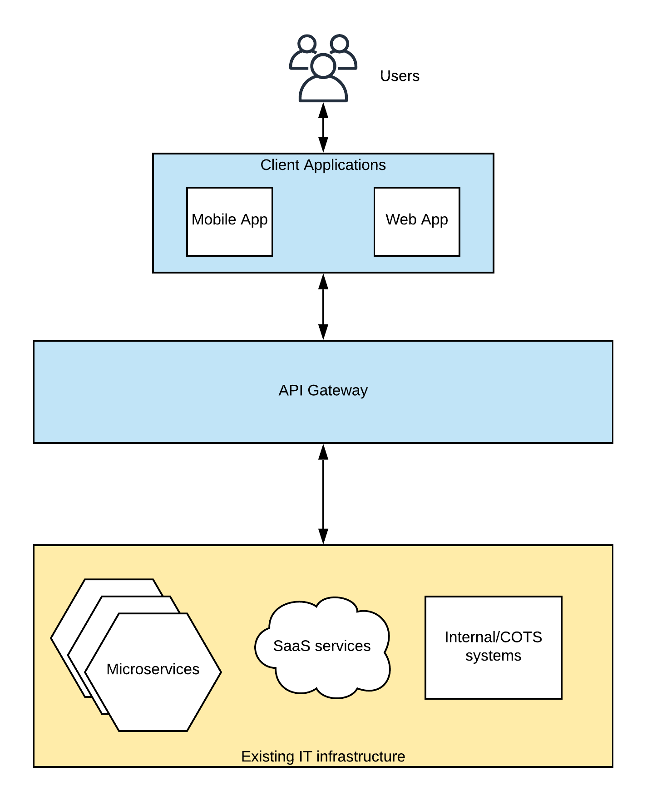
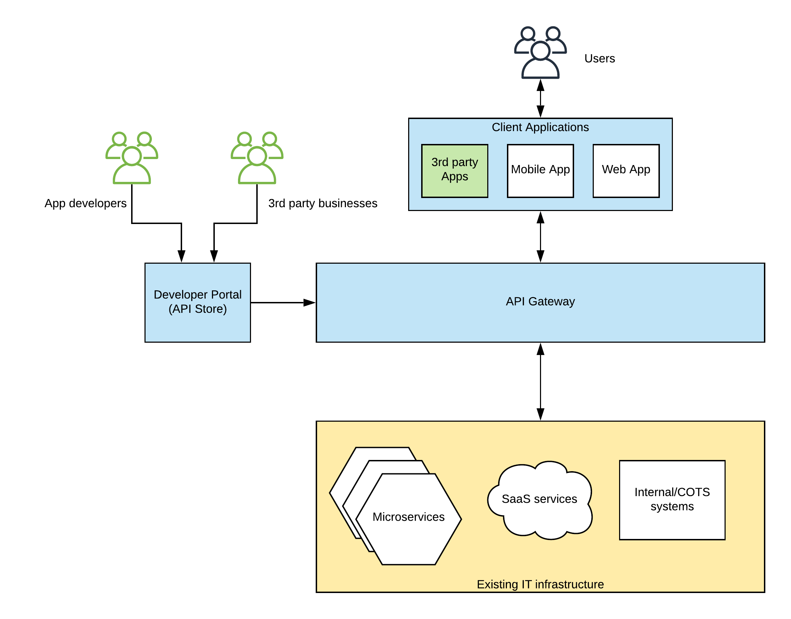
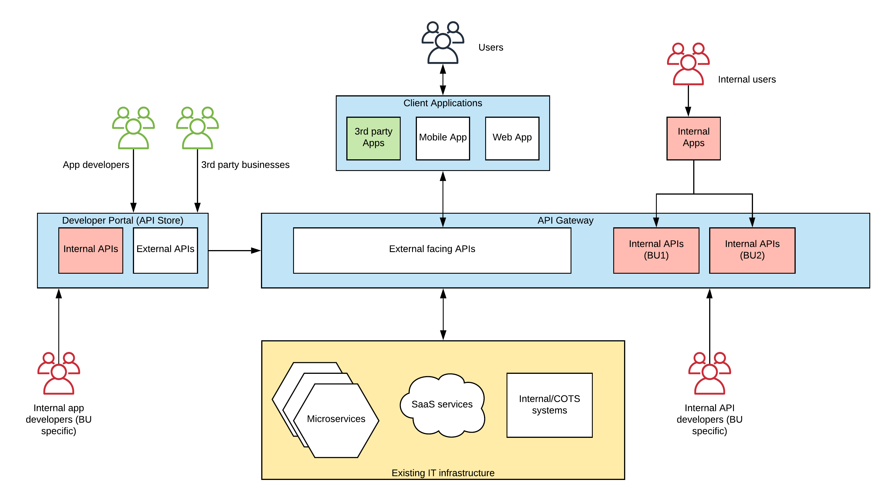
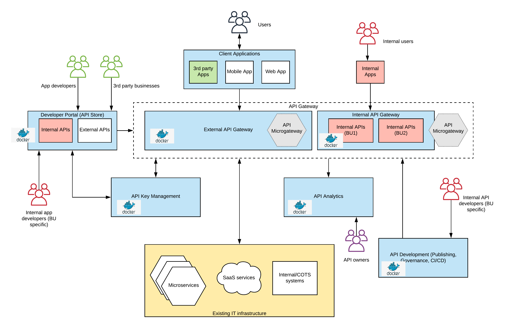

## What is an API?

In layman terms, an API is an interface that you can use to deliver your business capabilities and business data as valuable information to your customers. As an example, if you own a retail store, you can sell an item to a customer who is sitting on his couch at his home through an API. Isn’t it amazing?

## Why APIs?

If you want to grow your business, you need to reach out to more customers. APIs allow you to reach out to customers who you could never reach before. Who would have thought 20 years ago that you can shop everything you need without stepping out of your home? With APIs, you can make virtual connections with your customers, partners, and even employees and build a connected supply chain. 

## How to get started with APIs?

This is the million-dollar question. How to get started? In today’s world with increased adoption of information technology within businesses regardless of the scale of the business, we can assume that there is some sort of an IT system in place. With the growing popularity of cloud platforms like Amazon AWS, Microsoft Azure and Google Cloud and Software as a Service (SaaS) tools, you can own an IT platform without having a single server within your premises. The only thing you require is a device with a browser interface. 

Having said that, let’s assume that you have a set of systems (this can be10s, 100s, or even 1000s) that you are already using to store various business data and execute business processes. If you don’t have a component that integrates all these systems together, it is a good idea to use an integration platform (like ESB) to do that while getting started with the APIs. It is optional but recommended. 

We are yet to get started with APIs. Let’s get started. The fundamental idea of an API is to build an interface that exposes your business functionality to internal and external users. The most common and well-adopted mechanism (protocol) for exposing services through the internet (or network) is REST (REpresentational State Transfer) over HTTP. You can define your interface as a contract between the customer and your system. This contract can be defined using standards like Swagger or Open API Specification (OAS) or RAML. That contract explains basic details like

- How you can access this interface
- What you get out of this interface
- What you need to present when accessing the interface
- What happens if something goes wrong

Once you define this interface (contract) using a standard mechanism, then users can prepare their client applications (e.g. mobile, web) according to that contract. What happens behind the contract and within your business applications is no longer relevant to the customer. 

The component that hosts all these interfaces so that customers can access those is called an API gateway. Let’s see how you can use an API gateway to deliver business functionality to your users through APIs.

Figure: Using an API gateway to expose business functionality to users

As depicted in the above figure, users get access to business functionality with the client applications by contacting the API gateway. Let’s see what capabilities are required at the gateway layer. You can imagine that gateway is like a doorkeeper or a receptionist. At the fundamental level, it needs to have the following capabilities.

- Hosting APIs based on a standard format (e.g. REST, Swagger, OAS)
- Allow multiple users to access at the same time
- Validate the API users based on some form of identification

If you are starting off your API journey, the above-mentioned functionalities are more than enough to expose your business functionality to a wider audience. There are many other advanced features you would be interested in with the popularity of your API program. Let’s keep these basic capabilities to get started. 

## How to make your APIs popular?

Now you have opened up a certain limited set of functionalities and data (as information) to the users (both internal and external) over APIs and people start using it. Given below are a couple of examples where organizations have used APIs to improve their business processes with gateway functionality.

- An Insurance organization exposed a set of APIs to insurance brokers to register new deals as well as generate quotations for customers. This saved a lot of time and effort for brokers as well as for the organization. 
- A manufacturing organization exposed a set of APIs to resellers to check the availability of certain products in the manufacturing lines and make their decisions on orders and pickup based on availability. It helped resellers to plan their sales, orders, and transport arrangements. 

In both of the above cases, APIs helped an organization to improve their interaction with the partners who play a pivotal role in the entire sales process. The next step of reaching out and growing your business is to expose certain functionalities to end-users or the customers. There are different approaches to reach out to new customers. One simple method is to develop a mobile application and publish that in mobile app stores like google play store and apple app store. But that requires you to carry out a whole set of new marketing efforts to make that application popular. Some organizations with big brands may be able to do that. But not possible for many organizations. 

That is where the concept of an API marketplace comes into play. Instead of you alone trying to make use of the APIs through a mobile or web application, you can expose the APIs to a whole set of other businesses and application developers to build value on top of those. To do that, you need to have a place where these 3rd parties can come and discover your APIs and interact with your internal API publishers. An API Store or a Developer Portal does just that. Let’s see how it interacts with the overall architecture. 

Figure: Expanding your API usage with a developer portal

As depicted in the above figure, the developer portal allows external developers to make use of the APIs and build better experiences that are integrated with their current applications. As an example, if you are an insurance organization, now car sale companies can use your APIs and build an integrated experience for car buyers to get the insurance directly from their car selling application. Isn’t it amazing?

Let’s try to understand the basic functionality of a developer portal to get started. Here are some of the fundamental features of a developer portal.

- Provides a catalog of APIs where users can search and browse easily
- Provides a comprehensive representation of the API and its usage using relevant documentation
- Provides a mechanism to test the API functionality (optional)

In addition to the capabilities mentioned above, there are certain advanced features you would see in existing API management products that will increase the overall efficiency of the interaction with the external developers. Some of those features include

- Ratings, reviews and comments capability for each API
- Ability to share the APIs through social media
- Analytics on API usage
- Fine-grained API security configurations
- API monetization

You should consider these advanced features based on your need. 

## How to expand your API strategy within the organization?

So far so good. Now you have exposed your business functionality to partners first and then to a whole new set of users who will eventually become your customers. Don’t get frustrated with the conversion rates from those external sources at the beginning. As an example, you will see that only 0.1% of users coming through these external applications are actually becoming customers at the beginning of this effort. But this relative number will become huge when your absolute figures grow into large numbers. 

Let’s think about a scenario where you have multiple departments (or BUs) within your organization and most of these other departments are not directly interacting with the customers. There is a good chance that the IT departments of that BUs will not see the value of an API platform from the outset. You can consider those as partners and explain to them the advantages of both partners and the business experienced during the early stages of the API adoption. You can onboard other BUs in a phased manner. 

Let’s assume that you have the accounting department of your organization is ready to onboard into the API platform and they wanted to not only become a consumer of the APIs but also to host their own APIs for internal usage. The simplest way to support their requirement is to take the API requirements from the accounting department and develop the APIs and release that to the API platform under the supervision of the main team who is managing the API platform. This is good to start with. But this approach creates a lot of bottlenecks in the process and agile development practices and delivery practices cannot be followed by this approach. 

That is where the concept of API Federation comes into play. Instead of having a central team who is managing the entire platform, you should be able to federate the API platform according to the needs of different departments or BUs. The platform should be capable of providing the required independence and agility to other BUs to develop and maintain their own set of APIs and security policies. This does not necessarily mean that you should have a separate deployment of an API platform for each department. Rather, you can share the same API platform across multiple departments using a concept like “multi-tenancy”. That provides flexibility while keeping the cost factor low and make it easy for other departments to adopt the API platform without worrying about huge cost increases. 

Figure: Expanding API platform within the organization through federation

As depicted in the above figure, there are a new set of APIs deployed into the API gateway which is specific to internal business units (or departments). These APIs were developed by the developers of the respective BUs and deployed into the gateway so that only the departmental users can view those APIs in the developer portal as well as execute those APIs in the gateway. These are some of the crucial features of an API platform if you are going down this route. 

This requires specific role-based or group-based access control capabilities at the gateway level as well as similar visibility controls at the developer portal level. Most of the existing API management vendors support this requirement through the “multi-tenancy” feature. 

## How to make your API platform cloud-native?

Awesome!. Now we have discussed expanding our API platform to wider audiences through the developer portal and API federation. What’s next? Next in-line is what everyone is talking about. Making it future-proof and cloud-native or cloud-ready. We didn’t want to jump into the cloud bandwagon at the beginning since APIs and cloud-native are 2 separate things and to understand the value of APIs, you do not necessarily need to talk about cloud-native concepts. But we cannot let it go if we are designing our API platform to be future-proof. 

The layman’s definition of the word cloud-native is “to reap the benefits of the cloud”. At a high-level, cloud computing offers you the capabilities like

- High availability - available across the globe
- Elasticity - can scale up and down as and when necessary
- Scalability - expand to global scales 
- Cost savings - pay as you go

There are many other aspects, but we can consider these as the basic advantages of the cloud. Let’s see how we can align our API platform to reap the benefits of the cloud. There is an entirely different set of advantages offered by container platforms and microservices architecture which is not mentioned here. Once you have the platform designed for the cloud, you can consider gaining those advantages also through the same. 

One of the fundamental aspects of scalability and maintainability is modular architecture. If you have all the functionality baked into a single monolithic application, scaling becomes much harder. The concepts like microservices architecture have come up to address the problems which are surfaced with this monolithic architecture. Once the functional components are divided into compatible yet independent modules, the deployment becomes much more flexible. Let’s see how to define a cloud-native architecture for your API platform. 

Figure: Modular API platform with micro gateway

The above figure captures several aspects which we have not yet discussed and hence the steep jump from the previous figure to this one. Let’s start with what we have discussed before the figure which is the modular architecture. Prior to this point, we considered the API gateway as a one-component and API developer portal as a separate component. In this diagram, we have separated out the security part of the API gateway into a separate component called API key management so that security-related requirements can be handled independently. Also, we have introduced 2 additional modules for API analytics and API development. API analytics component is a good to have feature if you want to analyze the API usage and many other parameters and take decisions based on that. API development component is the component where API developers will interact with when building the APIs. This can be a GUI based interface or a fully automated process that bounds to a source code management system and a build pipeline like Jenkins. 

The other key addition of this figure is the separation of internal and external gateways so that those APIs don’t impact each other during the execution (runtime). In addition to that separation, there is a hexagon in those components that describes a micro gateway that can be used in certain use cases where you need to deploy one or a selected set of APIs in an isolated runtime which can work independently from any other component. Again, the micro gateway is a good to have component in your API platform. 

Finally, all these components are embossed with the docker logo to depict that these components can be deployed in a cloud-native platform like docker. The selection of the underlying infrastructure layer is totally up to the respective organization. The above architecture matches well with any of the 
- On-premise (physical/VM)
- IaaS (VM based)
- Containerized
- Kubernetes
infrastructure mentioned above.

## Summary

If you have read this far, you may be wondering what is the API management platform you are going to select? Even though the topic of the article suggests a selection process, the final decision on a particular vendor always in the hands of the respective organization. In this article, we covered the fundamental requirements of an API platform and how that can be scaled within an organization to reach out to more customers and then make it future proof. In terms of vendor selection, here is a list of vendors that fits into the above-mentioned requirements. 

- IBM API Connect
- Apigee
- WSO2 API Manager
- Kong Enterprise
- Mulesoft anypoint platform

