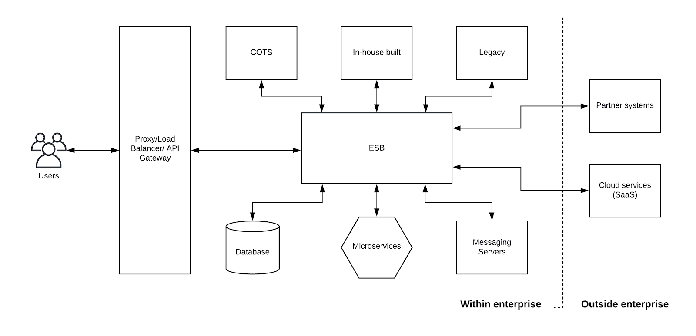
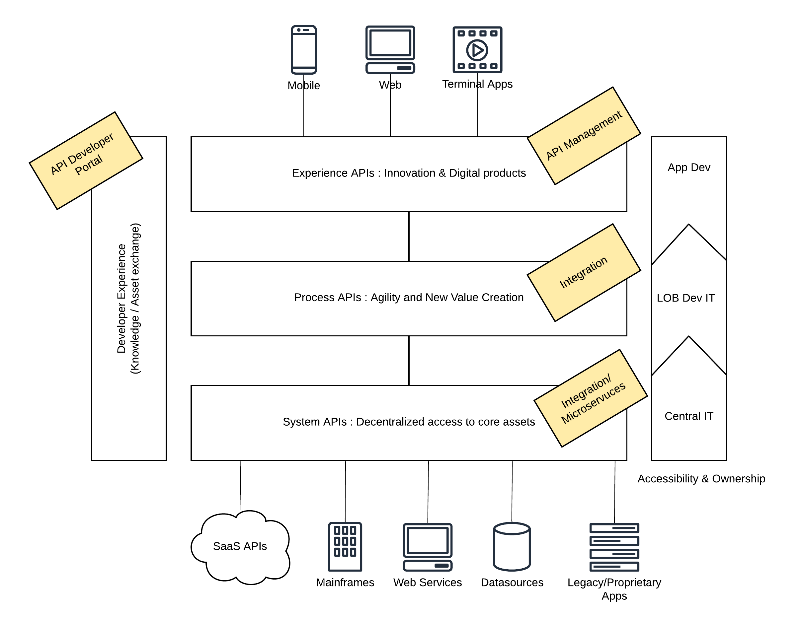
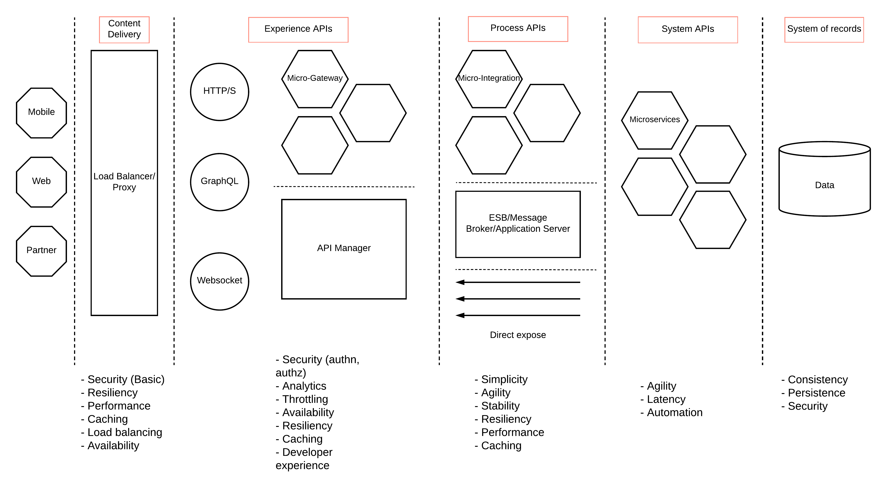
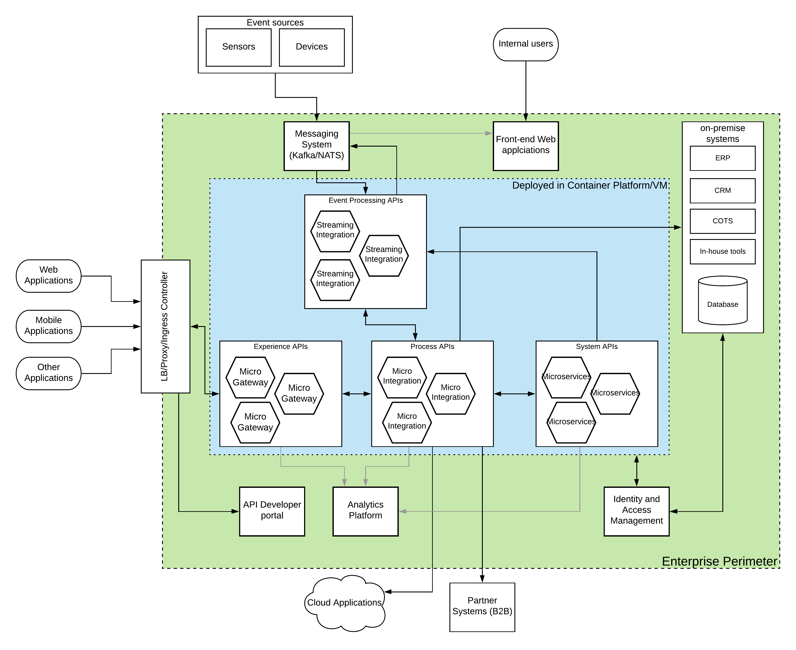

## What is Integration?
In layman's terms, integration is the interconnection of disparate systems to exchange data. In a conversation of a group of people, if different people speak different languages, then you need a language translator to keep the conversation going. Integration platforms perform a similar function in an enterprise IT system where disparate systems use different protocols and messaging formats to exchange information.

## Why Integration?
The technology landscape has evolved so much from the early mainframe computers where we had one large computer which executes a given task and produce the result. In today’s world, to do a given task, you need multiple systems to interact. This is the distributed architecture where the technology world is heading. Instead of having one monolithic application doing everything, enterprises have turned into multiple systems each executes a given micro function or a selected set of micro functions and does that much better than the large monolith. It is a given that even the smallest enterprise has more than one system and integration between these systems is a must to keep the business operations going.

## How to get started with Integration?
In today’s world with the increased adoption of information technology within businesses regardless of the scale of the business, we can assume that there is some sort of an IT system in place. With the growing popularity of cloud platforms like AWS, Microsoft Azure, Google Cloud, and Software as a Service (SaaS) tools, you can own an IT platform without having a single server within your premises. The only thing you require is a device with a browser interface.
Having said that, let’s assume that you have a set of systems (this can be10s, 100s, or even 1000s) that you are already using to store various business data and execute business processes. Even though these systems do their respective tasks, overall business success depends on the cohesive nature of their interactions.

Most of the small businesses start integration by writing their own software programs with technologies like Java or .Net. Given the set of features, libraries, and material available on these frameworks, you can absolutely do that without any issue. This would have been the step 0 if your IT ecosystem stays the same. But in reality, with the growth of the business, more and more systems need to be introduced into the IT ecosystem, and implementing more and more programs and modifying the existing programs, and maintaining those will become a huge challenge and that would hinder the ability to innovate within the industry.

Instead of spending time on implementing customized programs to integrate systems, you can start with an ESB (enterprise service bus). There are many open-source and commercial ESB offerings available in the market and you can start with one. These ESBs provide high-level, domain-specific language (DSL) to implement the integrations with pre-built templates and support various messaging formats and wire-level protocols so that developers can take those capabilities for granted. This reduces the time to market and opens up new avenues to innovate and increase the efficiency of the business operations.

Figure: Integration with an ESB

As depicted in the above figure, the ESB will integrate systems of various types including on-premise systems as well as off-premise systems like systems owned by partners and third-party cloud services like Software as a Service (SaaS) applications. This sort of integration is called hybrid integration. At a high level, the integration platform (or an ESB) provides the following capabilities.

- Application integration
- Data integration
- Business to Business (B2B) integration
- API management

These high-level requirements are fulfilled with a set of functional capabilities available in those integration platforms. Given below is a list of such capabilities available in an integration platform.

- Data transformation
- Protocol translation
- Application connectors
- File processing
- Routing and orchestration
- Messaging/Event handling (synchronous and asynchronous)
- EDI support
- Event stream processing
- API policy enforcement and management
- Ecosystem/partner community engagement

In addition to the above-mentioned capabilities, there are many more capabilities available in those integration platforms. Based on the need, you can utilize those capabilities.
Having an ESB that integrates the enterprise systems is the first step of building an effective integration platform. With the advancements in the technology landscape, integration requirements have also been evolved beyond the traditional ESB style integration. Let’s discuss these requirements in detail.

## Understanding the solution architecture
There are several different solution architecture patterns available in the technology landscape to address these modern integration challenges. One of the most adopted architecture patterns for integration is the layered architecture based on REST APIs. We have decided to go with that pattern given its simplicity and adoption.

Figure: API-led integration architecture

The above figure depicts the solution architecture for API-led integration that can be used to fulfill the expectation we set in the previous section. This architecture clearly defines the functional requirements of different layers based on the systems each layer interacts within the overall solution.

- Experience APIs — At the highest interaction point, users (internal and external) expect access to fine-grained, purpose-built, cutting-edge information with high value and easy usage. This is where innovation happens. As an example, a user who wants to buy a bicycle through his mobile phone wants to know every detail of the bicycle through the phone itself (except the real bicycle ride). The data which is exposed to this layer needs to improve the user experience or else it will be invalid.

- Process APIs — Providing quality experience APIs require the interaction of multiple systems and data sources and the proper design of data structures. This is where the process API layer comes in handy. This layer acts as the orchestration layer for multiple systems and data sources while fine-tuning the end result for the above layer (Experience API layer). Providing API based access to these capabilities allows users to create value and bring agility to business operations.

- System APIs — There should always be a component that does the heavy-lifting on behalf of the entire system. That is what this system APIs layer does. It makes interactions with core data sources and caches where valuable business data resides for longer periods and provide guarantees of data. These core systems can also expose their functionalities as APIs with proper controls in place so that it is much easier to interact with.

Each of these layers requires a certain set of specific functionalities that can be supported by the selected integration platform. Let’s discuss these components in detail.

- Experience APIs layer can be implemented with an API management platform. This may require a different set of functionalities depending on your enterprise and selecting an API management vendor needs to be done after evaluating the requirements. The fundamental capabilities like security, monitoring, rate-limiting, throttling, caching, and better performance are supported by the majority of vendors.

- Process APIs layer can be easily implemented with an integration technology platform that is capable of doing protocol translations, message transformations, service orchestration, and support for major messaging formats and wire-level protocols. These integrated services can be exposed as managed or un-managed APIs to the upper experience layer. One fundamental difference in this API-led connectivity or API-led integration is that you don’t need an API management component at each and every layer though it discusses APIs at each layer.

- System APIs layer can sometimes be directly passed through if the core data is coming from those systems through a defined API. If not, there should be a core business logic layer that converts the business-specific, raw data to meaningful data through an intermediate layer. Users can either utilize an existing integration framework or a standard web-services, microservices technology stack to implement this layer.

- One major advantage of this proposed API-led integration approach is that every functional capability is available in the means of APIs. Having a centralized developer portal that has details of all the APIs (experience, system, and process) would increase the overall operational efficiency in magnitudes since users do not need to make individual manual requests to get certain things implemented on a lower layer. There are API management vendors who can provide this sort of a developer portal as part of their core offering or through a plugin or add-on.

### Support for event-driven use cases

More and more business use cases in the enterprise world are built around handling large amounts of data. It used to be the extract, transform, and load (ETL) type of use cases in the past where users migrate large amounts of data in an asynchronous manner from one system to another system. Another example of an asynchronous, event-based use case is the publish and subscribe model (pub-sub) with the use of message brokers. Having these capabilities in the integration platform would be useful if your enterprise has similar use cases.

A new set of event-driven use cases are identified with the increased popularity of artificial intelligence (AI) and machine learning (ML) technologies used for business intelligence and automation. Hence, having the ability to support real-time, event-driven use cases can become really useful for any enterprise. Sometimes these use cases are called stream processing or streaming integrations.

Up to this point, we have not discussed any modern technology terms like microservices, cloud-native, containers which can be surprising for most of you. That was done intentionally so that we understand the fundamentals well before jumping into those cutting-edge technologies.

## Modern brown-field integration
Enterprise technology is going through a phase of disruptive innovation with the popularity of containers and cloud computing. Most of the IT teams across the enterprise are trying to adopt these new technologies within their solutions. That attempt made most of the enterprise software systems in this state called “brown-field enterprise” which is a state where the IT platform has both traditional, monolithic type systems as well as modern cloud-native systems at the same time. The selection of an integration platform needs to consider this aspect with the highest priority.
That means the integration platform should be capable of not only integrating with both monolithic and cloud-native systems but also to complement those systems at each level including the deployments. Let’s expand on the layered architecture that we discussed in the previous section a bit further and identify the requirements in relation to the brown-field integration.

Figure: Modern brown-field integration requirements

As depicted in the above figure, each layer is having a different set of requirements in a typical brown-field enterprise platform. Let’s discuss those requirements in detail.

### System of records layer
This is where the business-critical data resides in your system. You should have the following main requirements covered with any of the technology/vendor you are going to select for the implementation.
- Consistency — The data you stored in this layer should be consistent. Any type of tampering of data needs to be avoided and necessary measures need to be taken to prevent such attempts.
Persistence at scale — Your system should be capable of storing events at very higher rates without losing consistency. In the meantime, it should be available to read the persisted data.
- Security — This is a critical requirement of your data stores since this data derives value for your business. Any unintended use or access needs to be prevented

### System APIs layer
This layer consists of actual business logic and services which offers the information which is needed by most of the client systems. In the SOA world, you may have few services with each service covering a particular area of functionality at a macro level. But in an MSA type of implementation, each service covers a unique functionality which is at a micro-level. As an example, you may have a flight booking service at SOA world and a flight information service, flight schedule service, and flight rate service as separate microservices in an MSA world. In any of the situations, you need to deploy these services independently so that they will not have an impact on each other when there is a failure. At this layer, the system should be capable of fulfilling the below main requirements
- Agility — This layer should be implemented in an agile manner with proper testing and automation strategies built around that. Since this layer provides more up-to-date business-critical information, new services need to be implemented more frequently when the business grows. Proper CI/CD processes and build pipelines need to be integrated with the selected technology.
- Latency — Another important aspect of this layer is latency. The results should be delivered with minimum latency since there are additional layers that add up to the overall latency due to network interference. The services implemented at this layer should more clean and efficient to provide better latencies.
- Automation — The other important factor to consider here is the level of automation and the different levels of testing carried out before releases. Since this layer is at the heart of the enterprise system and the core of your business, any false data or service outages can cause loss of business.

### Process APIs layer
This layer provides the mediation capabilities required for different systems to interact with each other. You can find tons of different integration products and technologies which provide the feature set which is required at this level. But not every technology/vendor is capable of fulfilling the below mentioned critical but future-proof requirements.
- Simplicity — Integration of services need not be as hard as implementing business logic at the services layer. You should have easy to use syntax and visual tooling to build these integrations without much fuss. In the meantime, it should provide the necessary building blocks to deal with integration requirements at production deployments. Concepts like data types, resiliency, containerization need to be supported.
- Agility — This might have not been a requirement in the past where you had bulky ESBs, Message Brokers deployed for integration. But in a modern enterprise, your integration technology needs to be agile and capable of supporting frequent releases, automation, and DevOps integrations
- Stability — When you deal with heterogeneous systems, there is a high chance that the system might interact with a lot of unexpected data types. This can cause stability issues in your integration layer. It is essential that your integration system should be capable of handling such scenarios without losing the stability
- Resiliency — Another aspect of integrating heterogeneous systems is that that system can fail at any moment and the integration layer should be able to withstand those failures without propagating those failures to upper layers. The technologies like Circuit Breaker and retry needs to be supported for resiliency.
- Performance — When it comes to performance at the integration layer, it should be capable of accepting concurrent requests at a higher rate while dispatching them at a lower rate to the backend services which are not that capable of handling concurrent connections. This capability is critical when you have systems that have different message processing rates.
- Caching — This is kind of nice to have the capability at the integration layer given that it is much closer to the actual back end service. If the backend services layer is malfunctioning, the integration layer can provide some sort of cached data in some scenarios.

### Experience APIs layer
Once you have the backend services layer and the integration layer implemented, the system is ready to expose valuable information to external systems. If your system is dealing with internal systems, you might not need an API management layer. But in most of the pragmatic integration projects, the API management layer is a core requirement. Instead of implementing common requirements at each and every service level, it is more efficient and scalable to add an API management layer. You will find dozens of API management vendors in the market which offer the same set of basic features required for traditional API management requirements. A more modern API management solution should be able to cater to the below set of requirements.
- Authentication and Authorization — The system should be capable of authenticating the users who request access to the services layer. Authorization can be an added feature to secure the services at a fine-grained level. OAuth2 has become the defacto standard for access delegation and authentication. The system should be capable of handling OAuth2.
- Throttling — The system needs to be properly controlled so that users get a fair share of access across the board and if you are charging for usage, you need to apply more advanced throttling policies.
- Analytics — Monitoring and analyzing your API usage is critical to improve your business processes and drive new revenue. Business level analytics is more critical here alongside system status monitoring.
- Availability — High availability is critical at this layer since users don’t want to see empty pages or internal server errors at any given time. By making this layer highly available, we can account for failures at upstream layers like integration and back end services through caching at the API gateway.
- Resiliency — Another critical requirement at API management layer is the ability to withstand failures at upstream layers. It should not propagate the failures of those systems to other downstream layers like load balancers. This can be achieved by having mechanisms like a circuit breaker, bulkhead, retry at this layer.
- Caching — Intelligent and adaptive caching technologies can be useful to provide uninterrupted service to consumers. Caching helps to improve the overall performance of the system by reducing the load on the backend systems. When the back end services are not available, intelligent caching systems can still provide cached results to the consumers.
- Developer experience — If you are exposing your APIs to the developers to browse through the APIs and create their own applications, developer experience is another key requirement of the system. Sometimes developers may need to build their own APIs by composing existing APIs. This API composition capability is nice to have requirements in most cases.

### Content Delivery layer
Exposing your business functionality to the public internet needs to be done very carefully given the number of data breaches and hacking activities happen around the world. That is why you need to have a proper load balancing or proxy layer to provide basic protection to your information system. The main requirements which need to be fulfilled at this layer are
- Security — This layer should be able to handle basic security threats like DOS attacks, XML injection, CSS, CRLF, and others. It should also be able to support SSL.
- Resiliency — At this layer, resiliency means that any failures in the upstream systems must not take this layer down. When the upstream systems are not available, it should be properly handled at this layer through techniques like a circuit breaker, retry.
- Performance — This is the layer that will serve all the requests coming into the system. We can reduce the load on back-end systems by using caching technologies at other layers. But this layer is not able to do that since it is at the forefront of the users. Having a good performance in terms of concurrency handling is essential at this layer.
- Caching — Having caching capabilities at this layer will eventually improve the overall system performance by reducing the load on the upstream systems. But the caching needs to be intelligent and adaptive since there are multiple layers of data invalidation that happens at the upstream systems
- Load balancing — Obviously, this is one of the core capabilities required at this layer to handle the enormous load coming into the system.
- Availability — This is the layer where availability is most critical. Since there are no other ways to mimic the availability of this layer (similar to caching), having HA at this layer is a must.

From what we discussed so far, we can identify that the API-driven layered architecture is a great foundation to build an effective integration platform. At the same time, if your organization is moving towards the more cutting-edge technologies like container platforms and cloud-native, that architecture needs to be flexible enough to let those capabilities into the platform. As an example, if most of the existing components are going to be deployed in containers, your integration platform should be able to deploy in containers and complement other components. If those components are deployed in a microservices type of architecture with each service having its own API gateways, that sort of architecture should be supported by the integration platform. Let’s discuss how to build a modern cloud-native architecture with an extension to the layered architecture we discussed before.

## Understanding the modern IT requirements
Enterprise Application Integration (EAI) is a complex problem to solve and different software vendors have come up with different software products like ESB, Application Server, Message Broker, API Gateways, Load Balancers, Proxy Servers, and many other forms. These products have evolved from monolithic, heavyweight, high-performing runtimes to lean, modularized, micro-runtimes. Microservices Architecture (MSA) is having a major impact on the way architects design their enterprise software systems. The requirements which were there 10 years ago have been drastically changed due to modern advancements of MSA, Containers, DevOps, Agility and mainly due to crazy customer demands.
Let’s start with an understanding of the challenges with a traditional ESB/Message Broker style integration solution first.

- Hard to scale — If you want to support an increased load during the release of a new product/service or during a festive season, setting up a new instance of an existing service needs to deploy an entire instance of the server and also requires shutting down of the existing system and restart along with the new instance.
- Hard to manage — Deploying a new service, updating the operating systems, libraries, and other runtime components, applying updates, finding the root cause of an issue sort of management activities are time-consuming and depend on multiple CoE teams which creates a lot of friction
- Hard to innovate — Because of the separation of teams (CoE) and time it takes to execute certain activities and the lack of automation makes it harder to innovate at a rate where competitors are going. The legacy message formats and protocols supported by the system makes it harder to provide new forms of experiences (e.g. mobile) to the customers
- Resource under-utilization — Since the deployments are done on physical or virtual resources that were designed to cater to the peak loads, there is a significant underutilization of the resources during the normal operation.
- Distributed user identities — This is a much bigger problem on its own. In a typical enterprise platform with heterogeneous systems, users are managed separately by those systems since they are not aware of the existence of other systems at the time of the design. Because of this, most systems have their own user stores and this causes the end-users to create and remember multiple user accounts and log into systems separately.
- Hard to monitor/troubleshoot — Another challenge with this sort of a disconnected platform that was built with systems that are designed in isolation is that it is harder to monitor and troubleshoot when things go wrong. Each system has its own ways of logging details and there is no connection between these log entries. That makes debugging and troubleshooting issues really hard.
- Hard to update/upgrade — Software systems are prone to bugs. With the increased demands from business leaders and customers alike, systems need to undergo changes. Updating or upgrading a system is not easy with this sort of a legacy platform since there are a lot of dependencies and sometimes it takes months to do an update or an upgrade. Because of this, many systems are running without any updates or upgrades even though users and system owners do not satisfied with the platform.

This list shows that there are a certain number of aspects we need to consider when choosing the right platform for your integration needs. A good architect will not only solve these problems but also set the right expectations with the solution that he builds. Even though it looks like the opposite of the points mentioned above, it may not be true always. Here is a list of things that we should expect from the integration platform.

- Easy to scale — Obviously, the scalability aspect needs to be addressed and it needs to be smooth without any interruption to the services
Easy to innovate — Once the business and field sales request for a new service, it needs to be delivered in a short period of time before any competitor release that service.
- Easy to manage/monitor — Upgrading/updating the systems, deploying new services, troubleshooting issues, monitoring across systems needs to be in place.
- Agile development — To support the speed of innovation, the development, deployment, and testing needs to be done in an agile manner without any CoE borders or friction
- Automation and DevOps — Once the developers commit the code to a source repository, it needs to go through the testing and deploy it into multiple environments without any human interaction. This level of automation allows the teams to do multiple releases within a day when comparing the previous single release per months strategy
- Flexible — Platform needs to be flexible and adaptable to change and should be capable of integrating with external systems that will be brought into the system by partners and various internal business units. The extensibility of the platform defines flexibility.
- Cloud-native — The new platform needs to be cloud-ready and designed in such a way that it can be easily migrated into a cloud infrastructure without much effort. It also needs to utilize the benefits of the cloud infrastructure from the get-go.

With the understanding of the expected outcome, let’s try to come up with a simple yet powerful solution architecture that can be used to build a great integration platform. That allows users to choose the correct vendor for their respective functionality.

## How to make your Integration platform cloud-native?
The integration platform that you choose should be future-proof and cloud-native or cloud-ready. The layman’s definition of the word cloud-native is “to reap the benefits of the cloud”. At a high-level, cloud computing offers you the capabilities like

- High availability — available across the globe
- Elasticity — can scale up and down as and when necessary
- Scalability — expand to global scales
- Cost savings — pay as you go

There are many other aspects, but we can consider these as the basic advantages of the cloud. Let’s see how we can align our integration platform to reap the benefits of the cloud. There is an entirely different set of advantages offered by container platforms and microservices architecture which is not mentioned here. Once you have the platform designed for the cloud, you can consider gaining those advantages also through the same.

One of the fundamental aspects of scalability and maintainability is modular architecture. If you have all the functionality baked into a single monolithic application, scaling becomes much harder. The concepts like microservices architecture have come up to address the problems which are surfaced with this monolithic architecture. Once the functional components are divided into compatible yet independent modules, the deployment becomes much more flexible. Let’s discuss how to define a cloud-native architecture for your integration platform.

Figure: Cloud-native, brown-field integration solution architecture

The above architecture is an extension of the API-led architecture that we discussed in earlier sections. We have introduced a couple of new components to this platform so that we cover the modern requirements like event-driven architecture and analytics. Let’s discuss the components in this diagram in detail below.

- Messaging System — This component is required when there is a need to process a huge amount of asynchronous data points (events) coming into the system using an event-driven architecture. Apache Kafka and NATS are 2 of the best technologies available to fulfill this requirement. Depending on the levels of guarantees and the performance required for event handling, you can choose either Kafka or NATS.
- On-premise systems — These are the existing systems that are used in the enterprise which may have built with various protocols, standards, messaging formats. It is impossible to replace the capabilities of these systems with modern architectures like microservices or containers. Instead, these systems need to be integrated with the newly built architecture.
- Event processing system — This component is used to process the events received by the messaging system in real-time or in batch mode. This component can be used to transform, correlate, summarize, and store these events so that these results can be used for business operations as well as to improve customer experience. The processed results can be sent back to the messaging system so that other applications can receive these results.
- System APIs (Microservices) — There can be many situations where existing applications and systems cannot fulfill the ever-increasing consumer demands and business requirements. The microservices style of development is better suited for this sort of service development.
- Process APIs (Integration platform) — When there is a plethora of applications and systems that need to work together, the integration platform is the glue that connects various systems. Instead of using a traditional, monolithic integration layer, using a microservices style of a lightweight integration platform is recommended. The above figure depicts the usage of “micro integration” runtimes that are designed to support container-based deployments.
- Experience APIs (API platform) — Once the services are built as microservices or integration services, these services need to be exposed to various consumer channels. The API gateway acts as an intelligent gatekeeper that allows only the authorized requests while listening to all the requests. As depicted in the above figure, using a “Micro gateway” is beneficial in a container or cloud-native deployment.
- Developer portal — Providing a developer portal where external parties can build their own applications and products on top of the business APIs exposed through the system is critical in expanding the business to new heights.
- Analytics platform — Business Intelligence or Business Analytics is becoming ever so important with the amount of data collected in enterprise systems as well as the type of competition in the market. An analytics platform with proper tools and minds can really take you to the next level of your business and keep your competition at bay.
- Identity and Access Management platform — This is where the centralized management of authentication, authorization, provisioning, SSO, MFA happens. There are distributed alternatives like Open Policy Agent (OPA) that exists for microservices and API security. But not all the applications and systems support those alternative approaches.

The selection of the underlying infrastructure layer is totally up to the respective organization. But it is the role of the architect to design the solution so that it can be deployed in any infrastructure without much issue. The above architecture supports well with any of the below-mentioned infrastructure choices.

- On-premise (physical/VM)
- IaaS (VM based, AWS EC2, Azure, GCP)
- Containerized (AWS ECS, GCP, Azure)
- Kubernetes (EKS, GKE, AKS)

## Deployment model
Now we have a better understanding of what functional and non-functional aspects need to be considered when selecting an integration platform at a higher level. The next thing that we should consider is the deployment model of the platform. This is as critical as any other point we mentioned so far. There are 3 main deployment models available for integration platforms.

- Self-managed deployment (on-premise, on-IaaS)
- Vendor-managed deployment (SaaS, private-IaaS)
- Hybrid deployment (vendor managed + self-managed)

Let’s discuss in detail what these deployment models offer to the users.

### Self-managed deployment
This is the traditional on-premise deployment model supported by most of the integration (ESB) vendors from the past. This means that the user needs to manage the deployment of the integration platform by themselves with support from the vendor. The vendors provide support through ticketing systems like JIRA with different SLAs for different types of issues (incident, queries, development, etc.). With the popularity of IaaS providers like AWS, Azure, and GCP, more and more people started deploying these products on those platforms. Even in that sort of deployment on a cloud platform is considered self-managed if the user is managing the deployment-related activities like patching, updating, upgrading, and monitoring. This option is suitable for organizations having dedicated IT teams with enough resources to manage these deployments. With the usage of proper automation and monitoring tools, most of these management activities can be offloaded to systems. But that requires a significant effort to build such an infrastructure. One advantage of this approach is that the system has the highest level of flexibility in terms of customizations that are required for the specific customer.

### Vendor-managed deployment
This is the option with the least management overhead. In this option, the vendor who offers the product takes care of the management of the deployment. In most cases, these solutions are provided as SaaS (Software as a Service) or PaaS (Platform as a Service) on the cloud. The users have to work with the solution architects from the vendor to identify the components and their respective sizes required for the integration project. Then the vendor will provision the required services on their cloud platform and give the users with access to those services. In most of the vendors, these services are running as multi-tenant, shared infrastructure with each user getting logically separated deployment. These solutions are commonly known as integration platform as a service or iPaaS.
One drawback with this approach is that the flexibility in terms of customization is very since this is a shared infrastructure. As a solution to that problem, some vendors offer the option of providing a fully-managed, private cloud deployment for users who are willing to pay some extra bucks. The deployment will be a dedicated one for the user on a given cloud platform (IaaS) and the vendor will take care of the maintenance and management aspects.

### Hybrid deployment
This deployment model is designed to provide the best of both worlds in terms of flexibility and the management of the infrastructure. In this model, the vendor is managing the “control plane” or “management plane” related components that do not need to stay close to the user's systems. As an example, the API gateway is a component that needs to sit close to the process APIs and system APIs but the developer portal does not need to do the same. In such a case, the API gateway will be deployed in a customer-managed infrastructure (on-premise, IaaS) while the developer portal is deployed in a vendor-managed cloud environment. This model comes with a certain set of challenges as well. Integration from vendor deployment to user deployment needs to be set up in a proper manner and given the platform resides in 2 places, debugging issues can be difficult at certain times. But those challenges come with the price of flexibility and performance (latency) gains that users could achieve with this approach.

Each organization has its preferred ways of managing the IT systems and based on that preference, users can select a platform that supports that particular deployment model. One thing to consider here is that, if the platform is designed in a modular manner where functional components can be deployed independently, any of the mentioned deployment models is possible and future changes of directions can be accommodated.

## Developer Experience
The next big thing that we should consider when selecting an integration platform is the developer experience with the platform. Depending on the level of exposure to the technology, the users (who build integrations) of an integration platform can be divided into 3 categories.

- Developers (programmers) — This is the category of users who are most comfortable with writing code and building integrations with programming languages. They will be comfortable with platforms that provide enough flexibility to extend the functionality in case they cannot find an OOTB feature to support a certain use case.
- Citizen integrators — This is the type of user who comes with a better understanding of the specific business domain (e.g. financial, retail, healthcare) but not always has the same level of expertise in writing code as the developers. They would prefer tools that provide higher-level abstractions like UI based flow designers.
- Integration specialists — These are the users with experience in implementing integration projects using various tools and technologies and comfortable with both writing code as well as DSL or UI based approaches. Some of them come with specific domain knowledge as well based on their previous experiences but not as much as citizen integrators.

It is critical to select a platform that aligns with the level of experience and the skill set that is available in the organization or has plans to hire. In most cases, we could find engineers who can wear different hats based on the need of the company. But it is good to select a platform that most of your engineers are comfortable with than asking them to adapt to the new platform.

## Summary
In this article, we covered the fundamental requirements of an integration platform and then moved to more modern requirements that have appeared with the advancements in the enterprise technology domain. We used solution architecture diagrams to explain the overall architecture of an enterprise IT platform that has many other components in addition to the integration platform that we are going to choose. We identified various functional requirements at each component level. If you are in the process of selecting an integration platform for your enterprise, you should look at the most related functional requirements and architecture considerations mentioned in the article.
Given below is a list of leading vendors in the enterprise integration technology market.

- WSO2
- Mulesoft
- Tibco
- IBM
- Dell Boomi