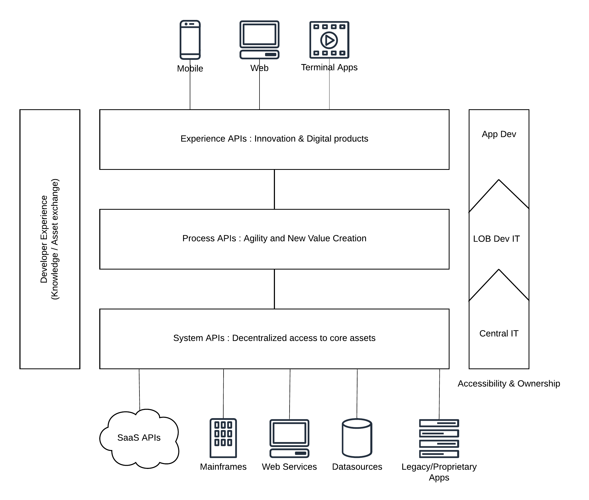
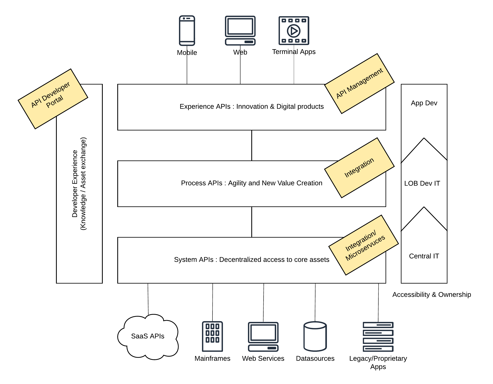

## Introduction

Businesses need to grow with the market to make it relevant to the consumers in the long run. Building a successful, long-running business needs a lot of planning and adopting to changes happening around it. Digital transformation is something that every business must adopt if they want to be in the game. That does not necessarily mean that you need to hire a consulting company who are specialized in digital transformation and spend millions of dollars to go there. Instead, you can always start with the fundamental requirements of an expanding business and slowly migrate towards a full digital transformation. 

The fundamental requirement of the digital transformation is the integration of your existing set of systems, applications, and data. This article discusses how you can use the concept of “API-led connectivity or API-led integration” to kick-start your digital transformation journey with open source technology using WSO2 product stack.

## Architecture
“Every business is running on software” is not a false statement. It is the 80% case and we can consider that as the practical norm in the enterprise. Running business operations using software applications is not something to make your enterprise special. But if you are exposing your business products and services through digital mediums, that is indeed a specialty depending on your vertical. Industries like retail, banking, education are already adopting the technology for internal and external operations. But there are certain industries that are still not utilizing the power of the digital age and the value of structural information exchange patterns to boost their businesses. 

Application Programming Interface or an API defines an interface that can be used by internal and external consumers to get services from your business. It can be as simple as buying a product through a web site, sending a purchase order to supply raw material or even updating the EOD profit and loss statement to the head office branch. APIs allow you to build interactions amongst your customers, partners, employees and your entire business. 

### Business Architecture

Let’s dig a bit deep and understand the business architecture of a typical enterprise with an API-driven approach. 

Figure 1: API-led connectivity, business architecture

Disclaimer: The original architecture diagram of the above figure can be found in the below link.
[1] https://blogs.mulesoft.com/dev/api-dev/what-is-api-led-connectivity/

In a typical enterprise, there are certain types of users interact with systems, applications, and data. Depending on their role within the enterprise ecosystem, they require different sets of services and information access. To fulfill these requirements of different consumers, we can categorize the enterprise system into 3 main layers of responsibility. 

- Experience APIs - At the highest interaction point, users (internal and external) expect access to fine-grained, purpose-built, cutting-edge information with high value and easy usage. This is where innovation happens. As an example, a user who wants to buy a bicycle through his mobile phone wants to know every detail of the bicycle through the phone itself (except the real bicycle ride). The data which is exposed to this layer needs to improve the user experience or else it will be invalid. 
- Process APIs - Providing quality experience APIs require the interaction of multiple systems and data sources and the proper design of data structures. This is where the process API layer comes in handy. This layer acts as the orchestration layer for multiple systems and data sources while fine-tuning the end result for the above layer (Experience API layer). Providing API based access to these capabilities allows users to create value and bring agility to business operations. 
- System APIs - There should always be a component that does the heavy-lifting on behalf of the entire system. That is what this system APIs layer does. It makes interactions with core data sources and caches where valuable business data resides in for longer periods and provide guarantees of data. These core systems can also expose their functionalities as APIs with proper controls in place so that it is much easier to interact with. 

Note: There will always be systems and data types that need to be processed in an asynchronous manner where you need to put a messaging system (e.g. Kafka, NATS) into the mix. This article does not specifically mention that aspect since this article focuses on APIs. You can always bring in a messaging system and asynchronous communication to this architecture. 

With the above architecture in mind, let’s try to build a solution architecture for this business architecture. 

### Solution Architecture
Having a layered business architecture allows us to define a solution architecture which is also a layered architecture. But this is not a necessity and someone can come up with a fully distributed solution architecture even with the above-mentioned business architecture if needed. But for the sake of simplicity, let’s take a layered approach with well defined functional components for each layer. 

Figure 2: API-led integration, solution architecture

As depicted in the above figure, we can map the functionalities of each layer to certain functional capabilities within enterprise architecture. 

- Experience APIs layer can be implemented with an API management platform. This may require a different set of functionalities depending on your enterprise and selecting an API management vendor needs to be done after evaluating the requirements. The fundamental capabilities like security, monitoring, rate-limiting, throttling, caching and better performance are supported by majority of vendors. 
- One fundamental difference in this API-led connectivity or API-led integration is that you don’t need an API management component at each and every layer though it discusses APIs at each layer. Process APIs layer can be easily implemented with an integration technology platform that is capable of doing protocol translations, message transformations, service orchestration and support for major messaging formats and wire-level protocols. These integrated services can be exposed as managed or un-managed APIs to the upper experience layer. 
- System APIs layer can sometimes be directly passed through if the core data is coming from those systems through a defined API. If not, there should be a core business logic layer that converts the business-specific, raw data to meaningful data through an intermediate layer. Users can either utilize an existing integration framework or a standard web-services, microservices technology stack to implement this layer. 
- One major advantage of this proposed API-led integration approach is that every functional capability is available in the means of APIs. Having a centralized developer portal that has details of all the APIs (experience, system, and process) would increase the overall operational efficiency in magnitudes since users do not need to make individual manual requests get certain things implemented on a lower layer. There are API management vendors who can provide this sort of a developer portal as part of their core offering or through a plugin or add-on. 

## Final thoughts
Though people going after hyped words like microservices, containers, serverless, the fundamental architectures for building digital businesses still remains the same. API-led connectivity or API-led integration is such a fundamental concept that can live nicely in both existing monolithic enterprise as well as modern cloud-native, microservices-based enterprise. Any large digital transformation project can be kicked-off with this fundamental architecture pattern and can grow to much bigger projects. Having the fundamental architecture right at the start is crucial in any successful project whether it is large or small. 
