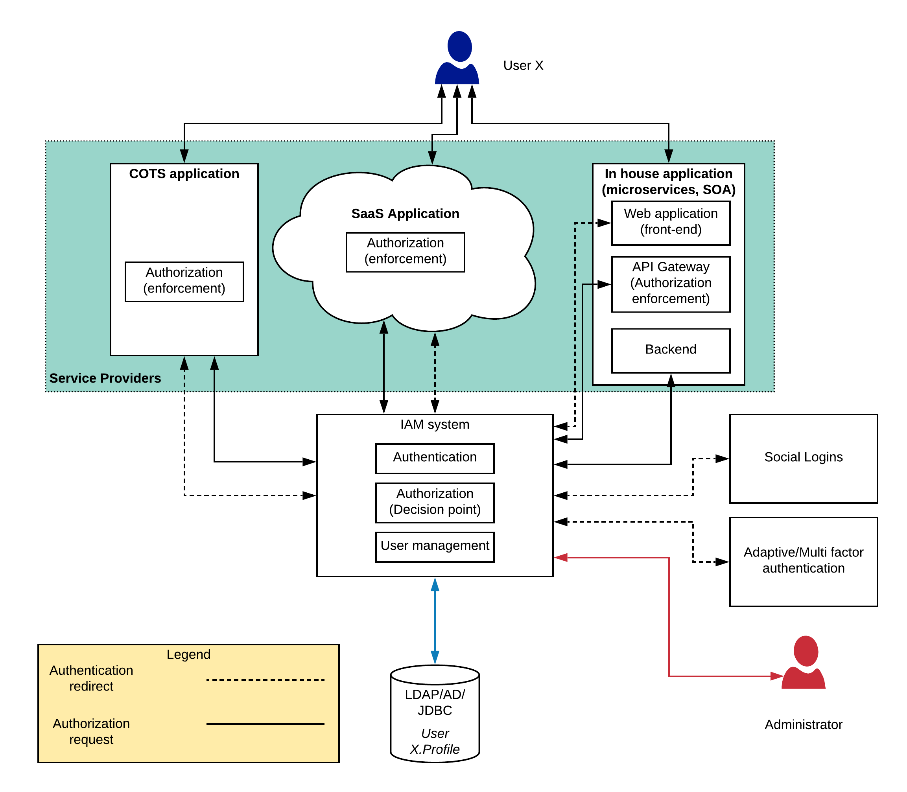

# Centralized Identity and Access Management Pattern
## Introduction
Enterprises are strengthening their IT capacity by bringing in more and more software solutions into the system. With the increased demand from the consumers, the business organizations needs to be more systematic and hence wanted to either build new software tools or bring pre-built software. These software applications will solve different problems within the enterprise and if you architect it properly, it will definitely improve the efficiency of the overall business. At the end of the day, these software systems will provide some sort of services to a set of users in a digital format (mostly through a web application or a mobile application). When there are more and more systems, integrating these systems with each other is an essential part of enterprise architecture which can be achieved with a proper integration platform.

Exposing these services through a digital mean to the consumers requires proper control. Otherwise, all the efforts made to make the enterprise platform more systematic and secure will be in vain. Due to this fact, securing your software applications is one of the critical aspects of building enterprise platforms.

## Security in enterprise software architecture
When it comes to security within an enterprise software system, there are 3 main aspects.

- Authentication — Verify the identity of a user.
- Authorization — Verify the authority of a user.
- User management — Managing a set of users who are going to consume the applications
Let’s try to understand how these requirements are fulfilled in most of the existing enterprise applications with the help of the below figure 1.

Figure 1: Application security implementation in a traditional enterprise

The different types of applications used in an enterprise can be divided into 3 main categories.

- Commercial Off The Shelf (COTS) applications — These applications are mostly proprietary software solutions running on premise. These applications sometimes cater the most important requirements of the platform by holding valuable business data. ERP systems, CRM systems, core banking systems fall into this category.
- Software as a Service applications — This is the new style of software delivery which is followed by most of the vendors. This type of applications are fully run and maintained by the vendor and the users get a web interface to consume the application. Salesforce, Office365, PeopleHR are some of the examples for this type of applications.
- In house applications — These are the type of software which is maintained by the internal IT teams. Service Oriented Architecture style software (ESB, Message Broker, Web Services), Microservices (modern), core back end services, Database systems fall in to this category.

The above mentioned applications are developed by different vendors and they have their own mechanisms of securing the applications. Due to this fact, these systems rely on their own user stores and authentication implementations. As depicted in the above figure, each application category has their own user stores, authentication and authorization technologies. Some of these may not be adhered to any of the standard security (or identity) protocols. The above approach has many drawbacks.

- Applications has to maintain their own set of users as well as authentication and authorization mechanisms which is a duplication of effort.
- Users has to remember many different username/password pairs for different applications and these applications has different set of rules on passwords.
- Implementing more secured approaches like adaptive authentication, multi-factor, multi-option authentication, attribute based access control is almost impossible with some systems
- Integrating with external identity providers like google, facebook, linkedIn is not easy to implement across all the applications

Authentication and authorization capabilities are required by each and every application running in your enterprise. Instead of implementing these capabilities at each application, these capabilities can be delegated to a specialized component. There are many Identity and Access Management (IAM) solutions available in the market. Some of them are open source and some are proprietary. Some are cloud based while others are on-premise based. This IAM component will do the heavy lifting of authentication, authorization as well as user management while allowing applications to implement more modern types of security methodologies which will improve the overall user experience while providing improved protection to the applications. Let’s see how the above architecture can be improved with an IAM component.

Figure 2: Centralized security architecture for enterprise

The above figure 2 contains many changes to the figure 1. Let’s try to identify these changes and what those changes mean to the overall system architecture.

### Users are moved into a central repository
The users who were managed separately by different applications have been moved into a single user store which can be LDAP, Active Directory or Database (RDBMS).

### Authentication and authorization moved out of the applications
Since authentication is a commodity functionality which needs to be implemented in a standard manner, it is moved into the IAM platform. Additionally, authorization decision making also moved to the IAM platform while authorization enforcement is kept at the application layer.

### API gateway is introduced for in-house applications
Once the authentication and authorization is moved out of the back end services implementation, there should be a component which is going to enforce the authorization. API gateway allows different backend services to have different authorization policies and use standards based advanced technologies for authentication and authorization like OAuth2, OIDC, JWT.

### User management is done through a central location
User management functionality is critical when managing the security of these applications since adding, modifying, deleting users across multiple systems can be a cumbersome process which will cause many human errors. With the centralized user management, all those burdens are gone away.

### Adaptive/multi-factor authentication is added
With the increase of digital information theft, systems needs to protected in more advanced, yet smarter means. Adaptive authentication capability allows applications to provide different levels of protection depending on factors like geolocation, roles, attributes of the user. Multi-factor authentication allows applications to protect their resources with improved security by adding multiple factors to authenticate users instead of just asking for username and password.

### Social/Federated login capability is supported
Most of the users does not like to keep 100s of different accounts to log into 1000s of applications they use daily including personal and business applications. They will prefer using a well trusted social login so that they don’t want to create another username/password pair to their already overwhelmed password vault. With an IAM platform, users can add social login support for existing applications with minimal changes to the application side.

In addition to the above mentioned changes, there is a clear difference in the figure 2 w.r.t figure 1 which is the connecting arrows. There are 2 types of black coloured connecting arrows.

- Authentication redirect flows — The black dotted lines indicate the flow when the users try log in to the application through a web browser or a mobile application where users are redirected to the IAM platforms login page. This architecture helps the IAM platform to verify the user details as well as build trust on the users since this IAM login page can be (need to be) protected with proper security testing. Also it allows the applications to enable Single-Sign-On (SSO) using various supported protocols (SAML2, OIDC, WS-Fed, etc.).
- Authorization request flows — The black straight lines indicate authorization requests coming into the IAM platform. In this scenario, user is not redirected to the IAM platform rather the application communicates over the wire with the IAM platform to verify the authorization details

There are many more advantages delivered with an IAM platform other than the ones mentioned above. Some of them are

- Ability to implement overall security of the platform in a standard manner
- Enhancing the user experience with features like SSO, Social logins
- Improve the overall protection of applications with MFA, Adaptive authentication
- Ability to support security compliances like GDPR, FISMA

As I mentioned above, there are many IAM vendors available in the market which caters the above mentioned requirements. Here is a list of the most popular IAM platforms.

- WSO2 Identity Server
- Ping Identity
- Okta
- Auth0
- Keycloak
- Forgerock
- Janrain
- LoginRadius
