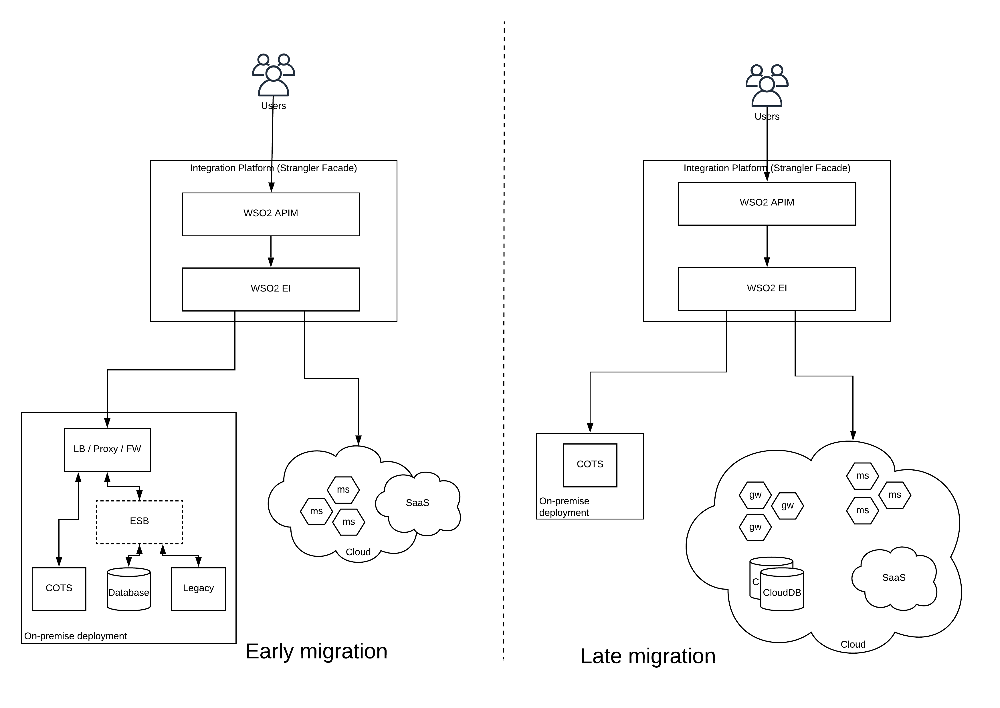
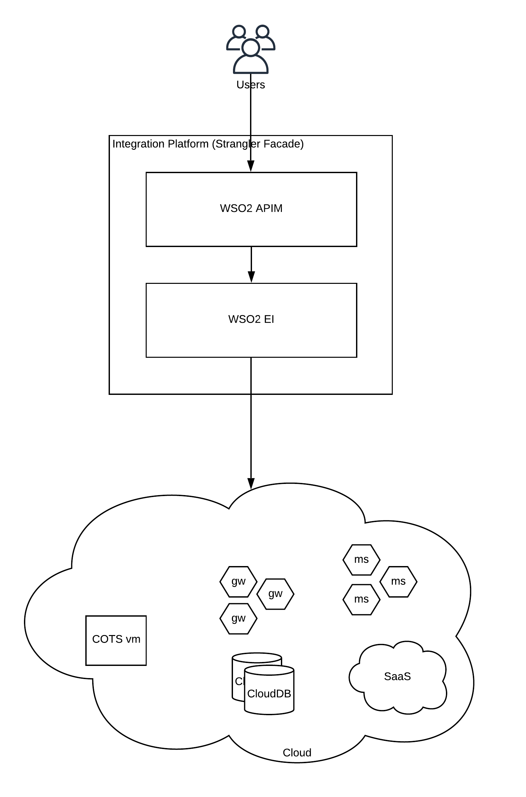

## Introduction

One of the most common requests coming from enterprise leaders to enterprise architects these days is “move to cloud”. There is a common notion about cloud that it is
- Cheap (pay per usage)
- Easier to maintain
- Highly available

and sometimes more safer than your on-premise system. All those points are valid and hold true to a certain extent. The intention of this post is not to challenge the decision of “move to cloud”, rather to help enterprise architects to make the move with a proper architecture guidance.
Every time you make a change to the enterprise system, it can affect the entire business operation within your organization. Because of this, I have seen some enterprise systems kept as it is for ages without making any change. With the adoption of “cloud” and cloud-native technologies, none of those systems can live in isolation and in hiding. Those systems must make significant improvements if those systems needs to survive within the enterprise.

### Before migration
Let’s consider a typical medium sized organization having a SOA based enterprise system with a set of integrated components. In most cases, you would find an architecture similar to the below figure in such an enterprise.

Figure 1: Enterprise Architecture — Before migration

As depicted in the above figure, there are different types of systems which are used in the enterprise for daily operations and an ESB has been used to integrate certain systems which cannot communicate with each other natively. There are certain in-house developed systems as well as legacy and COTS systems along with data sources. All the systems are exposed through a load balancer, proxy and/or a firewall to external and internal consumers. Everything works perfectly fine and business operations running smoothly with this architecture. Then why do you need to change this architecture?

The new CIO or CTO looks at the architecture and explains the challenges of this architecture as below.
- How do you scale this architecture from thousands to millions of consumers if we are growing globally
- What happens if one of the components goes down and what happens if an entire data center goes down?
- How easy to deploy a new application with this architecture?
- How often this system is being updated and when was the last time you made an update/upgrade?

If you haven’t put a lot of thinking around these pointers, there is a high chance that you will stuck in front of your C-member without proper answers.

Now you are convinced that you need to make a move and start working on the aspects which are mentioned above. How can you achieve those capabilities without impacting the business operations is the real challenge. That is where we can use the concept of “Strangler Pattern” or “Strangler Facade” to our rescue.

### Start migration
The idea of the “Strangler Pattern” is to introduce a layer which will hide the actual transition which is going underneath from the users. To achieve this, we can utilize an integration platform or a product to act as the glue between existing components and the newly developed components while exposing both those capabilities selectively to the users.

Figure 2: Enterprise Architecture — During migration

As depicted in the above figure, we are going to introduce an additional layer on top of the existing services. This layer is called the “Strangler Facade” which is capable of exposing similar functionality as it is now (through proxy) or with additional capabilities (e.g. monitoring, security) and improved user experience (developer portal). These additional capabilities are optional and you should not worry much at the beginning. In addition to exposing the existing set of systems through this layer, it will also selectively open up the services which are developed in the new deployment which is on the cloud. You can start with things like in-house tools which were built sometime ago and convert them into a set of microservices. While doing this development, you can selectively expose these services through the API management functionality of the strangler facade. In addition to the API management capability, strangler facade has the capability to integrate across systems if required.

The deployment of this “Strangler Facade” component needs to be done in the cloud since the eventual goal of this effort is to move to the cloud. But if you are thinking of moving out to a on-premise deployment with container technologies, you can deploy the strangler facade on the same deployment.

With the time, more and more of your enterprise systems will be moved to the cloud either running on cloud VMs, microservices or as SaaS services. During this time, strangler facade will act as a controlling layer which will offer existing services as well as new services to the consumers. The other advantage of this approach is that, you don’t need to wait till the end of the migration to reap the real benefits of the new architecture.

### Post migration
If you continue the migration with a proper plan, you should be able to migrate most of your systems to “cloud” without impacting the business operations while adding more and more services to your consumers. There can be situations where some of the systems might stay in the on-premise deployment. Even those systems can be integrated into the new architecture through the “integration” capability of the strangler facade.

Figure 3: Enterprise Architecture — migrated

Once the migration is done, you can achieve the requirements which were initially put in front of you by your CIO/CTO. As depicted in the above figure, fully migrated enterprise system can be exposed through the strangler facade. If you really need, you can even live without the strangler facade by utilizing similar functional components provided by the respective cloud service providers. But this is something you should do after considering all the facts. The danger of making such a move to remove the strangler facade is that you will be locked down to that particular cloud provider for all your operations. Instead, it is recommended to keep the strangler facade as an independent component so that if you decide to move to a different cloud vendor or to move back to on-premise container deployment, you can easily do that with the same.

## Final thoughts
The requirement of “move to cloud” is becoming more and more prominent in the enterprise and there are people rolling out cloud migration projects without understanding the value of cloud as well as the disruptions that can bring to your business. Hence, if you are doing a cloud migration project, you should consider all the nitty gritty details of where you are, where you want to be and how you are planning to go there. The “strangler pattern” or “strangler facade” introduced in this article helps you to take a measured approach make that move without much interruptions. I have used WSO2 API Manager and WSO2 Enterprise Integrator (EI) as the products which offers the required functionality at the strangler facade. You can replace them with any technology of your choice as long as it provides the required functionality.
