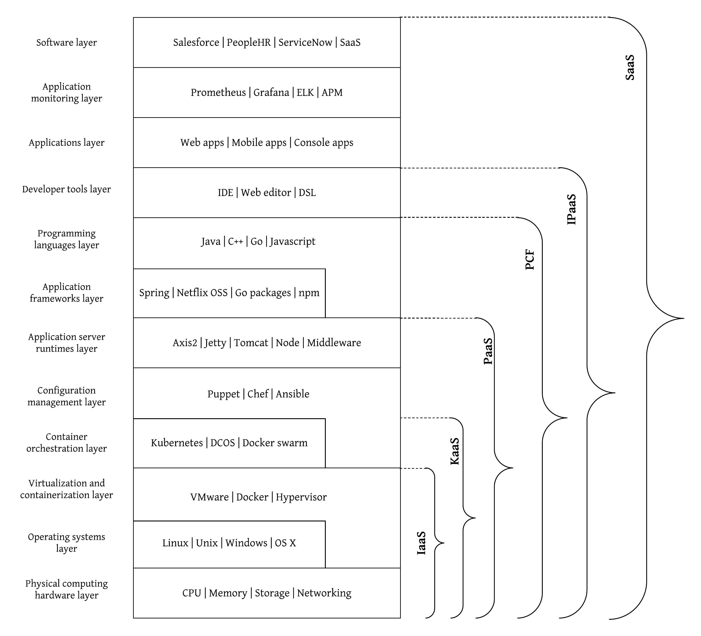

## Introduction
Enterprise software landscape has evolved from running batch jobs in mainframe computers to run a SaaS application from your mobile phone to on-board an employee. The software you run within the enterprise needs to be carefully selected and architected. The role of an enterprise software architect has become more prominent and important in the era of cloud computing and data privacy regulations. You have to consider many different aspects when designing an enterprise software architecture. Here are some of the key factors you need to put your close attention to.

- Availability - Make sure you don’t loose a single purchase order
- Performance - Don’t let your customers look into alternatives
- Flexibility - Make sure the system blends with other systems nicely
- Maintenance - You don’t need to keep an eye on notifications all the time
- Price - Make sure you have the right balance between cost and return
- Privacy and Security - Protect your customer’s data or get fined
- Compliance - Make sure things are in proper order

If we consider all the above mentioned factors, it is evident that we cannot have the best of all always. We have to compromise some features to support the other. Let’s try to understand the software which is running on the enterprise in more detail.

## Enterprise software architecture
Everything starts with the bits and bytes running on a set of electronic circuits which we called as hardware. From that point onwards, there are a plethora of software components which hides the complexity of the bits and bytes and abstract it away for various users based on their knowledge and expertise and expectations. There are many organizations who offers different levels of enterprise software capabilities as cloud services or “as a Service” offerings. Here are some of the common cloud services offered as services which are fully hosted and managed by the respective vendors. 

- IaaS - Infrastructure as a Service. This is an offering where you can purchase computing power at it’s raw level to deploy your applications. What you will get here is a set of virtual machines with a pre allocated CPU, Memory, networking and disk space. 
- KaaS - Kubernetes as a Service. With the increased adoption of microservices, containers, kubernetes has become the de-facto container orchestration platform. Most of the IaaS vendors offers kubernetes as a service so that enterprise architects don’t need to worry about deploying kubernetes on their data centers. 
- PaaS - Platform as a Service. If your enterprise does not have a skilled IT team to manage the servers and the infrastructure, you should consider getting a subscription of a platform as a service where it allows you to deploy various types of applications (web, mobile, etc.) without worrying about the underlying servers. 
- PCF - Pivotal Cloud Foundry. This is an enhanced version of a PaaS where the underlying platform offers additional capabilities like development frameworks and easier access to other services like data, security, monitoring, etc. 
- IPaaS - Integration Platform as a Service. If your development team only consists of a few citizen integrators who needs to connect various applications through a high level IDE, iPaaS is the perfect fit.
- SaaS - Software as a Service. This is the utmost delegation of your computational requirements to a third party vendor you don’t maintain or develop any of the applications except the operations you do on top of these SaaS applications. 

The figure below showcases how each of these components are layered up.

Figure 1: Enterprise software architecture stack

As depicted in the above figure, there are various cloud offering available in the market which can help you to delegate your responsibilities of IT infrastructure maintenance to a third party technology vendor. Depending on the requirements and the capacity of your IT staff, you can select the best possible abstraction layer. Here are some ways on how you can decide which cloud abstraction is better suited for your enterprise. 

- If you're an organization with a highly skilled IT team who likes to deploy, manage and maintain the IT assets with more flexibility, you can manage everything by yourself without any of the cloud offerings. Then the entire deployment would be done by your team and they will bring in the new technologies like microservices, containers, kubernetes, serverless into your platform. This is feasible of your an internet scale company like Netflix, Uber, Google or Amazon. 

- If your organization is having a skilled IT team with a lot of development capabilities and like to do their own experiments with new technologies and have full control over which software they run in which topology and architecture but don’t need to worry about maintaining physical servers, you can consider an IaaS provider to run the servers for you. You can provision hardware as and when required and scaled them down based on usage. Most of these IaaS vendors have security compliances and the data security features which are required for enterprise grade deployments. These vendors offer Kubernetes as a Service (KaaS) as an additional layer on top of the IaaS so that if a particular customer wants to utilize container based deployment model without worrying about the maintenance aspect, they have a better choice. 

- Sometimes enterprise IT teams does not like to worry about not only the hardware maintenance but also the maintenance of server runtimes. Instead, they just want to run their applications on a platform which is already configured for them including physical hardware, operating system and even application servers. PaaS is an ideal solution for this type of organizations where PaaS make sure applications keep running and scale up and down based on the usage. 

- If you are an organization who wants the total control of your IT infrastructure without worrying about spinning up servers, running containers, setting up web servers but need them to be running for you within your data center, PCF is the ultimate choice. It is a private PaaS with enhanced user experience. You can develop application with any technology and connect with various applications as they are running in the cloud without worrying about running and maintaining them. 

- If your organization is having a lean IT team with few people who can wire a set of applications through an IDE to build an integration of a few SaaS applications running for you in the cloud, you should look at an IPaaS solution. There are different levels of abstractions available with IPaaS solutions. Some of them have interfaces which are so simple to use that even a non-technical person can do an intergration between 2 enterprise applications. They lack the flexibility and the control. There are some other IPaaS vendors who provide full power through a well designed IDE which needs some sort of domain expertise to build integrations. 

- If you are an organization with a few sales and marketing people who wants to use some tools to run your business, you shouldn’t worry about any of the fuss like server maintainance, runtime management, monitoring, etc. You just need a web URL which you can log in and do some simple operations. If that is the scale of your organization, you can go for a SaaS solution where that vendor manages everything for you behind the scenes in the cloud and let you use it for a subscription.

In addition to the above mentioned categorization, there are some other offerings coming through to simplify the IT operations within enterprises. One such an approach is “Serverless” platforms where they run your programs for you in the cloud as and when necessary instead of running them all the time in the case of a PaaS or PCF. Another cloud offering which is getting popular these days is "IDaaS" which is "Identity as a Service" which provides various Identity and Access Management capabilities as a cloud offering. Another such service is "MBaaS" which expands to "Mobile Backend as a Service" which will provide you a platform to run your mobile backends for various mobile applications running on different platforms. 

Here is a list of vendors under each layer which are available in the market.

- IaaS - AWS, Azure, IBM cloud, Google Cloud
- KaaS - Google , Amazon EKS, AKS
- PaaS - Heroku, WSO2 Integration Cloud, Cloud Foundry, IBM BlueMix
- IPaaS - Dell Boomi, Mulesoft, Informatica
- PCF - Pivotal Cloud Foundry
- SaaS - Salesforce, ServiceNow, PeopleHR, WSO2 API Cloud, Apigee

