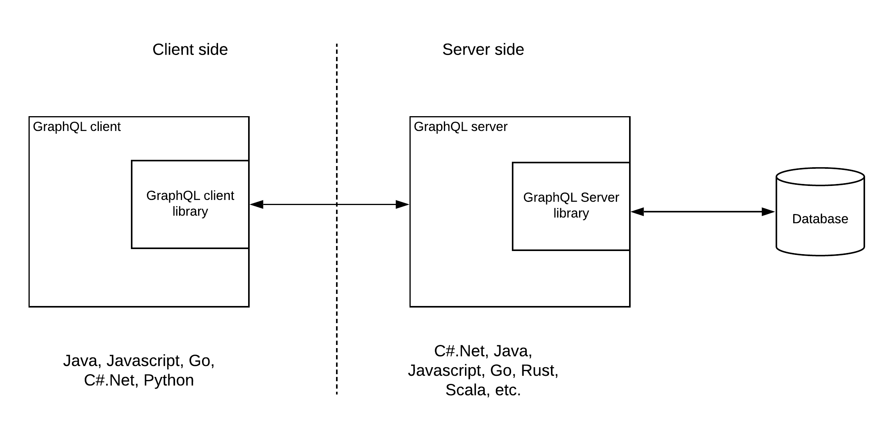
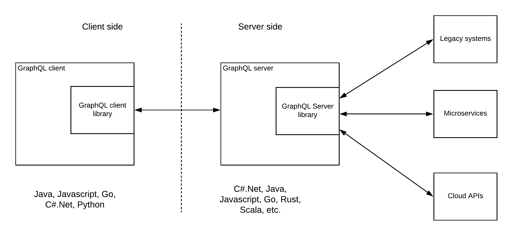
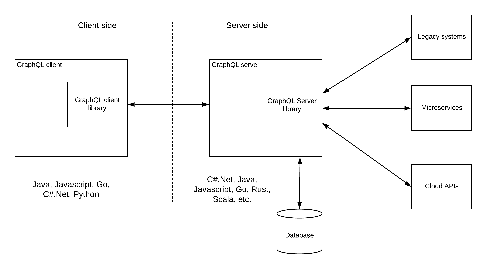
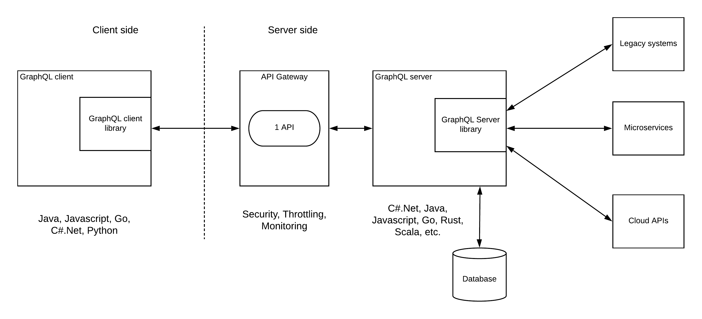
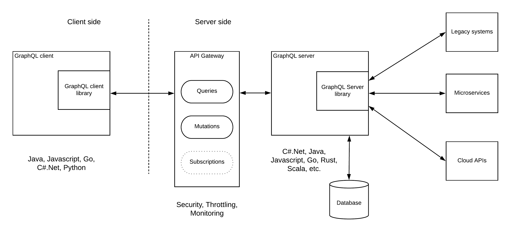

# GraphQL based solution architecture patterns

## Introduction
GraphQL is becoming popular in the tech industry as a replacement for REST. It really carries out significant advantages over existing mechanisms for the client-server type of communications.
In simple terms, GraphQL allows the client to choose which information it wants rather than receiving all the data which is available for the API. This is similar to a database query where we request only the required information. That is why it is called as GraphQL. We can do this easily with databases and data services runtime. But if you think about implementing the same capability for a REST API, you have to create so many different resources and the client has to call each and every one of these resources and handle the orchestration logic at the client-side. Otherwise, the API server has to do the heavy-lifting of orchestration. But this is not scalable with the changing demands from customers and the business. You can find a simple example and an explanation of why GraphQL is considered as the better REST by reading the content in the below link.

https://www.howtographql.com/basics/1-graphql-is-the-better-rest

The intention of this post is to discuss possible solution architecture patterns that can be used to implement systems with GraphQL.

## Solution Architecture Patterns

### Pattern 1 — GraphQL Server exposing database
This is the fundamental use case of the GraphQL. That is to expose a database in a much more controlled manner with additional capabilities like caching. A similar kind of functionality can be achieved with the OData specification. But GraphQL has really excelled beyond the OData by giving users to do basic CRUD operations as well as allowing the consumers to subscribe to data changes. It has clearly separated out the read operations (Queries) from the write operation (Mutations) and introduced a new operation type for data change notifications through Subscriptions.

Pattern 1 — GraphQL server exposing a database

As depicted in the above figure, GraphQL provides server libraries for multiple programming languages so that developers can build servers based on GraphQL specification. You can find more details on available language support for the server-side from here. Similarly, it provides client libraries to implement GraphQL clients. More details can be found here. GraphQL server exposes a simple HTTP/REST interface so that users can use any existing tools and clients which they have already built.

### Pattern 2 — GraphQL as a layer of integration
The real power of the GraphQL specification comes from the ability to provide access to various data sources from the clients in one go. Instead of sending multiple requests (and hence wasting the bandwidth due to headers), GraphQL client can send a single request and get all the data it requires regardless of the actual backend data source. This allows the GraphQL server to act as an integration hub while exposing the services through GraphQL.

Pattern 2 — GraphQL server as an integration hub
As shown in the above figure, GQL server can connect to multiple backend systems within the enterprise including legacy systems, microservices, and existing 3rd party cloud APIs as data sources and provide a unified GraphQL interface to the clients.

### Pattern 3 — GraphQL hybrid integration
In most of the real-world scenarios, you find there are various systems that need to be connected including databases, legacy apps, microservices, cloud APIs, etc. Therefore, building a GraphQL server that connects to a database as well as other systems can be a more frequent requirement.

Pattern 3 — GraphQL hybrid integration
In this pattern, GraphQL server has its own connected database and it will also connect to external systems. The clients get a unified API that they can consume efficiently without sending multiple requests to get desired data.
The above 3 patterns are the standard GraphQL patterns recommended by the GraphQL community. But these patterns don’t fulfill the requirements of a modern enterprise architecture. The interfaces that expose these services need to be managed through a management layer. That is where the API gateways come into the picture.

### Pattern 4 — GraphQL server with one managed API
Exposing the GraphQL based interfaces without any security can be a big issue in most of the enterprise deployments. That is the reason why we need to apply proper protection to these APIs using an API gateway. GraphQL provides a single endpoint to access data and execute various actions on top of that data. Therefore, the simplest approach to protect and manage this interface is by applying the management functionalities over this single endpoint.

Pattern 4 — GraphQL server with one managed API
In this architecture, API gateway provides the security, throttling and monitoring capabilities to the single endpoint which is exposed from the GQL server. If you have multiple GraphQL endpoints available, these endpoints can be protected as separate APIs. Also, with this approach, multiple resources can be implemented for the same API with different throttling and security policies. But this needs to be done as a custom implementation and a lot of manual work needs to be done.

### Pattern 5 — GraphQL server with native API management
One of the drawbacks of the above pattern 4 was that GraphQL native concepts (Queries, Mutations, Subscriptions) cannot be managed as separate entities. That is the exact requirement covered with this pattern. Here, once the GraphQL endpoint is provided to the API gateway, it will generate the GraphQL specific endpoints (operations) based on the definition of the GQL file and allow the users to apply throttling, security, and monitoring at these operations level.

Pattern 5 — GraphQL server with native API management
In this pattern, both Queries and Mutations can be implemented with native API management capabilities like security, throttling, caching, monitoring, etc. But the subscription feature of the GQL server cannot be implemented with that functionality since it works in an asynchronous, event-based mechanism.

## Implementation approach
GraphQL servers and clients can be implemented in many different programming languages and there are libraries that are purpose-built for certain technology stacks available in the community. For adding the API management capabilities, users can use existing API management tools like WSO2 API Manager which supports both the above-mentioned pattern 4 as well as pattern 5.

## Future
I have discussed some of the possible solution architecture patterns with the GraphQL specification. These are not the only patterns and there can be more and more patterns evolved with the time. Additionally, the above patterns didn’t cover the container-based, cloud-native architecture patterns since that is too much of a scope for a single article. But the concepts mentioned in this article can be reused when building such architectures as well. This article is more or less a foundation article on building real-world systems with GraphQL specification.
