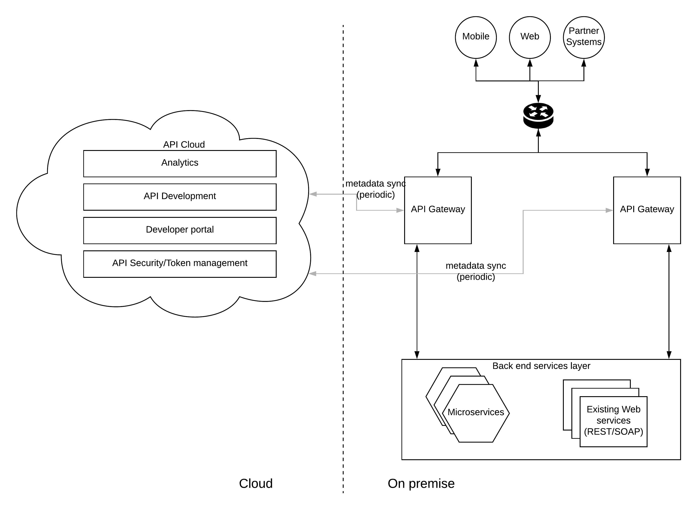

## Hybrid API Management Pattern

### Introduction
API Management has become a cornerstone in any digital transformation project happening within the enterprises. APIs provide a mechanism to build a secured, well-defined, discoverable interface to external consumers who are coming through various channels. API Management platforms provide a set of functionalities which are required by your business services. 

- Security (Authn and Authz)
- Monitoring & Analytics
- Throttling & Rate limiting
- Discoverability
- Error handling

There are many API Management vendors (both open source and proprietary) who offers these capabilities through their products. 

### Deployment choices
These API Management platforms can be deployed in various different modes. Here are the 3 most common ways of deploying an API Management platform.

1. On premise 
2. On Cloud (Public SaaS or Managed/Private Cloud)
3. Hybrid

Though both on premise and on cloud deployments have their own advantages, they also have some disadvantages as well. By using a hybrid deployment model, we can achieve the advantages of both approaches while minimizing the disadvantages.

The functional capabilities mentioned above can be run independently if the API Management vendor has designed the solution in such a manner. These functional components can run within different runtimes and different environments while communicating with each other to provide the end to end API management functionality. 

The APIM platforms which are implemented in a modularized nature can be deployed in a hybrid architecture as depicted in the below figure.

Enterprises are more and more moving towards cloud based infrastructure and having a fully managed software solution is preferred over on-premise software due to the ease of management. But it is not possible to go with full cloud solutions which are offered as SaaS solutions due to various regulatory requirements. In such a scenario, enterprises can use this hybrid api management pattern. In this model, API management functional components are deployed in 2 different environments. 

1. API Gateway is deployed in on-premise infrastructure
2. API Management, Analaytics, Security components are deployed in cloud infrastructure

In a hybrid deployment model, all the API traffic (requests) will be going through the on premise gateway runtime. In the meantime, the rest of the API management capabilities like security, analytics, lifecycle management, development, discovery will be running on the cloud. 

### How it works
Once we deploy the API Gateway within the on premise infrastructure and the rest of the components within the cloud, these components should communicate with each other to provide the end to end API Management capabilities. As an example, when a new API is created from the API development component, that API needs to be available in the gateway runtime which is running on premise. Additionally, the token validation, throttling, analytics capabilities needs to interact with the gateway runtime even though they are running in the cloud. 

This communication needs to be implemented in such a way that it won't disturb the runtime traffic, does not need any special connectivity from cloud to on premise gateways. To fulfill these requirements, API gateway component needs to connect to the cloud based components in an asynchronous manner with a periodic "pull" model for API artefacts and "push" model for analytics information. In both scenarios, it is the gateway component connecting to publicy accessible cloud URLs which does not need any special connectivity from cloud to on premise data center. 

### Advantages of hybrid model 
This deployment model provides certain advantages over the other 2 deployment choices which are on-premise and on-cloud (SaaS or PaaS). Here are few advantages.

- Keeping API Gateway runtime closer to the actual backend improves the overall performance of the API responses
- Routing the API traffic which carries sensitive data through on-premise gateway improves the data security
- Running API Gateway on-premise allows the system to be designed in a manner which compatible with regulations like HIPAA, PCI-DSS, GDPR
- Keeping the rest of the API Management components in the cloud reduces the management overhead of those components

### Possibility to run multi-cloud
This hybrid api management pattern can be extended to support a multi-cloud deployment topology where API Gateway can be run on one cloud provider and the rest of the components can be run on another cloud provider depending on the infrastructure your backend services are running
