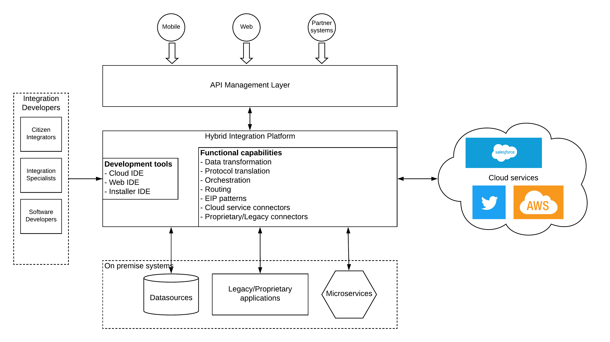

## Hybrid Integration Pattern

### Introduction
Integration is one of the key capabilities required within any enterprise software system. With the growth of a business, its enterprise software system also grows accordingly. This growth can happen by adding more functionality to existing systems, introducing new on premise systems or more recently, bringing in cloud (SaaS) solutions into enterprise (e.g. salesforce, servicenow, peoplehr). The more systems you use for business operations, more complex your enterprise system becomes. Instead of connecting each system with other systems in a point to point manner which ends up in spaghetti pattern, using an integration layer would make the connections and the management of overall system integration more efficient. 

Depending on the infrastructure a given software system is installed, we can divide the enterprise software components into 2 main categories.

- On premise systems which are running within enterprise perimeter
- Cloud services which are hosted by 3rd party organizations in public cloud

The integration platform we choose should be able to connect with both types of systems which are mentioned above. Such an integration platform is called as an hybrid integration platform (HIP). 

As depicted in the above figure, hybrid integration platform should be capable of supporting functional requirements like
- Data mapping/transformation
- Protocol translations
- Service orchestrations
- Connecting to cloud services
- Connecting to proprietary/legacy systems
- Routing
- Enterprise Integration Patterns

On top of these functional requirements, another key aspect of selecting a proper HIP is the flexibility of development. This choice needs to be made based on the type of developers available within your organization. There can be different types of developers available within your enterprise like

- Integration specialists - Domain experts who understands various EIP patterns, DSLs
- Citizen Integrators - Not much experts but can implement use cases with a high level config language like XML or UIs
- Software Developers - Willing to do the development with programming language
