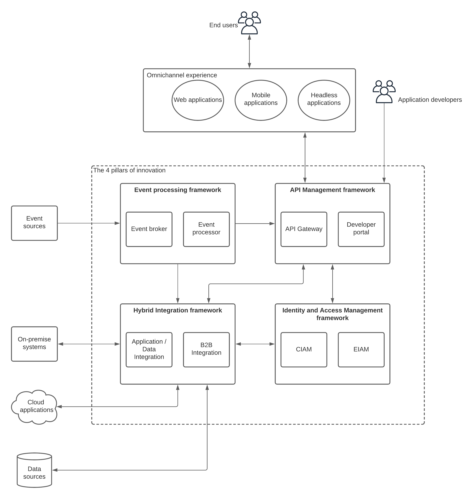

## Introduction
We are living in an era of innovation like never before. Consumer-driven businesses (95% of businesses are like this) are competing with each other to get as many customers as possible under their roof. Almost all the products and services that we can imagine are available at the fingertips of the customer. Business leaders should take decisions instantly about new products and services. Hence the innovation plays a pivotal role in the success of any business in the modern digital economy.
Enterprise IT platform is considered as a supportive function for business operations that just sit in a data center or a cloud environment (e.g. Iaas like AWS) and executes its functions without much innovation or change. We have seen enterprise platforms that lasted 15–20 years without much change or innovation. With the success of digital-native organizations like Facebook, Amazon, Google, Netflix, LinkedIn, and Uber (to name a few), the traditional boundaries of enterprise platforms were shattered and most other industries started adopting the changes and innovations that evolved from these organizations.

## Existing approaches of innovation within the enterprise
One of the main challenges faced by organizations when they wanted to digitally transform their traditional IT ecosystem is where to start and how to get going with the innovation without interfering with their existing business operations. Here are some of the common approaches organizations have followed when transforming their organizations into digitally innovative platforms.

- Migrating the workloads to the cloud (IaaS)
- Adopting microservices architecture
- Deploying applications on containers using docker and kubernetes
- Use hybrid deployment approaches
- Adopt cloud (SaaS) solutions as much as possible to reduce the maintenance costs

Let’s dig deeper into these approaches so that we understand the pros and cons of each of these approaches.

### Migrating to the cloud (IaaS)
One of the common approaches that most cloud vendors recommend to business leaders is to migrate their existing workloads to an infrastructure as a service (IaaS) platform. This requires minimum rework of the existing applications and architecture in most cases since this approach is just moving the applications running on physical or virtual machines to the cloud computing infrastructure (mostly to VMs). This approach is called the “lift and shift”. This approach reduces the management overhead of the physical computing infrastructure and assumed to provide cost benefits via the per-second billing available in most of the cloud platforms. The amount of work to perform the migration is assumed to be small and the transition is assumed to be seamless to the end-users. But in real-world projects, there have been many occurrences of long project delays, architectural changes, implementation changes, and sometimes increased cost due to unforeseen aspects of the cloud cost structure. Hence it is not as rosy as it appears from the outset.

### Adopting microservices architecture
According to Conway’s law, the structure and the organization of the IT ecosystem are a reflection of the organizational culture. That means you cannot fix the IT ecosystem without fixing the organization’s culture. Microservices architecture suggests not only a change in the architecture and the implementation of the application but also a change in the organization’s culture. It is a great approach to build highly scalable, available platforms that can span across 100s or even 1000s of instances. But it comes with the requirement of organizational culture changes which are essential to making the microservices journey a success. Most small to medium-sized organizations start adopting microservices architecture without properly aligning their organizational culture to it.

### Deploying application on containers using docker and kubernetes
A container is a miniature version of a virtual machine with improved resource utilization and portability. This means that virtually any application that runs on a physical machine or a virtual machine can be run on a container (in theory). But containers are designed to run applications that are ephemeral in nature and need higher levels of scalability and recoverability. As an example, running microservices in a container makes every sense while running a database system in a container does not make much sense. Hence it is important to understand the requirements of the application and decide whether to run inside a container or not.
Kubernetes provides an excellent abstraction of the underlying computing infrastructure by providing one common interface to interact with the computing resources. It allows the applications to run across multiple servers without actually thinking about the fact that there are multiple servers running. That means any failure of a node or multiple nodes is handled by the kubernetes platform so that the application does not need to worry about it and will not get impacted by those failures. It is a great platform to run applications and there are many cloud service providers who offer managed kubernetes services on their cloud platforms so that users can run their applications. But it is essential to understand the applications that you have and decide on whether to run them on containers or not. At the same time, this approach won’t be as simple as the lift and shift approach (we already mentioned that it is not that simple) since there can be architectural and implementation changes required before running on container platforms.

### Use hybrid deployment approaches
Another common approach that organizations follow when building digital platforms is the use of a hybrid deployment model where certain parts of the applications are moved to the cloud while certain parts of the applications kept on-premise. This approach supposed to be providing the best of both worlds in terms of management overhead, cost, and data security. Even though it should work out like that in theory, most of the practical experiences tell a different story. One of the major challenges with the hybrid approach is that due to the involvement of multiple parties who are not fully aware of the overall business and operational goals, rapid innovation becomes really difficult, and doing a small modification to the system takes a lot longer than you could afford in the competitive business environment.

### Adopt cloud applications (SaaS) as much as possible
There are 1000s of cloud applications available in the market for almost any business use case. Some organizations move in the path of migrating their existing on-premise and hybrid applications to software as a service (SaaS), turnkey solutions that provide similar functionality. The main advantage of these applications is the reduction of the management overhead of the application in terms of development, testing, deployment, and infrastructure. With the flexible, usage-based pricing models, sometimes these applications appear to be cost-effective as well. But the challenge with these applications is that organizations do not have any control over the feature functionality and the customizations which were possible with the on-premise and hybrid applications. They have to wait until the vendor comes up with a solution for a particular requirement regardless of the importance of the same to the business, sometimes for years. That hinders rapid innovation.

## Digital transformation and innovation
Most organizations are trying to implement digital transformation projects with one of the preceding approaches assuming that it will allow these organizations to innovate. It is true if you execute the digital transformation in the correct manner. But we have discussed in the previous section that sometimes these digital transformation projects can go wrong and blocks the ability to innovate within the organization. Hence, you should understand the concept of innovation within an enterprise platform before moving ahead with any DT projects.
In layman’s terms innovation is the task of doing something new or producing something new for the users. Some people innovate progressively yet some people innovate in leaps and bounds. Regardless of how big or how small your innovation is, it will keep the users getting a better experience than their previous experiences. The dangerous side of innovation is that if you innovate something that is not usable to the average user, your organization’s reputation will be affected, and sometimes that can lead to major losses to the organization. But you cannot live without it. If you don’t innovate, you will sooner be forgotten.
So innovation is a must. Digital transformation is the vehicle that you should use to build an innovation-driven organization. Let’s discuss how we can achieve that.

## The four pillars of innovation
Let’s step back and try to understand the core requirements of a typical enterprise platform. Unless you are a digital native organization, you should have an enterprise architecture that contains disparate applications and systems. Each of these applications and systems will allow you to innovate within their boundaries. If you want to innovate and produce new products and services involving multiple applications and systems, you should integrate these components with each other. Once you integrate these components, you can innovate across the board and come up with new data models and services that will allow different organizational units to innovate in a collaborative manner.

*Integration is just the beginning of innovation*

Once you integrate disparate systems and applications, the next step is exposing these integrated data models and services to various consumers. It can be internal or external consumers depending on the innovation that you do with your enterprise data. This is where the concept of APIs comes into play. APIs allow us to share business data and services in a standard manner so that different clients can consume the same in a unified manner. At the same time APIs allow the business to control access to valuable business data and services with security, rate-limiting, and monitoring capabilities. The API-first approach allows rapid innovation with improved efficiency and less time to the market where both front-end and back-end application developers can work in parallel once the API is defined.

*APIs are the digital connectors that connect consumers and businesses to expand the business with innovation* 

Sometimes innovation comes with greater security risks. That means exposing valuable business data to external consumers needs to be done with additional care. That is where identity and access management come into play. It allows the developers and architects to protect business data from unauthorized access and also improves the user experience without bothering the authorized users with additional nuances when accessing the system. This needs to be a well-measured approach since securing services and providing easy access to the services look like 2 ends of the same tunnel. That is the challenge that IAM platforms trying to solve with different approaches.

*Identity and Access Management is the foundation of business innovation*

When the systems are well integrated with APIs exposing products and services to a larger consumer base, each interaction with a customer generates valuable business data that drive the business forward and pave the way for further innovation that is directly related to consumer expectations. This extra step of collecting these interactions and deriving insights from these events allows organizations to beat the competition and come up with innovative products and services. An event processing framework allows you to achieve this requirement by collecting the data, processing it, and then publish the results for analysis.

*Event processing allows businesses to innovate according to real customer needs*

Up to this point, we have discussed 4 main components that will drive innovation within an enterprise platform. These components are also important in any digital transformation project that you are planning to implement within your organization.

**Figure: Four pillars of innovation within the enterprise ecosystem**

The preceding figure depicts the high-level solution architecture of a typical enterprise platform that is driven by innovation. The center of the figure captures the 4 main components that will help organizations to innovate without losing the trust of the organization. Let’s get into the details of each component and try to understand how these components can help to build an innovation-driven enterprise.

### Hybrid Integration Framework
Enterprise platforms use applications to process data belongs to various business operations and provide the best possible experience to the consumers. Hence the integration of applications and data is a core requirement of transforming a business into a digital business. It allows respective organizations to come up with innovative products and services by utilizing the capabilities of several applications.
When the business started to grow beyond its boundaries, integrating with 3rd party applications and systems become a necessity. That is where the business-to-business (B2B) integrations become crucial. One difference in internal applications/data integration and B2B integration is that latter has more demands and less flexibility since these partner applications will not be able to accommodate the changes similar to the former. Hence the integration framework should support both types of integrations.
Another key requirement of an integration framework is the ability to integrate with on-premise systems as well as cloud-based applications which are sometimes called hybrid integration.
Once the integration framework is available in the enterprise platform, coming up with new ideas becomes much simpler since it opens up all the applications and data to innovate. Anyone with knowledge of the business domain can come up with new ideas without worrying about the underlying details of how to connect these applications together since that is provided by the integration framework.

### API Management framework
The more open your data is, the more innovation you can do. This has been proved by open source projects such as Linux and kubernetes. But one thing that most people don’t see in this statement is the security aspect of the process. APIs allow organizations to open up their business services and data in a standardized way so that different delivery channels can be used to provide these new services to the consumers. It reduces the need for having everything embedded into one application piece (monolith) and repeats the implementation for different channels like mobile, web, and headless applications.
API gateway is the main component that interacts with the consumers that are coming through these different channels like mobile and web. It enforces the required security, rate-limiting, and monitoring features on the consumer requests and makes sure that only the authorized users can access the business services and data. APIs allow organizations to innovate rapidly by defining the interfaces first and start implementing the client-side (front end) and the server-side (back end) in parallel so that new services can be delivered in quick time to market. Also, it allows the business domain experts to come up with innovative ideas and easily convert them to API definitions using standard interface definition models like swagger or open API specification so that any vendor can easily implement the APIs in no time.
Once the business APIs become successful, more and more external partners and application developers can be onboarded to the platform so that they can scale up the level of innovation in several magnitudes since those stakeholders can have better ideas to reach out to a wider consumer base. This is where the need for a “developer portal” comes into play where these external parties can interact with the business APIs and develop new applications to reach out to more consumers using the same. This portal is used by the application developers and partners to find, test, subscribe and build innovative applications to offer additional services to the consumers of the organization. As an example, an open API exposed from a bank can be used by 3rd party merchants to sell their products to banking customers. Hence the bank accounts will be utilized even more than before.

### Identity and Access Management framework
One important aspect of innovation within the enterprise landscape that most people ignore is security. Usually, people are hesitant to touch the components that provide security to the platform. But in the real world, there are many innovations that an enterprise can do to provide a secured yet improved experience to the consumers. Some common examples are

- Single-Sign-On (SSO) — which allows consumers to access multiple applications with a single login without remembering passwords for each application
- Social login — Instead of remembering passwords, users can use their social accounts like Google, Facebook to login into the system
- Passwordless login — Users can provide with entirely passwordless login with some secure keys and devices so that they get a better experience
- Two/Multi-Factor Authentication (2FA/MFA) — In situations where additional security is required for an operation like a bank transaction of a higher amount (e.g. 1 million), users will be asked for multiple factors to verify the operation

These innovations allow enterprise applications to secure data in a standardized manner as well as provide a better experience to the consumers.
Identity and Access Management (IAM) is mainly divided into 2 sections depending on the users at hand. If the IAM functionality operates on top of internal users like employees and mainly used for managing and provisioning these internal users, it is called the enterprise IAM or EIAM. Providing these internal users with a secured and improved user experience is critical to improving the efficiency of the workforce.
If the IAM functionality operates on external users like customers of the business, then it is called customer IAM or CIAM. This directly impacts the business and providing the best possible user experience is critical in CIAM.

### Event processing framework
Once the enterprise platform is transformed into a digital platform, it starts generating a lot of data that can be used to derive insights that eventually can be used to make better decisions on the business operations. These are internal business events that most organizations do not pay much attention to. As an example, an eCommerce application generates a lot of events when the user browses through different products and services. These events can be analyzed in real-time to provide the user with related products and attractive offers so that the user will be tempted to make a purchase. These sort of advanced features requires the processing of the business events in real-time. An event processing framework allows the enterprise platform to process different types of business events and come up with innovative approaches to provide feedback to consumers as well as business leaders to take important business decisions.
Event broker is the component that will collect information in real-time and supports very high message rates and volumes so that it won’t lose any important business event. At the same time, it decouples the event producer from the consumer so that those 2 systems can execute their operations without actually knowing about the existence of each other.
The event processor will consumer the events from the broker and do various real-time operations like filtering, aggregation, correlation, and generate insights into the business events so that further actions can be taken based on the data.
These insights will help business leaders and domain experts to innovate across various aspects of the business including new products and services, recommendation systems, and many more.

### Additional components
In addition to these 4 main components (pillars), enterprise architects and developers are innovating within their platforms to increase efficiency and availability using technologies such as microservices and containers. These are also can be considered as additional components that can help to build an innovative enterprise platform.

### Microservices framework
Microservices allows the developers to design and implement certain business functionalities as independent services that can deploy, scale, and manage separately. This allows rapid innovation without worrying about changing an entire application and doing time-consuming testing on each part of the application. It also allows each microservice to innovate within itself to use the best technology available (polyglot programming model) for the task without restricting to a certain technology. It also encourages agile development models where applications are developed by dedicated teams of small sizes and with short release cycles to produce tangible results without wasting resources and failing at the end (fail-fast).

### Container framework
Containers make application developers life easier by packaging the entire application code and the dependencies into a single binary that run in the same manner regardless of the environment it runs on. This removes the everlasting issue of “it didn’t work in my environment” where developers, quality engineers spend a lot of time figuring out what has gone wrong when moving the application from the developer to the quality team. At the same time, containers remove the need for a guest operating system to run the applications in isolation in a given computer. This makes the developer's life easier and allows them to do their own testing before handing it over to the quality teams. At the same time, container orchestration frameworks like kubernetes hide the underlying infrastructure layer and make the entire data center a single computing resource to the applications so that applications do not need to worry about the sudden failures of machines, networks, and service discovery. It allows applications to be more reliable and robust with fewer failures and improved recovery.
Business leaders and domain experts can come up with new ideas and the developers can release new versions of the existing applications (microservices) or new applications without impacting the existing applications with technologies like load balancing across different versions of the same application for A/B testing and canary releases.

## Summary
Innovation is the one “mantra” that every company keeps following. Regardless of how big or how small the organization is, innovation is the key to progress. The challenge with innovation is that it is not something one can learn or teach. It comes naturally in people’s minds and when it comes, you should have the supportive infrastructure and organizational culture to perceive it and take it forward. In this article, we discussed 4 pillars that can be used to build an innovation-driven enterprise ecosystem. We started with the integration aspect which helps people to innovate beyond application boundaries. Then we discussed how APIs can help innovate with internal/external consumers and partners to bring the organization to the next level of expansion. Then we discussed the importance of security in the innovation process and how we can innovate in the user experience aspect while protecting the enterprise applications and data. Finally, we touched on going the extra mile and understanding consumer behaviors, and capturing all sorts of interactions via event processing framework to get insights into the business operations and innovate for the future.