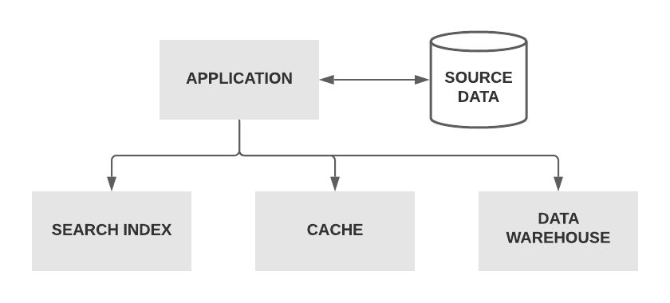
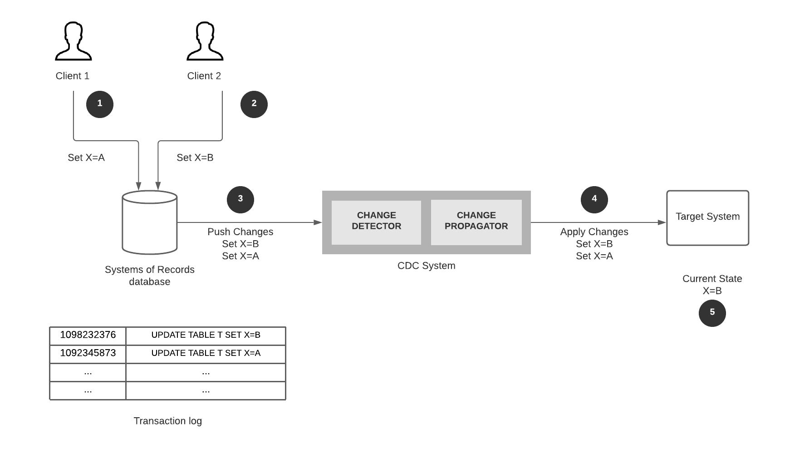
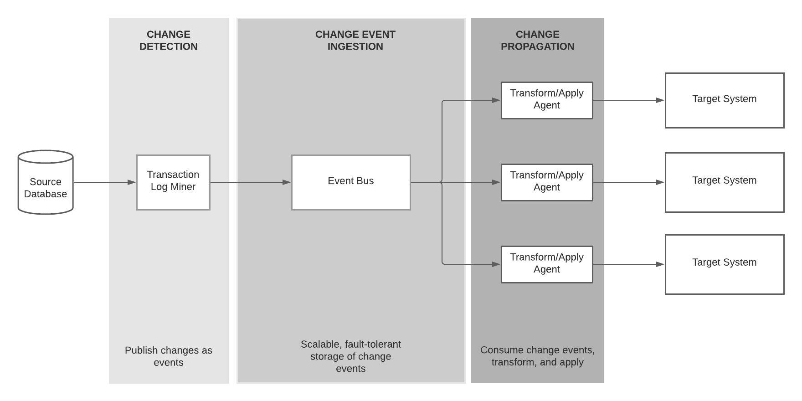
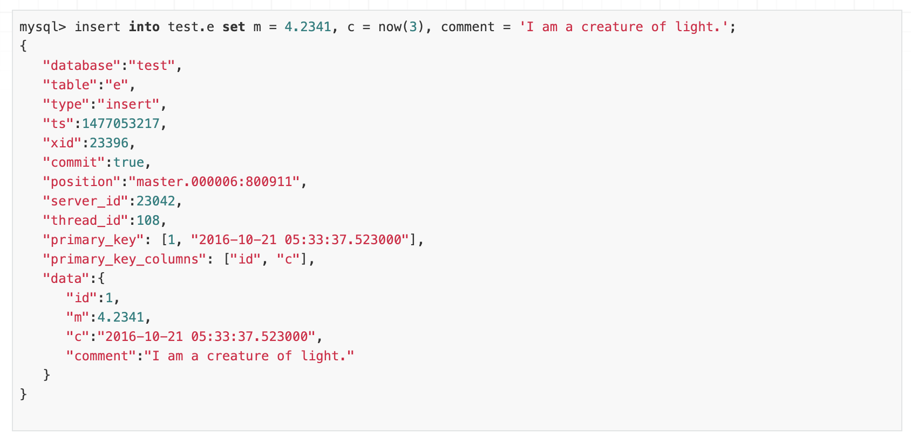

## The motivation behind CDC
Applications start with a small data footprint. Initially, a single database fulfils every data need of the application.
When applications evolve, they need to support different data models and data access patterns. For example, they might need a search index to perform full-text searches, a cache to speed up the reads, and a data warehouse for complex analytics on data.
Eventually, that simple architecture evolves into something like this.

Practically speaking, no one database can satisfy all those needs simultaneously. Consequently, applications have to use different data storage technologies such as indexes, caches, and warehouses together in their architecture. That forces them to keep their data in multiple places, in a redundant and denormalised manner.

### Systems of Records and derived data
When you have multiple versions of the same data set, you need to appoint one as the **source of truth**, or the authoritative version. That means, when there’s a discrepancy across versions, the source of truth will be accepted as the correct one. This version is often called Systems of Records data or source data.

The very first time a user creates data, it is captured into Systems of Records. For example, when a customer creates an order, it is first stored in the orders database.

Other systems can take source data, apply transformations, and store with own representations to serve different purposes. This data is called Derived Data — which is often redundant and in denormalised form. If you lose derived data, you can recreate it from the source.

### Source data and derived data need to be synchronised

Source data and derived data should not be kept in silos. They have to be synchronised to preserve consistency across the application. If we go back to our original example, a change made in the database has to be reflected in the search index, the cache, and ultimately in the warehouse.
So there should be a way of capturing the changes done to the source data system and propagating them to derived data systems in a reliable and scalable manner.
That paves the road for Change Data Capture.

## Change Data Capture (CDC)

Process of **observing all data changes** written to a **database** and **extracting** them in a form in which they can be replicated to **derived data systems**.

Although the term CDC is relatively new, the underlying concept was there in the industry as database replication and ETL(Extract Transform Load). These approaches tend to be complex, required expensive licensing, and too slow. Hence, organisations were on the lookout for a real-time, event-driven way to synchronise source and target data systems.

The CDC process has three stages.
1. Change detection
2. Change capture
3. Change propagation

### Change detection methods

There are few options to detect the changes done to the source database.

1. Polling the LAST_UPDATED column of tables periodically to detect changes.
2. Database triggers to capture row-level operations.
3. Watch the database transaction log for changes.

Polling is slow; it puts more load on the source database. Also, the implementation requires you to add dedicated columns to the source. Triggers deliver the results in real-time. But they are resource-intensive and can drag the database.

Watching the transaction log of the database is fast and does not impose a performance impact. Many CDC systems today have adopted this approach for their implementations.

## How does a log-based CDC system work?
Users and applications make changes to the source database in terms of inserts, updates, and deletes. The database records these changes in the transaction log in the order of their occurrence.

CDC system watches the transaction log for any changes and propagates them into the target system while preserving the change order. The target system then replays the changes to update its internal state.

In the above figure, Client 1 and client 2 update the value of X in two transactions. The transaction log records the changes. Eventually, the CDC system picks up the changes, delivers them to the destination so that the changes can be replayed to target systems.

That looks straightforward in theory. But designing a production-grade CDC system requires prior thinking in terms of scalability, reliability, and extensibility.

## Requirements for a production-grade CDC system

A production-grade CDC system should satisfy the following needs.
- **Message ordering guarantee** — The order of changes MUST BE preserved so that they are propagated to the target systems as is.
- **Pub/sub** — Should support asynchronous, pub/sub style change propagation to consumers.
- **Reliable and resilient delivery** — At-leat-once delivery of changes. Cannot tolerate a message loss.
- **Message transformation support** — Should support light-weight message transformations as the event payload need to match with the target system’s input format.

## Making it event-driven
[Event-Driven Architecture (EDA)](https://en.wikipedia.org/wiki/Event-driven_architecture) seems an ideal fit to achieve the above system requirements. EDA brings to the table the asynchrony, loose coupling, and scalability. By combing the EDA features, we can rethink the CDC architecture as follows.

### 1. Change event generation

The transaction log mining component captures the changes from the source database. It converts them into events and publishes them to the message bus. That happens in real-time while changes are made to the source database.
Each event is timestamped and contains only a single change. The format of a typical change event would look like the following.

### 2. Change event ingestion

Change events are then written to the message bus. It provides highly scalable, and reliable change event storage while preserving the order of received events. Also, depending on the implementation, the message bus can provide at-least-once or exactly-once delivery guarantees.

Change events are usually written to a topic so that any interested consumers can subscribe to receive updates.

A message broker like RabbitMQ or ActiveMQ can provide transient event storage while a streaming platform such as Kafka or Kinesis provides a durable event streaming capability. Choosing either of them should be use case driven. You can refer to my [earlier post](https://medium.com/event-driven-utopia/comparing-enterprise-messaging-and-event-streaming-e714f7b5fc40) about their difference.

### 3. Change event propagation
Any downstream application can subscribe to the above topic to receive change events. Usually, an intermediate component consumes the events, applies a light-weight transformation to the event payload, and publishes it to the target system. For example, a connector reads events from the topic, applies transformation, and updates a search index.

Depending on the use case, consumers can do event-driven consumption or streaming consumption.

## Advantages
The event-driven CDC approach adds the following benefits over traditional ETL and polling-based solutions.

- Changes are detected, captured, and propagated in real-time as they happen. That enables downstream consumers to act upon changes quickly. Compared to traditional batch-oriented systems, that is a huge gain.

- The loosely coupled nature allows adding or removing components to the architecture with minimum impact. Source and target systems can be upgraded or replaced without affecting each other.

- The message bus in the middle provides reliable delivery of change events. Also, it can buffer incoming events if the rate of event production is higher than consumption. That will be beneficial for slow consumers.

- Unlike polling and trigger-based methods, no performance impact on the source system.

## Use cases
- Cache invalidation
- Search index building
- Database migration (version upgrade, migrate to a different vendor, on-premise to the cloud)
- Offline analytical processing
- Data synchronisation in Microservices

## Tools in the market

There are both open source and commercial tools available in the CDC market. Many open-source tools are flexible enough to co-exist with popular messing systems and target systems whereas commercial tools sometimes ask you to buy their entire platform.

Mentioned below are some renowned open-source tools in the market.

### Debezium
[Debezium](https://debezium.io/) is an open-source CDC platform built on top of Apache Kafka. Debezium has connectors to pull a change stream from databases like PostgreSQL, MySQL, MongoDB, Cassandra, and send that to Kafka. Kafka Connect is used as connectors for change detection and propagation.
Even though Debezium utilises Kafka in its architecture, it offers other deployment options to cater to different infrastructure needs. Debezium can be used as a standalone server (with Debezium server), or you can embed it into your application code as a library. Visit [here](https://debezium.io/documentation/reference/architecture.html#_debezium_server) for more information on that.

### Maxwell
[Maxwell](https://maxwells-daemon.io/) reads MySQL binlogs and writes row updates as JSON to Kafka, Kinesis, or other streaming platforms. Maxwell has low operational overhead, requiring nothing but MySQL and a place to write.

## Conclusion

When applications evolve, the way they access and process data changes. That forces them to keep data in multiple places in different formats to serve unique purposes. A problem arises when these data need to be synchronised.

An event-driven, real-time CDC system allows source database changes to capture and propagated to target systems as they happen. That enables downstream systems to react to them without delays.

When choosing a CDC tool, you should pay attention to the throughput it can offer and the flexibility to work with different source and target systems.

## References

*Designing Data-Intensive Applications: The Big Ideas Behind Reliable, Scalable, and Maintainable Systems — Martin Kleppmann*