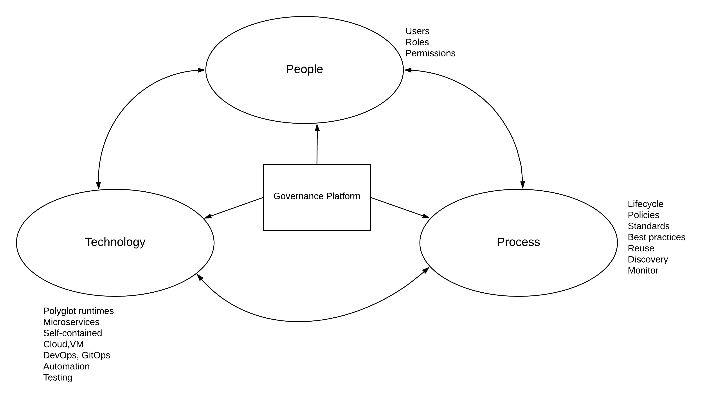
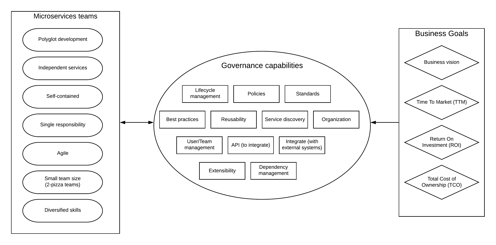
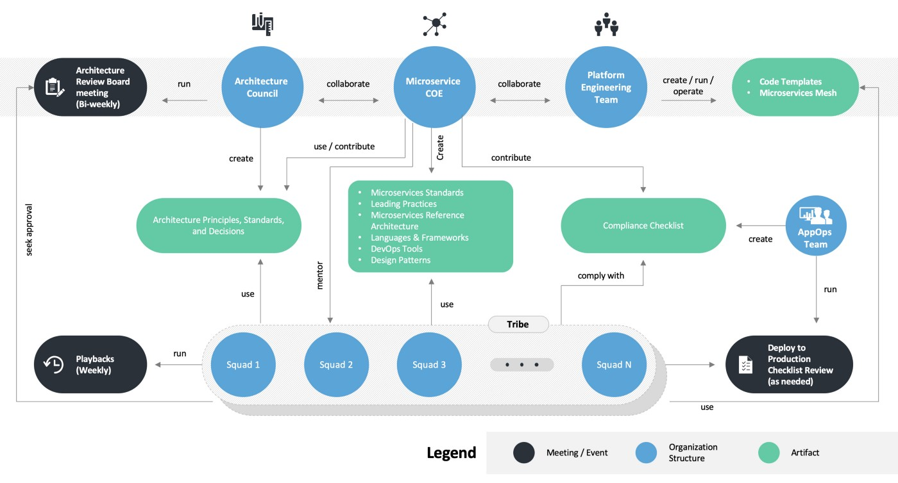
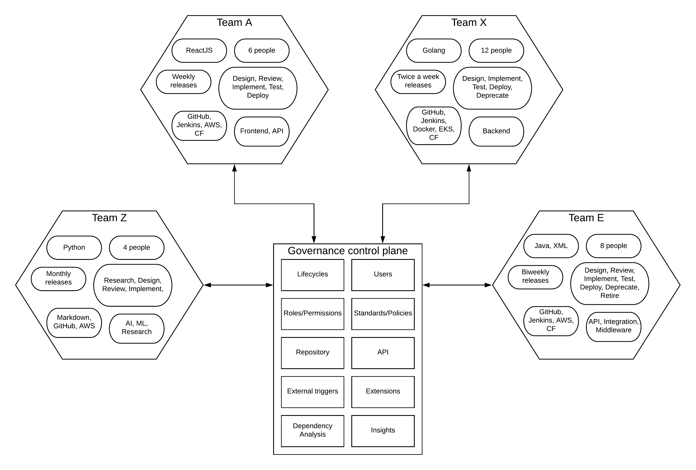
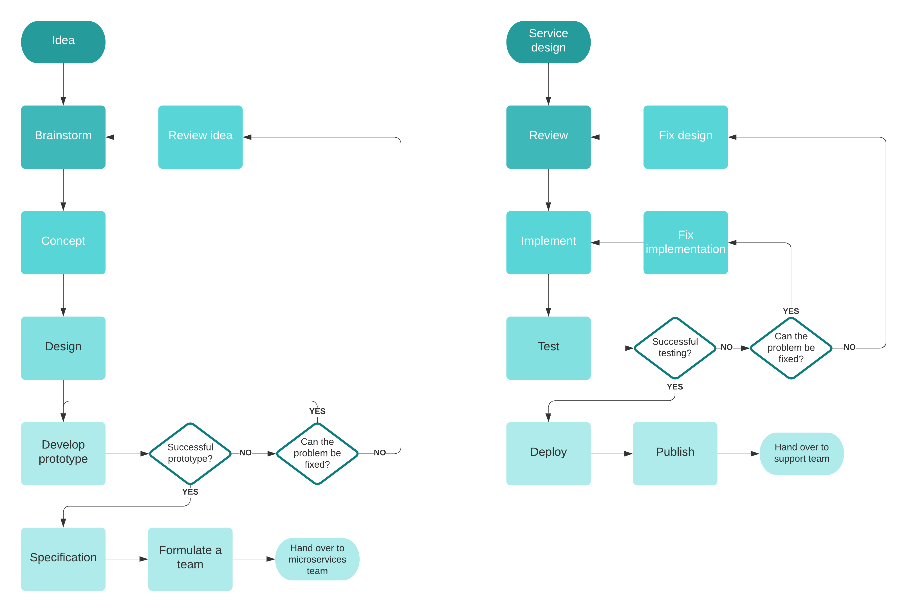
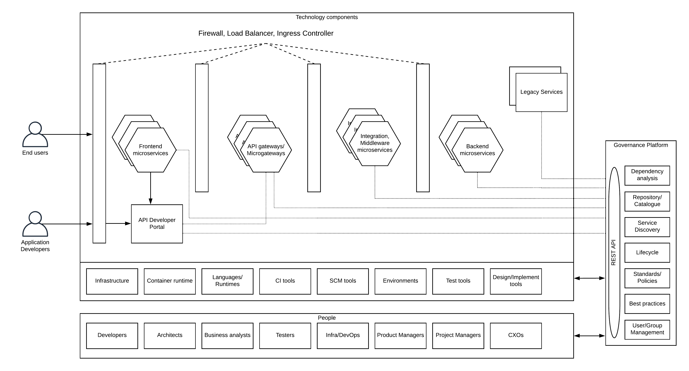
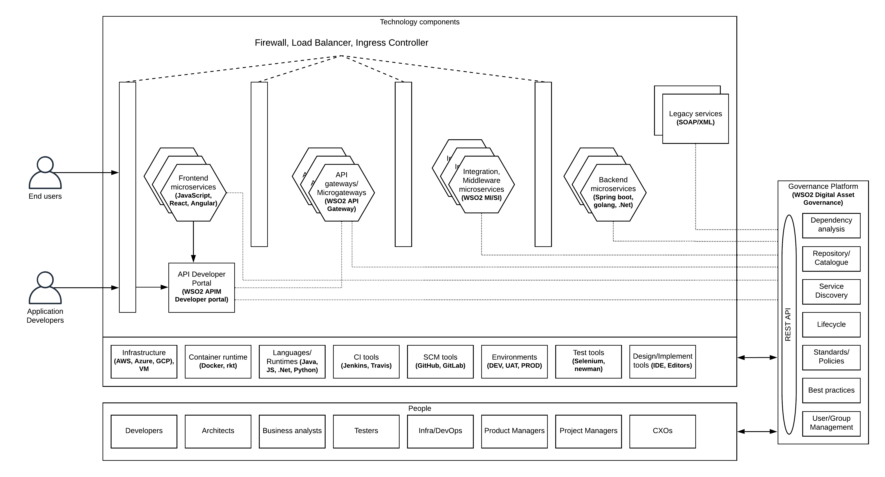
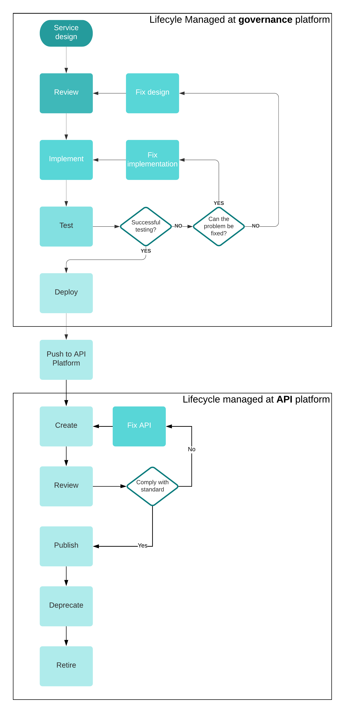
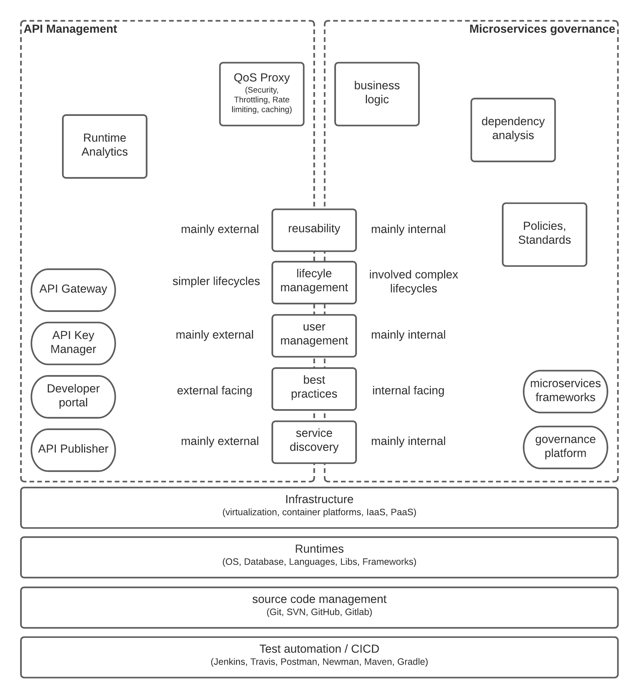

## Introduction

The term “Governance” often used in the context of governing countries or states with rules and regulations. In the context of Information Technology (IT), governance can be defined as the “model that connects people, processes and technology to deliver value to the stakeholders”. Given below are a couple of definitions found in the web. 

“IT governance provides a structure for aligning IT strategy with business strategy”
source: https://www.cio.com/article/2438931/governanceit-governance-definition-and-solutions.html

“IT Governance is a process used to monitor and control key information technology capability decisions - in an attempt - to ensure the delivery of value to key stakeholders in an organization”
source: https://cio-wiki.org/wiki/IT_Governance

If we simplify the above definitions, IT governance talks about the connection between people, processes, and technology to deliver value to stakeholders. This same concept is depicted in the below figure.

Figure: IT governance in a nutshell

As depicted in the above figure, IT governance process interacts with 3 main components within an enterprise IT ecosystem.

### People
This is where the organizational structures, teams and individuals are identified and assigned with specific functions as part of the service delivery. This includes people with various skills including developers, architects, business analysts, CXOs, and many other stakeholders involved in the process of IT services delivery. From the requirement identification to the final delivery of the business functionality as a service through the IT ecosystem, these various actors (roles) interacts with themselves as well as the underlying processes and technology. Different roles need a different set of permissions to implement the governance model so that stability, integrity and accountability is maintained. 

### Processes
Processes are the definitions that put governance over technology and people. This comprises of policies, standards, best practices, roles (user management), etc. People are required to honor these processes when utilizing technology to deliver IT services. In the context of the microservices, processes are centred around individual teams, yet governed through a central control plane. 

### Technology
This is where the actual work of developing, testing, deploying, and delivering of the services happen. People use these technology components to deliver value to the key stakeholders under the governance of the processes. 

At the end of the day, final outcome of a proper governance model is to deliver value to the stakeholders (e.g. consumers, partners) with accountability and transparency. If we analyze most of the failed IT projects, one of the most common root causes of the failure is the lack of governance. Understanding and the visibility of the project within the wider business organization is very low in those projects. 

With that brief introduction to IT governance, let’s direct our attention to the topic of this research which is “microservices governance”. 
Microservices and Governance
According to the renown technology guru Martin Fowler, 

“The term "Microservice Architecture" has sprung up over the last few years to describe a particular way of designing software applications as suites of independently deployable services. While there is no precise definition of this architectural style, there are certain common characteristics around organization around business capability, automated deployment, intelligence in the endpoints, and decentralized control of languages and data” 
source: https://martinfowler.com/articles/microservices.html

The above definition is somewhat detailed and if we summarized that, microservices architecture is a “software development practice where teams develop, deploy and manage services independently which are self-contained and serve a specific business purpose”. 

Let’s expand this definition to microservices governance. “microservices governance is a process that helps people to manage the microservices development to deliver key results to the business stakeholders”. In other terms, it is a process that helps an organization to align its’ business goals with the microservices initiatives through a set of defined policies and standards without hindering the advantages of the same. 

One of the common misconceptions in the world of technology is that putting process and policies over a microservices development team can hinder their innovation and delivery speeds. Even though there can be some impact, it is far more important to have that when the organization becomes larger and having to deliver 100s of different services as microservices. 

Figure: microservices, governance, and business goals

The above figure specifies the key characteristics of microservices teams, governance, and business requirements and how they are interconnected when building a governance framework for microservices. 

### Microservices teams
Microservices architecture allows teams to have autonomy when developing and delivering services. They can select their own runtimes, languages, tools, and processes. But these teams do not fall from the sky. There needs to be a process to identify the service requirements and then spin off the teams to work independently. This can be the starting point of the microservices governance where there is a process to spin-off a team when a business requirement needs to be delivered as a service (specifically microservice). This can be implemented as a lifecyle in the governance platform and managed by a central team that consists of business analysts, architects and a few developers. 

Source: https://medium.com/ibm-garage/microservices-technical-governance-f5aed10189d1

Once the microservices team is identified and handed over the specification to implement, it is up to the team to come up with their own tools, processes and technologies to deliver the expected results. 

Even though microservices teams can define their own service delivery lifecycles, standards, and best practices, those need to be aligned with the overall business goals and objectives. The idea of governance in the context of microservices is not to hinder the innovation by putting a centralized management structure, rather introduce proper order via a distributed governance layer with a centralized control plane. 

### Governance capabilities
When it comes to governance in the microservices context, there are 2 types of governance capabilities. 

#### Design time governance
This is where all the policies, lifecycles, standards, best practices, and dependency management capabilities are defined. The teams can have their own versions of these capabilities, but those needs to be notified and defined in the governance control plane so that when business leaders need to do some sort of audit or change in business vision, everything is recorded. This also includes aspects like reusability where teams can look for existing fine grained services before spending time on implementing duplicate services. It also improves the visibility and accountability of microservices teams to the overall business process which can help people immensely when things go wrong. 

#### Runtime governance
These are the governance features that are used in execution time or runtime. Some examples are service discovery where a certain runtime component discovers an endpoint URL by referring to a key that is defined as a governance asset in the platform.  Another example is the use of a REST API exposed by the governance platform to change the state of the lifecycle of a microservice during a CICD pipeline execution. 

### Business goals
At the end of the day, everything we do with microservices and governance needs to deliver results to the business. There can be different goals in different businesses, but some of the common business goals are
- Business vision
- Time to market (speed of delivery)
- Return on investment
- The total cost of ownership

When defining the policies, standards, best practices in the governance layer, and approving them for individual microservices teams, it is essential to align those with the previously described business goals in one way or another. 

Let’s try to understand this interaction of microservices teams with the governance platform via a practical example where we have 4 different microservices teams at a given time within an organization delivering different types of services. These teams interact with the governance control plane to make sure things they do comply with the business standards and needs and accountable for the same. 

Figure: microservices teams interact with governance control plane

As depicted in the above figure, there are 4 microservices teams developing services of various domains and functionalities. These teams have their own choices for 

- Programming language/runtime
- Release strategy
- Delivery lifecycle
- Source code management tools
- Number of team members
- Service category

This shows that individual teams can take different approaches to execute various tasks based on their need to deliver the services with the best quality. At the same time, they will interact with the governance control plane to verify the approach and record the same for future references as well as for a wider visibility within the organization. 
Governance control plane exposes APIs so that these teams can interact with it programmatically with less human interaction. In addition to that, it also provides user interfaces to perform the same set of operations in case if some teams decided to go down that path. Some of the key aspects of governance that can be used in this situation are

- Lifecycle management - Each team can have their own lifecycle stages and transitions with respective roles. At the same time, these details will be captured and governed through the governance control plane. This interaction can be manual or through the APIs exposed by the governance layer. 
Service repository and reusability - While teams developing new microservices with a domain based design where microservices serves a specific functional capability, there can be certain overalaps in actual implementations. It is good to go through the existing set of microservices before allocating resources to replicate the same functionality. This is where the service repository aspect of the governance layer helps with reusability and improve the overall efficiency of the system. 
- Standards/ Policies - While each teams can decide on the technologies, release models, lifecycles, there should be a common mechanism to define various aspects of the development process through standards and policies. If it is about API design, then it is good to have a common agreement on which specification is accepted at the organization level since that is a technology agnostic decision to make. If there are certain certifications (HIPPA, FEDRAMP) needs to be achieved at the organizational level, that needs to be honored by all different teams. 
- Best practices - This is something similar to lifecycles where teams can have their own best practices based on their technology choices. But it is the responsibility of the teams to publish these best practices at the governance level to make sure those best practices aligned with business goals. 
- Dependency Analysis - When things starting to boom on the business side, more and more microservices can be added to the ecosystem and understanding the relationship of microservices and related assets becomes really useful. That is where the dependency analysis can help with visualizing the complex dependencies between various asset types including microservices teams, service URLs, roles and many others.  
- Monitoring / Auditing - Microservices teams cherish the idea of autonomy and it helps them to innovate and come up with new ideas that can transform the business at times. At the same time, there can be many cases that things does not work out. It is the nature of trying out new things. All of these things are acceptable results. At the same time, there should be a mechanism to do a retrospective of the failed projects and learn from those mistakes. That is where the auditing and monitoring aspect of the governance platform can help organizations. 

The above-mentioned capabilities of the governance control plane allow the business to align its vision with the work that is done by microservices teams without restricting their freedom and innovation. The above diagram depicts a model called “trust but verify” where you build a distributed governance structure based on trust with the central verification layer. 

Let’s dig a little deeper and define 2 lifecycles that are used by one of the 4 microservices teams mentioned above. The first lifecycle is a generic lifecycle to initiate an idea and prove that as a valuable and doable idea. The result of that is spinning off a microservices team. The next lifecycle defines the service release process of a given microservices team. 

Figure: microservices governance lifecycle example

On the left-hand side of the above figure, you see a lifecycle that is used to convert an idea into a concept and then spin off a microservices team to develop that as a service and deliver to the consumers. This lifecycle can come from one of the microservices teams. But it is a reusable lifecycle that can be followed by many teams regardless of the technologies they used. 

On the right-hand side, you see a typical software lifecycle that involved design, implementation, test phases, and finally deploy and publish as a managed API via a developer portal that is accessible to the external consumers. Microservices team can implement a CICD pipeline to go over the lifecycle automatically. It can integrate with the governance platform via the APIs to update the lifecycle changes on the governance layer. That will make sure that every release is tracked and passing the required governance requirements before going in to the production environment. 

This lifecycle can be different in another team. With the central control plane, architects can always compare these lifecycles with each other and make suggestions to improve based on the learnings from each team. 

## Microservices governance reference architecture
Now that we have covered the details of the microservices governance and how it works at a non-technical level, let’s try to bring these ideas into a solution architecture that depicts the various components and their interactions in a technical context. 

Let’s take an example of a modern brownfield enterprise that is being transformed into a microservices architecture.

Figure: microservices governance reference architecture

The above figure depicts a detailed view of the previously discussed architecture where people, technology, and governance process interacts with each other to deliver results to the business. 

### Technology components
The end result of a microservices team is the microservice that is up and running in a production environment. What you see in the above figure at the top half is a production environment that has various types of microservices deployed with multiple replicas. This diagram does not depict other components like security token services, services meshes, message brokers, etc. for the sake of simplicity. It also depicts the legacy services that are an unavoidable part of an enterprise architecture. 
At the bottom half of the technology components section, it depicts various underlying technology components that are utilized by the microservices during the runtime as well as during the development and testing phases. These components can be different from microservice to microservice. But using different variations of all those components for different microservices can be an overkill. As an example, if the organization decided to use a certain IaaS provider for infrastructure, then it is advisable to use that instead of going for a different provider if there is no real reason. Similarly, polyglot concept needs to be utilized with care. With the governance in place, utlization of technology components can also be managed in a “trust but verify” model. 

### People
This diagram details the people aspect as well. It depicts different roles that people play within a microservices-based development process. These are the people who interact with the governance platform from time to time to deliver the services that align with business goals. From the initial design phase to the final retire phase, various team members play one or more roles from the mentioned list to provide the best experience to the users. These roles will have different permissions according to the requirements of microservices teams and overall business needs. 

### Governance platform
We have already discussed the capabilities of the governance platform in previous sections. In this section, We’re discussing the advantages of these capabilities in the microservices context. 

#### Repository/Catalogue
In a typical enterprise deployment with an N-tier architecture, there are different types of services from backend services, middleware services, APIs to frontend services. Usually, API platforms have developer portals that expose the API details to the consumers. But other types of services are not stored in this portal. It is the responsibility of the governance platform to keep all the different types of services and make sure that each service is reusable. Additional functionalities like search, browse, discovery, categorization, dependency analysis will increase the value of the platform. 

#### Service discovery
Runtime service discovery is one of the important aspects within a microservices based self-contained, service oriented, n-tier architecture model where different functionalities are executed at different services. When the services are deployed through different environments, the actual URL of these services can be changed. In such a situation, having a common reference as a “key” in the implementation and mapping that to a “value” via the service discovery function can reduce the management complexity of the services when going through environments. 
 
#### Lifecycle management
This is another key functionality used by services other than APIs. In most cases, API platforms only manage the lifecycle of API proxies which is an overlay on top of the actual microservice. These core microservices also have their own lifecycles and need to be governed according to the business standards and best practices. That functionality is provided by the governance platform as we discussed earlier in this writing. Different teams can have their own lifecycle stages and attach those lifecycles to the respective microservices via this platform. 

#### User/Group management
One of the key aspects of any governance process is the management of users and their permissions. This is the functionality that manages the people aspect of the governance story where different roles can be assigned with different permissions to do certain operations. One example is the management of lifecycle states. Developers will do the development and need to get approval from testers to move it to the production environment. 

#### Interaction over API
Some teams may prefer programmatic access to governance functionalities so that they can build automated pipelines to deliver services. One of the key capabilities of the governance platform is to expose almost all the required capabilities via a defined API so that teams can interact with the platform via that. This needs to be protected with a mechanism like OAuth2 or basic authentication based on the ability of the clients. 

#### Standards/Policies/Best practices
Giving too much freedom to microservices teams can lead to a complex overall architecture with so many different technologies, standards, and practices. That is one of the key reasons why microservice architecture needs a governance layer to “trust but verify” the microservice teams’ work. These policies need not be pushed from top to bottom always. These can come from the individual teams but need to be verified and reviewed by the architects and business leaders to verify that they are in line with the business standards and goals. 

## Microservices governance reference implementation with WSO2
The reference architecture we discussed before needs to be something that is practical. In other words, it needs to be possible to implement with existing software tools. That is the intention of the final section of this writing to discuss the possible solution architecture with WSO2 open source software stack. This architecture includes many other existing tools and technologies in addition to WSO2 to make it a complete reference implementation. 

Figure: microservice governance reference implementation WSO2

As depicted in the above figure, microservices pertaining to different domains can be implemented with variety of technologies. A few examples are
- Frontend applications - Javascript, React, Angular
- API gateways - WSO2 API Manager, Microgateway
- Integration services - WSO2 Enterprise Integrator, Micro Integrator
- Backend business services - Spring boot, Golang, .Net
- API Developer portal - WSO2 API Manager developer portal

In addition to this, there can be legacy services that needs to integrated with the overall ecosystem since those systems cannot be replaced with the microservices. 
- Legacy services - SOAP, XML, SAP, FIX, JMS

All these services utilize various underlying tools and technologies to deliver value to the end users. Those technologies are
- Infrastructure - AWS, Azure, VMs or Physical hardware
- Container runtime - Docker, rkt
- Language runtimes - JDK, .Net framework, Node
- Continous Integration tools - Jenkins, TravisCI, CircleCI
- Source code management tools - GitHub, GitLab
- Test automation tools - Selenium, Newman, SOAPUI
- Design/Implementation tools - IDE, VSCode

When it comes to the governance of the overall ecosystem, there are 2 types we have identified at the beginning of this writing. Those are design time governance and runtime governance. Let’s dig a little deeper into these concepts with this reference implementation. 

### Design time governance
This is the part of governance that involves lifecycle management, policies, standards, best practices as well as reusability. Different microservices teams can have their own lifecycle definitions and different user roles to manage the lifecycle state transfer. That allows teams to work autonomously. At the same time, WSO2 digital asset governance solution allows these teams to create custom lifecycles and attach them to the services that they implement. As part of that, there can be roles that verifies the overall governance across multiple teams by making sure that everyone follows the industry best practices which are accepted by the business. As an example, If the industry best practice is to use Open API Specification for API definitions, every microservices team needs to adhere to that standard since it is technology neutral. At the same time, teams should have the autonomy to select the programming language and the libraries used in their development. 

Another key aspect of the design time governance is the reusable aspect. Given that microservices teams are stemmed from ideas, there can be situations where certain services that are required to retrieve data for this new microservices implementation is already available via a service developed by another team. Instead of reimplementing the same service, that team can make use of the existing service. This is the functionality of the repository aspect of the WSO2 governance solution where users can browse, search existing services and reuse the same wherever possible. That reduces the overall time to market and duplicate effort that could waste considerable time from the team. 

When it comes to managing the lifecycle of the services, sometimes it is necessary to deprecate older services to make the way to the new services. At a time like that, it is essential to udnerstand the impact of a given service before deprecating it. In a large enterprise with 1000s of services, finding this relationship can be extremely difficult if you don’t have a governance tool that supports this capability. Fortunately, WSO2 governance solution allows the users to analyse the impact of a given service (or asset) on other similar objects. 

When it comes to API development, WSO2 API Manager comes with the API Publisher and Developer portal that serves the functionality of lifecycle management and repository aspect for APIs (API Proxies). This is mainly designed to be exposed to internal as well as external developers who are planning to utilize the APIs in their respective delivery channels (mobile, web apps). WSO2 Digital Asset Governance solution can be integrated with WSO2 API Manager to implement a seamless experience for API development where API designing can be done at the governance platform and push that to the API Management layer for managing the rest of the lifecycle. 

### Runtime governance
This is the component of governance that is often being overlooked. But it is an essential part of building a modern automated, dynamic enterprise platform. Runtime governance deals with the runtime interaction of services with the governance platform via an API to find out certain assets in the platform. As an example, in a typical integration developed in WSO2 EI, the endpoint name can be given as a fixed value like “HospitalEP”. But the actual URL of this value can be different based on the environment (DEV, UAT, PROD) and that runtime mapping of the endpoint name to the URL can be achieved through the governance platform where it can store the value against the URL and resolve that during the runtime. This functionality is often called as “service discovery” where the runtime discover the actual URL of the service by calling the governance platform. 

In addition to that, governance platform exposes a set of REST APIs to perform most of the design time governance functionalities via these APIs in a programmatic manner. If the microservices team has a fully automated development, deployment, testing lifecycle, then the governance platform should support that lifecyle implementation without hindering the same. These APIs allows such teams to integrate their automated deployments with the lifecycle management aspects of the governance platform so that both parties are accountable. It is good to have at least one step in the lifecycle where manual inspection happens before a particular service is deployed into the production to make sure that we align with the “trust but verify” strategy. 

Another aspect of the runtime governance is the ability to send real time notifications (emails) to the respective parties when there are changes happening on services. As an example, if a service is transitioning from implementation to publish state, the users of similar services (or users of the previous versions of the same service) can be notified via the platform automatically so that users can reap the benefits of this new service in no time. The same can be applied for certain activities like deleting an asset so that there are additional security measures taken for harmful actions by responsible people. 

### Security of the governance platform
One of the key aspects of the governance is the security of assets (services) that are maintained by the platform. Users can be residing in a enterprise user store like LDAP, AD or in a database that is connected to the governance platform. According to the requirements of microservices teams and overall company needs, roles are defined with a given set of permissions. These permissions define the activities that the respective users can perform on the governance platform. As an example, a user with the developer role will not be able to change the lifecycle of a service from implementation to publish state. But a user with product manager can do that after verifying the necessary details. Similarly, if there is a requirement to logically isolate the assets across different business units, multiple tenants can be created and maintained their own repository without any interference from other teams. 

## Microservices governance and API Management
One of the biggest confusions in the industry around microservices governance is that API Management platforms can cover up the governance aspect of microservices through it’s API publishing tools and developer portals. This is not true. API Management tools provide some level of governance to the APIs(API Proxies) that are developed on top of the microservices . If a certain backend microservices team decides to utilize the API management platform to expose their microservices to other components, at that point, APIM platform will start interacting with the microservices with a new lifecycle, standard and policy that is related to the API fraction of the service. But it is not capable of handling the governance capabilities that are required prior to the API development. This is the time where people tend to cover up the governance aspect via the API platform by creating a lifecyle that expands beyond the API lifecyle with stages like “Design”, “Review”, “Implement” for backend microservice without any connection or relation to the actual progress of the microservices development. By doing this, users will lose the ability to properly govern the microservices development process, rather it will only be able to handle the governance of API Proxy development. 

The other arguable fact about microservices development is that every microservice should be exposed via an API management platform. This arguments help vendors to push the idea of use API Management platform to govern your microservices since all the microservices are published through the same. Even in a situation like that where all the microservices are exposed via an API platform, those platforms are not capable of handling the governance aspect of the microservices development (except the API proxy part). The best solution for this sort of a scenario is to build a bridge between the microservices governance platform and API management platform where API management becomes an extension of the microservices governance. 

Figure: microservices governance and API management integrated
As depicted in the above figure, microservices governance captures the lifecyle transitions of the development process that are independent of the API development. In a waterfall type of development model where one microservices team responsible for both microservice implementation and the API development, this sort of an integration can help to bridge the 2 components. 

In most cases, these 2 tasks of microservices development and API development can execute in parallel without waiting on each other (within a single microservices team or in 2 different microservices teams) when there is a defined API interface. This is called the “API first” development approach where architects will define the API as an output of the initial lifecyle of idea generation (depicted in a previous figure) and then spin off 2 microservices teams to work on the development of backend implementation and the API creation and related activities. 

Lifecycle management is only one of the features that can differentiate the functionality of microservices governance framework and API management platform. In addition to that, API management platforms always creates an API proxy out of the microservice and adds another component to the runtime architecture which is not desirable for every microservice. There can be microservices that just need to publish it’s metadata to other users without introducing any additional runtime layer on top of the existing service since those required QoS services are already available within the microservice itself. This can be a common case where microservices teams use technologies like service meshes where it provides additional control of the QoS functionality within it. In such cases, using an API management platform to govern the microservice will not be required unless otherwise that platform has a mechanism to register these microservices without generating a proxy API. In such a case, microservice governance framework can provide the required functionality of reusability and service discovery via the same without needing an API management platform. 

In addition to the above mentioned points, features like dependency analysis to identify the relationship of a given service with the rest of the ecosystem is not something available in API management platforms since it only cares about a particular API and it’s related endpoint/s. 

Figure: API management and microservices governance

As depicted in the above figure, even though similar functionalities like service registry (reusability), service discovery, lifecyle management, user management and best practices are available within APIM platforms, their scope is well outside the microservices development process. Microservices governance platform needs to compliment the API manegement platform to implement end to end governance on a microservices architecture.

In summary, we can identify that there is a clear void in the space of microservice governance that people often overlook when adopting microservices architecture and due to that, maintaining such an architecture has become a major challenge to an extent where some of the early promoters of microservices architecture is leaving it behind as a mistake. But in reality, it has a lot of advantages that deliver value to the business and the consumers if we govern the process properly. 

## Future improvements
The term “governance” is an ever evolving concept in every context (political, business, IT) which is applicable. In the context of IT governance, we identified that design time governance and runtime governance are the 2 branches of governance that helps organizations to achieve their business objectives through the use of technology and people. One key aspect missing in the governance tools is the “observability” where the results of the delivered services are captured and analyzed with modern tools like Artificial Intelligence and Machine Learning to expedite the processes of service delivery by predicting the future requirements rather than waiting for ideas to be stemmed from people all the time. These analytics tools can be used to measure the effectiveness of the processes and derive better models (lifecyles, team sizes, release cycles) to work on and hence improve the overall efficiency of the system. 

References:
https://www.wipro.com/blogs/dr-gopala-krishna-behara/microservices-governance/

https://www.leanix.net/en/blog/microservices-governance

https://dzone.com/articles/efficient-enterprise-microservice-governance

https://wso2.com/whitepapers/microservices-in-practice-key-architectural-concepts-of-an-msa/

https://medium.com/ibm-garage/microservices-technical-governance-f5aed10189d1

