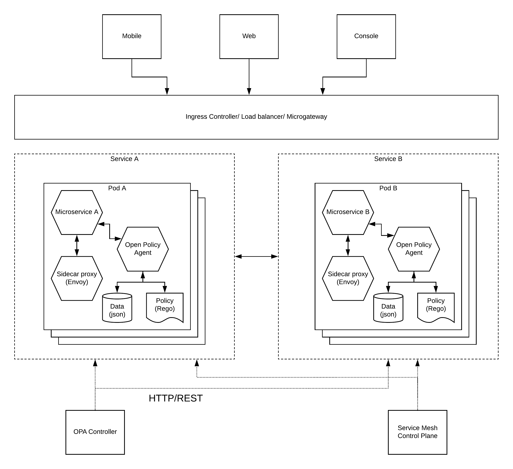

# Microservices Security Pattern - Implementing a policy based security for microservices with OPA

## Introduction
Implementing security for a microservices architecture can be done with 2 approaches. 

1) Centralized security layer - A common security service (STS) running as a microservice which can be consumed by other microservices. This security service can take care of all the security related requirements by having it's own user store and security policies. 

2) Distributed security layer - Instead of having the security service external to the microservice (Pod), each microservice can run a security service which is dedicated to the MS itself. With this approach, MS can have more finer grained access policies which are customized according to the service. 

Some people might argue that having a centralized security layer would kill the purpose of whole microservices architecture. But in reality, it is not entirely true. You can run this centralized security component as a microservice with all the characteristics of a microservice like auto scaling, containerized, highly available, componentized manner. Most of the current security implementations within microservices deployments today follow this approach. 

Even though the above mentioned centralized security architecture works fine with MSA, we shouldn't stop looking for a better alternative which is distributed in nature. Instead of delegating the security aspect to a separate service, microservice can run the security service as a sidecar within the same pod so that each and every microservice has it's own security component. This is what exactly Open Policy Agent (OPA) is trying to promote with it's decoupled policy agent approach. You can read more about OPA by referring to the below link.

[OPA Site](https://www.openpolicyagent.org/)

## Architecture
The better approach to build a microservices architecture is to use containers, pods and service mesh so that you get the total control over the architecture. OPA is a component which you can easily bind in to this architecture by running it as a sidecar container along with the microservice. The below architecture diagram depicts a possible approach to implement a fully distributed policy based security for your microservices architecture.

As depicted in the above figure, microservices A and B are deployed as respective services (kubernetes) which internally runs on a set of auto scalable pods (kubernetes). Each pod containes the following components running as separate containers. 

- Microservice - The actual business logic implementation of the service
- Sidecar proxy (envoy) - This is the supportive proxy which takes care of inter-service communication and related matters
- Open Policy Agent - This is running as a separate container which acts as the security service for the microservice. It uses a data store and a policy store to store the user details as well as policies respectively. These components can run within the pod itself or within the OPA container itself. 

## How it works?
Let's assume an external user wants to access microservice A. User will present his token (Oauth2, JWT, etc.) to the LB/IC/MGW layer and it will validate the user against the security controls which are applied at the global level. Then it will pass the user information (possibly through a JWT) to the microservice through the sidecar proxy. Once the microservice recieves this information, it needs to validate this information against the policies which are related to it. It will call the OPA service to validate the user information along with the accessed service/resource details. Then OPA will respond back with a JSON response mentioning the validity of the request. Once this validation is successful, microservice will execute the remaining business logic and provide the deisred output to the user. 

### How to manage policies and data
One of the key advantages of this approach is that each and every microservice can have it's own set of policies and data which is local to that microservice. If needed, this data and policies can be shared across multiple OPA agents. If a user needs to modify a security policy related to a microservice, he does not need to modify global components like LB/MGW/IC. Instead, it can use the REST APIs which available in the OPA to manage and control the policies and data. 

### Using OPA as a library with go microservices
In addition to running as a separate container alongside the microservice, OPA can be used as a library if you are implementing microservice in go programming language. This approach will slightly modify the above architecture by moving the OPA agent within the microservice container itself as a runtime component.

## Future
With the increasing adoption of MSA, a simple, distributed security architecture is evloving. OPA is one such implementation where is uses the distributed, policy based security approach for microservices which blends nicely with existing tools like kubernetes and istio. Going forward, this sort of implementations can become the norm and the de-facto standard for microservices security. This is just the beginning!

