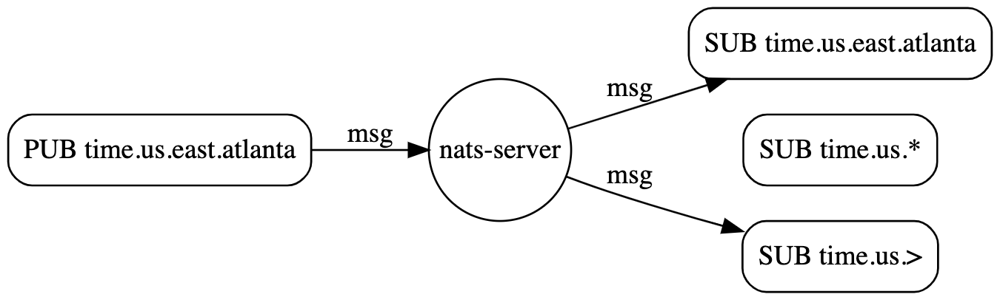
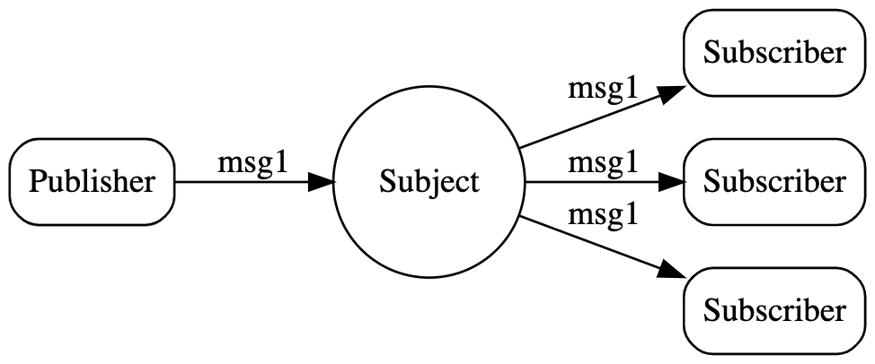
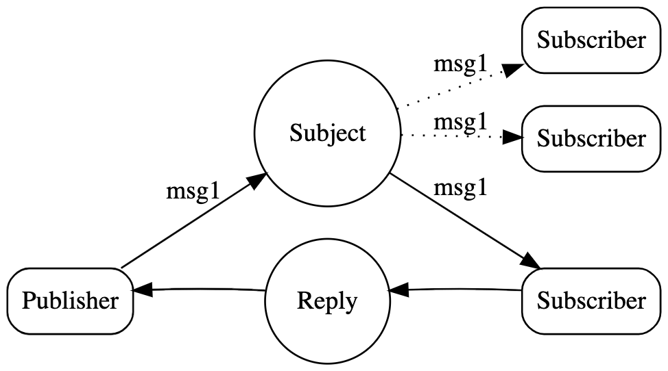
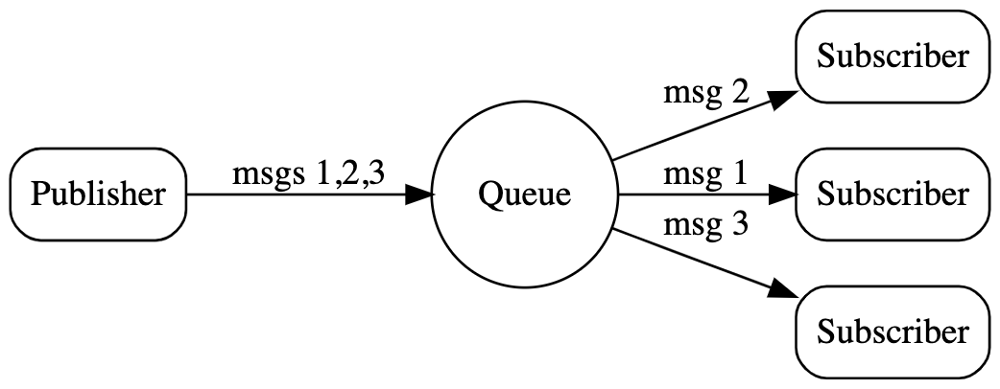
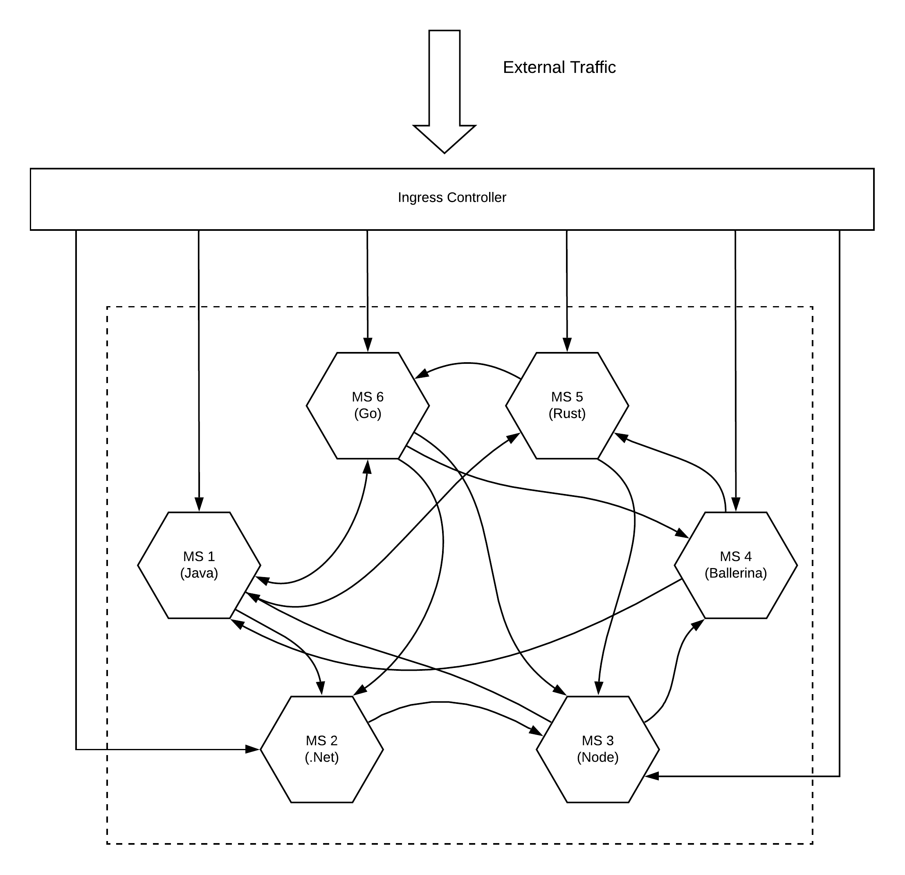
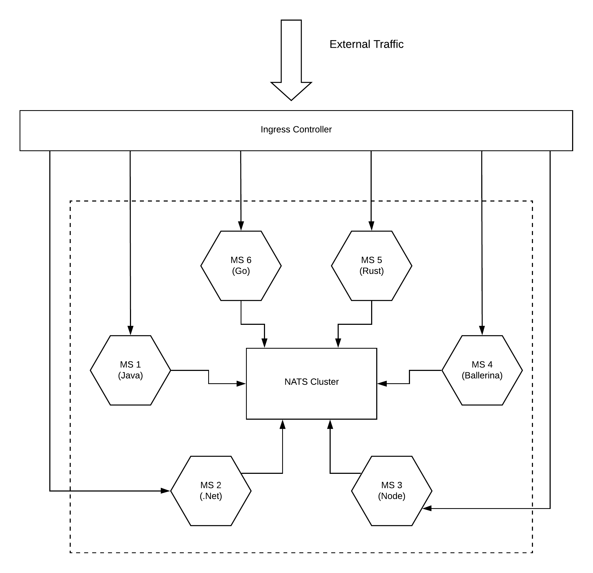
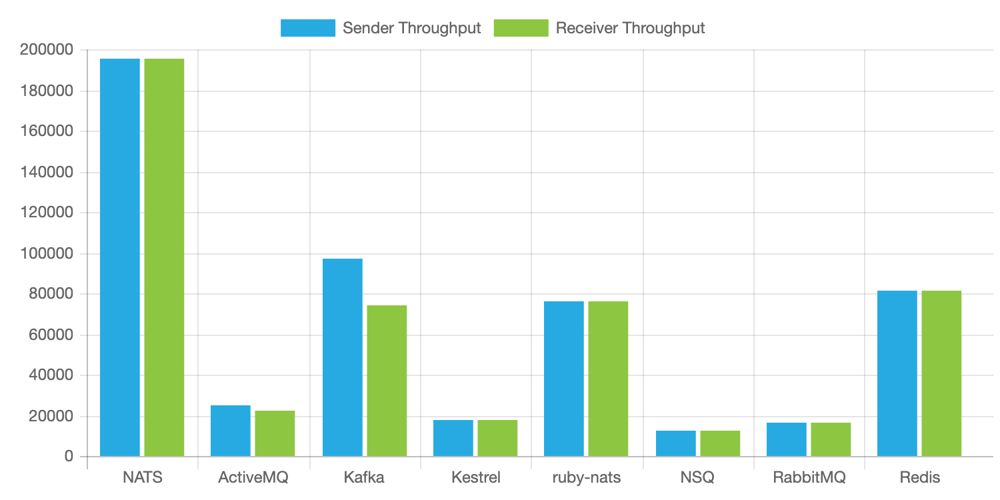

# Microservices architecture with NATS messaging

## Introduction
NATS is a messaging technology that is developed initially as part of the Pivotal Cloud Foundry for messaging requirements within PCF. As per the official NATS documentation,

“ NATS was built to meet the distributed computing needs of today and tomorrow. NATS is simple and secure messaging made for developers and operators who want to spend more time developing modern applications and services than worrying about a distributed communication system.”

Simply it is yet another messaging system designed to solve the ever so complex distributed systems communication problem. The major features of NATS are (as mentioned in the documentation)

- Easy to use for developers and operators
- High-Performance
- Always on and available
- Extremely lightweight
- At Most Once and At Least Once Delivery
- Support for Observable and Scalable Services and Event/Data Streams
- Client support for over 30 different programming languages

## NATS messaging patterns

NATS supports 4 main patterns for communicating messages across entities. Those are
1. Subject-based messaging
2. Publish-Subscribe
3. Request-Reply
4. Queue groups

### Subject-based messaging
This pattern allows entities to share data using a “subject” and consumers can receive these messages (data) by listening in to the “subject” by using wildcards. As an example, if an entity sends a message with “time.us.east.atlanta” in the subject field, all the entities listening on the exact message or a wildcard subject that matches it can receive the message.

Source: https://nats-io.github.io/docs/developer/concepts/subjects.html

### Publish-Subscribe messaging
This is the traditional pub-sub messaging model with topics where a publisher pushes a message to a topic where a set of subscribers subscribes to that topic and get the messages.

Source: https://nats-io.github.io/docs/developer/concepts/pubsub.html

### Request-Reply messaging
This is a common pattern used in most of the web-based applications where users expecting an immediate response for a request. Though most people think that this needs to be implemented in a blocking manner where the requester needs to wait until it gets the response, in reality, most of the server implementations follow an asynchronous pattern.
NATS supports this pattern with its core communication mechanism, publish and subscribe (asynchronous). A request is published on a given subject with a reply subject, and responders listen on that subject and send responses to the reply subject. Reply subjects are usually a subject called an _INBOX that will be directed back to the requestor dynamically, regardless of the location of either party.

Source: https://nats-io.github.io/docs/developer/concepts/reqreply.html

### Queue groups messaging
Sometimes applications need load balancing across multiple applications or across multiple instances of the same application. Queue group is a perfect solution for such requirements where it load balances the messages across multiple subscribers who have subscribed to the same subject.
To create a queue subscription, subscribers register a queue name. All subscribers with the same queue name form the queue group. This requires no configuration. As messages on the registered subject are published, one member of the group is chosen randomly to receive the message. Although queue groups have multiple subscribers, each message is consumed by only one. One of the great features of NATS is that queue groups are defined by the application and their queue subscribers, not on the server configuration.

Source: https://nats-io.github.io/docs/developer/concepts/queue.html

With a brief introduction to NATS, let’s move on to the microservices side of things to understand why NATS is a valid approach for building scalable microservices architecture.

## Microservices and NATS
Microservices Architecture (MSA) fundamentally increases the message load on the system when compared to a monolithic application or an SOA based application architecture. When you divide the functionality of a single monolith to a set of microservices, these microservices need to communicate with each other. The in-memory communications in the monolith are converted into over the wire communication. If we extend this trend into a large microservices project with 100s of microservices, the increase of the message load is so big. If we think about a situation where it receives millions of messages within an hour, all the microservices (which interacts) needs to handle a considerable load on each microservice. That is what exactly happens if we wire all the microservices in a mesh-like architecture where each microservice directly calling another microservice in a synchronous manner.

Figure: Microservices mesh with a point to point connections

If you have implemented a microservices architecture with a polyglot approach, you may have microservices running on your environment with each one connecting with each other over a standard protocol like HTTP. This will create a mesh-like architecture as depicted in the above figure. Each microservice will use different techniques to connect with other services. Let’s assume you introduce a new microservice (MS7) that needs to consume messages from MS1, now you have to go and modify the code in MS1 which can cause impact on all the services which are connected to MS1. Instead of that, what if MS1 does not need to do any changes to its logic but can connect with as many consumers as required. This approach has a limitation when it comes to scaling the architecture where it grows to a spaghetti mesh.
Let’s see how this messy mesh can be fixed by using NATS.

Figure: Microservices with NATS messaging

Instead of connecting microservices in a point to point manner, NATS uses a hub-and-spoke topology where all the microservices are connected to a cluster of NATS servers. This NATS cluster makes sure that a message that comes to it from any microservice is delivered to another microservice which is waiting for it. By default, it guarantees at-most-once style. This can be extended to at-least-once for mission-critical applications with the introduction of NATS streaming server which is an implementation done on top of core NATS (or NATS). With the introduction of NATS into the architecture, microservices get the following advantages

- Ultra-high performance
- Ability to send messages with multiple styles
- Ability to grow the architecture without impacting running services
- Increase the observability of the services and messages
- Consistent client-side implementation regardless of the programming language used by microservices

One of the highlights of the NATS messaging is its ultra-high performance. The below graphic shows how it performs compares to other messaging technologies.

Source: https://nats.io/about/

The above performance results make it a prime choice to build a highly scalable, available, performant microservices architecture.

Sometimes core NATS is not sufficient for use cases which requires different levels of message guarantees and durable subscriptions. NATS streaming can be used in such scenarios.
Here is a list of features of NATS streaming mentioned in the documentation.

- Enhanced message protocol — NATS Streaming implements its own enhanced message format using Google Protocol Buffers. These messages are transmitted as binary message payloads via core NATS platform, and thus require no changes to the basic NATS protocol.
- Message/event persistence — NATS Streaming offers configurable message persistence: in-memory, flat files or database. The storage subsystem uses a public interface that allows contributors to develop their own custom implementations.
- At-least-once-delivery — NATS Streaming offers message acknowledgments between publisher and server (for publish operations) and between subscriber and server (to confirm message delivery). Messages are persisted by the server in memory or secondary storage (or other external storage) and will be redelivered to eligible subscribing clients as needed.
- Publisher rate limiting — NATS Streaming provides a connection option called MaxPubAcksInFlight that effectively limits the number of unacknowledged messages that a publisher may have in-flight at any given time. When this maximum is reached, further async publish calls will block until the number of unacknowledged messages falls below the specified limit.
- Rate matching/limiting per subscriber — Subscriptions may specify a MaxInFlight option that designates the maximum number of outstanding acknowledgments (messages that have been delivered but not acknowledged) that NATS Streaming will allow for a given subscription. When this limit is reached, NATS Streaming will suspend the delivery of messages to this subscription until the number of unacknowledged messages falls below the specified limit.
- Historical message replay by subject — New subscriptions may specify a start position in the stream of messages stored for the subscribed subject’s channel. By using this option, message delivery may begin at:
  — The earliest message stored for this subject
  — The most recently stored message for this subject, prior to the start of the current subscription. This is commonly thought of as “last value” or “initial value” caching.
  — A specific date/time in nanoseconds
  — An historical offset from the current server date/time, e.g. the last 30 seconds.
  — A specific message sequence number
- Durable subscriptions — Subscriptions may also specify a “durable name” which will survive client restarts. Durable subscriptions cause the server to track the last acknowledged message sequence number for a client and a durable name. When the client restarts/resubscribes, and uses the same client ID and durable name, the server will resume delivery beginning with the earliest unacknowledged message for this durable subscription.

## Conclusion
With the increased complexity of the microservices architecture, some of the technologies that we thought become obsolete are coming to the mix with a different approach. NATS is a perfect example of this. Not long ago, an Enterprise Service Bus (ESB) served a similar purpose by connecting heterogeneous applications over a hub-and-spoke topology and people thought that with the MSA, ESBs are going to be dead. But with NATS, it looks like that ESB is reborn with a different approach to the microservices problem.
