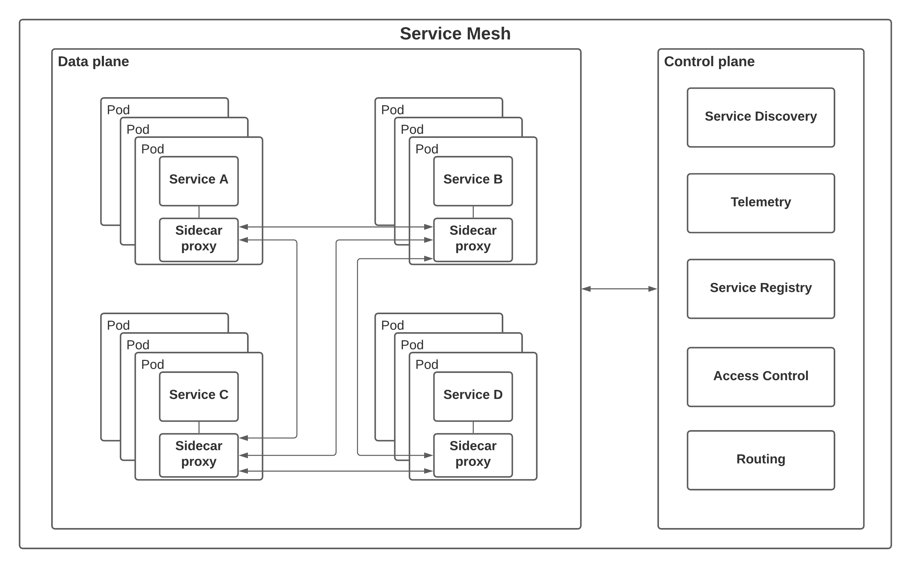
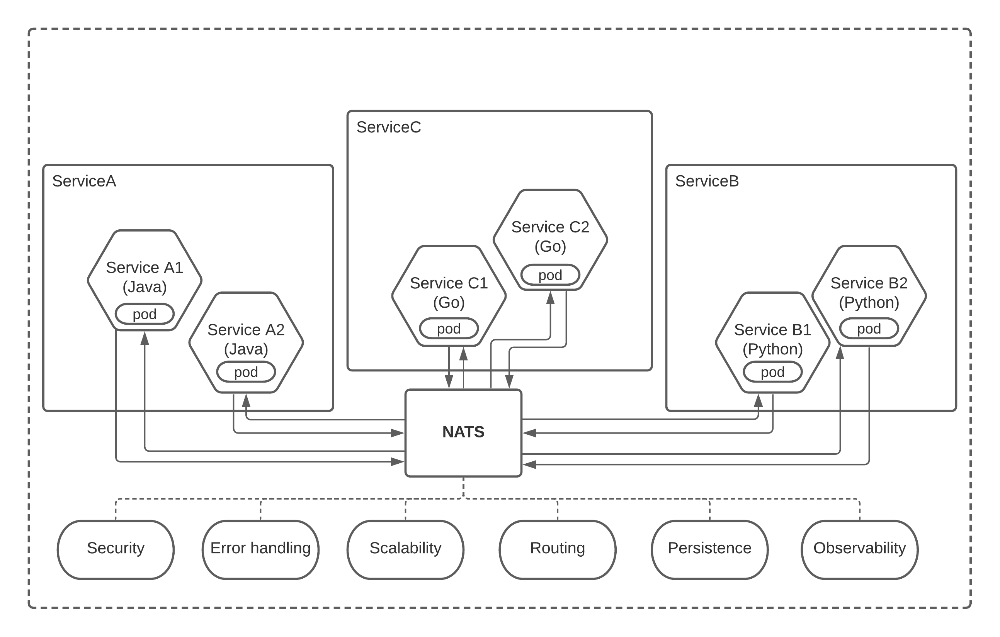

## Introduction
Microservices are becoming a commodity in the enterprise world. The reason being the agility and the modularity it brings to the software development and delivery process. It is not that difficult to getting started with the microservices since there are enough tools and frameworks available to bootstrap the microservices-based application development. But there is a point that most teams who adopt microservices find it challenging to deal with. That is when the number of microservices goes beyond a certain limit (let’s say 25 in some cases), people start realizing the real challenges that microservices architecture brings to the table. Some major challenges most teams face at this point are

- Inter-service communication (east-west traffic)
- Observability
- Failure handling

The popular solution to deal with these challenges is the Service Mesh. A service mesh is a technology that is used to help microservices communicate with each other in a centrally manageable manner without adding complexity to the microservices logic. It is capable of handling functions such as

- Routing
- Error handling
- Service Discovery
- Observability
- Load balancing
- Access Control (Security)

## What is a Service Mesh?
The figure below depicts the general architecture of a service mesh.

Figure: Service Mesh Architecture

The data plane takes care of the communication of messages from one service to another service while the control plane takes care of the supporting functionalities such as routing, access control, and service discovery.

It really looks like a promising solution to face the challenges of microservices architecture when the number of microservices goes beyond a certain limit. There is Istio Service Mesh which is backed by industry giants such as Google, IBM, Microsoft, and most people think that if those big guys are using it why shouldn’t we?

This was the trend for the last couple of years and the general consensus that we find in the industry is that there are more teams struggling to manage microservices with Service Meshes than who succeeded with it. Even Istio is making a lot of changes to its architecture and rethinking the ways to improve the service mesh technology.

## Microservices with first principles
Let’s take a step back and think about one of the first principles of the microservices architecture which is the idea of “Smart endpoints and dumb pipes”. Most people seem to forget this idea when designing microservices platforms. The practical meaning of this idea is that microservices can use an entity such as a message broker (dumb pipe) when communicating with each other (inter-service communication). If we expand this idea into the practical world, we can get rid of the Service Mesh and build a microservices architecture that is capable of handling the challenges we mentioned at the beginning.

Inter-Service communication can be implemented in an asynchronous manner using an event-based publish-subscribe model or a request-reply model. There are message brokers such as NATS that support both these models of communication.

Error handling is much easier since communication happens between the microservice and the message broker. We can use acknowledgments and various message guarantee levels such as exactly once, at least once and at-most-once to make sure that messages are properly delivered to the recipients. With the features such as persistent message storage, applications can replay lost messages without ever contacting the sender.

Observability can be implemented with the usage of UUIDs attached to the messages and using a centralized observability platform such as ELK stack or Prometheus, Grafana, and Loki stack.

## Microservices with NATS
The below figure depicts the architecture of using NATS as the inter-service communication mechanism to build a microservices-based platform.

Figure: Microservices Inter-Service Communication with NATS

The preceding figure introduces the NATS message broker in place of the service mesh for inter-service communication. It allows services to communicate with each other without worrying about the other services. The communication happens in a fully decoupled manner and services can process messages and respond to them according to their own interests. The NATS server is capable of providing the capabilities such as

- Security
- Error handling (via message guarantees and acks)
- Routing (via subject-based message communication)
- Scalability (via clustering)
- Performance (best-in-class performance)
- Observability (via logging and Prometheus agents)
- Load balancing (via queue-based messaging)

In fact, NATS provides the same set of capabilities (even more) as the service mesh without adding much complexity to the overall solution. It eases out the dependencies of services with each other and allows them to operate in a truly independent manner.

If you need to learn more on this topic and understand how to design and implement microservices-based enterprise platforms, you can read this book on the subject from the following links. It provides practical examples of how to design and implement a microservices-based platform with NATS.
[Designing Microservices Platforms with NATS](https://www.packtpub.com/product/designing-microservices-platforms-with-nats/9781801072212)
