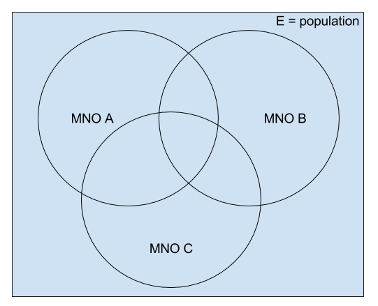
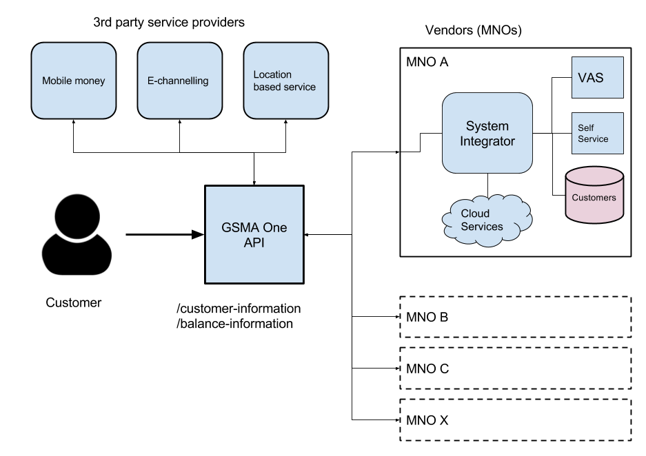
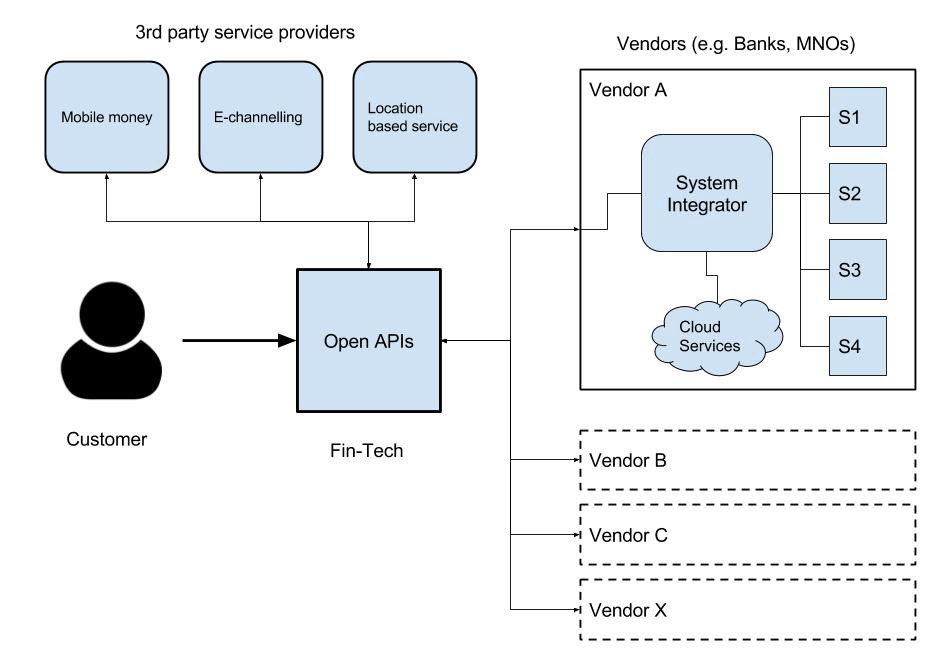

## Introduction
We know for a fact that there are more mobile phones than the world population right now (2020 March). But this does not mean that every person has a mobile phone. But it is almost every person who can handle a mobile phone will get it in the future. I will stop right here without going deep into mobile phones. But it is clear that mobile phones have been democratized so quickly even it has overtaken an essential need like electricity. Most of these mobile devices are in the category of “smart phones” where they have connectivity to the internet. 10 years back, a farmer living in a rural village in Dambulla, SriLanka may not have even dreamt about having such a device in their hand. But it happened in a way no one could predict. Mobile phones have been democratized across the globe. A company located in USA, Japan or Korea has acquired the market far away in east.

Every business organization wants to expand its business horizon to all parts of the globe. Apple CEO Tim Cook may be thrilled to see that iPhone is helping to change peoples lives in a far distant country like Lesotho. It is more or less the same ambition for Elon Musk, Jeff Bezos or Satya Nadella. They want to see their products and services expands too far distant limits so that they can change the human behaviour for the good (and make them profitable).

First of democratizing the digital transformation is already here. It happened within the last 10 years. Here 5 companies which lead this phase
- Uber
- AirBnB
- Amazon
- Alibaba
- Facebook

Uber made everyone a global passenger of the world’s largest taxi service which does not own a single taxi. It democratized the transportation industry (especially taxi services). There are so many localized companies coming up every day to copy the concept and helping the process.

AirBnb allowed travellers across the globe to fulfil their dreams without spending a lot of money on accommodation. It became the largest hospitality service company without owning any (relatively) real estate or hotel. It has democratized the travel and hospitality industry.

Likewise, Amazon and Alibaba democratized the way people do shopping and the process of buying and selling products online. Facebook built the largest media owner of the world without having any media or media personnel.

### What is Digital Transformation?
It is time for another revolution in human existence using technology. Specifically using the digital transformation. If you are in the technology industry, you may have heard of the term “Digital Transformation” along with the words like Micro Services Architecture (MSA), DevOps, Containers, Service Mesh, Artificial Intelligence, Analytics. These technical jargons shape up the next wave of the technology revolution.

Digital Transformation is a term heavily used in analyst’s reports recently. Based on a recent survey done by Gartner (2017 April), 42% of CEOs of different organizations have already started working on DT. This survey did not include tech giants like Amazon, Facebook, Google or Microsoft. It is all about companies which do not have a direct connection to technology products. The main intention of this post is to talk about the social impact of the digital transformation rather than the enterprise side of it.

Let’s talk about the political side of the story. Socialism is the best. But hardest to implement and persist. Democracy is good. Not much harder to implement. Super democracy (as we know it) is not that good. Let’s focus on the topic of “Democratizing the Digital Transformation” rather than day-to-day politics.

Democracy in layman’s terms is to offer everyone equal opportunities to prosper. Digital Transformation is a bit harder to describe in layman’s terms. But it can be defined as “Transforming your assets (products, services, customers, employees, etc) into a digitally accessible form”. As an example, If you are a shoe company, customers would be happy to go through the catalogue of shoes using a digital device like phone, tablet or PC before coming into the brick and mortar store and make the purchase.

That is Digital Transformation as we know it. But democratizing the DT requires some additional technological advancements and agreements between different competing organizations. Let’s take one industry and try to simplify the idea. Since I began the story with a mobile phone, let’s take the telecommunication industry. In most of the countries where mobile network operators (MNOs) operates in, there are more than one competing vendors. The looks of the subscribers (users) and the population can be depicted as in following the venn diagram.

Figure: Mobile subscribers and population

As depicted in the above figure, there are already people who are using multiple service providers (MNOs). But that is transparent from the operator. One of the main business trends in the telecom industry is the value-added services (VAS). But these services are limited only to the customer base which is owned by that particular MNO.

## How Telecom operators can expose OpenAPIs?

These telecom operators (MNOs) has tried to democratize the industry on their own but they failed. GSMA is the global body which is responsible for the governance of the MNOs across the globe. They came up with the idea of a standard set of APIs which can be used by different MNOs across the globe to expose and exchange information about their customers and provide value-added services across different operators.

Figure: Mobile operators expose OpenAPIs to consumers

As depicted in the above figure, once all the MNOs exposes their customer information with customer’s consent, individual operators can extend their value-added services to the customers who are using other mobile operators in an area where first operators coverage is not present. 

In addition to that, independent service providers (3rd parties) can build applications on top of these APIs and extend their services to new customer bases. The impact this kind of architecture can have on a normal person’s life can be immense. A farmer living in a developing country can use services like mobile banking or Ali express to buy and sell items through his mobile (which may or may not be a smartphone) phone. This is not a story anymore. This has already been realized in some parts of the world right now. It is only a matter of time until it comes to your doorstep.

The above mentioned use case showcases how to democratize the digital transformation within the telecommunication industry. The same concept can be applied to many other industries. Another frontrunner in this space is the financial industry.

## How financial industry is using OpenAPIs?

European union has recently released a regulation to all the banks operating in EU countries to expose their customer and payment information securely with customers consent through a standard set of APIs. This is known as Payment Services Directive 2 (PSD2). This is a scenario where democratizing of DT comes as a regulation. Financial institutes like Banks were bit curious at the beginning to adhere to this regulation. But after they understood the potential, they quickly moving towards the PSD2 compliance. This will allow the financial industry in the EU to reach new heights in their operations and customers will get more benefits.

Figure: Generic OpenAPI based DT Architecture

As depicted in the above figure, with the concept of Open APIs, different vendors can expose information about their customers with customers consent in a unified manner. Their internal implementations for providing these APIs can be different. But the APIs are unified. Using the Open APIs, third party service providers (e.g. online shopping, merchants, location based services, etc.) can engage with the customers when customers are purchasing their products or services.

Let’s take another example where you want to buy a laptop from Amazon.com and you need to make the payment using your existing bank account rather than a credit card. When you check out your item from Amazon.com, the web site will provide you with the option to select from which bank account you are going to make the payment. This is achieved through the Open API which has been used by all your banks to expose your account information. Now you select Bank A and you will be redirected to Bank As web site. Now you confirm the Bank A that you allow Amazon.com to debit the relevant amount for the product which you are purchasing from Amazon.com. That’s all. No credit card. No third party credit card providers.

The previous example showcases the power of Open APIs in a banking use case. But this is true for all sorts of different industries. GSMA one API is being used in different places across the globe for various use cases like mobile connect, mobile ID, etc. It has allowed people who didn’t have any facilities to connect with entities like Banks using their mobile phone. This has transformed their lives like never before.

## Summary
As a final thought, with the concept of Open APIs and Digital transformation, the world is becoming a more connected place than ever before. It allows people from different capacities (wealthy as well as poor) to reap the benefits of the digital age.

With these 2 practical examples of democratization of DT, the same concept can be extended to other industries such as Healthcare, Manufacturing, Retail, Governance, etc. This will allow people from different levels of society from different geographical locations to reap the benefits of the technology and specifically the Digital Transformation.
The more generalized form of the above architecture is mentioned below.

