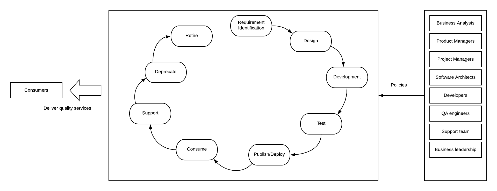
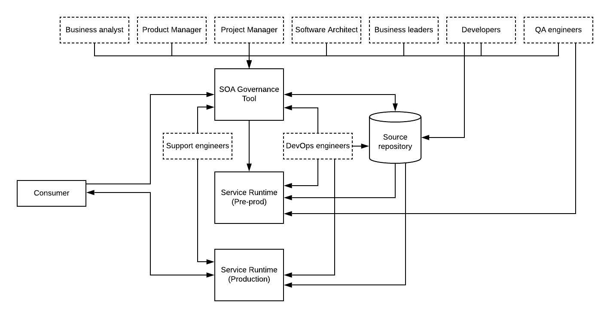
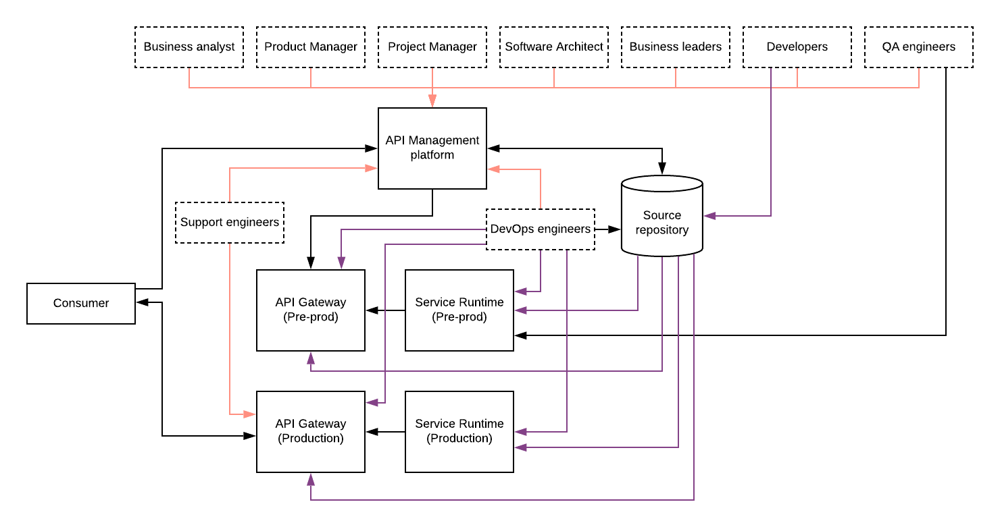
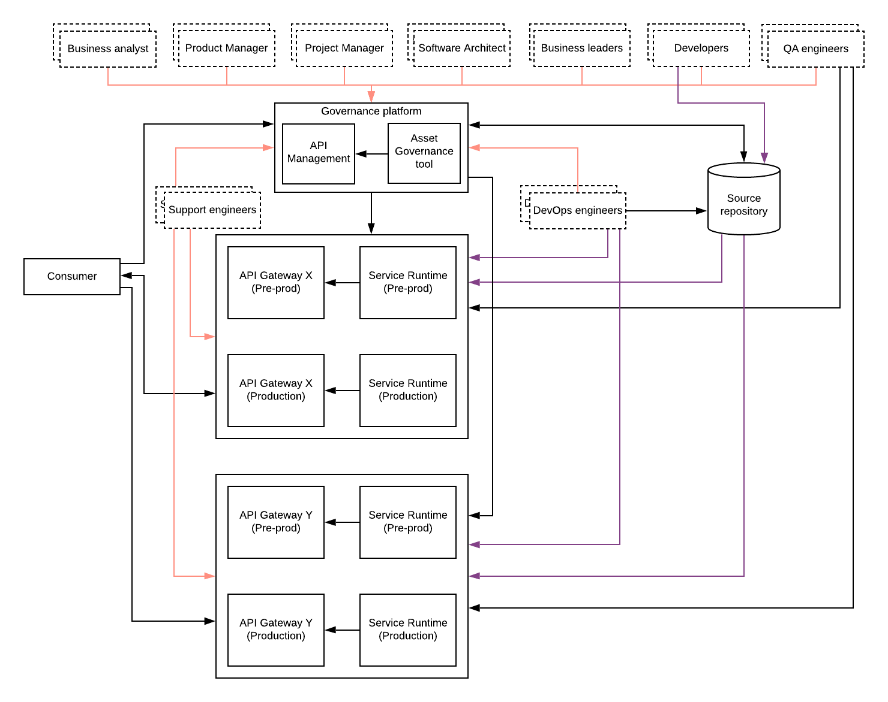

## Introduction
Service Oriented Architecture (SOA) is one of the foundational architecture styles that engineers used within enterprise software systems in the past and there are still a considerable amount of enterprises using it. As we all know, technology is an ever-evolving field like most of the other fields. Some people say that Microservices Architecture (MSA) is “SOA done right”. In my personal view, that statement is partially true. MSA has a way more to figure out in terms of management and governance of microservices. SOA governance was a complicated process and many enterprises have failed to apply that within their SOA projects. It required the entire IT teams to change the way they have been doing things pre-SOA era and in most cases, people were reluctant to accept those changes. All in all, the failure of the adoption of SOA governance was not entirely because it was not good for the enterprises, but it was complicated to implement and the IT generation of that time was not entirely ready for that level of governance and control. 

Things have changed a bit more now. IT teams are looking at putting more organization, governance, and security into their processes because IT services have become the customer-facing interface of every enterprise. It has pushed IT teams to take extra measures to make sure that delivering services is much more important than anything else within the enterprise. Because of this implicit push from the business to the technology to the people, SOA governance has become a hot topic again in 2020. Since most of the enterprises are moving towards APIs, microservices, serverless kind of services, traditional SOA governance models need a rethink when applying to these modern services. Having said that, still, there are a lot of things we can reuse and learn from the SOA governance model. 

## SOA Governance
If we go back 15 years from now, SOA was the hype within the enterprise software domain. Converting large monolithic applications to well-defined services that interact over a defined contract in the form of WSDL or WADL was the main task of many engineers who worked in the enterprise software domain. Most of these services were developed to expose certain business information (data) to internal applications or partners over standard interfaces like SOAP and/or REST. With the increased usage of the internet and the connection between systems, applications, and processes, the number of these services has increased. That is where the need for SOA governance emerged. Instead of developing ad-hoc services using non-standard approaches, enterprise architects wanted to enforce proper control over the entire lifecycle of a service. The various stages of the service lifecycle were identified and certain standards and policies were implemented at each stage to make sure that IT ecosystem runs smoothly at any given time regardless of the situation of the business. 

### Service lifecycle stages
- Requirement identification
- Design and Review
- Implementation
- Test
- Publish/Deploy
- Consume
- Support/Maintain
- Deprecate
- Retire

Above mentioned stages are the most common denominator of the lifecycle stages defined within SOA governance projects. There can be several other lifecycle stages defined in SOA governance projects as well. There has been a different set of people with different skill sets and experiences engaged at different stages of the process. The main stakeholders of this SOA governance process were

- Business analysts
- Product managers
- Software architects
- Developers
- QA engineers
- DevOps team
- Project managers
- Support engineers
- Consumers
- Business leaders

In most cases, some people played the role of multiple stakeholders mentioned above and in large corporations, we could find at least one from each category involved in the SOA projects. It was the responsibility of SOA governance to get all these stakeholders involved in the process of delivering quality software services and/or products to the consumers no matter what. 

Figure: SOA governance stakeholders and service lifecycle

As depicted in the above diagram, service lifecycle management via a set of policies by different stakeholders at different stages was the SOA governance in a nutshell. These policies defined access control, user management, process management, and various interactions of the users with the service lifecycle. 

Various software vendors started building SOA governance tools and most of the tools adhered to a solution architecture similar to the below diagram.

Figure: SOA governance solution architecture

Most of the services developed within enterprises were SOAP and REST-based services and they were deployed in runtimes such as web servers, enterprise services bus runtimes, and message broker solutions. As depicted in the above figure, the expected behavior of the platform was to use the SOA governance tool at the design time of the services and relevant stakeholders contribute to the service design and implementation via the same. Service implementation was done separately within a source control management system and managed by the DevOps team for deployment and publishing. Initially, these services were deployed to pre-production environments like Dev, QA, UAT, Test. Once it is done, the QA team is notified to carry out the testing and if the testing is passed, services will be deployed into the production servers by the DevOps team. The service consumers will use the SOA governance tool to discover the available services and then communicate with the service runtimes to consume the services. 

Initially, teams tried to build tools within themselves to keep track of various lifecycle stages, approval processes, policies, and processes with some tools like business process management (BPM) products. It worked to some extent but not worked in many cases. There have been several tools available in the market for SOA governance and most of those tools were too expensive and not easy to operate. With the introduction of new architectures and concepts like REST, Microservices, Containers, people started moving out of expensive SOA governance tools and looked for alternative solutions that can do the same job for a better price in a better way. 

## API Management
Then came the API evolution and people shifted their focus into APIs and management of APIs instead of working on SOA governance initiatives. One of the reasons for the higher rate of adoption for API management platforms was that some of the governance aspects were already built into the API management solutions. These platforms offered a superset of features when compared to the SOA governance tools. Instead of working on SOA governance tools, people started using the API facade pattern to hide the complexity of services governance by introducing APIs in front of those services as proxies and exposed those APIs via the built-in developer portals. In addition to that, lifecycle management capabilities and workflow engagement for state transitions and access management were available as out of the box features. 

Figure: API Management for SOA governance

As depicted in the above figure, API gateways were put in front of the service runtimes to expose all the HTTP based services to internal consumers as well as to a whole new set of consumers. In the meantime, SOA governance related functionality is handled by the “management layer” of the API platform. Most of the API management vendors have decoupled the gateway functionality from the management functionality so that relevant functionalities can be improved and maintained independently. In addition to that, this decoupled architecture has opened up certain possibilities like hybrid deployments as well as federated API gateways. 

Most of the API management tools support the governance of the APIs which are deployed at the gateway runtime which comes with the same vendor. In large corporations, different teams use different vendors based on the fit with other infrastructure and initiatives. Due to that, the need for a single API management layer that can support other API gateways is becoming the next level of the API governance. This is sometimes called as “API Federation” or “Bring Your Own Gateway” (BYOG). This requirement can be supported with a properly decoupled management and gateway components as well as a widely accepted standard for connecting from gateways to the management plane. 

Figure: Federated API management

The above figure is an extension to the previous figure where there is an additional API gateway component along with backend services that are introduced to the architecture. This can be expanded to support many gateways as long as the management plane has the ability to integrate with those gateways. Also, there are stakeholders from different teams are engaging with the management plane to carry out various governance functions. In most cases, the management plane isolates these different teams using technology like “multi-tenancy” so that teams cannot see and modify governance policies that are owned by other teams. 

## API Management with SOA Governance

Even though the API management platform has provided the same functionality that was expected from SOA governance to the APIs which were created as the front-facing interfaces, the same is not true for the backend services. Some people have migrated these backend REST/SOAP services into microservices and trying to find better tools to govern certain aspects like design, implementation, review through those tools. Some of the functionalities like deployment, testing have been automated through various CICD pipelines and hence the requirements for manual interactions at those activities are no longer there. 

One option to cater to this requirement is to support these backend services governance through the same API management plane which is used to govern the APIs which are deployed in gateways. This approach requires improved governance functionality at the management plane where different types of services (APIs, SOAP/REST, etc.) have different types of governance requirements. This is not an impossible thing to do and some of the existing API management platforms can be utilized for this functionality with some customizations. 

The other option is to find a modern governance tool that can support SOA governance while integrating with API governance (management) tools offered by the API management vendors. 

Figure: API Management with SOA governance

I have expanded the previous diagram with an addition of an asset governance tool along with the API Management component so that governance of APIs, services, and other assets can be done as one single platform called governance platform. From the user’s perspective, external users will access the API management platform (developer portal) in most cases. The asset governance tool will be mainly used by the internal tools to reuse the existing services when developing new services. In addition to that, this tool can have a link to the API developer portal so that internal users can also view the existing APIs from that tool itself. It can be as simple as a redirection or some integration where API metadata are exposed through the asset governance tool itself. 

## Final thoughts
With the modern advancements in the enterprise software domain, traditional SOA concepts are evolving into support the same. With the adoption of APIs and microservices, governance has become a major problem and the lessons learned from the SOA governance can be applied to build better solutions. In this article, we discussed the characteristics of SOA governance and how the focus has shifted towards API management and the real need for a complete governance platform to manage and maintain complex enterprise architectures with 1000s of services and APIs. 

