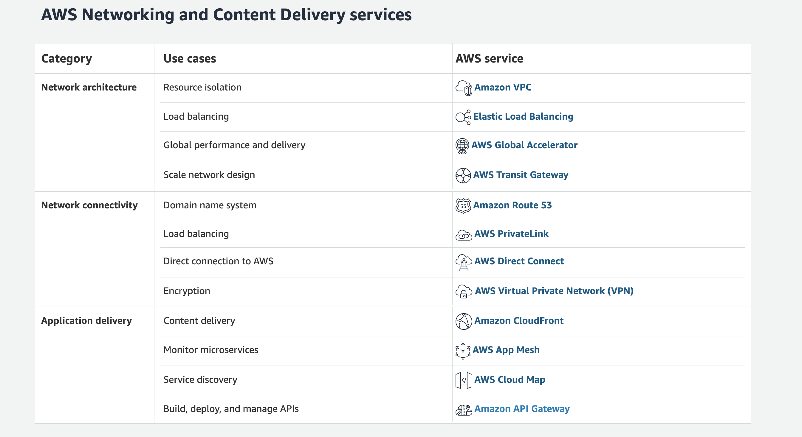

## Introduction
Amazon Web Services or AWS is the leading cloud services provider in the world. It was one of the early adopters of cloud evolution and reaping the benefits of the investments they made long before anyone think about it. AWS is the most versatile cloud services provider offering 100s of various cloud services for customers globally. Given the leadership position of AWS in the cloud market, it is highly likely that you are using some sort of AWS service within your organization. If you are an architect or an engineer who is currently dealing with the AWS services or planning on introducing some AWS services in the future, this post will help you to understand the “networking” services available in AWS.

## Networking services in AWS
According to the official AWS website, the networking services available in AWS can be categorized into 3 main areas depending on their usage. The below table (extracted from the official website) provides details about the services and their usage at a high level.

Source: https://aws.amazon.com/products/networking/

The above table categorizes the networking services into

- Network Architecture — The services used within the AWS to connect internal cloud services and expose those services to external consumers through the application delivery services
- Network Connectivity — These services are used to make connections from the AWS cloud to the user’s on-premise systems as well as VPCs within the cloud
- Application Delivery — These services are the delivery interface which front faces the consumers of cloud applications and services which are built by cloud users using the AWS services

## Networking services in a nutshell
AWS documentation has done a fantastic job of describing each and every service clearly. But there is a missing piece in the documentation which is that it does not have a single diagram that explains the overall architecture of these various services and how those services are interconnected. The below figure does just that.

Figure: AWS networking services in a nutshell

As depicted in the above figure, AWS offers various networking services within its cloud infrastructure to build and expose applications and services. There are 1000s of different customers use AWS cloud to build applications to offer their business services to their consumers. These organizations may bring their own data, systems, and users that they want to integrate with the AWS cloud. AWS networking services make these integrations possible.
Given below is a summary of each AWS networking service (which is extracted from the official AWS documentation).

### AWS Virtual Private Cloud (AWS VPC)
Amazon Virtual Private Cloud (Amazon VPC) lets you provision a logically isolated section of the AWS Cloud where you can launch AWS resources in a virtual network that you define. You have complete control over your virtual networking environment, including a selection of your own IP address range, creation of subnets, and configuration of route tables and network gateways. You can use both IPv4 and IPv6 in your VPC for secure and easy access to resources and applications

### AWS Elastic Load Balancing (AWS ELB)
Elastic Load Balancing automatically distributes incoming application traffic across multiple targets, such as Amazon EC2 instances, containers, IP addresses, and Lambda functions. It can handle the varying load of your application traffic in a single Availability Zone or across multiple Availability Zones. Elastic Load Balancing offers three types of load balancers that all feature the high availability, automatic scaling, and robust security necessary to make your applications fault-tolerant.

### AWS Global Accelerator
AWS Global Accelerator is a service that improves the availability and performance of your applications with local or global users. It provides static IP addresses that act as a fixed entry point to your application endpoints in a single or multiple AWS Regions, such as your Application Load Balancers, Network Load Balancers or Amazon EC2 instances.
AWS Global Accelerator uses the AWS global network to optimize the path from your users to your applications, improving the performance of your TCP and UDP traffic. AWS Global Accelerator continually monitors the health of your application endpoints and redirects traffic to healthy endpoints in less than 30 seconds.

### AWS Transit Gateway
AWS Transit Gateway is a service that enables customers to connect their Amazon Virtual Private Clouds (VPCs) and their on-premises networks to a single gateway. As you grow the number of workloads running on AWS, you need to be able to scale your networks across multiple accounts and Amazon VPCs to keep up with the growth. Today, you can connect pairs of Amazon VPCs using peering. However, managing point-to-point connectivity across many Amazon VPCs, without the ability to centrally manage the connectivity policies, can be operationally costly and cumbersome. For on-premises connectivity, you need to attach your AWS VPN to each individual Amazon VPC. This solution can be time consuming to build and hard to manage when the number of VPCs grows into the hundreds.

### Amazon Route53
Amazon Route 53 is a highly available and scalable cloud Domain Name System (DNS) web service. It is designed to give developers and businesses an extremely reliable and cost effective way to route end users to Internet applications by translating names like www.example.com into the numeric IP addresses like 192.0.2.1 that computers use to connect to each other. Amazon Route 53 is fully compliant with IPv6 as well.

### AWS Private Link
AWS PrivateLink simplifies the security of data shared with cloud-based applications by eliminating the exposure of data to the public Internet. AWS PrivateLink provides private connectivity between VPCs, AWS services, and on-premises applications, securely on the Amazon network. AWS PrivateLink makes it easy to connect services across different accounts and VPCs to significantly simplify the network architecture.

### AWS Direct Connect
AWS Direct Connect is a cloud service solution that makes it easy to establish a dedicated network connection from your premises to AWS. Using AWS Direct Connect, you can establish private connectivity between AWS and your datacenter, office, or colocation environment, which in many cases can reduce your network costs, increase bandwidth throughput, and provide a more consistent network experience than Internet-based connections.

### AWS Virtual Private Network (AWS VPN)
AWS Virtual Private Network (AWS VPN) lets you establish a secure and private encrypted tunnel from your network or device to the AWS global network. AWS VPN is comprised of two services: AWS Site-to-Site VPN and AWS Client VPN.
AWS Site-to-Site VPN enables you to securely connect your on-premises network or branch office site to your Amazon Virtual Private Cloud (Amazon VPC). AWS Client VPN enables you to securely connect users to AWS or on-premises networks. AWS Client VPN includes a free client-side application, which provides access to AWS services from remote networks.

### Amazon CloudFront
Amazon CloudFront is a fast content delivery network (CDN) service that securely delivers data, videos, applications, and APIs to customers globally with low latency, high transfer speeds, all within a developer-friendly environment. CloudFront is integrated with AWS — both physical locations that are directly connected to the AWS global infrastructure, as well as other AWS services. CloudFront works seamlessly with services including AWS Shield for DDoS mitigation, Amazon S3, Elastic Load Balancing or Amazon EC2 as origins for your applications, and Lambda@Edge to run custom code closer to customers’ users and to customize the user experience. Lastly, if you use AWS origins such as Amazon S3, Amazon EC2 or Elastic Load Balancing, you don’t pay for any data transferred between these services and CloudFront.

### AWS App Mesh
AWS App Mesh is a service mesh that provides application-level networking to make it easy for your services to communicate with each other across multiple types of compute infrastructure. App Mesh standardizes how your services communicate, giving you end-to-end visibility and ensuring high-availability for your applications.
Modern applications are typically composed of multiple services. Each service may be built using multiple types of compute infrastructure such as Amazon EC2 and AWS Fargate. As the number of services grow within an application, it becomes difficult to pinpoint the exact location of errors, re-route traffic after failures, and safely deploy code changes. Previously, this has required you to build monitoring and control logic directly into your code and redeploy your service every time there are changes.

### AWS Cloud Map
AWS Cloud Map is a cloud resource discovery service. With Cloud Map, you can define custom names for your application resources, and it maintains the updated location of these dynamically changing resources. This increases your application availability because your web service always discovers the most up-to-date locations of its resources.
Modern applications are typically composed of multiple services that are accessible over an API and perform a specific function. Each service interacts with a variety of other resources, such as databases, queues, object stores, and customer-defined microservices, and it needs to be able to find the location of all the infrastructure resources on which it depends in order to function. In most cases, you manage all these resource names and their locations manually within the application code. However, manual resource management becomes time consuming and error-prone as the number of dependent infrastructure resources increases or the number of microservices dynamically scale up and down based on traffic. You can also use third-party service discovery products, but this requires installing and managing additional software and infrastructure.
