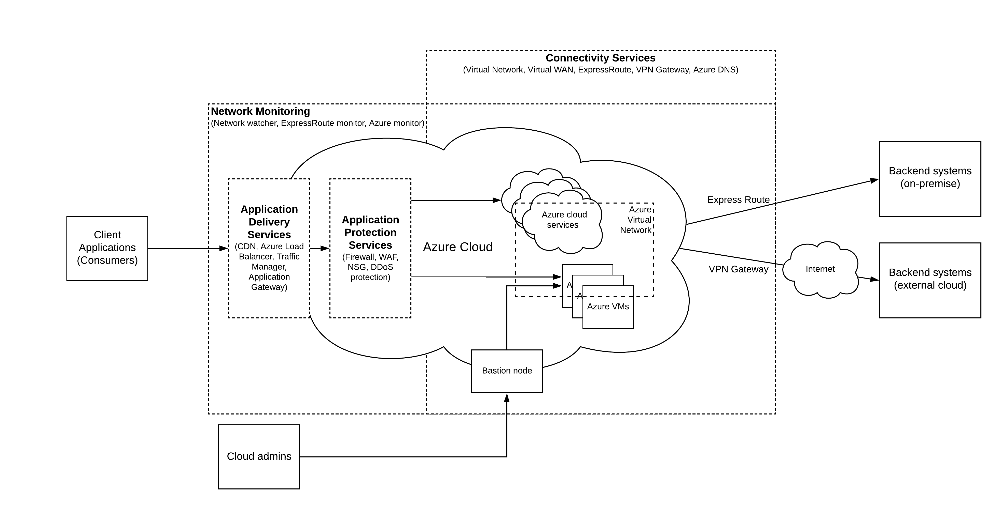

## Introduction
Microsoft Azure is one of the up and coming cloud service providers that can be used to host your applications in the cloud. It has various cloud services which can be categorized as
- IaaS — Infrastructure as a Service (Azure VMs, AKS)
- PaaS — Platform as a Service (Azure logic apps, Azure Service Bus, Xamarin)
- SaaS — Software as a Service (Office365, Dynamics365, Outlook)
- FaaS — Function as a Service (Azure Functions)
Regardless of what type of service you are going to utilize in the Azure cloud, you need to understand the networking model of the Azure to better utilize these services. This article discusses the various networking services available in Azure in a nutshell.

## Azure networking services
The users of the Azure cloud can utilize various network services available in azure to deliver the best experience to the consumers of their respective business applications and services. These network services can be divided into 4 main categories.

- Application delivery services — These are the services on the edge of the network which delivers the consumable services to end-users of the organizations who are using the Azure cloud to serve their customers
- Application protection services — Application security is one of the utmost critical aspects of the cloud. These services protect the applications and services from all kinds of threats coming from malicious users
- Connectivity services — Even though we consider cloud as a single entity, it consists of multiple disparate systems and applications which need to be interconnected. These connectivity services allow the cloud to build internal connectivity as well as external connectivity to and from the cloud infrastructure.
- Network monitoring — In a distributed network, anything can fail. It is quite critical to monitor various points of the cloud infrastructure to debug the issues that can happen more often than not. Network monitoring services allow cloud users to monitor various services and take necessary actions on failures.

Depending on the place within the data path in which these services are applied, I have come up with the below figure which puts all these services into a single diagram as a nutshell representation of Azure cloud networking services.

Figure: Azure networking services in a nutshell

As depicted in the above figure, azure networking services cover the full spectrum of connectivity between services spanning from service delivery, application security, intra/inter networking to the monitoring of the services. These services can be further detailed into the following services.

### Application Delivery Services
User experience is critical when using cloud services since these resources are hosted all over the internet. These services make sure that applications are delivered to consumers with better performance without any jitter.

- Content Delivery Network (CDN) — Delivers high-bandwidth content to users. CDNs store cached content on edge servers in point-of-presence (POP) locations that are close to end users, to minimize latency
- Azure Front Door — Enables you to define, manage, and monitor the global routing for your web traffic by optimizing for best performance and instant global failover for high availability
- Traffic Manager — Distributes traffic based on DNS to services across global Azure regions, while providing high availability and responsiveness
- Load Balancer — Provides regional load-balancing by routing traffic across availability zones and into your VNets. Provides internal load-balancing by routing traffic across and between your resources to build your regional application
- Application Gateway — Azure Application Gateway is a web traffic load balancer that enables you to manage traffic to your web applications

### Application Protection Services
These services provide the necessary infrastructure for securing the applications and services hosted in the cloud.

- DDoS protection — High availability for your applications with protection from excess IP traffic charges
Web Application Firewall (WAF) — Azure WAF with Application Gateway provides regional protection to entities in public and private address space. Azure WAF with Front Door provides protection at the network edge to public endpoints.
- Azure Firewall — Azure Firewall is a managed, cloud-based network security service that protects your Azure Virtual Network resources. It’s a fully stateful firewall as a service with built-in high availability and unrestricted cloud scalability
- Network Security Groups (NSG) — Full granular distributed end node control at VM/subnet for all network traffic flows
- Virtual network service endpoints — Enables you to limit network access to some Azure service resources to a virtual network subnet

### Connectivity services
These are the services that are used to build the connectivity between components within the cloud as well as outside the cloud.

- Virtual network — Enables Azure resources to securely communicate with each other, the internet, and on-premises networks.
- Express Route — Extends your on-premises networks into the Microsoft cloud over a private connection facilitated by a connectivity provider
- VPN Gateway — Sends encrypted traffic between an Azure virtual network and an on-premises location over the public Internet.
- Virtual WAN — Optimizes and automates branch connectivity to, and through, Azure. Azure regions serve as hubs that you can choose to connect your branches to.
- Azure DNS — Hosts DNS domains that provide name resolution by using Microsoft Azure infrastructure.
- Azure Bastion — Configure secure and seamless RDP/SSH connectivity to your virtual machines directly in the Azure portal over SSL. When you connect via Azure Bastion, your virtual machines do not need a public IP address

### Network Monitoring
In the cloud, failure is inevitable and you should take necessary steps to monitor the failures and recover immediately. These services allow cloud users to monitor their applications and services.

- Network Watcher — Helps monitor and troubleshoot connectivity issues, helps diagnose VPN, NSG, and routing issues, capture packets on your VM, automates triggering diagnostics tools using Azure Functions and Logic Apps
- ExpressRoute Monitor — Provides real-time monitoring of network performance, availability, and utilization helps with auto-discovery of network topology, provides faster fault isolation, detects transient network issues, helps analyze historical network performance characteristics, supports multi-subscription
- Azure Monitor — Helps you understand how your applications are performing and proactively identifies issues affecting them and the resources they depend on
- Virtual Network TAP — Provides continuous streaming of virtual machine network traffic to packet collector, enables network and application performance management solutions and security analytics tools

#### References :
https://docs.microsoft.com/en-us/azure/networking/networking-overview
