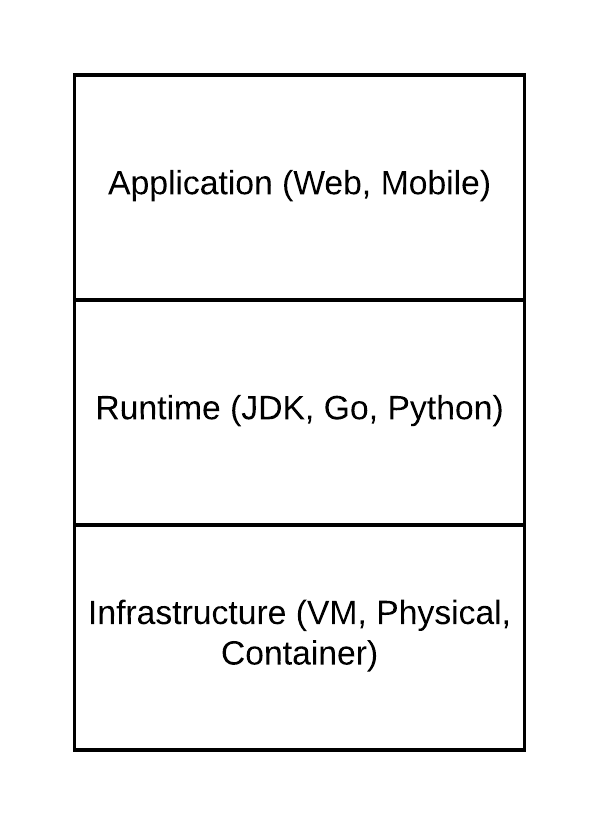
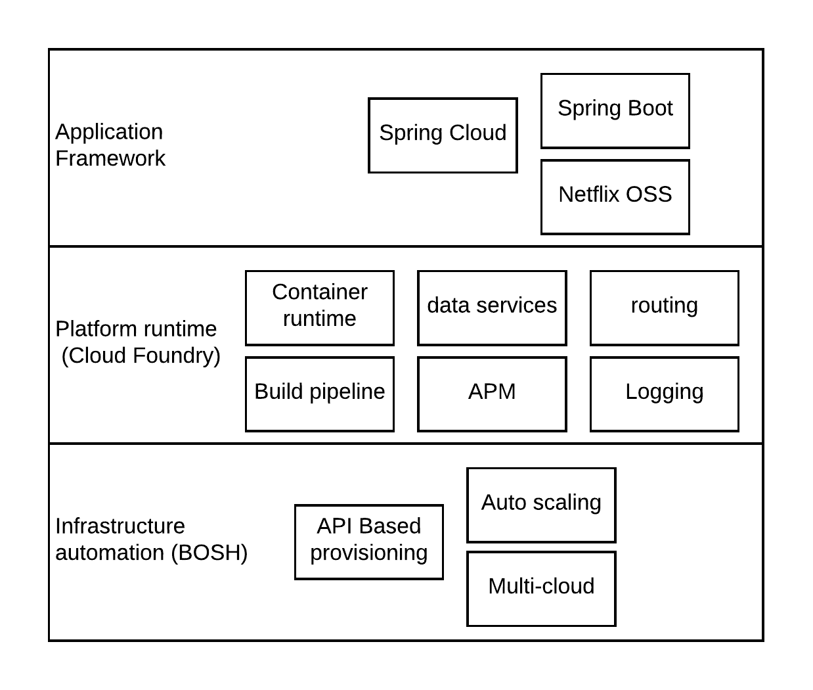
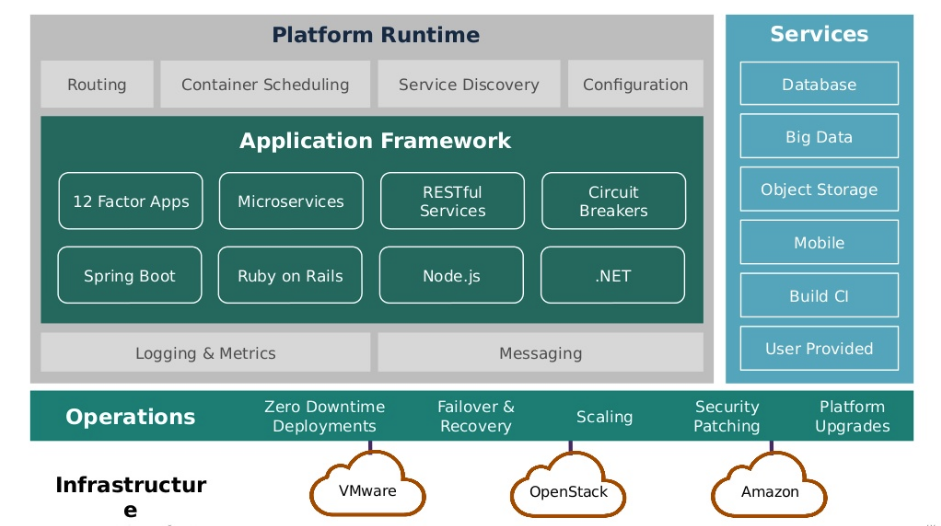
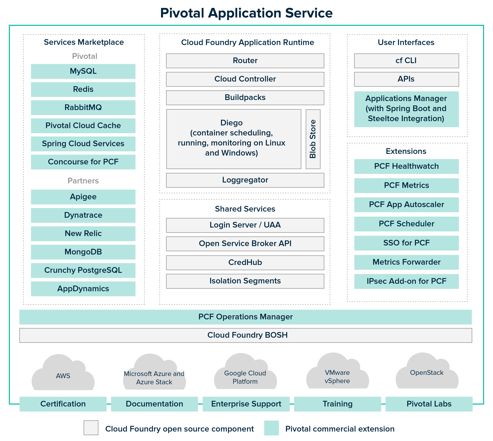

## Pivotal Cloud Foundry Introduction

### Introduction

Enterprises are moving towards a more smooth running IT operations where the maintenance and the management of IT resources are in auto-pilot mode. Mega cloud providers like Amazon, Google, Microsfot and IBM are taking the advantages of this mindset of enterprise architects at a higher cost. These mega clouds has strategies where customers will lock-in to a certain set of technologies and runtimes which will hinder the agility of the overall solutions architecture of your enterprise. Here are some of the drawbacks or challenges with adopting a mega cloud

- Vendor locking
- Lack of visibility and control
- Hidden prices and strategies to increase your cost with the time 
- Sometimes unpredictable performance
- Harder to debug

Because of these challenges, people started to step back and looking for a better alternative to deliver your digital experiences to the customers in a more agile, user friendly manner. One of the popular alternatives to some of the above mentioned challenges is the multi-cloud approach where, using multiple cloud service providers to get the best of all clouds. This approach will address some of the concerns mentioned above. But it will become more and more complex when it comes to maintain. Few drawbacks of multi-cloud approach are

- Lack of knowledgeable resources who understands all clouds
- Latencies can be increased when communicating across clouds
- Differeneces in user management, resource management can increase the complexity of the overall maintenance

Does that mean cloud is not something we should adhere to? This is where the concept of a private cloud comes into the picture. Most of the time, private cloud is identified as a platform as a service (PaaS) which is running for you. It need not to be a dedicated deployment for you. This is an additional functional layer which sits on top of IaaS layer and control the overall operations within an IT team. 

Cloud Foundry is an open source initiave which defines a “Platform as a Service” stack which is independent of any cloud provider. Pivotal has utilized this open source framework and built their own layer of capabilities to the open source version as Pivotal Cloud Foundry (PCF). 

### Architecture

The day-to-day IT operations belongs to 3 types of workloads. Those are
- Applications
- Runtimes
- Infrastructure

Applications contains the business logic of a give service and the runtime defines the technology stack which is used to develop that application. Based on the application domain, a developer can select the best runtime (polyglot programming). Once the application and the runtime is fixed into an artefact as a VM, container image or binary, these needs to be run on top of a computing infrastrutre which is abstracted away by an operating system. 

 

Figure 1: Enterprise application workload seggregation

As depicted in the above figure, understanding an enterprise application in the above mentioned 3 aspects allows us to define the processes to manage and maintain each and every aspect independently. That is exactly what Pivotal Cloud Foundry has done with their architecture. They have built a platform with frameworks which can help developers to utilize and automate their development at each layer so that application development becomes a one end-to-end process with well defined set of connected operations. As an example, developer can develop their application with a seletec technology and push that to the PCF platform and from that point onwards, PCF will take care of the rest of the testing, deployment and monitoring of the application. 

Figure 2: Pivotal Cloud Foundry High level architecture

At a very high level (33,000 feet), PCF contains the following 3 main components.

- Application framework - This is where application developers can utilize the available frameworks within the PCF platform to develop their applications. It provides various different frameworks and application runtimes for polyglot types of application development
- Platform runtime - This is the component which provides supportive capabilities to run your application in a distributed environment. Capabilities like routing, data services, monitoring, logging and infrastructure automation are provided at this layer
- Infrastructure automation - This is the component responsible for actual provisioning of computing resources by utilizing the underlying infrastrucutre on top which PCF is running or connected to. 

Let’s take a bit deeper look into the Pivotal Cloud Foundry. 

Figure 3: Pivotal Cloud Foundry - detailed look (Source: https://www.slideshare.net/Pivotal/t3-pivotal-cloud-foundry-a-technical-overview)

As depicted in the above figure 3, the PCF platform can be divided into 3 main functional components. 

- Cloud native application framework - The application framework contains the cloud native application runtimes to implement all sorts of enterprise grade applications. The application developer does not need to worry about bundling these runtimes into their applications since those frameworks are provided from the framework itself. Application developers can use different styles like 12 factor apps, microservices, REST services as well as different programming languages like Javascript, Java, Ruby, C# .Net, etc. 

- Cloud native platform runtime - Once these applications are put into work, they cannot live in isolation. These applications needs to be discovered, scaled, monitored, connect with other services, etc. All these supportive services are provided through the platform runtime. There are a set of services which will be utilized by the applications as well as platform runtime. 

- Cloud native infrastructure automation - Running applications has been isolated from the application developers in the past. But with the automated CI/CD pipelines, infrastructure as code concepts, application developer cannot throw his application over the boundary to the devops engineer to run it for you. Rather, application developers are responsible end-to-end from developement to production. With the pivotal’s platform, developers can achieve 
-- zero downtime deployments
-- failover and recovery
-- platform upgrades
-- security patching
seamlessly.

### Why Pivotal Cloud Foundry?
Cloud Foundry(CF) is an open source project which is trying to build a vendor neutral, cloud native Platform as a Service (PaaS) framework and it has already achieved the goal to some extent. So what is special about Pivotal version of the Cloud Foundry? 

Pivotal has been able to add a value chain on top of the standard CF framework with leading open source software technologies. Some of them are developed and contributed by Pivotal and others are independent vendors. The below figure highlights the difference between the standard CF and PCF. 

Figure 4: PCF vs CF (source: https://docs.pivotal.io/pivotalcf/2-6/concepts/overview.html)

As depicted in the above figure 4, Pivotal has added many additional components which becomes really handy when implementing enterprise level software. The services offerred through pivotal as well as through the partner network allows application developers to make their software enterprise grade with caching, monitoring, security. Additionally, pivotal also provides documentation, training, consultancy, certification to the users who are willing to utlize the PCF platform. 

At the end of the day, what pivotal is trying to build is an efficient software delivery pipeline which can be deployed on-premise or cloud which increased the agility, quality and the experience of the developers as well as consumers. There was an analogy somewhere in the internet which compared kubernetes with PCF.

“If K8S is google, PCF is apple ”. 
