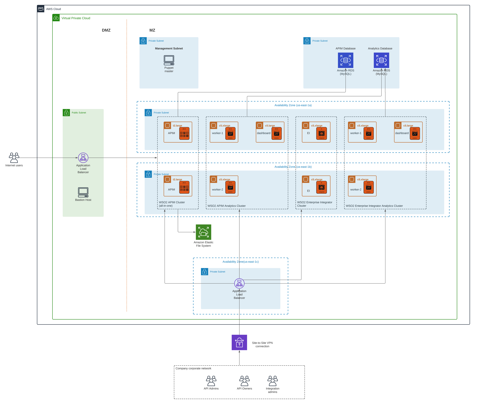

## Introduction
WSO2 is an open-source, enterprise middleware platform that offers software products for API Management, Integration and Identity, and Access Management. WSO2 products can be deployed on infrastructure platforms such as

- On-premise physical hardware
- Virtual machines
- Infrastructure as a Service (IaaS) platforms such as
    - AWS
    - Azure
    - GCP

In addition to these customer-managed infrastructure platforms, WSO2 also has a fully managed cloud version of the products as Software as a Service (SaaS) offering. Having said that, AWS is still the most popular and comprehensive cloud infrastructure for deploying applications on the cloud. Hence we will be discussing how to deploy the WSO2 platform on top of the AWS infrastructure.

## Amazon Web Services (AWS) Concepts
Before moving on to the actual deployment details, let’s discuss some of the concepts of AWS that we will be using for the deployment architecture. AWS provides a plethora of services for application development and deployment. For this article, we will be using the below-mentioned services.

### EC2 (Elastic Computing Cloud)
Amazon EC2 is a cloud service that provides secure, resizable compute capacity in the cloud. It is designed to make web-scale cloud computing easier for applications. It provides a comprehensive computing environment with a choice of processor, storage, networking, operating system, and purchasing model. It offers computing resources available from a variety of geographical locations across the globe using its regions and zones. It also provides automatic scalability of computing resources within minutes.

### VPC (Virtual Private Cloud)
Amazon VPC is a service that lets users launch AWS resources in a logically isolated virtual network that the user defines. User has complete control over the networking environment including the selection of IP address range, creation of subnets, and configuration of route tables and network gateways. It allows users to create a public-facing subnet for the web servers which are directly accessed by the end-users. At the same time, it also allows creating private subnets to host backend systems, such as databases and application servers. It let you use multiple layers of security, including security groups and network access control lists, to help control access to computing resources in each subnet.

### Regions and Availability Zones (AZs)
AWS is a global cloud infrastructure that offers over 200 fully-featured services from data centers globally. Whether users need to deploy their application workloads across the globe in a single click, or they want to build and deploy applications closer to the end-users with single-digit millisecond latency, AWS provides the cloud infrastructure where and when they need it.

#### Regions
An AWS Region is a physical location somewhere in the world where there is a cluster (set) of data centers. A group of logical data centers is called an Availability Zone (AZ). Each region consists of multiple, isolated, and physically separate AZ’s within a geographic area. AWS maintains multiple geographic regions, including
- North America
- South America
- Europe
- China
- Asia Pacific
- South Africa
- Middle East
AWS opens new regions rapidly based on user demand.

#### Availability Zone (AZ)
An AZ is one or more discrete data centers with redundant power, networking, and connectivity in an AWS region. AZs give customers the ability to operate production applications and databases that are highly available, fault-tolerant, and scalable than would be possible from a single data center. All AZs in an AWS region are interconnected with high-bandwidth, low-latency networking over fully redundant, dedicated metro fiber. All traffic between AZs is encrypted.

### RDS (Relational Database Service)
Amazon RDS makes it easy to set up, operate, and scale a relational database in the cloud. It provides cost-effective and scalable capacity while automating time-consuming tasks such as hardware provisioning, database setup, patching, and backups. It is available on several database instance types including
- MySQL
- SQL Server
- Oracle
- MariaDB
- PostgreSQL
- Amazon Aurora

Out of the above database types, Amazon Aurora is a proprietary AWS database which is a MySQL and PostgreSQL compatible database built for the cloud that combines the performance and availability of traditional enterprise databases with the simplicity and cost-effectiveness of open source databases.

### EFS (Elastic File System)
Amazon EFS provides a simple, serverless, elastic file system that lets users share file data without provisioning or managing storage. It can be used with AWS cloud services and on-premises resources and is built to scale on-demand to petabytes without disrupting applications. It provides elasticity by allowing users to grow and shrink the file systems automatically as the user adds and removes files, eliminating the need for overprovision. It offers to create the file system using one of the following storage classes.
- Standard — store data within and across multiple availability zones
- One Zone — store data redundantly within a single zone (AZ)

### ELB (Elastic Load Balancing)
Amazon ELB automatically distributes incoming application traffic across multiple targets, such as EC2 instances, containers, IP addresses, Lambda functions, and virtual appliances. It can handle the varying load of the application traffic in a single AZ or multiple AZs. AWS provides 4 different types of ELBs for different use cases.

#### Application Load Balancer (ALB)
Operates at the application level (layer 7), routing traffic to targets such as EC2 instances, containers, IP addresses, and Lambda functions based on the content of the request. Ideal for advanced load balancing of HTTP and HTTPS traffic, ALB provides advanced request routing targeted at the delivery of modern application architectures, including microservices and container-based applications.

#### Network Load Balancer
Operates at the connection level (layer 4), routing connections to targets within VPC, based on IP protocol data. Best suited for load balancing of both TCP and UDP traffic, it is capable of handling millions of requests per second while maintaining ultra-low latency.

## WSO2 Deployment Reference Architecture
As per this article, we will be deploying WSO2 API Manager and WSO2 Enterprise Integrator along with the respective Analytics components on AWS infrastructure. Each product and component is deployed with the minimum high availability.

- WSO2 API Manager is deployed as the all-in-one mode with 2 instances
- WSO2 Enterprise Integrator (EI) is deployed as the micro integrator profile mode with 2 instances
- WSO2 API Manager and EI Analytics is deployed as 2 separate clusters of
    - 2 worker nodes (active/passive)
    - 1 dashboard nodes (active)

In addition to the WSO2 products, we will be utilizing the following AWS services

- Amazon RDS for API management database as well as Analytics database with MySQL
- Amazon EFS for sharing files across APIM nodes with Standard class of service
- Amazon ALB for balancing the load across APIM nodes and EI nodes
- Bastion Host is used to providing access to the private subnet from the public subnet for managing the deployment on EC2
- Puppet is used for managing the deployment of servers via automation for updates and upgrades

The preceding figure depicts the deployment architecture of WSO2 APIM, EI, and Analytics on the AWS platform. The deployment is designed so that it is deployed within a single AWS region (North America) across 3 different AZs
- us-east-1a
- us-east-1b
- us-east-1c

There are private subnets created for each availability zone. In addition to these, there are private subnets created for databases and deployment management tools (puppet).
A public subnet is created to host ALB that exposes the WSO2 API Manager gateway for external consumers. If required, the developer portal can also be exposed through the same ALB. In addition to that, there will be a bastion host running on the same subnet which provides the access to the Linux servers that are running on EC2 instances within the private subnets.

### WSO2 API Manager deployment
Two instances of WSO2 APIM are deployed for high availability and each instance is running on a separate AZ. For the deployment, the EC2 instance of type t2.large is used. This can be different based on the capacity requirements of the use case. The API gateway and the developer portal URLs are exposed through the ALB which is deployed in the public subnet (DMZ). In addition to that, other administrative interfaces such as publisher, carbon, and admin portals are exposed through a separate ALB which is deployed in a private subnet within a different AZ. This ALB is accessed by the internal organization staff members who manage the deployment via a VPN connection. For sharing the API definitions and throttling policies across APIM instances, Amazon EFS-based file system is utilized by the APIM deployment.

### WSO2 Enterprise Integrator deployment
Two instances of WSO2 EI are deployed for high availability and each instance is running on a separate AZ. For the deployment, the EC2 instance of type c5.xlarge is used. This can be different based on the capacity requirements of the use case. The carbon portal is exposed through a separate ALB which is deployed in a private subnet within a different AZ. The services that are running on WSO2 EI will be exposed to the API Manager and other systems via ALB which is running on a separate private subnet. This ALB is accessed by the internal organization staff members who manage the deployment via a VPN connection. If there is a need to connect with on-premise systems such as databases, ERP, CRM from WSO2 EI, the same VPN connection can be utilized.

### WSO2 API Manager/EI Analytics deployment
The analytics component comes with 2 profiles called worker and dashboard. Worker profile receives the analytics events from gateways (APIM) and do the real-time processing of data and store the results in the analytics database. Then the dashboard profile reads the processed data from the database and visualizes it in dashboards. The worker requires 2 nodes of active/passive deployment for high availability and those are deployed in 2 separate AZs. The dashboard profile is okay to deploy as a single instance given the lower importance of the tool. All 3 nodes are connected to the database that is running on the same VPC but in a different private subnet. The analytics dashboard is exposed through the ALB which is running on the private subnet. It is accessed by organizational users via a VPN connection. EC2 instance type of c5.xlarge is used for workers since it does heavy data processing as and when events are received from the gateways. A c5.large EC2 instance is used for the dashboard profile since it does not have heavy processing requirements.

In addition to the AWS services mentioned so far, users can utilize the tools provided by AWS for requirements such as
- Log and performance monitoring
- Network-level security (Web Application Firewall)
