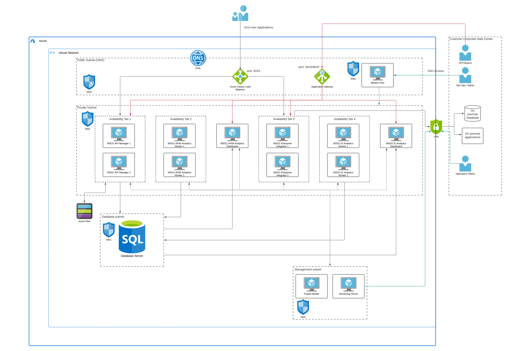

## Introduction
WSO2 is an open-source, enterprise middleware platform that offers software products for API Management, Integration and Identity, and Access Management. WSO2 products can be deployed on infrastructure platforms such as
- On-premise physical hardware
- Virtual machines
- Infrastructure as a Service (IaaS) platforms such as
    - Azure
    - AWS
    - GCP
In addition to these customer-managed infrastructure platforms, WSO2 also has a fully managed cloud version of the products as Software as a Service (SaaS) offering. Having said that, Azure is one of the upcoming cloud infrastructure platforms for deploying applications on the cloud. Hence we will be discussing how to deploy the WSO2 platform on top of the Azure. 

## Microsoft Azure Concepts
Before moving on to the actual deployment details, let’s discuss some of the concepts of Azure that we will be using for the deployment architecture. Azure provides a plethora of services for application development and deployment. For this article, we will be using the below-mentioned services. 

### Virtual Machines
Azure Virtual Machines provides secure, resizable compute capacity in the cloud. It is designed to make web-scale cloud computing easier for applications. It provides a comprehensive computing environment with a choice of processor, storage, networking, operating system, and purchasing model. It offers computing resources available from a variety of geographical locations across the globe using its regions and zones. It also provides automatic scalability of computing resources within minutes. 

### Regions and Availability Zones (AZs)
Microsoft Azure services are available globally to drive business applications at an optimal level. Users can choose the best region based on their needs based on
- Regulatory considerations
- Service requirements (performance, latency)
- Data residency
- Compliance requirements
Regions and AZs allow users to utilize the cloud platform in the best possible way for their applications.

#### Regions
A region is a set of datacenters deployed within a latency-defined perimeter and connected through a dedicated regional low-latency network. Azure gives you the flexibility to deploy applications where you need to, including across multiple regions to deliver cross-region resiliency.  Azure maintains multiple geographic regions, including
- Americas
- Europe
- Africa
- Asia Pacific
Azure opens new regions rapidly based on user demand. 

#### Availability Zone (AZ)
An Availability Zone is a high-availability offering that protects your applications and data from datacenter failures. Availability Zones are unique physical locations within an Azure region. Each zone is made up of one or more datacenters equipped with independent power, cooling, and networking. To ensure resiliency, there's a minimum of three separate zones in all enabled regions. The physical separation of Availability Zones within a region protects applications and data from datacenter failures. Zone-redundant services replicate your applications and data across Availability Zones to protect from single-points-of-failure. With Availability Zones, Azure offers industry best 99.99% VM uptime SLA.

### Availability Set
An availability set is a logical grouping of VMs that allows Azure to understand how your application is built to provide for redundancy and availability. We recommended that two or more VMs are created within an availability set to provide for a highly available application and to meet the 99.95% Azure SLA. There is no cost for the Availability Set itself, you only pay for each VM instance that you create.
Availability Sets ensure that the Azure virtual machines are deployed across multiple isolated hardware nodes in a cluster.
By deploying your vms across multiple hardware nodes Azure ensures that if hardware or software failure happens within Azure, only a sub-set of your virtual machines are impacted and your overall solution is safe and in working condition.
Availability set provides redundancy for your virtual machines.
Availability set spreads your virtual machines across multiple fault domains and update domains.

### Virtual Network (VNet)
Azure Virtual Network (VNet) is the fundamental building block for your private network in Azure. VNet enables many types of Azure resources, such as Azure Virtual Machines (VM), to securely communicate with each other, the internet, and on-premises networks. VNet is similar to a traditional network that you'd operate in your own data center, but brings with it additional benefits of Azure's infrastructure such as scale, availability, and isolation. Key use cases of VNets include
- Communication of Azure resources with the internet
- Communication between Azure resources 
- Communication with on-premises resources 
- Filtering network traffic
- Routing network traffic 
- Integration with Azure services

### Subnet
A subnet is a range of IP addresses in the VNet. You can divide a VNet into multiple subnets for organization and security. Each network interface(NIC) in a VM is connected to one subnet in one VNet. NICs connected to subnets (same or different) within a VNet can communicate with each other without any extra configuration. By default, there is no security boundary between subnets, so VMs in each of these subnets can talk to one another. However, you can set up Network Security Groups (NSGs), which allow you to control the traffic flow to and from subnets and to and from VMs.

### Network Security Group (NSG)
A network security group (NSG) contains a list of Access Control List (ACL) rules that allow or deny network traffic to subnets, NICs, or both. NSGs can be associated with either subnets or individual NICs connected to a subnet. When an NSG is associated with a subnet, the ACL rules apply to all the VMs in that subnet. In addition, traffic to an individual NIC can be restricted by associating an NSG directly to a NIC.

NSGs contain two sets of rules: inbound and outbound. The priority for a rule must be unique within each set. Each rule has properties of protocol, source and destination port ranges, address prefixes, direction of traffic, priority, and access type. All NSGs contain a set of default rules. The default rules cannot be deleted, but because they are assigned the lowest priority, they can be overridden by the rules that you create.

### Azure database services
Azure offers a choice of fully managed relational, NoSQL, and in-memory databases, spanning proprietary and open-source engines, to fit the needs of modern app developers. Infrastructure management—including scalability, availability, and security—is automated, saving you time and money. Focus on building applications while Azure managed databases make your job simpler by surfacing performance insights through embedded intelligence, scaling without limits, and managing security threats. The available database services include
- Azure SQL Database
- SQL Server on VMs
- Azure database for PostGreSQL
- Azure database for MySQL
- Azure database for MariaDB
- Azure CosmosDB
Out of the above database types, Azure SQL database is a fully-managed database that provides the SQL server capabilities to the user.

### Azure Files
Take advantage of fully managed file shares in the cloud that are accessible via the industry-standard SMB and NFS protocols. Azure file shares can be mounted concurrently by cloud or on-premises deployments of Windows, Linux, and macOS. Azure file shares can also be cached on Windows Servers with Azure File Sync for fast access near where the data is being used.

### Azure Load Balancing 
The term load balancing refers to the distribution of workloads across multiple computing resources. Load balancing aims to optimize resource use, maximize throughput, minimize response time, and avoid overloading any single resource. It can also improve availability by sharing a workload across redundant computing resources. Azure provides various load balancing services that you can use to distribute your workloads across multiple computing resources - Application Gateway, Front Door, Load Balancer, and Traffic Manager.

#### Azure Load Balancer
Azure Load Balancer is a high-performance, ultra low-latency Layer 4 load-balancing service (inbound and outbound) for all UDP and TCP protocols. It is built to handle millions of requests per second while ensuring your solution is highly available. Azure Load Balancer is zone-redundant, ensuring high availability across Availability Zones. It's the single point of contact for clients. Load balancer distributes inbound flows that arrive at the load balancer's front end to backend pool instances. These flows are according to configured load-balancing rules and health probes. The backend pool instances can be Azure Virtual Machines or instances in a virtual machine scale set.

#### Application Gateway
Azure Application Gateway is a web traffic load balancer that enables you to manage traffic to your web applications. Traditional load balancers operate at the transport layer (OSI layer 4 - TCP and UDP) and route traffic based on source IP address and port, to a destination IP address and port.

Application Gateway can make routing decisions based on additional attributes of an HTTP request, for example URI path or host headers. For example, you can route traffic based on the incoming URL. So if /images is in the incoming URL, you can route traffic to a specific set of servers (known as a pool) configured for images. If /video is in the URL, that traffic is routed to another pool that's optimized for videos.

## WSO2 Deployment Reference Architecture
As per this article, we will be deploying WSO2 API Manager and WSO2 Enterprise Integrator along with the respective Analytics components on Azure infrastructure. Each product and component is deployed with the minimum high availability. 

- WSO2 API Manager is deployed as the all-in-one mode with 2 instances
- WSO2 Enterprise Integrator (EI) is deployed as the micro integrator profile mode with 2 instances
- WSO2 API Manager and EI Analytics is deployed as 2 separate clusters of
    - 2 worker nodes (active/passive)
    - 1 dashboard nodes (active)

In addition to the WSO2 products, we will be utilizing the following Azure services
- Azure SQL service for API management database as well as Analytics database 
- Azure files for sharing files across APIM nodes 
- Azure Load Balancer for balancing the load across APIM nodes and EI nodes
- Azure Application Gateway to balance load and expose admin web applications
- Bastion Host is used to providing access to the private subnet from the public subnet for managing the deployment on Azure

Let’s get on with the deployment architecture. 

Figure: WSO2 APIM and EI deployment architecture on Azure

The preceding figure depicts the deployment architecture of WSO2 APIM, EI, and Analytics on the Azure platform. The deployment is designed so that it is deployed within a single AWS region. The entire deployment resides within a VNet inside the Azure cloud. There are private subnets created for WSO2 product deployment as well as for databases and deployment management tools (puppet). 

A public subnet is created to host the publicly accessible components. 
- Azure Classic Load Balancer - This is used to expose the APIs to the consumers via the service port 8243 (https) from the WSO2 products. This will be translated into port 443 when exposing to external consumers. 
- Azure Application Gateway - This is used to expose the web applications hosted in WSO2 products including API Publisher, Developer portal, Admin console, Analytics console and Carbon console via ports 9443 and 9643. Access to this is limited via firewall rules so that only users coming from customer corporate data center can access. If required, this can also be deployed in a private subnet and connect via VPN from the customer data center.
- Bastion Host - This provides the access to the linux servers that are running on virtual machines within the private subnets.

### WSO2 API Manager deployment
Two instances of WSO2 APIM are deployed for high availability within an availability set. Azure availability set provides the required redundancy in case there is a failure of one node. For the deployment, the VM instance of type B2MS is used. This can be different based on the capacity requirements of the use case. The API gateway is exposed through the Azure classic LB which is deployed in the public subnet (DMZ). In addition to that, other administrative interfaces such as publisher, carbon, and admin portals are exposed through the Azure application gateway which is deployed in the public subnet and protected via firewall rules. This is accessed by the internal organization staff members who manage the deployment. For sharing the API definitions and throttling policies across APIM instances, Azure files is utilized by the APIM deployment. 

### WSO2 Enterprise Integrator deployment
Two instances of WSO2 EI are deployed for high availability within an availability set. For the deployment, the EC2 instance of type B2MS is used. This can be different based on the capacity requirements of the use case. The carbon portal is exposed through the application gateway. The services that are running on WSO2 EI will be exposed to the API Manager and other systems via Azure classic load balancer. If needed, a separate classic LB can be setup within the private subnet for communicating to the EI nodes from APIM and other services. If there is a need to connect with on-premise systems such as databases, ERP, CRM from WSO2 EI, a VPN connection can be utilized as depicted in the above diagram.

### WSO2 API Manager/EI Analytics deployment
The analytics component comes with 2 profiles called worker and dashboard. Worker profile receives the analytics events from gateways (APIM) and do the real-time processing of data and store the results in the analytics database. Then the dashboard profile reads the processed data from the database and visualizes it in dashboards. The worker requires 2 nodes of active/passive deployment for high availability and those are deployed in an availability set. The dashboard profile is okay to deploy as a single instance given the lower importance of the tool. All 3 nodes are connected to the database that is running on the same VNet but in a different private subnet. The analytics dashboard is exposed through the application gateway which is running on the public subnet. Azure VM type of F4s v2 is used for workers since it does heavy data processing as and when events are received from the gateways. A VM of type F2s v2 is used for the dashboard profile since it does not have heavy processing requirements. 

