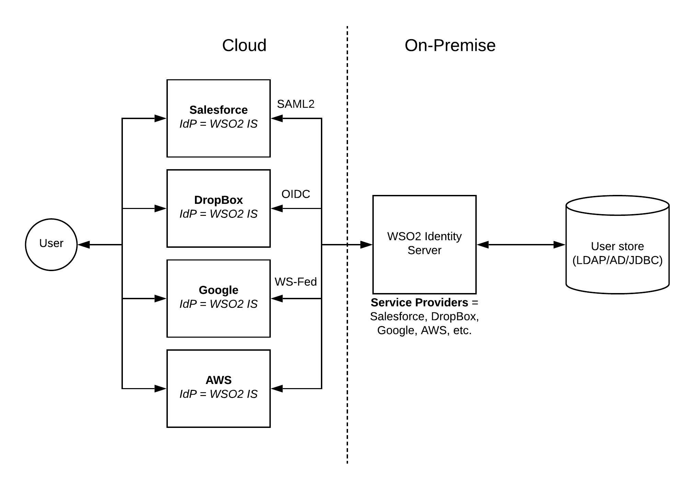

# Cloud Application Security Pattern

## Introduction
Enterprises are more and more out sourcing their internal IT applications to cloud based solutions due to the fact that maintainence cost of these on premise solutions are much more higher than the cloud counterparts in most cases. There are many cloud software service providers who is dominating the respective technology area. 

With the introduction of more and more cloud based applications, user management within the enterprise will become challenging. Here are some of the challenges

- Different cloud applications have different mechanisms to authenticate users
- Remembering different username/password pairs for different applications will be cumbersome to the users
- Different applications will need different levels of security (2FA, SSO)
- Keeping user profiles within each application will be hard to maintain

## Architecture
Using a centralized Identity Provider (IdP) is the solution to address the above challenges and come up with a user-friendly, scalable experience to identity admins as well as users. 

As depicted in the above figure, cloud applications are configured within the WSO2 Identity Server (or any IdP) as service providers. Based on the authentication mechanism supported by the relevant application (e.g. SAML2, OIDC, WS-Federation), WSO2 IS can be configured. In the meantime, WSO2 IS needs to be configured as an Identity Provider within the relevant cloud application side. Once these settings are done, when a user tries to log into the respective cloud application, it will be redirected to the WSO2 IS authentication endpoint. Now users can provide the credentials which are stored within the enterprise user store (AD, LDAP, JDBC) which is connected with the WSO2 IS. 

## Advantages

With the above mentioned architecture, enterprises will be able to reap the following benefits.

- Enterprise users can be centrally managed regardless of whether they sit within the enterprise or outside the enterprise
- Applications can have their own authentication protocols and connect with the WSO2 IS for authentication
- Different applications can be enabled with Single-Sign-On so that users don't need to log into multiple applications

## Additional reading

[WSO2 Identity Server Documentation](https://docs.wso2.com/display/IS570/Logging+in+to+Salesforce+using+the+Identity+Server)
