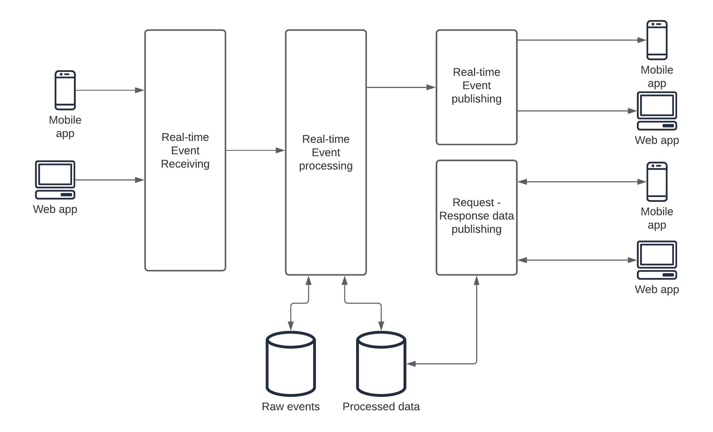
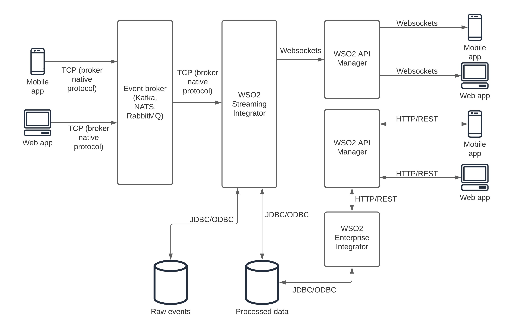
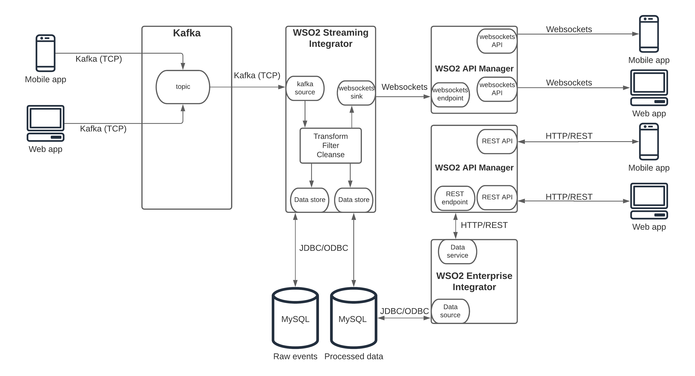
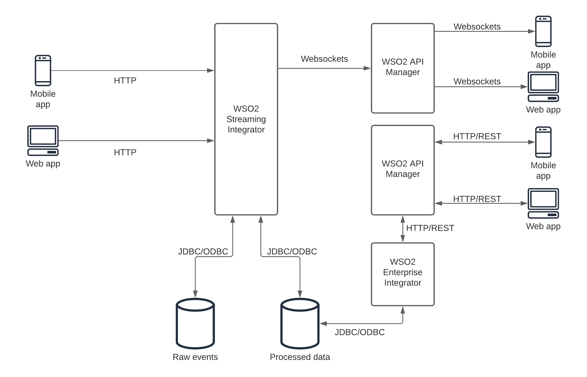
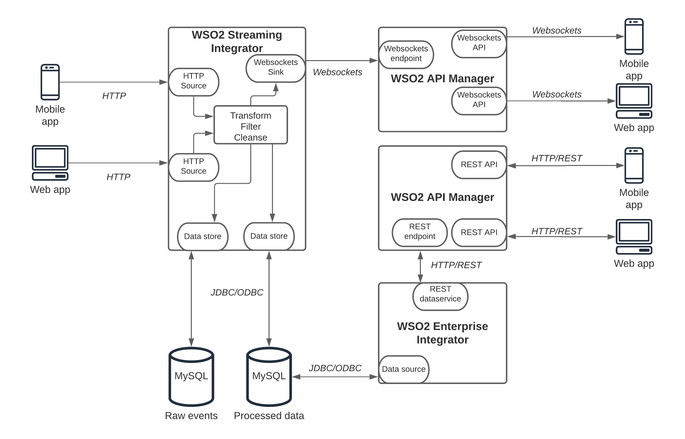
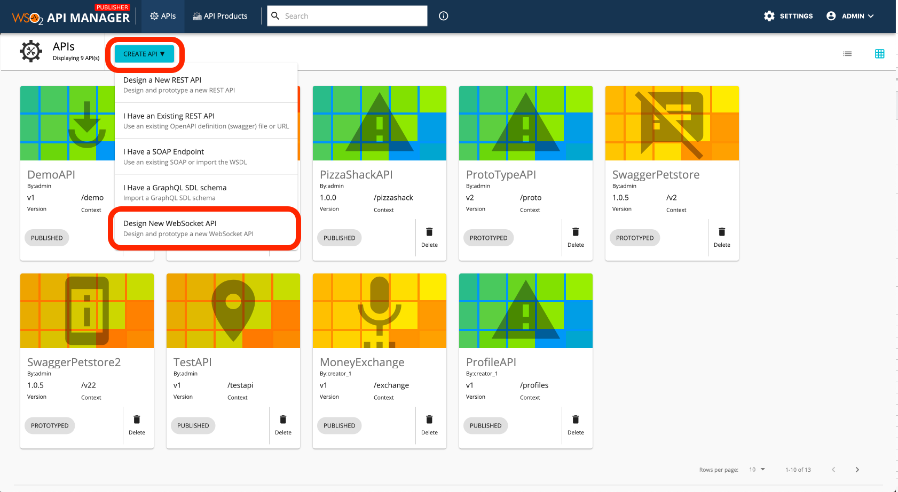
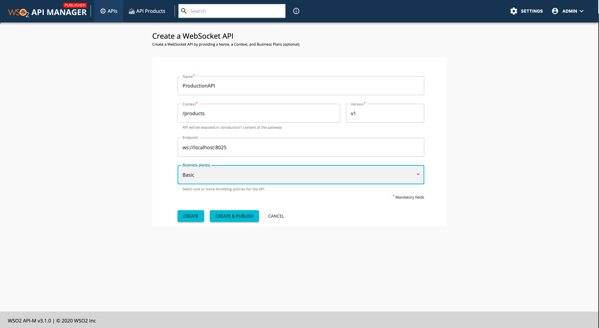

Did you ever think about how companies like Google, Facebook, LinkedIn became the world’s largest companies while providing their main products and services for free?

- “If you’re not paying for it, you’re not the customer; you are the product. — Andrew Lewis”

That is through selling data about users and their behaviors. This is a great example of how valuable data is. This comes to the point of “data is money”.

In today’s competitive world, data processing needs to be done in real-time. Otherwise, a competitor will act on it and gain an edge on the business. That is the reason why it is important to build enterprise systems that are capable of handling information (data) in real-time. One of the key aspects of handling data in real-time is to design the system to act on events in an asynchronous manner rather than in a synchronized manner. You can build real-time systems with synchronous, request-response messaging as well. But those systems are not the most efficient when it comes to resource consumption. That is why we need to understand how to build a real-time information system based on an event-driven approach.

Figure: real-time information system solution architecture

As depicted in the above figure, events are originated from various channels including mobile and web applications. These events need to be received first. One of the fundamental requirements of the event receiving component is the ability to handle large amounts of data at any given time. Depending on the use case, these rates can be 1000 events per second to millions of events per second. This component will only do the reception of the events and pass it back to the processing component.

The event processing component will act on the event data and do certain operations like filtering, cleansing, transforming, and summarizing to name a few. Depending on the event receiving component behavior, event processing can be done independently of the event receiving or as a dependent operation. This component can store raw events in data stores for audit purposes (if that is not handled at the receiving component) and store calculated results in separate data stores depending on the use case. In addition to that, most of the events are processed in real-time and published into the event publishing component to pass it to the consumers.

The event publishing component will take the processed data and push it to the consumers in real-time. These consumers can be mobile or web applications or other systems that act on the processed events. In addition to these real-time event publishing, there can be certain use cases where processed summary information needs to be exposed in a synchronous, request-response manner to mobile and web applications over an HTTP channel.

This reference architecture can be used in multiple use cases where events occurring in the field need to be processed and published into back-office applications and some other field forces. As an example, we can use this architecture to build a supply chain of farmers delivering their crops to a supermarket chain via the delivery vehicles. Farmers can update their crop details when it is ready and the supermarket back office team will get updates from various locations in real-time and arrange the vehicles to collect the crops in an efficient manner without any delay. Another example would be to support an emergency situation where field forces can send updates on the situation and details of requirements in real-time while the back office team can make the necessary arrangements without any delay and deliver those items to the location.

Let’s see how this reference architecture can be realized with a reference implementation.
Reference architecture with WSO2 and Kafka

A message broker is a component that decouples the message sender from the receiver. There are many message brokers available in the market that does just that. They have their own advantages and disadvantages. Kafka, NATS, and RabbitMQ are 3 of the most popular message broker technologies available in the market. Out of these 3, Kafka acts as the broker that has the best features from both NATS and RabbitMQ. Hence, we are selecting Kafka as the event broker for our reference implementation. Users can select any other message broker as well if they already have a different broker. As the event processor, we are using WSO2 Streaming Integrator since it is one of the feature-rich, simple, and open-source tools available in the market. As the event publisher, we use WSO2 API Manager since it supports both streaming and REST-style APIs. These components can also be replaced with similar tools in the market. The figure below depicts the components and their interconnections to build a real-time, event-driven information system.

Figure: Real-time, event-driven information system with a broker and WSO2 platform

In this architecture, events coming from various sources including mobile apps, web apps are received by an event broker. That will handle the load coming from the event sources and then WSO2 Streaming Integrator will consume the events from the broker and do the required processing before publishing the resulting events to the WSO2 API Manager over a WebSocket connection. Then WSO2 API Manager has a WebSocket API that is exposed over the gateway and consumed by the consumer applications like mobile and web applications which receives the events in real-time. At the same time, WSO2 Streaming Integrator can store raw events as well as aggregated results in data stores that can be exposed over standard REST APIs from WSO2 API Manager to consumers that are interested in that sort of information. A more detailed view of the above architecture is mentioned in the below figure.

Figure: Real-time, event-driven information system with Kafka and WSO2 platform details

As depicted in the above figure, event sources are publishing the events through Kafka clients to the topics that are available in the Kafka broker. WSO2 Streaming Integrator will subscribe to these topics and consume events from Kafka in real-time via a Kafka source configured there. These events are then processed via the operations available in Siddhi language and then pass it to the event sink which is a WebSocket sink in this case. At the same time, as and when required, WSO2 SI stores the events in the database tables via data stores.

This WebSocket sink is consumed by the WSO2 API Manager via a WebSocket API and it configures the details of the WebSocket sink as the endpoint of the API. The client applications that consume the WebSocket API will receive the processed events in real-time.

At the same time, processed information and raw events can be stored in a database. This database can be exposed through the WSO2 Enterprise Integrator as a REST data service. This data service is then exposed as a protected REST API over the WSO2 API Manager for synchronous communication via client applications. This architecture can be extended to support many other enterprise use cases like hybrid integration requirements, API management platforms, etc. Hence, this can be considered as a full-blown enterprise architecture that supports most of the enterprise system requirements.
Reference architecture with WSO2 platform only (without Kafka)

If your organization is just getting started with building a real-time, event-driven information system without much load on the system, you can build a cut-down version of the previous architecture (without losing any functionality) by only using the WSO2 platform. The below figure depicts the reference implementation of such a system without a message broker.

Figure: Real-time, event-driven information system with WSO2 Platform

The only difference between this architecture and the previous architecture is that the event broker is not used here. Instead, client applications will directly send the events to WSO2 Streaming Integrator over an HTTP call. Since this architecture does not have a message broker, WSO2 SI needs to store the raw events in a database for auditing purposes. The remainder of the functionality is same as the previous architecture. A detailed view of this architecture is mentioned in the below figure.

Figure: Real-time, event-driven information system with WSO2 Platform details

The WSO2 SI is configured to receive the events via the HTTP interface through an HTTP source configuration in a Siddhi application. Then these events are processed via the operations and then published into a WebSocket sink. At the same time, raw events are stored in a database using a data store and aggregated results are stored in another table via a different data store. The remainder of the functionality is the same as the previous broker based implementation.

Sample Code for Kafka to Websocket Siddhi Application

Given below is a sample siddhi application that can read from a Kafka topic and publish the events through a WebSocket server. It does a simple check (filter) for every event before publishing through the WebSocket server to see whether the amount is less than 500. It publishes events to a log sink (output) also.

You can find a detailed example of how to set up Kafka with Streaming Integrator and try out this Siddhi Application by referring to the below documentation link.

https://ei.docs.wso2.com/en/latest/streaming-integrator/examples/working-with-kafka/

How to create a WebSocket API connecting to the WebSocket endpoint

You can create a WebSocket API from the WSO2 API Manager publisher interface to consume these events from the WS server and publish it to the clients.

You can select the “Design New WebSocket API” option from the above menu (“Create API”) and provide the details in the next window as depicted in the below figure.

Once the details are provided, you can select the “Create & Publish” option to do push the WebSocket API to the developer portal where users can consume that with a valid OAuth2 token.

You can find a step by step guide on creating the WebSocket API and trying that out with a sample client by referring to the below documentation link.

https://apim.docs.wso2.com/en/latest/learn/tutorials/create-and-publish-websocket-api/#create-and-publish-a-websocket-api

Users can find a good set of examples on how to configure various aspects of WSO2 Streaming Integrator, WSO2 API Manager, and WSO2 Enterprise Integrator in the below links.

- [WSO2 Streaming Integrator tutorials](https://ei.docs.wso2.com/en/latest/streaming-integrator/guides/use-cases/)
- [WSO2 API Manager tutorials](https://apim.docs.wso2.com/en/latest/learn/design-api/create-api/create-a-rest-api/)
- [WSO2 Enterprise Integrator tutorials](https://ei.docs.wso2.com/en/latest/micro-integrator/use-cases/learn-overview/)
