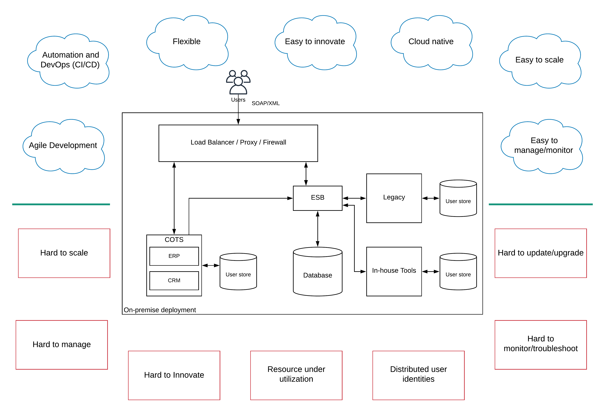
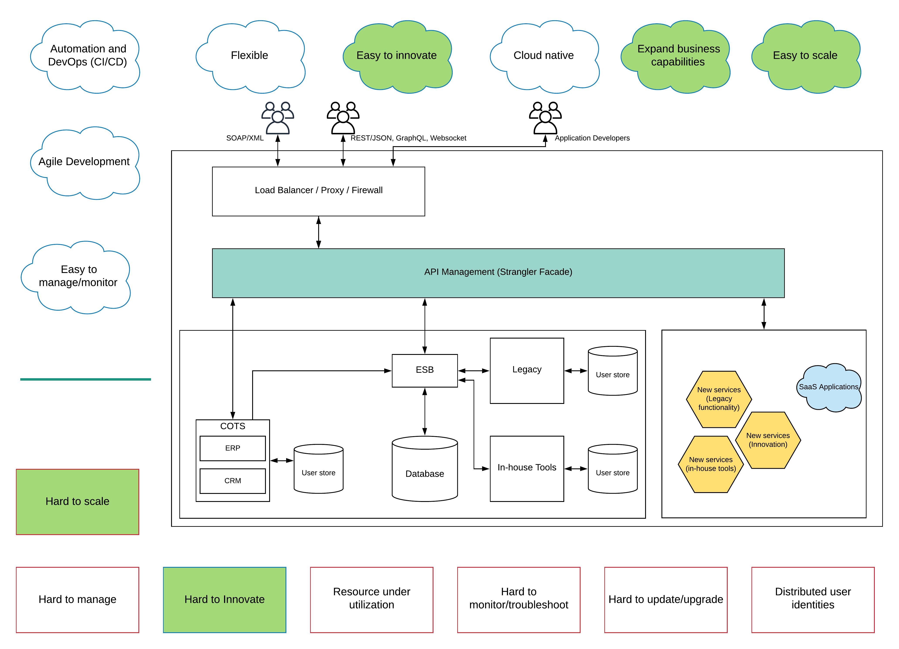
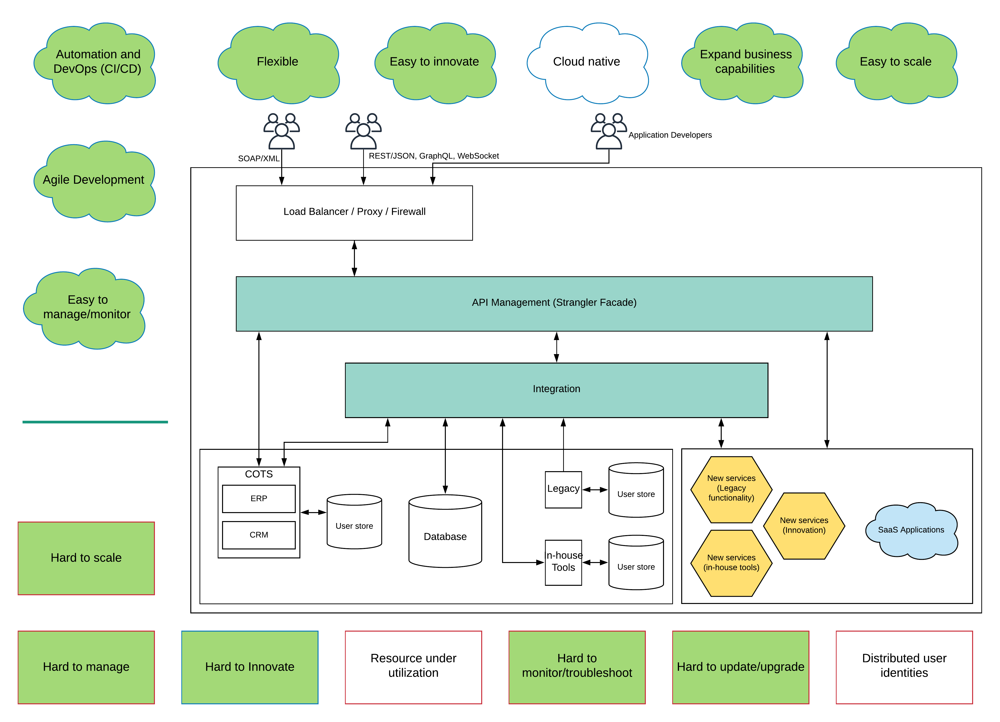
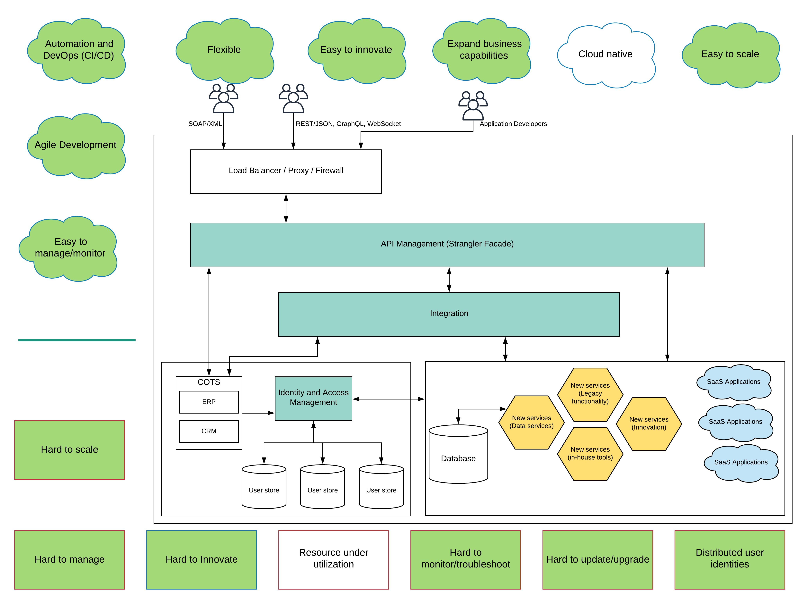
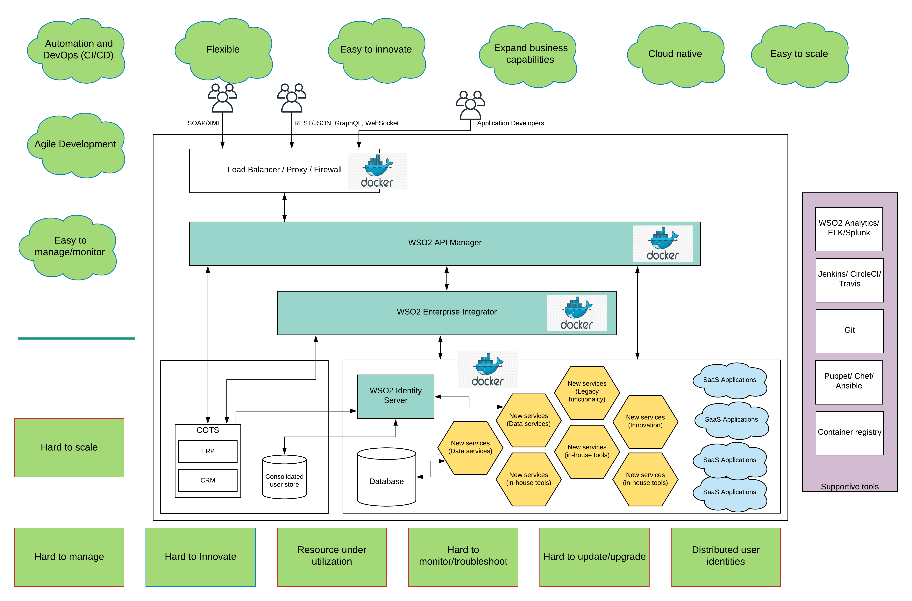

## Background
If you are an engineer or an architect working in the field of enterprise IT, you may be hearing terms like “digital transformation”, “cloud-native”, “microservices”, “architecture modernization” several times a day. But your reality may be to make sure that

- ESB is running without any issue (You restart it every day)
- Database systems are properly running (DB admins are the busiest people)
- End-users are not experiencing any slowness (They always complain)
- There are a minimum number of support tickets in the system (No day without a late-night support call)

If you think just about the tasks and responsibilities you already have similar to above, you may think that this is enough trouble for you to spend your entire working career. This is true for anyone in the team from the engineer to CIO if they think only about these points. But there are people who think outside the box and look for proactive approaches to solve complex problems rather than act in a reactive manner. Instead of stuck with the existing set of challenges and finding solutions to those, they go one step further and look for ways to change the way things are handled and looking into the big picture.

## Existing legacy platform (Step 0)
Let’s come back to the ground and try to understand the current legacy enterprise platform you are having in your enterprise along with the challenges it has.

Figure: Legacy enterprise platform — challenges and expectations

As depicted in the above figure, the existing platform consists of a set of heterogeneous systems that interacts with each other through an ESB and exposed through a proxy or load balancer. In your enterprise, there can be 10s or 100s of different systems deployed. But the architecture would be similar to this. For this article, we’ll keep the proxy/load balancer component aside. This architecture works for the last 20 years and it still works with a few challenges. Users are mainly interacting with the system through SOAP/XML over HTTP/S and they handle the complexity of XML processing at the client-side applications.

Let’s try to figure out the challenges you have with this platform.

- Hard to scale — If you want to support an increased load during the release of a new product/service or during a festive season, setting up a new instance of an existing service needs to deploy an entire instance of the server and also requires shutting down of the existing system and restart along with the new instance.
- Hard to manage — Deploying a new service, updating the operating systems, libraries, and other runtime components, applying updates, finding the root cause of an issue sort of management activities are time-consuming and depend on multiple CoE teams which creates a lot of friction
- Hard to innovate — Because of the separation of teams (CoE) and time it takes to execute certain activities and the lack of automation makes it harder to innovate at a rate where competitors are going. The legacy message formats and protocols supported by the system makes it harder to provide new forms of experiences (e.g. mobile) to the customers
- Resource under-utilization — Since the deployments are done on physical or virtual resources which were designed to cater to the peak loads, there is a significant underutilization of the resources during the normal operation.
- Distributed user identities — This is a much bigger problem on its own. In a typical enterprise platform with heterogeneous systems, users are managed separately by those systems since they are not aware of the existence of other systems at the time of the design. Because of this, most systems have their own user stores and this causes the end-users to create and remember multiple user accounts and log into systems separately.
- Hard to monitor/troubleshoot — Another challenge with this sort of a disconnected platform that was built with systems that are designed in isolation is that it is harder to monitor and troubleshoot when things go wrong. Each system has its own ways of logging details and there is no connection between these log entries. That makes debugging and troubleshooting issues really hard.
- Hard to update/upgrade — Software systems are prone to bugs. With the increased demands from business leaders and customers alike, systems need to undergo changes. Updating or upgrading a system is not easy with this sort of a legacy platform since there are a lot of dependencies and sometimes it takes months to do an update or an upgrade. Because of this, many systems are running without any updates or upgrades even though users and system owners do not satisfied with the platform.

As I mentioned at the beginning of this post, addressing these challenges is necessary. But that does not solve the bigger problem of not designing the platform for future needs. That’s the responsibility of a good architect to think about the big picture and design the system which solves the existing problems, as well as any problem or challenge, occur in the future. Let’s try to understand the expectations of the modernized platform at the beginning of this migration effort.

- Easy to scale — Obviously, scalability aspect needs to be addressed and it needs to be smooth without any interruption to the services
- Easy to innovate — Once the business and field sales request for a new service, it needs to be delivered in a short period of time before any competitor release that service.
- Easy to manage/monitor — Upgrading/updating the systems, deploying new services, troubleshooting issues, monitoring across systems needs to be in place.
- Agile development — To support the speed of innovation, the development, deployment, and testing needs to be done in an agile manner without any CoE borders or friction
- Automation and DevOps — Once the developers commit the code to a source repository, it needs to go through the testing and deploy it into multiple environments without any human interaction. This level of automation allows the teams to do multiple releases within a day when comparing the previous single release per months strategy
- Flexible — Platform needs to be flexible and adaptable to change and should be capable of integrating with external systems that will be brought in to the system by partners and various internal business units. The extensibility of the platform defines flexibility.
- Cloud-native — The new platform needs to be cloud-ready and designed in such a way that it can be easily migrated into a cloud infrastructure without much effort. It also needs to utilize the benefits of the cloud infrastructure from the get-go.

## Start the modernization (Step 1)
Once the existing challenges and the broader picture is identified and convinced to at least some of the stakeholders (sometimes you can’t convince everyone to get things started), you should start somewhere. One important aspect of doing any migration or modernization is to do that with minimum impact on existing users. This is the reason why we should bring in a layer at the highest point of interaction to the customer just below the load balancer or proxy.

Figure: Legacy modernization step 1

As depicted in the above figure, there are 2 main changes done to the platform architecture here.

- API Management layer is introduced to the platform
- A new set of services are developed as microservices and cloud (SaaS) services

Bringing in API management platform allows us to provide the same set of existing functionalities to the customers from multiple backend systems. Some functionalities of the legacy systems and in-house tools are migrated as microservices and deployed separately. This deployment can be on a physical/VM infrastructure or a container platform. Along with that, users can bring in new cloud services (SaaS) if required. But still, the integration is handled through the ESB layer.

In addition to migrating a set of capabilities to new microservices platform, now certain services can be exposed through modern interfaces like REST/JSON, GraphQL, or even Websocket. It allows the business functionalities to be exposed to a wider audience. It also allows the application developers to interact with the service developers through an interface like a developer portal. With this initial step, the platform has the following capabilities which were not there before.

- Scale according to load variations (through API gateway)
- Innovative services (REST, JSON, GraphQL, Websocket)
- Expand business capabilities to a new set of users (through application developers)

But still, there are a lot of issues, and challenges still exist in the overall platform and you need to address those as well.

## Establish the new platform (Step 2)
Even though the API management platform is capable of supporting certain aspects like automation, cloud-native, agile development, and improve monitoring aspects, the rest of the platform is still not ready to build that integrated experience. Because of that, we have to identify the next phase of the modernization effort carefully and execute without frustrating the stakeholders.

Figure: Legacy platform modernization — establishing

The next phase is to move a considerable amount of legacy and in-house capabilities into the new microservices style deployment as well as migrating away from the existing legacy ESB which plays a major role in the overall platform. This might be one of the most challenging phases of the modernization effort since your existing developers find it difficult at the beginning to migrate these integration services to a new platform since the syntax of this new platform is vastly different. But in reality, most of these integrations are done according to a selected set of patterns (EIP patterns), and once you identify the pattern, you could find enough samples from the new vendor related to those patterns and migrating the logic won’t be that difficult. Depending on the number of integrations developed in the existing ESB, the time it takes to do the migration may vary.

One of the key improvements your developers can do during the migration is to think differently and write these new services in a much efficient manner since things have changed a lot since the original services are written. That will help you to reduce the number of integrations rather than blindly converting the services from one platform to the other. During this migration also, the API management layer plays the role of the anti-corruption layer where it serves the customers from backend services running in both ESBs for a certain period of time.

Once the Integration and the API management components are in place, the platform is capable of handling another set of challenges and supports the new capabilities mentioned below.

- Agile development — With the integrated story of API and Integration platform along with the microservices layer, the developers can work in an agile manner to innovate faster
- Automation and DevOps — The service development can be automated with the use of microservices, integration, and API management runtimes which are capable of handling automated deployments.
- Management and monitoring — With common monitoring tools supported by microservices, API, and integration platforms, platform-wide monitoring becomes a possibility and troubleshooting issues become easier. Managing the development, deployment would become easier with automated pipelines.
- Update/upgrades — Updating and upgrading the deployment becomes easier with configuration management tools and CI/CD pipelines.
- Flexibility — With API management and integration platform which has extensions points to integrate with 3rd party systems and having connectors to connect with those systems allow the platform to become flexible

At this stage, the modernization effort is well established and most of the challenges faced in the legacy platform are gone and the new capabilities are providing the business level benefits across the board. There are a couple of things yet to be addressed.

## Improve user experience (Step 3)
With the enterprise platform in better shape in terms of scalability, management, automation, and innovation, the next step would be to improve the overall user experience of the platform while applying the better security models for users and applications. Though it feels like we are considering security as a secondary matter since it appeared in step 4, it is not the right way to look at this approach. From the beginning, the security was handled by applications and they managed their own user stores and their own security protocols. Through the API management platform, certain aspects of security were modernized with the use of OAuth 2.0 tokens. But consolidating the various user bases which spanned across multiple applications needs to be done once the systems are properly implemented.

Figure: Legacy modernization — improve user experience

As depicted in the above figure, the Identity and Access Management layer is introduced to improve the user experience and consolidate the various user stores and manage them centrally. This allows both existing applications and modern microservices to provide a much better, unified user experience regardless of which application the user is accessing. With this component, users can be provided with more secure, yet easy to use applications with features like Single-Sign-On (SSO) to multiple applications, Strong Authentication (2FA, MFA), Social log-in (Facebook, Google) and many other. This will solve the distributed user identities problem and make life easier for users as well as system administrators to manage the users through a single component.

All is well up to this point and the system is providing more and more functionalities to the users and the overall maintenance, management, innovation aspects are vastly improved. Still, there is room for improvement.

## Make it future proof (Step 4)
If you look at the figure in the previous section, there are 2 white boxes still we need to make green. Those are the resource under-utilization and cloud-native aspects. Based on research done in recent times, it is evident that more and more enterprises are moving their workloads to the cloud already or planning to migrate their workloads to the cloud in the future. As an enterprise architect who is planning a modernization effort, not thinking about cloud migration is a big mistake. Because of that, we should make the modernized platform cloud-friendly so that when the overall organization decides to go down the cloud direction, the platform is ready to move on to the cloud.

Figure: Legacy modernization — future proof deployment

You will recognize several changes in the above diagram from the previous diagram. Since this section of the article discusses making the entire platform cloud-native and running on a container platform(docker), I have chosen an open-source technology platform that supports the functional capabilities of API management, Integration and Identity, and Access Management. In addition to that WSO2 platform comes with a set of runtimes that are cloud-native and supports container-based deployments from the core of the runtimes.

- WSO2 API Manager — Open source API management product that can be deployed in a container platform with a distributed architecture where different runtime components run in independent containers and scale separately.
- WSO2 Enterprise Integrator — Open source integration platform capable of handling hybrid integration scenarios along with data services and event streaming capabilities with container-friendly, cloud-native runtime.
- WSO2 Identity Server — Comprehensive Customer Identity and Access Management (CIAM) software developed by WSO2 which caters to all the functional requirements and supports container deployments natively.

All the above-mentioned components along with the newly implemented microservices layer which replaced the legacy and on-premise tools can be deployed in a container platform like docker so that it can scale and manage independently.
To make this platform fully automated and well managed, we need to use a set of supportive tools that are also available as open-source products.

- WSO2 Analytics Platform — This component provides the operational level statistics, real-time event detection and monitoring of services, APIs and applications deployed in WSO2 components
- ELK stack — This open-source monitoring stack can be used to monitor the platform-wide operations and use for debugging and troubleshooting the issues which may occur in production environments
- Jenkins — This is a tool to implement CI/CD pipelines and automate the development, testing, and deployment of services. It plays a crucial role in the overall agile development process and automation aspects.
- Git — Is the most popular source code management system which can be used to manage the code developed by developers and can be integrated easily with tools like Jenkins for automation.
- Ansible — This is a configuration management software that helps to build automated pipelines for server updates, upgrades, and deployments.
- Container registry — If you are deploying in a container platform, the container registry provides the repository where you can maintain the respective containers of the product runtimes and required supportive tools and libraries.

One of the important aspects of driving this sort of a modernization effort is to handle the people aspect. That means you have to drive the people transformation as well as the platform modernization at the same time. Otherwise, it will not reap the full benefits of this effort. The other aspect is that you have to plan it properly and execute accordingly.

The reason why I choose open source technology for this modernization effort was that it allows you to do your early research, development without any cost involved or with the minimal cost. It also gives the flexibility to fix your mistakes (free from vendor-locking) if a certain component does not work as expected without burning additional dollars.
Once the platform is designed and implemented as per the 5 step process described in this article, you will have a platform that addresses the existing challenges, that open up new business opportunities and that is ready to take on any future changes in the industry as per the current knowledge on the future.

## Future
Once the platform is designed in the manner which was explained throughout this article, moving this platform into cloud infrastructure is not that hard. Many cloud providers support managed kubernetes environments that are capable of deploying container workloads with additional capabilities like auto-scaling, auto-healing, rolling updates, monitoring, and flexible pricing models. If your organization is looking to reduce your operational and maintenance overhead of the platform, this modernized state allows your organization to go through that transition smoothly and reduce the total cost of ownership (TCO) and improve the return on investment (ROI).
