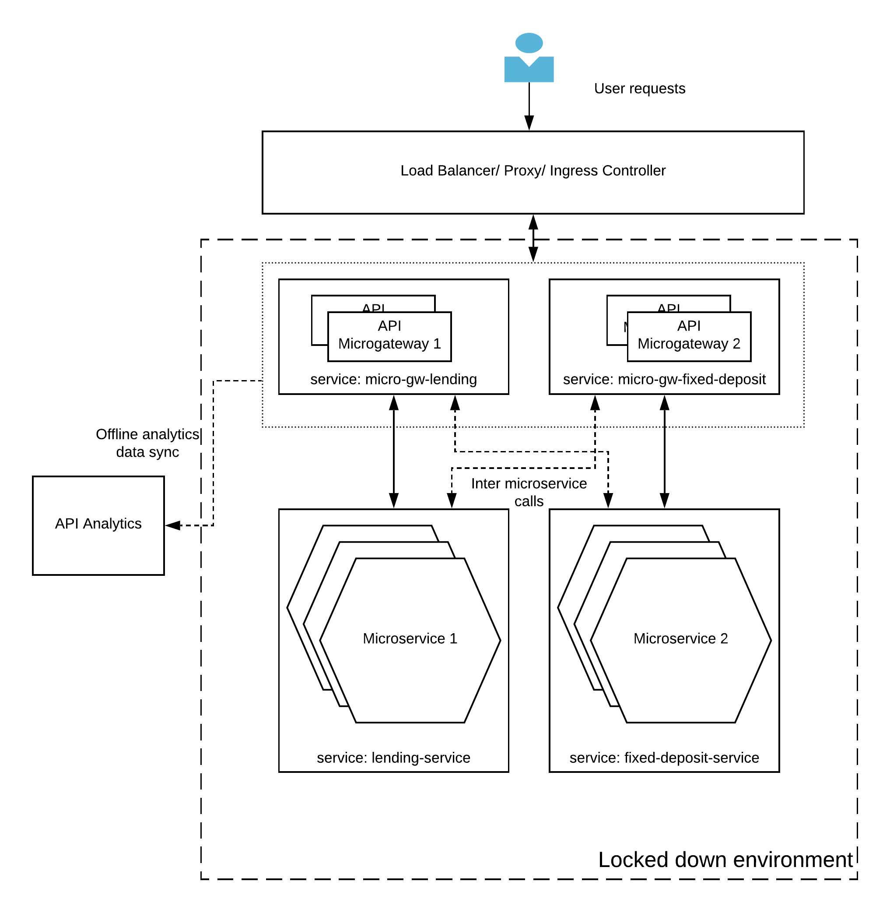

## Locked-down API gateway pattern

### Introduction
Sometimes applications needs to be deployed in environment where there are no connection to the public internet or any other parts of the system. As an example, If you are deploying a system which is deployed in deep water under the sea, the system will be deployed in total isolation in a locked-down mode. 

### Architecture

Figure 1: Locked-down API Gateway pattern

As depicted in the above figure 1, WSO2 API Microgateway has the ability to run in this type of environment with it’s built in security (JWT based), rate limiting (local) and offline-analytics capabilities. The applications and microservices will get the same set of capabilities from the API Microgateway, though there is no connection at all with the rest of the components of the API Manager. The Analytics data will be collected into files and will be uploaded to the analytics runtime when there is a connection established with that component.

With this deployment pattern, API development can be entirely automated and done through the API Microgateway toolkit. The APIs can be defined in Open API Specification (OAS) format with the WSO2 specific extensions in a json file and it can generate the microgateway. This entire process can be automated and implemented through a CI/CD pipeline.
