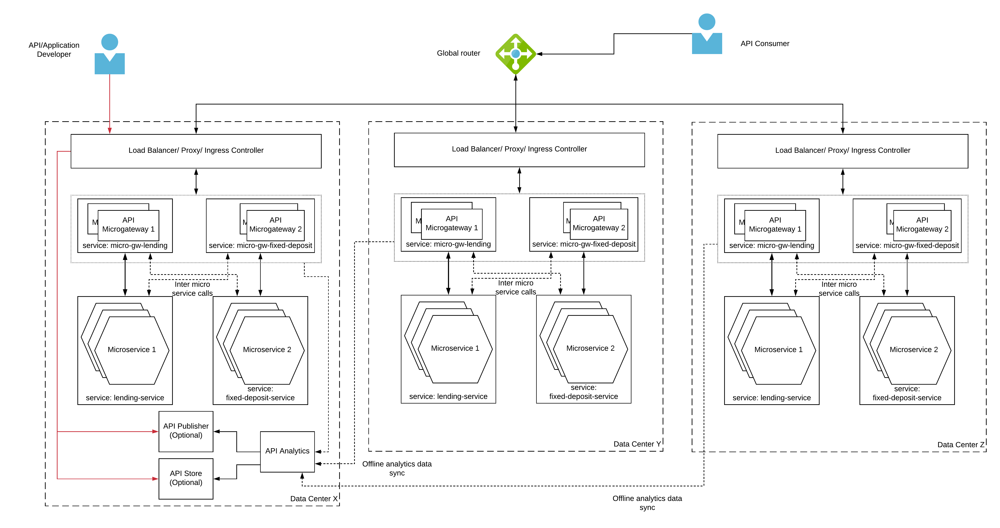

## Multi data center API gateway pattern

### Introduction
Large enterprises which has global operations requires their applications to be as much closer to the user as possible. That will give their users a better experience when they search for a product or making a purchase order. Having multiple data centers across different geographical regions is a common approach taken by these multi national corporations. These data centers can be their own or on public cloud platforms like Amazon, Google or Microsoft. One of the key challenges of deploying an API Management platform across data centers is to share data across data centers. WSO2 API Microgateway solve this complexity with it’s unique immutable design and the ability to run without any other dependency. 

### Architecture

Figure 1: Multi data center API gateway pattern

As depicted in the above figure 4, the only component which shares data across data centers during the runtime is the analytics component which can connect to the other data centers in an offline manner. With the API microgateway, multi data center deployment has become much simpler and easier to implement and maintain. The above mentioned data centers can span across multiple cloud IaaS providers (Amazon, Google, Microsoft) as well.
