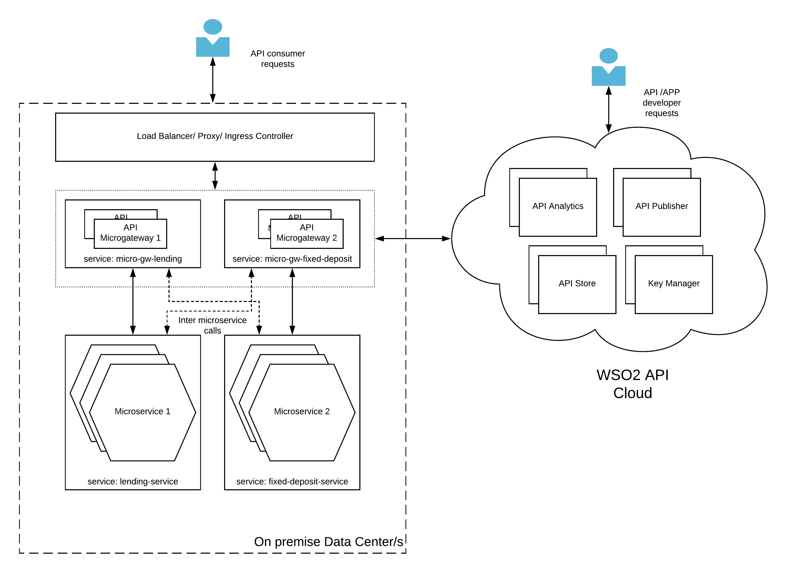

## Hybrid API gateway pattern

### Introduction
In all the deployment patterns mentioned above, the management aspect of the deployment needs to be handled by the enterprise. It gives them the utmost flexibility and control over the platform. But sometimes, organizations with limited IT staff and skill set wants to outsource some of the management and hosting capabilties of the platform while keeping the important components. This is what exactly the hybrid API gateway pattern provides. 

### Architecture

Figure 1: Hybrid API gateway pattern

In this deployment pattern, the critical runtime component of the API platform which is the gateway will be running under the control of the enterprise. It can be run on a private data center, public IaaS cloud or both. In the meantime, the management components of API publisher, Developer Portal, Analytics and Key manager will be hosted and maintained by WSO2 within their public API Cloud. 
