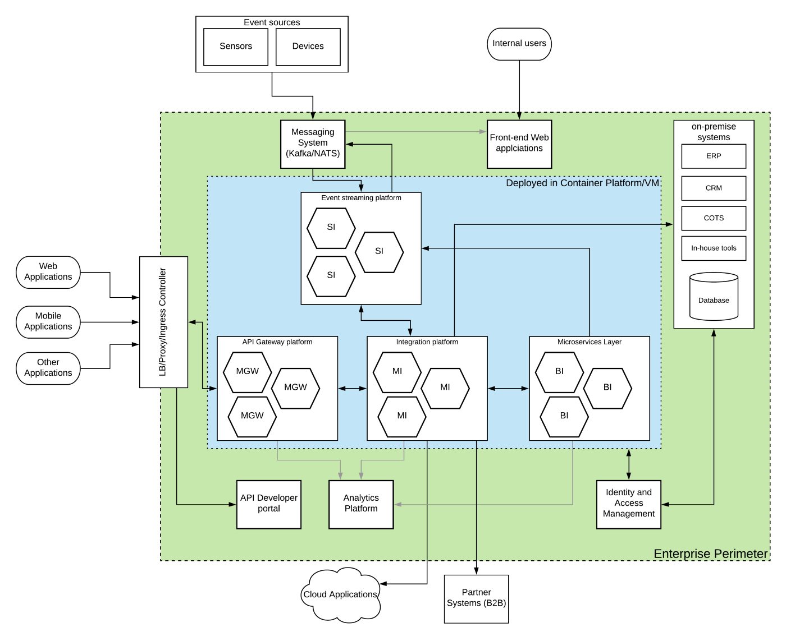

## Introduction
Even though how much people talk about building microservices architectures within enterprises, it is quite true that enterprises are not green-field, meaning you cannot build everything as microservices. Instead, most of the enterprise systems are built many years ago and they will last many years to the future. It is the duty of the enterprise architects to evolve these brown-field systems to modern architectures without breaking the existing system.

In a typical enterprise, you will find various systems which used to improve the overall efficiency of the business. Some of them are
- ERP systems to manage the enterprise resources
- CRM systems to maintain customer information
- Databases to store information
- COTS applications built for various requirements
- Cloud (SaaS) services purchased for various operation requirements
- In-house built applications

Once the business starts growing, it is essential to open up business operations, products and capabilities through various channels so that consumers across the globe can consume your products and services.

## Solution Approach
Digital transformation is the word every one chant when there is a need to expose your business functionality to the external world and API management is the de-facto way of doing that. It is true that you should use an API management platform and go down the digital transformation path. At the same time, you should also consider the other factors when designing such a solution for your company that would last for a longer period of time. Microservices, Containers, Asynchronous messaging, Analytics are some of the technologies that have changed the way people build enterprise systems. As an enterprise architect, it is your responsibility to blend these modern technology concepts into your architecture and make that rock-solid so that it can grow with the growth of your organization. When it comes to designing an enterprise architecture, it is essential to understand the various stakeholders and contexts. Mainly, there are users, data and systems involved in this architecture.

External users will consume business information or services through various channels like web, mobile or console applications. In the meantime, there can be internal users who are accessing business-related information through internal applications. These are the forms where this enterprise system interacts in a request-response style of communication. In addition to this, there can be situations where devices and sensors collect a huge amount of data and pumping them through to the enterprise system in an asynchronous manner (as events).

Once these requests or events reach the enterprise perimeter, these requests need to be processed and sometimes need to respond back. When the processing happens, this data might touch various components within the system and get back with a response or store the results of the processing somewhere so that users can get access to them at a later time or in real-time.

The processing of this incoming data can be done at various components that are built specifically for various operations.

- An API gateway can provide the security, monitoring, throttling to control the data flow and protect the system from unauthorized access.
- There is a component that will communicate with multiple systems and orchestrate the data flow.
In addition to that, there can be newly built services which are developed as part of the modernization of existing services and providing new services.
- Also, there will be a separate component to capture the events coming at a high rate and process them in real-time and produce results that are useful for business operations.

## Solution Architecture
Let’s take a look at how these requirements can be fulfilled with an architecture diagram.

Figure: Modern enterprise system with WSO2 technology

As depicted in the above figure, the system is built without overhauling the existing systems. Rather it utilizes the capabilities of existing systems and infrastructure while bringing the latest technology to the mix. Here are the main components of this architecture.

### Messaging System 
This component is required when there is a need to process a huge amount of asynchronous data points (events) coming into the system. Apache Kafka and NATS are 2 of the best technologies available to fulfill this requirement. Depending on the levels of guarantees and the performance required for event handling, you can choose either Kafka or NATS.

### On-premise systems
These are the existing systems that are used in the enterprise which may have built with various protocols, standards, messaging formats. It is impossible to replace the capabilities of these systems with modern architectures like microservices or containers. Instead, these systems need to be integrated with the newly built architecture.

### Event streaming system
This component is used to process the events received by the messaging system in real-time or in batch mode. This component can be used to transform, correlate, summarize and store these events so that these results can be used for business operations as well as to improve customer experience. The processed results can be sent back to the messaging system so that other applications can receive these results.

### Microservices layer
There can be many situations where existing applications and systems cannot fulfill the ever-increasing consumer demands and business requirements. The microservices style of development is better suited for this sort of service development.

### Integration platform
When there is a plethora of applications and systems that need to work together, the integration platform is the glue that connects various systems. Instead of using a traditional, monolithic integration layer, using a microservices style of a lightweight integration platform is recommended.

### API management platform 
Once the services are built as microservices or integration services, these services need to be exposed to various consumer channels. The API platform acts as an intelligent gatekeeper which allows only the authorized requests while listening to all the requests. An API gateway is the main component which does all these gatekeeping work. There can be other requirements like providing a developer portal where external parties can build their own applications and products on top of the business APIs exposed through the system. In that type of scenario, API platforms provide a component called the developer portal (or API store) which can fulfill that requirement.

### Analytics platform
Business Intelligence or Business Analytics is becoming ever so important with the amount of data collected in enterprise systems as well as the type of competition in the market. An analytics platform with proper tools and minds can really take you to the next level of your business and keep your competition at bay.

### Identity and Access Management platform
This is where the centralized management of authentication, authorization, provisioning, SSO, MFA happens. There are distributed alternatives like Open Policy Agent (OPA) that exists for microservices and API security. But not all the applications and systems support those alternative approaches.

## How WSO2 technology can help?
WSO2 has been developing open-source enterprise software for more than 14 years. It has a suite of products that can be used to build modern cloud-native systems. Let’s see how WSO2 technology can help us to realize the above-mentioned architecture.

- WSO2 Enterprise Integrator 7 — This product is a collection of 3 cloud-native runtimes that can fulfill requirements of the microservices, integration, and streaming.

- WSO2 API Manager 3.0 with microgateway — API microgateway is a modern, lightweight, cloud-native gateway runtime. WSO2 API Manager 3.0 can be used for the developer portal.

- WSO2 Identity Server 5.9 — This is a full-fledged IAM platform that can support a plethora of IAM requirements.

WSO2 EI7 comes with 3 profiles (or runtimes) that can be used in this context. As depicted in the above figure, here is a list of WSO2 products and how they can be used.

- WSO2 Ballerina Integrator of EI7 (BI)— Ballerina is a programming language designed for building microservices style of applications ranging from integrations, data services, streaming and many more. In this context, BI is used for building microservices.

- WSO2 Streaming Integrator of EI7 (SI) — This is a real-time cloud-native event streaming platform built with Siddhi runtime which is a CNCF incubating project. It is used to process the events coming into the enterprise in large quantities and emit results in real-time that can be used for various advanced processing including Artificial Intelligence (AI) purposes.

- WSO2 Micro Integrator of EI7 (MI) — This is a lightweight, container-friendly integration runtime (similar to ESB) that supports connectivity with various on-premise, cloud and hybrid integrations as well as data integrations. There is a chance that if required, someone can choose BI for the same purpose.

- WSO2 API Micro Gateway (MGW) — This provides the security, rate-limiting, throttling, and monitoring to the business services and deployed in a container-based platform. It complements the microservices style of deployment by acting as a gateway to individual microservices (MGW per microservice) or to a set of microservices (MGW per set of microservices). It can work fully isolated from the rest of components like analytics, security and developer portal.

- WSO2 API Manager 3.0 — This product is a full API lifecycle management component that can be used as a developer portal in this context. If required, API publisher functionality can also be utilized for API development. If there is a requirement for distributed throttling, the Traffic Manager capability of the product can be utilized.

- WSO2 Identity Server — This component can be used to provide full IAM capabilities not only for WSO2 components mentioned above but also to the existing applications. It can act as the centralized IAM platform which provides authentication, authorization, user-management, SSO, MFA, social-login and many others.

- WSO2 Stream Processor for Analytics — WSO2 components that are mentioned above comes with product specific analytics runtimes which are based on WSO2 Stream Processor. This component can be used for various product-related analytics and monitoring requirements. If the capabilities of these product analytics components are not enough, users can bring in an external analytics platform like Prometheus, Grafana or ELK stack.

## Extended thoughts
The above architecture discussed a private deployment which is fully owned by an enterprise. This architecture can be extended by bringing a hybrid approach to some of the mentioned components. As an example, API developer portal functionality can be taken out of the enterprise perimeter and put that into a publicly hosted API cloud. Likewise, a hybrid extension is a possibility with the above architecture.
Also, the above architecture can be easily adopted with technologies other than WSO2 and it is up to the user to select the better technology stack based on their own interests and priorities.
Conclusion
Within the last few years, it became evident that microservices wave is not going to die as well as not going to wipe out what has been there before that. It is the best of both worlds will survive.