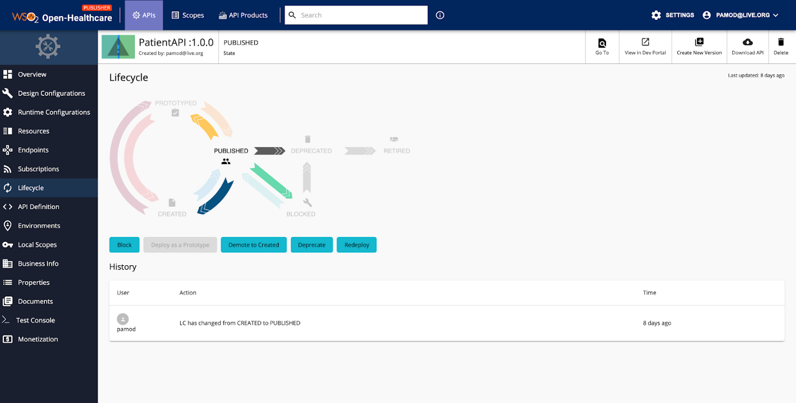

## Introduction

Wide adoption of smartphones and devices among the population have enabled HealthCare institutions to innovate faster, make the process more efficient, productive and also obtain a better Return of Investment (ROI). 
Imagine for a second you walk into a metro, gym, jogging park, airport or any place which comes into your mind, you’ll most probably observe the majority of the occupants either playing with a smartphone or wearing a smart device i.e FitBits. 
These devices basically live with humans and are able to collect a lot of information that can be valuable. Specifically for Health Institutions this information is game changing. 
For example EnrG | Rheum health care app has proven to increase productivity of clinicians by 26%, the app collects information from patients on behalf of the clinicians before their visit i.e details regarding symptoms such start date, nature. 
The app further organizes and auto assembles 90% of the clinic note for the provider; whereas the note could be directly pushed to the Electronic Health Record (EHR) upon clinician’s approval. This process reduces time a patient would have to spend at a clinician’s desk and it also improves productivity. 
Geisinger has further claimed the app was able to save nearly $1,000,000 every year [1]. There are tons of other apps such as Cardiac Risk, Duke Pillbox which provides quality of services for both patients and Health institutions.

## Innovation vs Interoperability in Relation to HealthCare

As articulated earlier, in relation to health care, innovation and interoperability between systems and devices has a proportional relationship. 
Ability for health institutions such as hospitals, insurance providers, pharmaceutical companies to interoperate with apps such as EnrG can increase ROI, productivity and efficiency. 
Further imagine the number of people equipped with wearables such as FitBits in Gyms, Jogging Parks which can provide real time data for health institutions i.e physicians, clinicians to provide accurate diagnostics to identify complex heart conditions, prd-blood pressure, diabetes conditions etc. 
In other words, sharing data between health institutions and consumer driven apps/devices i.e EnrG, FitBits could provide huge benefits for all parties including the patient.
Common challenge of integration is to compromise on a language both health institutions and consumer driven apps could speak. Identifying this challenge, the potential of interoperability and the benefits it’ll bring to the patient, Centers for Medicare & Medicaid Services (CMS) introduced a rule mandating all Health institutions and payers in the United States (US) to honor a common standard CMS-9115-F. 
This will be included as a part of the global standard HL7 Fast Healthcare Interoperability Resource (FHIR). The rule specifies a secure programming interface for data exchange. If you happen to build an app leveraging data from a US health institution based on the latest FHIR specification and if it doesn’t integrate, you literally could sue the institution post January 2022 (when CMS-9115-F rule is enforced).
The rule was brought due to the benefits it provides. Perhaps mainly focussing the patient. However as illustrated earlier it’s beneficial to all the parties i.e payers, providers and patients. Hence FHIR based applications are now widely adopted not only in the US but in other continents of the world i.e Europe, Asia etc.

## Implementing a HealthCare Platform

As a payer or provider i.e hospital, Insurance it will be essential to offer standards such as FHIR due to the benefits it provides. 
Further wide acceptance of FHIR as a standard protocol for data exchange will make the system more interoperable with smart devices. 
Following section elaborates what it takes for an organization to be FHIR compliant.
For simplicity we could look at the implementation in the following perspectives,
1) **Spec compliance** - An organization should interpret and materialize the standard FHIR specification published by HL7. This API specification contains 100+ API definitions and Implementations Guides.
API First approach will be beneficial. Third party applications who would depend on the platform could continue with implementation without blocked waiting till the whole system is available.

2) **Current system** - The existing HC system might involve in house databases, file systems, legacy systems, EMRs i.e Epic, Cerner for maintaining EHR. Hence it might require to orchestrate between multiple sub systems, enrich, transform different data types in order to be FHIR compliant.

3) **Collaboration and Governance** - It would be essential to have a platform for internal developers in the given HC institution to maintain APIs. APIs will have it’s own evolutionary cycle i.e development, test, publish, version upgrade, deprecate, retire etc. It’ll be important to be able to lifecycle manage and govern these APIs. 
Hence there should be a collaboration between internal developers and external application developers via API Developer Portal (store). 
API Store should be a marketplace for all application developers. 
It should allow them to discover APIs and subscribe to them. The lifecycle changes to these APIs should also be vivid in the store.

4) **Security and Consent Management** - Data in EHR is personal and sensitive. A health institution should only share personal data with third party apps through obtaining consent from the individual/patient. Further it would be essential for data in the system to be free from intrusion.

## Spec Compliance

After signing into the HC portal. As shown in Figure 1 the organization will have the option to choose from a list of pre-defined standard FHIR based APIs which they wish to have as a part of their solution. 
If organizations desires they could create their own API definitions as well.

Figure 1- FHIR API Portal

These pre-defined sets of auto generated FHIR based APIs will save months of development time which will be invested on analysing the spec and introducing the relevant APIs.
Use of WSO2 APIM will further allow organizations to follow API first approach and allow 3rd party apps to get connected in no time.
In terms of change management, as specs evolve with time. Having the in-house developers in HC organization focus solely on spec changes can deviate from the main purpose of organization goals. 
Developers should focus on enhancing the domain specific features which will directly impact an organization’s purpose. Hence it’ll be a time saver to have an external entity specialized solely on specifications to do the maintenance.

## Current System

As shown in Figure 2, once the APIs are selected the wizard will guide an organization to a page which will contain an Integrator Studio project with auto generated artifacts.

Figure 2 — Auto Generated Project Download

As shown in Figure 3, Integration Studio will provide a graphical interface for organization’s developers to convert the existing resources in organization to be FHIR compliant.

Figure 3 — Integration Studio

Whether the existing system is legacy based, requires connectivity with databases or requires connectivity with EMRs. 
The Studio interface will provide the capability for developers to graphically drag and drop a few components and connect them (via low code integration experience).
Further organizations will be able to do complex data transformations, enrichment via a graphical data mapping technology available in Integration Studio. 
As shown in Figure 4 transformations can be done in seconds.

## Collaboration & Governance

As depicted in Figure 5, Open HealthCare publisher portal provides an interface for in-house API developers to govern and manage APIs. 
They could specify security policies, QoS policies, SLA rules related to APIs using this portal.

For each API a graphical interface is provided to maintain its life cycle. Which is depicted in Figure 6.

Figure 6 — API Lifecycle Management

Published API can be viewed from the API Developer portal as shown in Figure 7. 
Third party application vendors could discover APIs available in the developer portal, subscribe to these APIs and get connected with the organization’s health platform.

Figure 7 — Open Health API Developer Portal

## Security & Consent Management

Open Health platform provides consent management capabilities for an organization. As depicted in Figure 8 patients consent will be obtained prior to accessing his/her data.

Figure 8 — Consent Management

Further the platform comes with a built in Identity and Access Management (IAM) component. Making it possible for organizations to leverage Multi Factor Authentication (MFA), Adaptive authentication, Federate Identity Access Management Capabilities etc.

## Conclusion
Consumer driven apps have enabled HealthCare organizations to revolutionize their work. Interoperability between these apps and services have become one of the key drivers for HealthCare innovation. 
FHIR standard has introduced a well defined set of interfaces to exchange data and interoperate. it’s also widely adopted around the world. It might take a reasonable effort for a HealthCare organization to become FHIR compliant. 
HealthCare platforms such as WSO2 Open Health have made this process simple.
