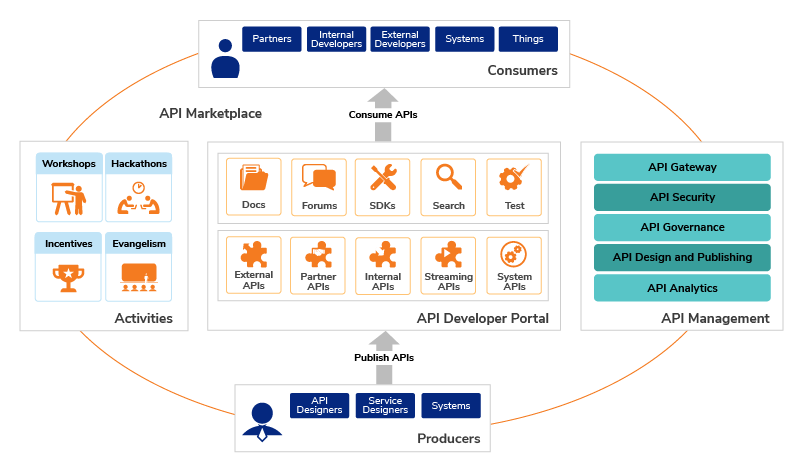
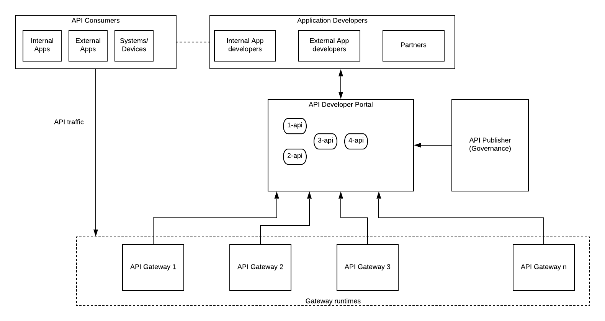

## Introduction

Application Programming Interface or APIs are the digital connectors that connect your business with the digital world which is out there. The consumers are interacting with your business to get products and services through digital means (mobile phones, tabs, computers, terminals, etc.) more than any other means. More and more brick-n-mortar stores are closing down or becoming large storage facilities for digital businesses. All these movements are building a digital economy that is driven by APIs or the so-called API economy. Who would have thought some 20 years ago that you can buy absolutely everything from a piece of soap to a kayak without even stepping out of your sofa?

API driven digital economy is here to stay. Whether you like it or not, you have to embrace that if you have plans to stay along with the competition in your respective domain. But this API adoption comes at a cost. Depending on which vendor you are going to choose, you will end up with a considerable cost. Good things do not come easy and they are not free. It is a given that you have to spend some amount of money to get things going in terms of the API driven business. But the real problem is that, what is the benefit you get out of that investment? How long will it take to show some benefits? These problems are nothing new to business leaders since they deal with these sorts of problems day in day out.

### Reusability

That is where the concept of reusability comes in handy. In the past, most of the enterprise IT teams worked in isolation and they had this concept of center of excellence (CoE) and domain experts who had some knowledge about certain applications and systems within those teams and individuals. That approach made your business leaders go crazy when it comes to IT budgets since every time they need new service or product, it costs fortunes of money to deliver. This had been a big issue in the IT domain and even today, businesses are spending more money than they should be spending due to this lack of reusability. In the Service Oriented Architecture (SOA) world, there was this concept of SOA governance which tried to fix the overall governance and reusability aspect. But most of the enterprises were not ready to embrace SOA governance.

## API Management

In a nutshell, API management is the function of delivering certain business functionality over standard interfaces (HTTP, REST, Websocket) in a well-managed manner by providing

- Security
- Performance
- Availability
- Monitoring

and other capabilities such as caching, rate-limiting, monetization, etc. If you are new to the topic of API management, you should read about it on the internet before continuing. Here are a few links on the subject written by APIM vendors and Wikipedia.

https://wso2.com/what-is-api-management/

https://www.redhat.com/en/topics/api/what-is-api-management

https://apigee.com/about/cp/what-api-management

https://www.mulesoft.com/resources/api/what-is-api-management

https://en.wikipedia.org/wiki/API_management

## API Development

It all starts with the business people coming up with new ideas and wanting to convert those ideas into business services via APIs. Then the architects will gather around with business analysts and product managers to convert those requirements into a design. If your organization is having a fully-fledged IT team, the process of API development consists of the steps mentioned below in most cases.

- Business analysts will discuss the business requirements with sales and business leaders and come up with a requirement specification
- Software architects will design the API definitions (swagger, OAS, RAML) and hand it over to the development team
- Developers will implement the APIs based on the definitions provided by the design team
- QA team will verify the functionality as well as stability and longevity of the APIs and give the green light to go into production
- DevOps teams will push the APIs to the production environment and hand it over to the support team
- API consumers will find the APIs somehow and start using these new APIs
- The technical support team will keep an eye on the customer complaints and issues and provide solutions as and when needed and provide the feedback to the upper levels
- Product managers will monitor the performance and usage of the APIs and keep maintaining the services with new features and decide on the lifecycle of APIs as to deprecate and retire

Even though we defined these as separate steps, in reality, multiple steps are carried out by the same person and if you are having a modern IT team, most of these steps are automated through CICD processes.

### Reusability in development

API governance is an essential part of implementing a successful API program. The above mentioned steps are actually the steps of a proper governance process. Without proper governance, different teams will come up with their own methods to expose the set of information to internal and external consumers through multiple channels (or APIs). With the governance in place, everyone can get an understanding of what other people are doing and if there is already an API is available to access certain information, developers can reuse those APIs rather than building from scratch. That would increase the time to market as well as reduce the clutter with duplicated APIs for the same purpose. In the meantime, if the existing API is not exactly matching with the requirements, they can send a feature request to the developers via the developer portal so that they can improve the API and publish a new version instead of creating a new API. This will help to keep the APIs organized and evolved with time rather than defining new APIs for each small improvement.

WSO2 API Manager comes with dedicated web applications for API Publishing as well as for the API Developer portal. API Publisher comes with features for API governance such as

- API lifecycle support with multiple lifecycle stages (create, test, publish, block, deprecate, retire)
- Design first API development by importing API definition files such as swagger, OAS
- Access control support for different teams within the same organization to have visibility and edit controls within the team while API is published at the developer portal for everyone’s use
- API Analytics that can help product managers to make business decisions on APIs

The above list is only a limited set of features from the full list. You can find more details by visiting the WSO2 website.

The WSO2 API Developer portal is useful in the API governance process where it provides a singular view of all the APIs that are developed by different teams within the organization. Developers from different teams can go through the existing APIs and reuse those APIs as and when necessary rather than reinventing the wheel. In addition to that, they can send feedback and feature requests for improvements through the same developer portal.

## API Marketplace

The success of the API program depends on how easy it is to find an API and use that by the consumers. No matter how good your APIs are, as long as you don’t have an easy way to find out the APIs and use them, your API program is going to fail due to the lack of adoption. On the other hand, the best method to showcase the return on investment is to make APIs popular and make it an integral part of your business.

API marketplace is a concept that discusses how you can make your API program a success by increased adoption within your organization as well as outside your organization within customers and partners. You can find a detailed article on the API marketplace in the below link which was written by Mifan Careem.

https://wso2.com/whitepapers/building-an-api-strategy-using-an-enterprise-api-marketplace/

I have taken one diagram from the article to discuss the high-level advantages of the API marketplace in relation to our topic.

Source: https://wso2.com/whitepapers/building-an-api-strategy-using-an-enterprise-api-marketplace/

As depicted in the above figure, API consumers can be of different types including

- Partners
- Internal Developers
- External Developers
- Systems
- Devices

At the beginning of the program, you will only have the internal developers who wanted to build new digital products and services using APIs. You can do internal workshops, hackathons within your organization to build awareness of the API program, and to educate them on the advantages of APIs. At the same time, these events will help developers to encourage the “reusable” aspect of APIs and data rather than building new applications and services to do the same set of operations on data unless otherwise. This will save a lot of time and effort of the developers and eventually save money for the organization.

When the APIs are exposed to external consumers and partners, you can again reap the benefits of reusability by exposing the same set of APIs to multiple users with different access controls using features such as OAuth2.0 scopes that is supported by WSO2 API Manager. This eliminates the need for having separate endpoints for separate partners to provide the same kind of data.

## API Developer portal and the reusable APIs

One of the key components of the above API marketplace diagram is the developer portal where different types of consumers engaged with the APIs. The features available in the developer portal defines the level of reusability and adoption that can be achieved through the API program. Some of the essential features are

- Browse APIs through taxonomy or categories
- Search APIs by name, category, type, author, version, etc.
- Proper documentation
- SDK generation
- Ability to test the APIs
- Comment/Feedback on APIs
- Rating of APIs
- Share APIs
- Ability to customize themes
- Analytics

There can be many more features available in the existing developer portals offered by the vendors. The above list is a more than enough feature set to implement a successful API program.

Regardless of the user type (internal or external), having access to the available APIs in an easily accessible manner helps these API consumers to reuse the existing APIs and increase productivity rather than build these APIs from scratch. It also reduces the unnecessary development efforts and clutter within APIs.

The WSO2 API Manager developer portal comes with the above features as well as few more additional features to support the API adoption and reusability. The API recommendation system based on artificial intelligence can help API consumers to find related APIs as automatic recommendations without putting much effort on searching or browsing the entire API set. If your organization needs to separate out APIs based on business units, you can do that with the “multitenancy” support of the WSO2 API Manager.

### Reusing Applications and Subscriptions

If there is a need to share the same application that is used to subscribe to APIs in the developer portal with multiple users, that can be supported through the application sharing functionality in WSO2 API Manager. In this scenario, users who belong to the same organization can reuse the same application. You can find more details from the below link.

https://apim.docs.wso2.com/en/latest/learn/consume-api/manage-application/sharing-applications/sharing-applications/#sharing-applications

## Reusable API platform architecture with WSO2 API Manager

WSO2 API Manager has most of the features required to build a reusable API platform. It allows enterprise architects to build API platforms that can reap the benefits of the API economy successfully.

Figure: Reusable API platform with WSO2 API Manager

The figure mentioned above depicts the various components of the WSO2 API Management platform along with their interactions with the API platform stakeholders as described in previous sections.

## Bring your own APIs (BYOAPI)

The next step of API reusability is the BYOAPI concept where different teams can bring their own set of APIs which are deployed and running on their own API gateways and register with one central API developer portal. This is a novel concept that is required by large corporations where they have multiple API gateway vendors running in parallel.

Figure: Bring Your Own APIs (BYOAPI) architecture

As depicted in the above figure, different teams design and implement the APIs based on their business needs and share the same within one developer portal. This approach again helps cross-functional teams to reuse already existing APIs that were developed by the cross-functional teams. This increases the overall time to market and efficient usage of resources. One additional component mentioned in the above figure is the API publisher that takes care of the governance aspect of APIs so that onboarding of APIs happens through a well-defined process and the quality of the APIs is maintained across teams.

This is not something available OOTB with WSO2 API Manager at the moment and it will come as a feature in the future.

At the same time, there are certain organizations trying to build a similar concept in the public internet using all the publicly available APIs. RapidAPI’s is one such example.

https://rapidapi.com/

## Final thoughts

Building a proper API platform helps you to get ready for the challenges coming from the competition regardless of which industry you are in. Some industries have already in full flow with API-driven business and some are getting there. If you are a CIO/CTO or software/solution architect managing the enterprise IT ecosystem, convincing business leaders to go down the API economy route will be challenging. You need to show the ROI of the program within short period of time. One of the best ways you can show the real value of an API program is to showcase the advantages of building reusable APIs that can help your business in limitless ways to reach far out customers and improve the efficiency of IT cost in terms of software and people. WSO2 API Manager is one of the best tools available in the market that can help you to implement a reusable API platform from the get-go.
