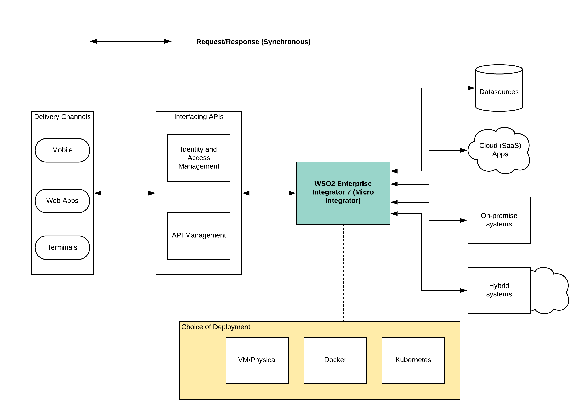
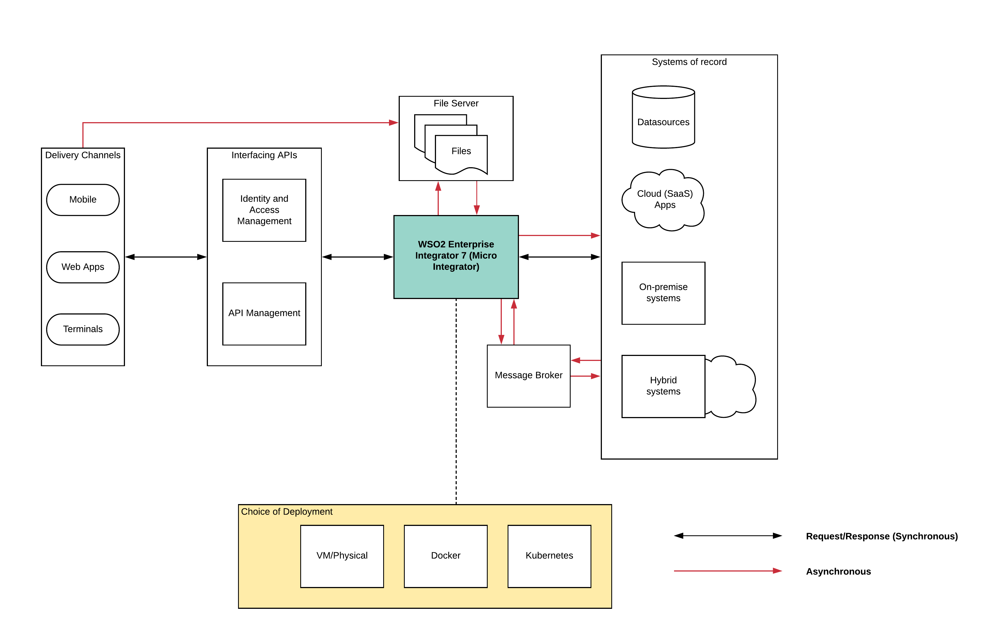
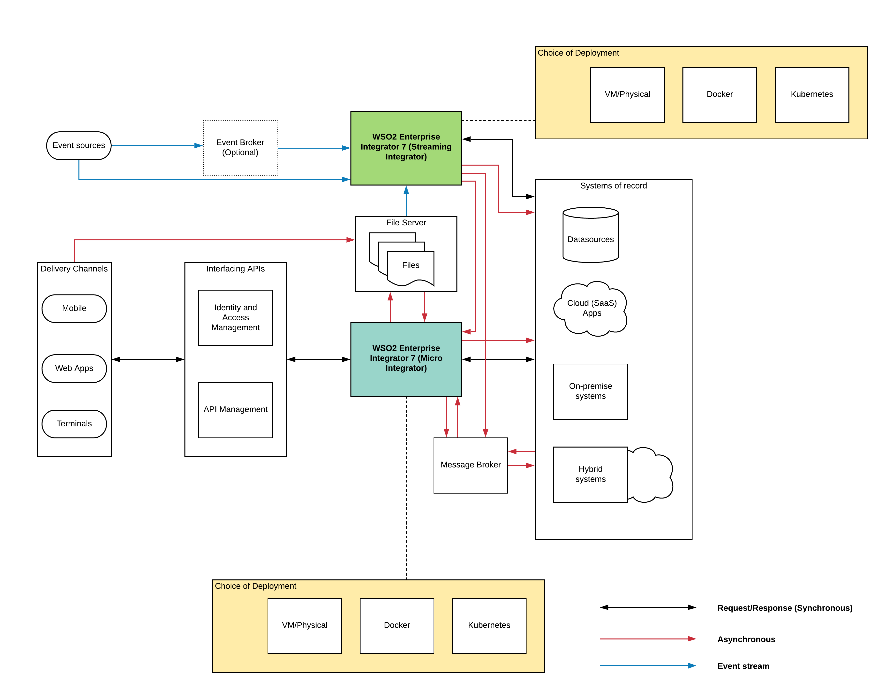

## Introduction

WSO2 Enterprise Integrator 7 (WSO2 EI7) is the latest version of the WSO2 integration platform. It is the successor of the WSO2 Enterprise Service Bus (ESB) which is later called WSO2 Enterprise Integrator 6 (EI 6). If you look at the evolution of the product, it was initially an ESB runtime that catered to traditional centralized integration requirements which overcame the complexities of point-to-point integrations. Then this ESB product converted into a fully-fledged integration platform with the introduction of Enterprise Integrator 6.0 which consisted of ESB (along with Data Services Server (DSS)), Message Broker(MB), Business Process Server(BPS) and ESB Analytics. These components were packaged into the same binary but executed as separate runtimes (JVMs) during the deployment.

Then came the Enterprise Integrator 7.0 (EI 7) which is the topic of this article which has removed certain components like Message Broker, Business Process Server and ESB Analytics from the binary distribution as well as from the installer packages. What you get with WSO2 EI 7.0 are 2 separate components (profiles) which need to be run in different JVMs as separate processes. Those are

- Micro Integrator — This consists of the ESB functionality along with DSS functionality in a lightweight runtime
- Streaming Integrator — This is the successor of WSO2 Streaming Integrator which is used for real-time event processing

Let’s understand a bit more about these 2 profiles within the WSO2 EI 7.0 so that we can map those capabilities along with our solution patterns.

### Micro Integrator
The Micro Integrator is a powerful configuration-driven approach to integration, which allows developers to build integration solutions with a low-code or design-first approach. It is an event-driven, standards-based messaging engine (ESB), which supports message routing, message transformations, and other types of messaging use cases. In addition to that, it contains a data service capability that can be used to expose various data sources (RDBMS, NoSQL, CSV, Excel) as HTTP based services.

#### Traditional Integration
If your organization uses an API-driven, centralized, integration architecture, WSO2 Micro Integrator can be used as the central integration layer that implements the message mediation logic connecting all the systems, data, events, APIs, etc. in your integration ecosystem.

#### Modern Integration
WSO2 Micro Integrator is also light-weight and container friendly. This allows you to leverage the comprehensive enterprise messaging capabilities of WSO2 Micro Integrator in your decentralized, cloud-native integrations.

### Streaming Integrator
WSO2 Streaming Integrator(SI) is a streaming data processing runtime that integrates streaming data (event streams) and takes action based on results. WSO2 SI can be effectively used for:
Realtime ETL: CDC for DBs, tailing files, scraping HTTP Endpoints, etc.
Work with streaming messaging systems: It is fully compatible with Kafka and NATS, and provides advanced stream processing capabilities required to utilize the full potential of streaming data.

- Streaming data Integration: Allows you to treat all data sources like streams and connect them with any destination.
- Execute complex integrations based on streaming data: SI has native support to work hand-in-hand with WSO2 Micro integrator to trigger complex integration flows based on decisions derived via stateful stream processing logic.

#### Key Features
WSO2 SI is powered by Siddhi.io, a well-known, cloud-native, open-source stream processing engine. Siddhi allows you to write complex stream processing logic using an intuitive SQL-like language known as SiddhiQL.

- Transforming your data from one format to another (e.g., to/from XML, JSON, AVRO, etc.).
- Enriching data received from a specific source by combining it with databases, services, etc., via inline calculations and custom functions.
- Correlating data streams by joining multiple streams to create an aggregate stream.
- Cleaning data by filtering it and by modifying the content (e.g., obfuscating) in messages.
- Deriving insights by identifying interesting patterns and sequences of events in data streams.
- Summarizing data as and when it is generated using temporal windows and incremental time series aggregations.

## WSO2 EI7 Solution Patterns
WSO2 EI7 and its capabilities are mentioned in the previous sections. Using these capabilities, it can solve complex integration problems within the enterprise software systems. In this article, I will be discussing 3 solution patterns that can reflect most of the integration patterns used in the industry.

Let’s consider an organization that is not an early adopter of cutting edge technologies. It starts small and brings in more systems and applications to its IT infrastructure. With time, most people realize that having a set of disconnected systems does not reap the real benefits of the data and they start connecting these disparate systems. When connecting these systems together, most of the time people think short term and integrate systems in a point to point manner assuming they will have only a handful of systems to integrate. But sooner rather than later, those enterprise architects realize that it is not going to work and look for alternative approaches. That is where the integration hub comes into the picture.

### Synchronous Hybrid Integration Pattern
If your enterprise offers data to external and internal consumers through web applications, mobile applications or terminal applications, most of the time, these communications happen through HTTP and are synchronous (request/response). If your backend systems or the systems of record also works in a similar manner (synchronous), then you can make integrations pretty straightforward using an integration runtime. For this purpose, you can use the Micro Integrator profile of the WSO2 EI7 as depicted in the below figure.

Figure: Synchronous Hybrid Integration Pattern

As depicted in the above figure, WSO2 EI7 Micro Integrator is used as the central hub which connects with the backend systems which consists of

- Various data sources (RDBMS, NoSQL, flat files, etc.)
- Cloud applications (Salesforce, PeopleHR, Workday, etc.)
- On-premise systems (COTS applications, in-house tools, etc.)
- Hybrid systems (deployed in both cloud and on-premise)

All of these communications happen in a request/response model over HTTP or JDBC (in the case of databases). WSO2 EI7 is fronted with an API management layer along with the Identity and Access Management layer which handles the interfacing functionality to internal/external consumers of data.

WSO2 EI7 Micro Integration can be deployed in a high-available manner in a preferred infrastructure as depicted in the above figure. Due to the lightweight nature of the runtime, it can be deployed in either of

- Physical hardware
- Virtual Machines (IaaS)
- Container platform (Docker, Rkt)
- Container orchestration platform (Kubernetes, Mesos DCOS)

### Sync-Async Hybrid Integration Pattern
If we extend the previously mentioned organization with some additional requirements like file processing and guaranteed delivery of messages, then we cannot live with the above mentioned solution pattern. The reason is that file processing is not a request/response type of operation. Also, the guaranteed message delivery cannot be achieved with standard HTTP messaging easily (you may require reliable-messaging over SOAP which is complicated and not used heavily).

Now we have to use the asynchronous messaging pattern along with the synchronous messaging pattern which was used for previous integrations. Let’s see how this can be catered with WSO2 EI7 Micro Integrator runtime.

Figure: Sync-Async Hybrid Integration Pattern

As depicted in the above figure, there are 2 additional components introduced into the architecture. Those are

- File Server — Which saves files which are coming directly from consumers (partners) through file upload (FTP) as well as data stored in files through the integration platform
- Message Broker — This is a critical component to support the guaranteed message delivery requirement. The reason is that at the time WSO2 EI7 receives a certain message from clients, if the processing backend is down, the message will be lost if we don’t use this message broker component. It will store the message and deliver it to the recipient once the recipient is back online either using a queue or a topic with durable subscriptions.

In this architecture, WSO2 EI7 Micro Integrator connects with the File server and the Messager Broker in an asynchronous mode and it will communicate with the systems of record using synchronous and/or asynchronous mode. It will read files from the file server and do some processing and pass that data to other systems.

To cater to the reliable message delivery, MI will connect with the Message Broker in an asynchronous manner and the broker will deliver the messages in a reliable manner to the recipients. In addition to that, MI can also act as a consumer of the Message Broker in some cases where it needs to implement some other asynchronous messaging patterns like Store and Forward.

In addition to that, it can also convert a synchronous message coming from the delivery channels (consumers) into an asynchronous message and store that in the broker or the file server.

### Sync-Async-Eventing Hybrid Integration Pattern
Let’s expand this organization further by adding 2 more use cases. Those are

- There are a large set of files which needs to be processed and load into a database in near-real-time (ETL)
- There are a set of event sources which are generating event streams which need to be processed and make certain decisions based on them (Stream Processing)

Even though we used WSO2 EI7 Micro Integrator to process simple files and to move them into another location, the above mentioned use case is complicated than that. In this case, large files need to be processed and stored in the database.

As we mentioned at the beginning, WSO2 EI7 comes with another profile that fits ideally to both these use cases. That is the Streaming Integrator profile. It allows us to process large files as a stream of events and then do the filtering, cleansing, transformations within the SI runtime and then output the results to many different event sinks. In this case, it will be a database (RDBMS or NoSQL).

Similarly, for the second use case which is to process a continuous set of events (stream) that has correlated data, SI can be used and generate valuable insights from the data and push those results to various event sinks. As an example, users can output these results as notifications or store them in summary databases for visualizations. Let’s see how this looks like architecturally.

Figure: Sync-Async-Eventing Hybrid Integration Pattern

As depicted in the above figure, the external event source can be directly integrated with the WSO2 EI7 Streaming Integrator or it can utilize an event broker like Kafka to store the events and then consume from the same. Either way is fine. Once these events are received to SI, it will do the processing and produce the output to the required channels. As you could see in the diagram in red-colored lines from SI to MI, Message Broker and Systems of record, these communications are mostly asynchronous. Depending on the requirement, these results can go into different channels.

In the case of file processing use case, SI will read the files from the file server and do the processing and output the result to the database as an asynchronous event stream.
As depicted in the above figure, both Streaming Integrator (SI) and Micro Integrator (MI) can be deployed in the infrastructure of your choice (VM/Physical/Containers/Kubernetes).

## Excluded components
The solution patterns mentioned in the above sections can be extended with other supportive components that come with the WSO2 EI7. I have not included them in the above diagrams since those are not in the critical path of these use cases. Those additional components and their usage are mentioned below in brief.

- Micro Integrator Dashboard — This allows users to monitor the artifacts deployed in the Micro Integrator runtimes
- Micro Integrator Analytics — This allows the users to monitor the messages passing through the MI runtime. It also provides capabilities like tracing.
- Streaming Integrator Dashboard — This allows the users to monitor the running SI instances and the artifacts deployed there

## Conclusion
In summary, this article discussed the possible use cases where WSO2 EI7 can be utilized and how it fits into the overall enterprise architecture. It did not cover the deployment architecture aspects like monolithic, microservices. But WSO2 EI7 can be deployed as a monolithic server runtime with all the integrations as well as a distributed, cloud-native runtime with separate integrations in separate EI7 instances. Regardless of the deployment choice, it can be utilized to build almost all the integration use cases and patterns with these 2 runtime profiles.